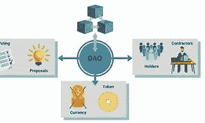

# 创造一个道

> 原文：<https://medium.com/coinmonks/creating-a-dao-6d208d04ca07?source=collection_archive---------39----------------------->

## 采取简单快速的步骤

在之前的一篇文章中，我解释了为什么你应该考虑将你的初创企业、公司或企业作为一个分散的自治组织来启动。

在这篇文章中，我将去做这件事需要什么。

Dao 是无层次的、开放的和分散的。这里有一些成功创建的必备条件。

你的项目:这是你道的主要目的。

您的 DAO 将需要一种方式让成员为决策投票。这可以由您自己创建，也可以通过第三方提供商创建。这就是所谓的投票机制。

在您的 DAO 中，您需要验证拥有投票权的成员。这可以通过拥有一个作为这个特定 DAO 中的用例的令牌(一个实用令牌)来实现。这意味着一个 DAO 需要一个治理令牌。

一个道如果没有成员或者一个社区，几乎什么都不是。这将使它成长并看到力量传播给越来越多对道的成功感兴趣和关心的人。

你的刀可以众筹。您的财富和资产需要妥善管理并保持安全。这通常是通过将它们保存在多签名钱包中来实现的，多签名钱包需要来自不同方的许可来执行交易。

所以让我们假设你有所有这些，你如何创造你的刀？

你需要一个投票机制从技术上来说，有像 Aragon 和 Snapshots 这样的开源软件，它们可以帮助你将你的 DAO 部署到受支持的区块链。

比如你决定用阿拉贡。

你必须拥有一个以太坊域名服务域名。

需要一把刀的制作费，包括汽油费，你需要有这个。

通过 Aragon Dapp，创建一个链接到您的 ENS 域的组织。您已经可以使用预设的样本。

将您的设置放在一起，例如投票持续时间和所需的百分比支持。

发射你的刀

检查阿拉贡进一步的知识。

说到 DAOs，成功运行一个将极大地依赖于社区/成员和项目/业务。

> 交易新手？试试[加密交易机器人](/coinmonks/crypto-trading-bot-c2ffce8acb2a)或者[复制交易](/coinmonks/top-10-crypto-copy-trading-platforms-for-beginners-d0c37c7d698c)