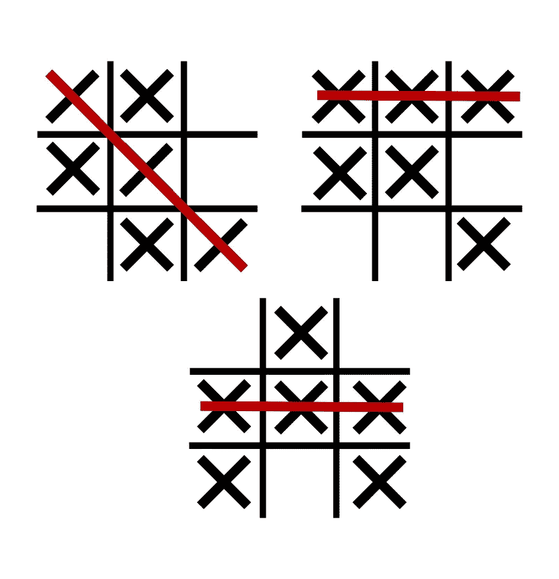
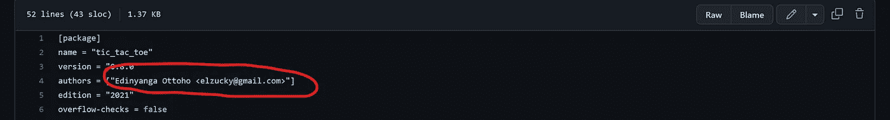

# 使用 Rust ink 在 Aleph Zero 上创建 P2P 井字游戏智能合约！；了解 psp22 标准

> 原文：<https://medium.com/coinmonks/creating-a-p2p-tic-tac-toe-gambling-smart-contract-on-aleph-zero-using-ink-9702f7714f55?source=collection_archive---------3----------------------->

这是新的一天，也是学习新事物的好时机；我来帮助您实现这一目标:)。本文旨在指导您使用 Rust(带墨水)创建一个井字游戏 P2P 游戏(带有赌博功能！).

在经历了这么长时间的阅读后(也是实践性的)，你应该能够与像 Aleph Zero 这样的衬底链上的 [PSP22 标准令牌](/supercolony/psp22-the-first-smart-contract-standard-on-the-polkadot-ecosystem-fef3f6c27d88)进行交互(这是我们的主要关注点)。

我将在本文中一直演示***PSP 22::balance of()***，***PSP 22::allow ance()***，***PSP 22::transfer()***和***PSP 22::transfer from()***PSP 22 方法。

> 有趣的事实:我把坚硬变成了生锈的墨水！反之亦然，JSYK😎


Image credits: [https://istockphoto.com](https://www.google.com/url?sa=i&url=https%3A%2F%2Fwww.istockphoto.com%2Fillustrations%2Ftic-tac-toe&psig=AOvVaw17JY8cHT26Zy_RLBTxFugD&ust=1668722492879000&source=images&cd=vfe&ved=0CBEQjhxqFwoTCKig1Kfbs_sCFQAAAAAdAAAAABAD)

显然，五分之二的人知道“井字游戏”，尽管根据人们的判断力、取向、地点或选择，它可能有不同的名称。

> **请注意，本文中的源代码没有经过任何审核，容易受到漏洞的影响；这完全是为了教育目的，没有别的。**

如果你从来没有听说过井字游戏，这是一种棋盘游戏，有一个 3×3 单元的正方形网格(根据玩家的喜好可能会有更大的数量，例如，5×5，9×9 等；通常在由奇数乘奇数组成的格子中)，每个玩家使用两个字符，通常是“X”和“O”。

每个玩家通过将他们相关的角色插入(画)到一个空的格子中来移动，目的是创建一个水平、对角或垂直的图案，同时防止他们的对手做同样的事情，以及智胜他们，以便无障碍地实现他们的完整线。对于每一轮，如果没有赢家(即所有的位置都被填满，没有任何玩家制作有效的图案)，游戏被标记为平局，新一轮开始。

从下图可以看出，被分配了“X”符号的玩家在所有三轮中都是赢家(忽略“O”没有被打满所有回合的事实；二号玩家是个呆子)。



Image credits: [https://en.wikipedia.org](https://en.wikipedia.org)

在这个例子中，两个玩家都将下注一定数量来玩游戏。胜者拿走所有代币，游戏结束，但如果是平局，代币退还给双方，游戏结束。每轮游戏结束后，棋盘也会重置。

既然您已经知道了这个游戏是如何玩的，那么让我们深入到 Rust 的实际实现中😎。很酷吧: )


Image credits: [https://tenor.com](https://tenor.com)

请点击[此链接](https://github.com/paritytech/cargo-contract)开始安装 Rust 智能合同开发的“货物合同”。

# 项目设置

在我们开始之前，项目文件夹必须有一个已定义的结构，我们将创建两个用于构建契约的文件。

*   cargo.toml
*   图书馆

“cargo.toml”更像是 NPM 著名的“package . JSON ”( node . js ),它帮助我们定义与项目相关的属性、依赖关系和信息，而我们将使用“lib.rs”作为我们的入口文件(所有的重要工作都将在这里完成)。

这是将在这个项目中使用的两个文件。

使用[这个文件](https://github.com/EdinyangaOttoho/ink-tic-tac-toe/blob/master/Cargo.toml)的内容组成你的“cargo.toml”文件。

你基本上需要在文件**的第 4 行**的“作者”键中修改名字和电子邮件，以匹配你的名字。



Update the authors’ array to contain your name and email.

该文件将如下所示:

```
[package]
name = "tic_tac_toe"
version = "0.9.6"
authors = ["Edinyanga Ottoho <elzucky@gmail.com>"]
edition = "2021"
overflow-checks = false

[dependencies]

ink = { git = "https://github.com/paritytech/ink", rev = "4655a8b4413cb50cbc38d1b7c173ad426ab06cde", default-features = false}
scale = { package = "parity-scale-codec", version = "3", default-features = false, features = ["derive"] }
scale-info = { version = "2", default-features = false, features = ["derive"], optional = true }

openbrush = { git = "https://github.com/727-Ventures/openbrush-contracts", branch="main", default-features = false, features = ["psp22"] }

[lib]
overflow-checks = false
name = "tic_tac_toe"
path = "lib.rs"
crate-type = [
    # Used for normal contract Wasm blobs.
    "cdylib"
]
[profile.release]
overflow-checks = false

[features]
default = ["std"]
std = [
    "ink/std",
    "scale/std",
    "scale-info/std",
    "openbrush/std"
]
psp22 = ["openbrush/psp22"]
ink-as-dependency = []
```

# 定义导入和存储结构

首先，我们需要创建模块并导入所有必要的依赖项，以适应智能合约的功能，以及构造函数初始化代码和将在整个源代码中使用的存储键的结构。

```
#![cfg_attr(not(feature = "std"), no_std)]

#[cfg(not(feature = "ink-as-dependency"))]

#[ink::contract]
pub mod tic_tac_toe {

    use ink::prelude::vec;
    use ink::prelude::vec::Vec;

    use openbrush::contracts::traits::psp22::PSP22Ref;

    use ink::env::CallFlags;

    use openbrush::traits::Storage;

    #[ink(storage)]
    #[derive(Default, Storage)]

    pub struct TicTacToe {
        board: Vec<u64>, //0 to 8 cells
        turn: AccountId,
        symbols: ink::storage::Mapping<AccountId, u64>,
        player_one: AccountId,
        player_two: AccountId,
        staking_token: AccountId,
        stake_amount: Balance,
        stakes: ink::storage::Mapping<AccountId, Balance>,
        last_winner: AccountId,
    }
}
```

存储结构“TicTacToe”中定义的键将在本文中继续讨论；不要慌:)。

# 构造函数

我们要做的下一件事是在“tic_tac_toe”模块的实现中定义构造函数，紧接在“TicTacToe”结构之后，该结构将在部署我们的智能合约时被调用，以便初始化一些我们希望默认注册到其中的值。

我们想要定义玩家的地址、游戏中使用的 PSP22 令牌、他们的符号以及给定游戏的赌注金额。

这些可以作为参数提供给构造函数，因此:

```
impl TicTacToe {
    /// Creates a new instance of this contract.
    #[ink(constructor)]
    pub fn new(player_one:AccountId, player_two:AccountId, player_one_symbol:u64, player_two_symbol:u64, staking_token: AccountId, stake_amount: Balance) -> Self {
        //Do something here...
    }
}
```

在“new()”方法中，我们必须存储这些值并进行一些例行检查，这样在游戏过程中就不会出现异常的契约行为。

```
let mut contract = Self::default();

let board = vec![0; 9]; //empty array

contract.board = board; //set board to empty state

contract.staking_token = staking_token; //set staking token

contract.stake_amount = stake_amount; //set stake amount

assert!(player_one != player_two); //addresses must not be the same

assert!(player_one_symbol != player_two_symbol); //symbols must be distinct

assert!(
    (player_one_symbol == 1 || player_one_symbol == 2)
        && (player_two_symbol == 1 || player_two_symbol == 2)
); //symbols must be either 1 or 2

contract.player_one = player_one; //set player one address

contract.player_two = player_two; //set player two address

contract.symbols.insert(player_one, &player_one_symbol); //set player one symbol

contract.symbols.insert(player_two, &player_two_symbol); //set player two symbol

contract.turn = player_one; //initialize turn to player one

contract
```

在本例中，我们将 0 作为空单元格，1 作为 X，2 作为 O。我们还将使用 0 到 8 来表示棋盘的单元格，从左上到右下依次排列，这意味着左上的单元格是 0，右下的单元格是 8，中间的单元格是 5。

从上到下分析上面的代码，我们看到创建了一个空数组，我们循环遍历它，将 0 插入到从 0 到 8 的每个索引中，这意味着开始是一个空的棋盘。

我们还从其参数中设置了赌注标记以及赌注金额。

我们要确保一号玩家没有使用和二号玩家相同的地址，也没有给他们分配相同的符号(仅限于 1 和 2)。我们用提供的参数设置了一号玩家和二号玩家的地址。

然后，我们还将两个玩家选择的符号插入到一个映射中，将它们的地址作为关键字，将选择的符号作为 **u64** type 中的值。

然后我们最终把一号玩家设为第一个回合。

万岁！我们完成了我们的构造函数！

# 输出方法

虽然我们很想制作一个有趣的游戏，但我们想知道在智能合约中存储和动态方面发生了什么，因此我们将创建一些方法来随意为我们提供存储值。

```
#[ink(message)]
pub fn get_stake_amount(&self) -> Balance {
    self.stake_amount //amount to be staked in game
}

#[ink(message)]
pub fn get_last_winner(&self) -> AccountId {
    self.last_winner //address of most recent winner
}

#[ink(message)]
pub fn get_current_turn(&self) -> AccountId {
    self.turn //who is meant to play?
}

#[ink(message)]
pub fn get_staking_token(&self) -> AccountId {
    self.staking_token //get address of staking token smart contract
}

#[ink(message)]
pub fn get_player_two_stake(&self) -> Balance {
    self.stakes.get(self.player_two).unwrap_or(0) //get total amount of tokens staked by player two
}

#[ink(message)]
pub fn get_player_one_stake(&self) -> Balance {
    self.stakes.get(self.player_one).unwrap_or(0) //get total amount of tokens staked by player one
}

#[ink(message)]
pub fn get_player_two_symbol(&self) -> u64 {
    self.symbols.get(self.player_two).unwrap_or(0) //get player two symbol
}

#[ink(message)]
pub fn get_player_one(&self) -> AccountId {
    self.player_one //get player one address
}

#[ink(message)]
pub fn get_player_two(&self) -> AccountId {
    self.player_two //get player two address
}

#[ink(message)]
pub fn get_player_one_symbol(&self) -> u64 {
    self.symbols.get(self.player_one).unwrap_or(0) //get player one symbol
}

#[ink(message)]
pub fn get_board(&self) -> Vec<u64> {
    //read and return board as array
    let board = &self.board;
    board.to_vec()
}
```

上面定义的大多数方法都是不言自明的，但是我将对它们中的每一个进行简单介绍，以便清楚地理解它们打算输出什么值。

*   **get_stake_amount()** 用于获取玩家投入游戏的金额，以供玩家进行游戏。
*   **get_last_winner()** 用于获取最近赢得游戏的玩家的地址。
*   **get_current_turn()**
    这个用来获取该轮到的玩家。
*   **get _ staking _ token()**
    这用于获取玩家将用作赌注的赌注令牌合同的地址。
*   **get _ player _ one _ stake()**
    用于获取玩家一下注的代币总数。
*   **get _ player _ two _ stake()**
    用于获取玩家二下注的代币总数。
*   **get_player_one()**
    这个用来获取玩家一的钱包地址。
*   **get_player_two()** 这个用来获取玩家二的钱包地址。
*   **get _ player _ one _ symbol()**
    这个用来获取玩家一的符号。
*   **get _ player _ two _ symbol()** 这个用来获取玩家二的符号。
*   **get_board()** 返回一个数组，表示棋盘上从 0 到 8 的单元格的当前游戏状态。

# 内联助手方法

有些方法将在内部使用，以帮助确定值以及在智能协定中执行入站操作。

他们是这样的:

```
#[inline]
pub fn _has_won(&self, symbol: u64) -> bool {
    let vertical = [[0,3,6], [1,4,7], [2,5,8]];
    let horizontal = [[0,1,2], [3,4,5], [6,7,8]];
    let diagonal = [[0,4,8], [2,4,6]];

    //check vertical
    let mut v_win = false;
    for i in 0..=2 {
        let mut count = 0;
        for j in 0..=2 {
            if self.board[vertical[i][j]] == symbol {
                count += 1;
            }
        }
        if count == 3 {
            v_win = true;
            break;
        }
    }

    //check horizontal
    let mut h_win = false;
    for i in 0..=2 {
        let mut count = 0;
        for j in 0..=2 {
            if self.board[horizontal[i][j]] == symbol {
                count += 1;
            }
        }
        if count == 3 {
            h_win = true;
            break;
        }
    }

    //check diagonal
    let mut d_win = false;
    for i in 0..=1 {
        let mut count = 0;
        for j in 0..=2 {
            if self.board[diagonal[i][j]] == symbol {
                count += 1;
            }
        }
        if count == 3 {
            d_win = true;
            break;
        }
    }

    if v_win == true || h_win == true || d_win == true {
        true
    }
    else {
        false
    }

}

#[inline]
pub fn _clear_board(&mut self) {
    let board = vec![0; 9];
    self.board = board;
}

#[inline]
pub fn _is_cell_empty(&self, cell: u64) -> bool {
    if self.board[usize::try_from(cell).unwrap()] == 0 {
        true
    } else {
        false
    }
}

#[inline]
pub fn _is_board_filled(&self) -> bool {
    let mut filled_cells = 0;
    let board = &self.board;
    for cell in 0..=8 {
        if board[usize::try_from(cell).unwrap()] != 0 {
            filled_cells += 1;
        }
    }
    if filled_cells == 9 {
        true
    } else {
        false
    }
}

#[inline]
pub fn _reward_winner(&mut self, account: AccountId) {
    let total_stakes = PSP22Ref::balance_of(&self.staking_token, Self::env().account_id()); //get total stakes

    PSP22Ref::transfer(
        &self.staking_token,
        account,
        total_stakes,
        ink_prelude::vec![],
    ); //transfer everything to the winner

    self.stakes.insert(self.player_one, &0);

    self.stakes.insert(self.player_two, &0);
}

#[inline]
pub fn _refund_tokens(&mut self) {
    let total_stakes = PSP22Ref::balance_of(&self.staking_token, Self::env().account_id()); //get total stakes
    let per_player = total_stakes / 2;

    PSP22Ref::transfer(
        &self.staking_token,
        self.player_one,
        per_player,
        ink_prelude::vec![],
    ); //transfer half to player one
    PSP22Ref::transfer(
        &self.staking_token,
        self.player_two,
        per_player,
        ink_prelude::vec![],
    ); //transfer half to player two

    self.stakes.insert(self.player_one, &0);

    self.stakes.insert(self.player_two, &0);

}
```

简而言之，我将解释上面的内联助手方法是做什么的，以防你没有清楚地掌握它们。

*   **_ has _ won(symbol:u64)** 此方法用于确定给定的符号是否为获胜符号。返回一个布尔值(真或假)。用于检查每个回合的赢家。
*   **_clear_board()** 该方法用于清空板子(视情况将所有单元格置 0 或空)。
*   **_is_cell_empty()** 这是用来判断给定的单元格是否为空(值为 0)。
*   **_is_board_filled()** 
*   **_ reward _ winner(address:account id)** 此方法将所有可用的令牌作为参数转移到提供的地址。
*   **_refund_tokens()** 此方法用于退还所有代币(适用于主动回合出现平局的情况)。


Image credits: https://getyarn.io

# 游戏部分

这是这个智能合同最重要的方面，因为如果不仔细检查，它可能会导致严重的后果。

成功的游戏有两种方法:

*   stake _ tokens()
*   播放(单元格:u64)

我将从第一个开始(尽管我应该这样做:)。

## stake _ tokens()

```
#[ink(message)]
pub fn stake_tokens(&mut self) {
    let player = self.env().caller(); //get caller address
    let stakes = self.stakes.get(player).unwrap_or(0); //get stake if existent

    assert!(player == self.player_one || player == self.player_two); //Caller must be player one or two

    if stakes > 0 {
        panic!("Already staked for this round")
    } //Make sure player hasn't already staked

    let balance = PSP22Ref::balance_of(&self.staking_token, player); //get user balance of token

    let allowance =
        PSP22Ref::allowance(&self.staking_token, player, Self::env().account_id()); //get spending allowance contract has to player

    assert!(balance > self.stake_amount); //balance must be greater than stake amount

    assert!(allowance > self.stake_amount); //allowance must be greater than stake amount

    //Transfer stake amount from caller (player) to contract
    PSP22Ref::transfer_from_builder(
        &self.staking_token,
        self.env().caller(),
        Self::env().account_id(),
        self.stake_amount,
        ink::prelude::vec![],
    )
    .call_flags(CallFlags::default().set_allow_reentry(true))
    .fire()
    .expect("Transfer failed")
    .expect("Transfer failed");

    self.stakes.insert(player, &self.stake_amount); //Add stake amount to user stake
}
```

您可以从上面的代码块中推断出，该方法用于存放下一轮的赌注标记(下注)。

首先，它检查呼叫者是一号玩家还是二号玩家，然后检查是否已经下注。

我们还检查他们在赌注代币中的余额，确保其达到赌注金额，并且支出津贴足以让合同从玩家的钱包中收取赌注金额。

我们最后从他们的钱包中转移赌注代币，并将赌注添加到玩家的赌注地图中。

## 播放(单元格:u64)

此方法采用 u64 类型的参数，指定要播放的单元格。

```
#[ink(message)]
pub fn play(&mut self, cell: u64) {
    assert!(cell <= 8);

    let player = self.env().caller(); //get caller address

    assert!(player == self.player_one || player == self.player_two); //caller must be player one or two

    assert!(self.get_player_one_stake() > 0 && self.get_player_two_stake() > 0); //both players must have staked

    let is_empty = self._is_cell_empty(cell); //check if cell is empty

    assert!(is_empty == true); //cell must be empty

    assert!(self.turn == player); //must be player's turn

    let mut board = self.get_board();

    let player_one_symbol = self.get_player_one_symbol();
    let player_two_symbol = self.get_player_two_symbol();

    let cell_index = usize::try_from(cell).unwrap(); //convert index to usize

    board[cell_index] = self.symbols.get(player).unwrap_or(0);

    self.board = board;

    let player_one_won = self._has_won(player_one_symbol);

    let player_two_won = self._has_won(player_two_symbol);

    let mut game_over = false;

    if player_one_won == true {
        //player one won
        self.turn = self.player_one; //set player to start next round
        self._reward_winner(self.player_one);
        self._clear_board(); //clear game board
        self.last_winner = self.player_one; //set to last winner
        game_over = true; //game is over
    } else if player_two_won == true {
        //player two won
        self.turn = self.player_two; //set player to start next round
        self._reward_winner(self.player_two);
        self._clear_board(); //clear game board
        self.last_winner = self.player_one; //set to last winner
        game_over = true;
    } else {
        if self._is_board_filled() == true {
            //It's a draw
            self.turn = self.player_one;
            self._refund_tokens(); //refund tokens because no one won
            self._clear_board();
            game_over = true;
        }
    }

    if game_over == false {
        if self.turn == self.player_one {
            self.turn = self.player_two;
        } else {
            self.turn = self.player_one;
        }
    }
}
```

在允许玩家移动之前，我们用这种方法做了很多检查。

首先，我们要确保呼叫者是与游戏相关联的两个玩家中的任何一个，同时确保两个玩家都已经为这一轮下注了他们的代币。

然后，我们确认该轮到给定的玩家了，之后我们会将他们的符号写入棋盘存储数组中适当的键。

我们检查赢和平的条件(对每一步棋都进行检查)。

如果一个玩家赢了，他们会得到所有的钱，棋盘会被重置，他们会成为下一个玩家(玩下一轮)。

如果游戏以平局结束，棋盘同样被清空，代币被退还给双方，新一轮开始。

我们完了！🔥

说了这么多，我应该喝杯冰镇葡萄酒。我希望你喜欢阅读和/或练习这个指南💚。

下面是完整的源代码(我已经格式化了:):

```
#![cfg_attr(not(feature = "std"), no_std)]

#[cfg(not(feature = "ink-as-dependency"))]

#[ink::contract]
pub mod tic_tac_toe {

    use ink::prelude::vec;
    use ink::prelude::vec::Vec;

    use openbrush::contracts::traits::psp22::PSP22Ref;

    use ink::env::CallFlags;

    use openbrush::traits::Storage;

    #[ink(storage)]
    #[derive(Default, Storage)]
    pub struct TicTacToe {
        board: Vec<u64>, //0 to 8 cells
        turn: AccountId,
        symbols: ink::storage::Mapping<AccountId, u64>,
        player_one: AccountId,
        player_two: AccountId,
        staking_token: AccountId,
        stake_amount: Balance,
        stakes: ink::storage::Mapping<AccountId, Balance>,
        last_winner: AccountId,
    }

    impl TicTacToe {
        /// Creates a new instance of this contract.
        #[ink(constructor)]
        pub fn new(
            player_one: AccountId,
            player_two: AccountId,
            player_one_symbol: u64,
            player_two_symbol: u64,
            staking_token: AccountId,
            stake_amount: Balance,
        ) -> Self {

            let mut contract = Self::default();

            let board = vec![0; 9]; //empty array

            contract.board = board; //set board to empty state

            contract.staking_token = staking_token; //set staking token

            contract.stake_amount = stake_amount; //set stake amount

            assert!(player_one != player_two); //addresses must not be the same

            assert!(player_one_symbol != player_two_symbol); //symbols must be distinct

            assert!(
                (player_one_symbol == 1 || player_one_symbol == 2)
                    && (player_two_symbol == 1 || player_two_symbol == 2)
            ); //symbols must be either 1 or 2

            contract.player_one = player_one; //set player one address

            contract.player_two = player_two; //set player two address

            contract.symbols.insert(player_one, &player_one_symbol); //set player one symbol

            contract.symbols.insert(player_two, &player_two_symbol); //set player two symbol

            contract.turn = player_one; //initialize turn to player one

            contract

        }

        #[ink(message)]
        pub fn get_stake_amount(&self) -> Balance {
            self.stake_amount //amount to be staked in game
        }

        #[ink(message)]
        pub fn get_last_winner(&self) -> AccountId {
            self.last_winner //address of most recent winner
        }

        #[ink(message)]
        pub fn get_current_turn(&self) -> AccountId {
            self.turn //who is meant to play?
        }

        #[ink(message)]
        pub fn get_staking_token(&self) -> AccountId {
            self.staking_token //get address of staking token smart contract
        }

        #[ink(message)]
        pub fn get_player_two_stake(&self) -> Balance {
            self.stakes.get(self.player_two).unwrap_or(0) //get total amount of tokens staked by player two
        }

        #[ink(message)]
        pub fn get_player_one_stake(&self) -> Balance {
            self.stakes.get(self.player_one).unwrap_or(0) //get total amount of tokens staked by player one
        }

        #[ink(message)]
        pub fn get_player_one(&self) -> AccountId {
            self.player_one //get player one address
        }

        #[ink(message)]
        pub fn get_player_two(&self) -> AccountId {
            self.player_two //get player two address
        }

        #[ink(message)]
        pub fn get_player_two_symbol(&self) -> u64 {
            self.symbols.get(self.player_two).unwrap_or(0) //get player two symbol
        }

        #[ink(message)]
        pub fn get_player_one_symbol(&self) -> u64 {
            self.symbols.get(self.player_one).unwrap_or(0) //get player one symbol
        }

        #[ink(message)]
        pub fn get_board(&self) -> Vec<u64> {
            //read and return board as array
            let board = &self.board;
            board.to_vec()
        }

        #[ink(message)]
        pub fn stake_tokens(&mut self) {
            let player = self.env().caller(); //get caller address
            let stakes = self.stakes.get(player).unwrap_or(0); //get stake if existent

            assert!(player == self.player_one || player == self.player_two); //Caller must be player one or two

            if stakes > 0 {
                panic!("Already staked for this round")
            } //Make sure player hasn't already staked

            let balance = PSP22Ref::balance_of(&self.staking_token, player); //get user balance of token

            let allowance =
                PSP22Ref::allowance(&self.staking_token, player, Self::env().account_id()); //get spending allowance contract has to player

            assert!(balance > self.stake_amount); //balance must be greater than stake amount

            assert!(allowance > self.stake_amount); //allowance must be greater than stake amount

            //Transfer stake amount from caller (player) to contract
            PSP22Ref::transfer_from_builder(
                &self.staking_token,
                self.env().caller(),
                Self::env().account_id(),
                self.stake_amount,
                ink::prelude::vec![],
            )
            .call_flags(CallFlags::default().set_allow_reentry(true))
            .fire()
            .expect("Transfer failed")
            .expect("Transfer failed");

            self.stakes.insert(player, &self.stake_amount); //Add stake amount to user stake
        }

        #[inline]
        pub fn _has_won(&self, symbol: u64) -> bool {
            let vertical = [[0, 3, 6], [1, 4, 7], [2, 5, 8]];
            let horizontal = [[0, 1, 2], [3, 4, 5], [6, 7, 8]];
            let diagonal = [[0, 4, 8], [2, 4, 6]];

            //check vertical
            let mut v_win = false;
            for i in 0..=2 {
                let mut count = 0;
                for j in 0..=2 {
                    if self.board[vertical[i][j]] == symbol {
                        count += 1;
                    }
                }
                if count == 3 {
                    v_win = true;
                    break;
                }
            }

            //check horizontal
            let mut h_win = false;
            for i in 0..=2 {
                let mut count = 0;
                for j in 0..=2 {
                    if self.board[horizontal[i][j]] == symbol {
                        count += 1;
                    }
                }
                if count == 3 {
                    h_win = true;
                    break;
                }
            }

            //check diagonal
            let mut d_win = false;
            for i in 0..=1 {
                let mut count = 0;
                for j in 0..=2 {
                    if self.board[diagonal[i][j]] == symbol {
                        count += 1;
                    }
                }
                if count == 3 {
                    d_win = true;
                    break;
                }
            }

            if v_win == true || h_win == true || d_win == true {
                true
            } else {
                false
            }
        }

        #[inline]
        pub fn _clear_board(&mut self) {
            let board = vec![0; 9];
            self.board = board;
        }

        #[inline]
        pub fn _is_cell_empty(&self, cell: u64) -> bool {
            if self.board[usize::try_from(cell).unwrap()] == 0 {
                true
            } else {
                false
            }
        }

        #[inline]
        pub fn _is_board_filled(&self) -> bool {
            let mut filled_cells = 0;
            let board = &self.board;
            for cell in 0..=8 {
                if board[usize::try_from(cell).unwrap()] != 0 {
                    filled_cells += 1;
                }
            }
            if filled_cells == 9 {
                true
            } else {
                false
            }
        }

        #[inline]
        pub fn _reward_winner(&mut self, account: AccountId) {
            let total_stakes = PSP22Ref::balance_of(&self.staking_token, Self::env().account_id()); //get total stakes

            PSP22Ref::transfer(
                &self.staking_token,
                account,
                total_stakes,
                ink::prelude::vec![],
            ); //transfer everything to the winner

            self.stakes.insert(self.player_one, &0);

            self.stakes.insert(self.player_two, &0);
        }

        #[inline]
        pub fn _refund_tokens(&mut self) {
            let total_stakes = PSP22Ref::balance_of(&self.staking_token, Self::env().account_id()); //get total stakes
            let per_player = total_stakes / 2;

            PSP22Ref::transfer(
                &self.staking_token,
                self.player_one,
                per_player,
                ink::prelude::vec![],
            ); //transfer half to player one
            PSP22Ref::transfer(
                &self.staking_token,
                self.player_two,
                per_player,
                ink::prelude::vec![],
            ); //transfer half to player two

            self.stakes.insert(self.player_one, &0);

            self.stakes.insert(self.player_two, &0);

        }

        #[ink(message)]
        pub fn play(&mut self, cell: u64) {
            assert!(cell <= 8);

            let player = self.env().caller(); //get caller address

            assert!(player == self.player_one || player == self.player_two); //caller must be player one or two

            assert!(self.get_player_one_stake() > 0 && self.get_player_two_stake() > 0); //both players must have staked

            let is_empty = self._is_cell_empty(cell); //check if cell is empty

            assert!(is_empty == true); //cell must be empty

            assert!(self.turn == player); //must be player's turn

            let mut board = self.get_board();

            let player_one_symbol = self.get_player_one_symbol();
            let player_two_symbol = self.get_player_two_symbol();

            let cell_index = usize::try_from(cell).unwrap(); //convert index to usize

            board[cell_index] = self.symbols.get(player).unwrap_or(0);

            self.board = board;

            let player_one_won = self._has_won(player_one_symbol);

            let player_two_won = self._has_won(player_two_symbol);

            let mut game_over = false;

            if player_one_won == true {
                //player one won
                self.turn = self.player_one; //set player to start next round
                self._reward_winner(self.player_one);
                self._clear_board(); //clear game board
                self.last_winner = self.player_one; //set to last winner
                game_over = true; //game is over
            } else if player_two_won == true {
                //player two won
                self.turn = self.player_two; //set player to start next round
                self._reward_winner(self.player_two);
                self._clear_board(); //clear game board
                self.last_winner = self.player_one; //set to last winner
                game_over = true;
            } else {
                if self._is_board_filled() == true {
                    //It's a draw
                    self.turn = self.player_one;
                    self._refund_tokens(); //refund tokens because no one won
                    self._clear_board();
                    game_over = true;
                }
            }

            if game_over == false {
                if self.turn == self.player_one {
                    self.turn = self.player_two;
                } else {
                    self.turn = self.player_one;
                }
            }
        }
    }
}
```

# 脚注

如果你喜欢这篇文章和/或觉得它有帮助，请在 Twitter 上关注我，关注我的动向😎。要获得 GitHub 上的完整源代码，请访问[此链接](https://github.com/EdinyangaOttoho/ink-tic-tac-toe)。值得称赞。

你可以随时叉库，并给我发一份公关你喜欢的任何时候。

为了在 Aleph Zero Testnet 上部署您的智能合约，使其具有有趣且流畅的用户界面，您可以点击[此链接](https://test.azero.dev/#/)。

如果您已经阅读了本文，那么您应该得到一些$AZERO 代币:)

我很高兴有你一直在这里。

> 交易新手？试试[加密交易机器人](/coinmonks/crypto-trading-bot-c2ffce8acb2a)或者[复制交易](/coinmonks/top-10-crypto-copy-trading-platforms-for-beginners-d0c37c7d698c)