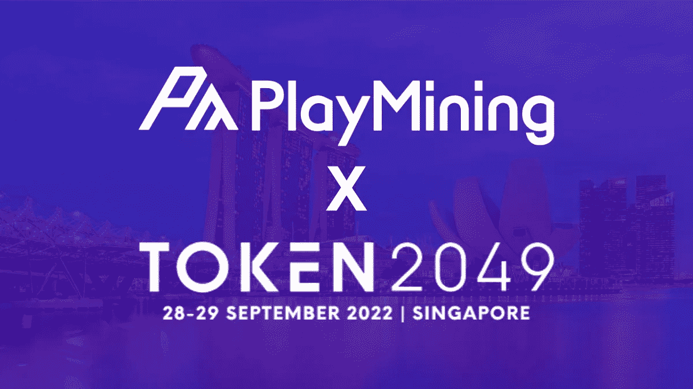
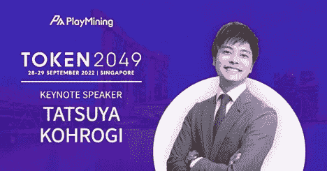

# 创意 IP 平台 PlayMining 在 9 月 29 日的 Token2049 上谈论行业颠覆

> 原文：<https://medium.com/coinmonks/creative-ip-platform-playmining-to-talk-industry-disruption-at-token2049-on-september-29-82c7fdbce1e6?source=collection_archive---------41----------------------->

*新加坡，2022 年 9 月 22 日* — **创意 IP 平台**[**PlayMining**](https://playmining.com)**荣幸地在** [**Token2049 新加坡**](https://www.asia.token2049.com) **上展示他们的 Web3 IP 货币化平台，聚焦创意产业面临的挑战，展示 play mining 的颠覆性解决方案。**作为亚洲顶级加密会议之一，Token2049 将接待超过 7000 名与会者、250 家参展商和 200 名演讲人。 [**亚洲秘密周**](https://www.asiacryptoweek.com/) **，**的旗舰赛事**结合了一百多项配套赛事，Token2049 先于首届**一级方程式新加坡大奖赛**周末在这个城市国家的滨海湾风景如画的背景下举行。**

负责全球业务的 PlayMining 首席战略官 [Tatsuya Kohrogi](https://www.linkedin.com/in/tatsuya-tats-kohrogi-a97a8953/) 将于 9 月 29 日上午 9:30-9:45 在信托 EVM 舞台上发表 Token2049 演讲。这份名为**‘PlayMining:颠覆创意产业’**的报告阐述了创意知识产权产业中存在的主要问题，以及 play mining 解决这些问题的独特方法。除了介绍即将推出的游戏之外，他们还将介绍 PlayMining 生态系统并确定利益相关者，使用 PlayMining 模型来展示如何产生社会影响。

> *“我们非常自豪地在 Token2049 上展示 PlayMining 平台，并很高兴向所有人展示在区块链* *上透明而公平地管理创意 IP 货币化会有多好，”* [*吉田直人*](https://www.linkedin.com/in/naohito-yoshida-47498836/) *，* [*数字娱乐资产*](https://dea.sg) *的联合首席执行官兼联合创始人说道吉田是一位拥有三十年经验的连续创业者，他之前为三家不同的公司实施过 IPO。*

Token2049 与会者还可以参加主题演讲和小组讨论，涵盖一系列关键主题，包括 DeFi、加密监管、Web 3.0、全球宏观战略、数据隐私等。将出席此次活动的知名演讲人包括 Galaxy 首席执行官迈克·诺沃格拉茨、Axie Infinity 联合创始人兼首席运营官·亚历山大·伦纳德·拉森和潘迪拉资本首席执行官汤姆·莫尔黑德，以及 Crypto.com、EOs 网络基金会和阿尔格兰德基金会的首席执行官等。

**扰乱创意知识产权产业**

当一个创意公司开发一个热门的电子游戏，漫画系列，动画系列等。，他们能够将其知识产权(IP)扩展到多个不同的收入流。例如，备受喜爱的视频游戏角色可能会出现在商品、漫画书、电视节目或 NFT 艺术品中。

> ****知识产权创作行业有一个真正的黑暗面，那就是制作公司、分销商和其他主要利益相关者往往会攫取几乎所有的价值。相比之下，艺术家和其他创作者挣得很少。DEA 的另一位联合首席执行官和联合创始人，*[*Kozo Yamada*](https://www.linkedin.com/in/kozo-yamada-14a56391/)*说，他是一位 NFT 游戏专家，在电视视频制作方面有超过 15 年的经验。****

*PlayMining 是一个赋予创作者权力的 Web3 IP 货币化平台。他们向官方和粉丝艺术的创作者支付版税，以确保艺术家为他们创造的价值得到充分补偿。他们的 NFT 市场整合了 PlayMining 自己的 [$DEAPcoin](https://coinmarketcap.com/currencies/deapcoin/) 令牌，这是日本第一个也是唯一一个(目前)由金融服务厅批准的 P2E 令牌，已经托管了 100 多个创作者的作品，包括日本动画和视频游戏界的知名人士，如《童话》、《龙的追求》和《最终幻想》的创作者。迄今为止，已经向创作者支付了超过 900 万新加坡元的版税。*

*他们的 NFT 游戏平台，目前拥有流行的内部游戏[工作部落](https://jobtribes.playmining.com/en/)和[烹饪汉堡](https://www.cookinburger.com/en/)，也将拥有拥有自己令牌的第三方游戏——允许第三方工作室获取他们创造的几乎所有价值。一款备受期待的第三方游戏《龙拉面》将于今年 10 月推出。今年推出的其他热门游戏包括 Graffiti Racer 和 Lucky Farmer。*

> *作为一个 Web3 平台，PlayMining 是第三方开发工作室推出新 IP 的理想场所，因为他们不会陷入分发平台的恶性循环，从他们的资金中抽取过高的比例。科罗吉说:“这是一个更加公平的竞争环境。”。“举个例子，苹果应用商店抽取高达 30%的利润，而像脸书和 Instagram 这样的网站不向在其平台上创建内容的人支付一分钱。相比之下，OpenSea 每次销售只向创作者收取微薄的 2.5%的费用，而且差别是不分昼夜的。”*

***关于 PlayMining***

*PlayMining 是一个 Web3 IP 货币化平台，它赋予创作者以权力，否则他们在传统的 IP 创作行业中受益甚少。PlayMining 平台是一种新的内容创作商业模式，以 PlayMining DEAPcoin 为动力的 NFT 市场为特色，与 NFT 游戏和元宇宙平台相结合，既有内部游戏，也有第三方项目，它们拥有自己的原生令牌，允许创作者捕捉他们创造的几乎所有价值。*

*PlayMining、NFT 市场和 DEAPcoin 由数字娱乐资产私人有限公司(DEA)运营，该公司于 2018 年在新加坡成立。该团队由两位联合首席执行官领导——nao hito Yoshida 和 Kozo Yamada——他们在创建成功的游戏创业公司(3 次 IPO)、创造热门视频游戏、制作网络电视节目以及对 NFT 游戏的深刻理解方面积累了数十年的经验。PlayMining 平台拥有 250 万用户，目前有两款游戏，即玩即赚游戏和工作部落游戏。硬币是目前唯一被日本金融厅认可的 P2E 代币。*

***官方渠道***

*PlayMining 网站:[https://playmining.com](https://playmining.com)*

*play mining Discord:[https://discord.com/invite/xWeHGdt](https://discord.com/invite/xWeHGdt)*

*PlayMining 推特:[https://twitter.com/PlayMining_SG](https://twitter.com/PlayMining_SG)*

*https://www.facebook.com/PlayMining/脸书采矿公司:*

*https://www.youtube.com/channel/UCGWmK0RLV4SB_PSXpj2j6dw*

> *加入 Coinmonks [电报频道](https://t.me/coincodecap)和 [Youtube 频道](https://www.youtube.com/c/coinmonks/videos)了解加密交易和投资*

# *另外，阅读*

*   *[BigONE 交易所评论](/coinmonks/bigone-exchange-review-64705d85a1d4) | [CEX。IO 审查](https://coincodecap.com/cex-io-review) | [Swapzone 审查](/coinmonks/swapzone-review-crypto-exchange-data-aggregator-e0ad78e55ed7)*
*   *[最佳比特币保证金交易](/coinmonks/bitcoin-margin-trading-exchange-bcbfcbf7b8e3) | [比特币保证金交易](https://coincodecap.com/bityard-margin-trading)*
*   *[加密保证金交易交易所](/coinmonks/crypto-margin-trading-exchanges-428b1f7ad108) | [赚取比特币](/coinmonks/earn-bitcoin-6e8bd3c592d9)*
*   *[WazirX vs CoinDCX vs bit bns](/coinmonks/wazirx-vs-coindcx-vs-bitbns-149f4f19a2f1)|[block fi vs coin loan vs Nexo](/coinmonks/blockfi-vs-coinloan-vs-nexo-cb624635230d)*
*   *[BlockFi 信用卡](https://coincodecap.com/blockfi-credit-card) | [如何在币安购买比特币](https://coincodecap.com/buy-bitcoin-binance)*