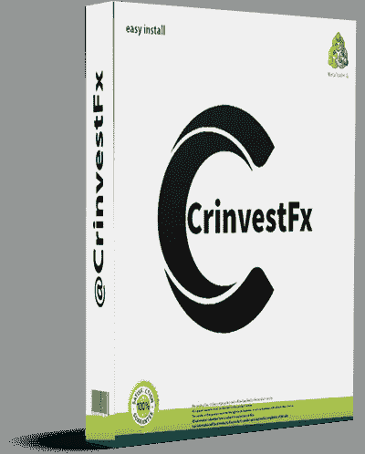

# CrinvestFx 策略评论-高级外汇经纪人

> 原文：<https://medium.com/coinmonks/crinvestfx-strategy-review-superior-forex-broker-6eff85afbf3?source=collection_archive---------44----------------------->

# **什么是 Crinvestfx？**

货币交易是一项复杂而激动人心的事业，可以带来巨大的收益和潜在的收入。然而，第一步是在参与之前做你的研究并了解风险。Crinvestfx 可以为您提供开始货币交易所需的工具和资源，我们致力于为我们的客户提供最高水平的服务和支持。

## **什么是 crinvestfx，交易货币有什么好处？**

[**Crinvestfx**](https://bit.ly/CrinvestFxStrategy) 是一家专门从事外汇交易的公司。他们为客户提供各种各样的好处，包括 24/7 的客户支持，有竞争力的差价，以及保证金交易货币的能力。通过外汇交易，投资者可以利用市场波动获利。

## 【crinvestfx 是如何运作的，买卖程序是怎样的？

Crinvestfx 是一家在线外汇经纪商。

该经纪商是一家俄罗斯外汇经纪商，提供 20 多种货币对的交易服务，以及股票、大宗商品和指数的差价合约。Crinvestfx 为其客户提供了各种交易平台，包括 Meta Trader 4 平台，移动应用程序已准备好进行交易。该场地易于使用，并提供了广泛的功能。

您首先需要在 crinvestfx 上开立一个账户来买卖货币。一旦注册或登录，您就可以开始交易。过程很简单。首先，选择你想要兑换的钱。然后，选择你想做的交易类型。你可以按当前市场价格买卖硬币，也可以设置限价单。

当准备好买入或卖出时，输入所需金额并点击“提交”按钮。订单将立即以最优惠的价格执行。Crinvestfx 保证最优惠的价格和紧凑的价差。

## **货币交易的危险和优势是什么，如何最大化自己的赚钱潜力？**

如果现金投资价值下降，最大的损失之一就是金钱损失。然而，如果你投资的现金增加了你的收入潜力，也有潜在的回报；仔细研究你考虑投资的货币是很重要的。你还应该意识到每种货币的各种风险和回报。

## **外汇交易新手入门小贴士。**

如果你正在考虑进入外汇交易，你应该记住几件事。首先，记住交易是有风险的，如果你不小心，你可能会赔钱。所以确保你有足够的钱来弥补你的损失，如果事情不顺心的话。“如何使用 Crinvestfx 进行交易——技巧和策略”

如果你想开始用 Crinvestfx 交易，那么理解市场如何运作是很重要的。这篇文章会给你一些建议和策略来帮助你开始。

## **1。Crinvestfx 交易介绍:**

首先，我们将解释 Crinvestfx 的不同类型的订单。然后，我们将讨论买卖加密货币、保证金交易和期货交易的不同交易方法。

我们将提供一些使用 Crinvestfx 进行交易的技巧，并解释如何登录和开始交易。感谢您选择 Crinvestfx，我们希望您喜欢在我们的论坛上销售！

## **2。使用 Crinvestfx 进行交易的提示:**

您需要创建一个帐户才能开始使用 Crinvestfx 进行交易。一旦您注册并登录，您将能够查看我们的交易仪表板，提供您感兴趣的市场的实时数据。

首先，始终确保你知道当前的市场状况，了解每笔交易的风险。其次，使用限价单来进入和退出头寸，以帮助最小化您的风险。密切关注你的交易历史和账户余额，确保你没有过度暴露。

## **3。使用 Crinvestfx 进行交易的策略:**

使用 Crinvestfx 进行交易时，您可以使用不同的策略。其中最流行的是众所周知的“买入并持有”策略。这包括购买一种证券并持有一段时间，希望价格会随着时间的推移而上涨。

你也可以使用“摇摆交易”策略。这包括在几天或几周内买卖证券。波段交易者经常使用基本面分析来做决定。

## **4。用 Crinvestfx 进行交易的技巧:**

使用 Crinvestfx 进行交易时，您可以使用几种不同的技巧。流行的一种是用技术分析。这包括研究过去的价格数据，试图找出可能预示未来价格走势的模式。你可以利用技术或基础研究做出更明智的决定。

## **5。使用 Crinvestfx 进行交易的移动应用:**

我们很高兴地宣布，我们发布了一个与 Crinvestfx 交易的移动应用程序。该应用程序适用于所有设备，并为交易者提供了一种在任何地方访问 Crinvestfx 的便捷方式。该应用程序具有用户友好的界面和交易者会发现有用的广泛功能。有价值的特性包括:

-查看实时价格和市场数据

-执行交易

-管理未平仓订单和头寸

-查看账户信息

-访问市场分析和新闻

我们鼓励交易者下载应用程序并试用。

## **6。用 Crinvestfx 买卖股票:**

可以用 Crinvestfx 买卖股票。我们提供各种各样的供应品供你选择。也可以用 Crinvestfx 来研究股票。我们为您提供最新的信息，帮助您做出明智的决策。

## **7。使用 Crinvestfx 进行交易的经验:**

Crinvestfx 为新手和有经验的交易者提供了独特的交易体验。我们提供各种功能和工具，使交易变得简单有趣。我们还提供 24/7 的客户支持，因此您可以在需要时随时获得帮助。

## **8。从 Crinvestfx 导出交易数据:**

首先，登录您的帐户，从 Crinvestfx 导出添加的数据。然后，转到“贸易”标签，并选择“出口”选项。一个弹出选项将显示您选择要导出的数据的位置。选择数据后，点击

记住，如果你最初亏损，要保持冷静，不要惊慌。成为成功的交易者需要时间，你不会一夜之间成为百万富翁。

[**点击此处获得 CrinvestFx 攻略特价**](https://bit.ly/CrinvestFxStrategy)

**关联披露:**

如果您选择免费购买推荐的产品，此产品评论中包含的链接可能会产生少量佣金。这将用于支持我们的研究和编辑团队，请知道我们只推荐高质量的产品。

> 交易新手？尝试[加密交易机器人](/coinmonks/crypto-trading-bot-c2ffce8acb2a)或[复制交易](/coinmonks/top-10-crypto-copy-trading-platforms-for-beginners-d0c37c7d698c)