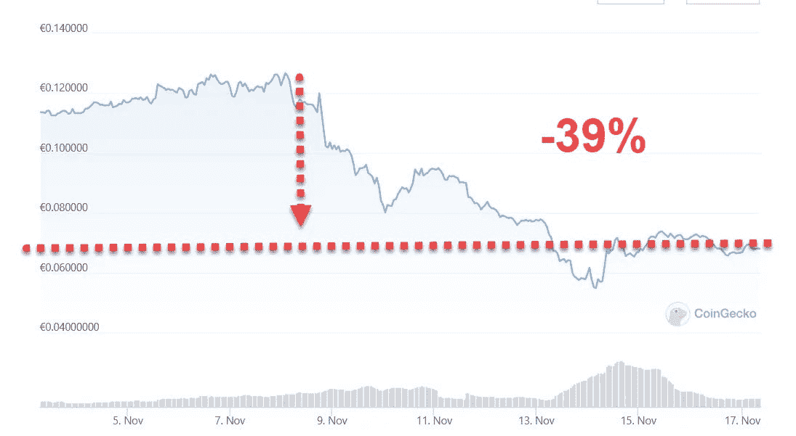
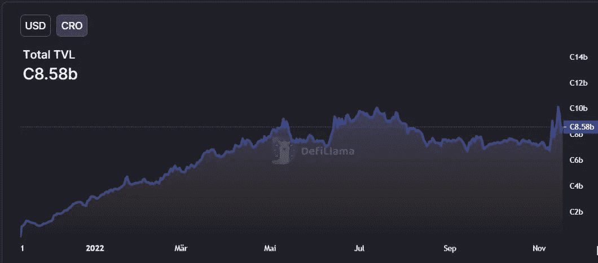

# CRO——FUD 还是克鲁德？

> 原文：<https://medium.com/coinmonks/cro-fud-or-crud-a7c06ff44745?source=collection_archive---------17----------------------->

看看最近围绕 CRO 市场行动的事件。

暂停提款正成为许多交易所的加密管理员最害怕的可怕字眼。在使用任何投资服务时，我首先要做的事情之一就是测试“出口”,以确保我可以取出我的密码，并且我熟悉如何操作。

随着 FTX 和其他交易所的崩溃，人们认为危机也可能蔓延到 CDC (crypto.com)。造成这种情况的原因是首席执行官随意“发推文”将 4 亿美元的 ETH 转移到错误的地址，以及一些人对他们持有的加密技术持怀疑态度。

任何参与转移大笔资金或在财政部工作过的人都知道，这无论如何都是不可行的。

与此同时，被视为疾病预防控制中心健康晴雨表的 CRO 标志遭受重创。

如果我们看看由 [coingecko](https://www.coingecko.com/en/coins/cronos) 提供的 14 天图表，我们可以看到自 11 月 8 日以来，代币价格已经下跌了 39%。

FUD 给出的原因是交易所周围的不安全感。这可能是一些人想卖掉他们的 CRO 的一个原因，但大多数 CRO 人被“锁定”在他们的交易所或他们的 visa 卡上。那么，投机者会对这次市场大调整负责吗？

[来源](https://defillama.com/chain/Cronos?currency=CRO)

我们可以看到，TVL 实际上一直在与 CRO 一起上涨，因此这似乎不是市场调整的可行解释。

[来源](https://defillama.com/chain/Cronos?currency=USD)

CRO 在 coingecko 的市值排名中名列第 31 位，因此它是一个受欢迎的标志。你可以看到，由于 DefiLlama，价值也缩水了 80%以上。

[来源](https://cronoscan.com/chart/active-address)

初始峰值后的活动钱包地址保持与当前水平相似。

然而，有趣的是，根据本报告[这里的](https://consensys.net/blog/cryptoeconomic-research/cronos-ethereum-compatible-layer-1-blockchain-built-on-cosmos-sdk-to-scale-web3/)，有 40%的代币分配应该在 11 月 7 日归属。

创造 FUD 是为了掩盖内部人士向 CRO 股东大量倾销 CRO 吗？

根据 [coingecko](https://www.coingecko.com/en/coins/cronos) 的数据，市值从 31 亿美元降至不到 14 亿美元。这是由授权和内部人做多银行造成的吗？

如果有 40%的流通代币进入市场，这是一笔巨大的横财，这肯定回答了我一年前的问题，即 CRO 的收益率来自哪里。你就是这里看起来的产量。

一个有趣的策略是，在如此大规模的归属发生的情况下创造 FUD，然后在市场上出售马甲，然后在随后的恐慌中以新的更低价格回购你的股份，从而套现一大笔现金，同时仍然拿着你的袋子。这就是他们所谓的白花钱吗？

感谢阅读。

**学分:**

[CRO 白皮书](https://whitepaper.io/document/378/crypto-com-chain-whitepaper)

> 交易新手？尝试[加密交易机器人](/coinmonks/crypto-trading-bot-c2ffce8acb2a)或[复制交易](/coinmonks/top-10-crypto-copy-trading-platforms-for-beginners-d0c37c7d698c)