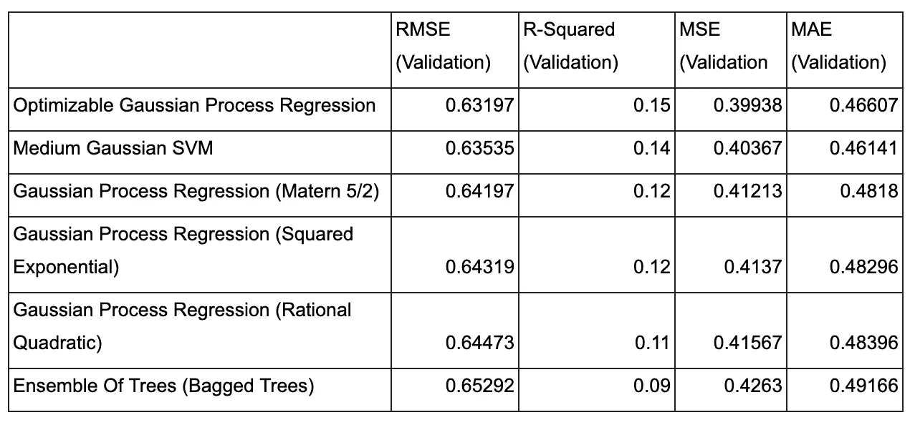

# 苏丹-萨赫勒参数保险产品中的作物产量指数——从保险吸收角度量化效率。

> 原文：<https://medium.com/coinmonks/crop-yield-indices-in-sudano-sahelian-parametric-insurance-products-quantifying-efficiency-from-e9de8628261f?source=collection_archive---------41----------------------->

# 上下文/注释:

以下是我在 2022 年初写的一篇论文，作为我本科学位的一部分。当时我并没有特别想把它贴出来，但不管出于什么原因，最近我突然想到，它可能对任何希望深入了解参数保险指数机制的人都有用。

请随时寻求澄清、背景或数据。

# 摘要

气候风险是 21 世纪全球经济的一个重要特征。苏丹-萨赫勒非洲的小农户最容易受到气候压力的影响，因为气候不稳定性的增加明显增加了该地区作物产量的差异(Pan 等人，2017 年)。这项研究旨在在一个新的框架内批判性地评估各种作物产量预测模型的优点，其中根据旨在最大化保险产品吸收的几个关键因素来评估模型效率。

# 介绍

参数保险是一种相对新兴的保险产品类别，近年来作为扩大发展中国家获得保险产品的一种潜在手段引起了人们的极大关注。广义而言，参数保险产品是一种金融工具，在预先指定的事件发生时支付预定的金额。它与传统赔偿保险的显著区别在于，它不需要对个人索赔进行评估:相反，它定义了一个指数(例如，特定地区的六月降雨量)，并设定了一个阈值。在前面的例子中，这可以简单到发生在降雨量比历史平均水平低 10%或更多的情况下的支付。这种方法的优势是显而易见的:像这样的产品易于分发，易于理解，并且比其他需要人工理赔并存在严重信息不对称问题的作物保险政策涉及的管理成本低得多(第十届保险监管机构、保险从业者和决策者小额保险监管咨询论坛，2017 年)。

基于指数的作物保险在许多发展中国家是一个新兴的行业，并在证明自己是农民可行的风险管理工具方面取得了重大进展。不幸的是，虽然引入了几个试点项目，但大多数项目未能被非洲苏丹-萨赫勒地区的小农农场大量采用(ISF Advisors，2018)——这是一个从强有力的风险管理解决方案中受益最大的客户类型的主要例子，因为该地区的收入主要基于畜牧业和雨养农业(Leisinger & Schmitt，1995)。 人们发现，整个非洲的小气候变化对农业生产率的影响不成比例(第十届保险监管机构、保险从业人员和决策者小额保险监管咨询论坛，2017 年，第 1 页)。

# 文献评论

# 目前的保险投保水平

总体而言，非洲的农业保险覆盖率低得惊人。非洲约有 5100 万小农户(Lowder 等人，2016 年)。其中，只有约 3.5%的人有农业保险(Nshakira-Rukundo 等人，2021 年)。这大大低于世界其他地区:15.8%的拉丁美洲和加勒比海地区以及 46.2%的亚洲小农拥有农业保险。

有几个因素阻碍了这类产品的进一步普及。从广义上讲，其中最重要的是导致“基差风险”现象的因素。

## 基差风险

基本风险是指由于特定天气事件造成的个人损失与参数保险产品可能为此提供的赔偿之间的潜在差额(Gaurav & Chaudhary，2020 年，第 2 页)。苏丹-萨赫勒地区基础风险的最重要因素可能是萨赫勒和苏丹草原的天气存在高度的时空变异性。萨赫勒已被确定为 20 世纪世界上降雨时间变异性最高的地区(Nicholson，2000 年)。这种时间可变性提出了在为该地区保单定价时应采取的最佳方法的重大问题，例如，根据过去 15 年的数据定价的保单与根据过去 30 年的数据定价的保单之间可能会出现重大差异。整个萨赫勒地区的降雨模式也有很大程度的空间变异性，以至于当地农民通常将他们的田地分散在当地，这样就可以将当地天气变化对单个家庭作物产量的影响降至最低(阿克波尼克佩、米内特、热拉尔、迪弗尼和比埃尔德斯，2011)。这种做法虽然效果一般，但清楚地表明效率低下，如果农民能够获得更有效的风险池，这种情况是可以消除的。

即使是结构和价格都精确的产品，也只能精确到其指数数据足够精确的程度——想象一下，在降雨模式具有高度空间差异的区域中，一个单一的降雨量测量值可以告知 100 公里范围内的农田。平均而言，该地区的农民可能会得到正确的补偿，但鉴于他们的产量损失规模，几乎可以肯定的是，一些农民将面临不足的补偿，而另一些农民将获得不成比例的巨额补偿。

类似地，许多现有参数保险产品采用的单一指数方法也有很大的局限性。虽然雨水是农作物产量的一个很好的预测指标，因为缺少雨水往往会破坏产量，但它远不是影响产量的唯一潜在因素。害虫、土壤肥力和野火只是在参数保险指数中增加基本风险的无数因素中的几个显著例子(Ngounge Liliane & Shelton Charles，2020)。例如，风会严重影响农作物的生长和产量。高速风可以加速沙地的侵蚀过程，并在幼苗上沉积大量的微粒。这种颗粒物质的重量，加上在这一过程发生的地区和时间通常观察到的与天气条件相关的较高土壤温度，可能导致同一作物在同一年需要多次复种。在尼日尔观察到风速超过每小时 100 公里(Sivakumar 等人，1993 年)。

## 其他因素以及这些因素之间的相互作用

(Nshakira-Rukundo 等人，2021 年)发现，目前有六个关键主题阻碍了非洲农业保险的发展:

**产品质量** 这是指限制给定保险产品有效性的因素。基差风险是其中最显著的。

**产品和合同设计** 这是指在设计产品时做出的设计决策:覆盖什么区域，一年中的什么时候触发支付，产品实际上是如何销售的？

许多小农户面临严重的预算限制。是否有灵活的支付方式，保险是否有补贴？

**信息、知识&教育原因** 当农民无法理解保险产品背后的机制时，他们就不太可能相信这些产品能维持他们的生计。

**行为和社会文化因素** 风险认知、社会信任、文化和宗教信仰都会影响人们购买农作物保险的可能性。

**政府在政策制定中的作用** 政府在监管保险市场、补贴保险项目和降低交付成本方面发挥着关键作用。

值得注意的是，这些项目之间存在相互作用:改进产品设计可以降低基差风险并提高产品质量，这反过来又可以使合同更实惠。教育通常与购买保险意愿的增加有关，但可能会改变其他社会文化因素，并导致收入多样化——这是一个往往会抑制保险需求的因素！(博加尔，2014)。任何因素的改善都可能是“复合的”,因为它们会积极影响其他对保险业务有贡献的因素，或者如果它们遇到具有相反效果的相互作用，就会“减弱”。

(Leblois 和 Le Cotty，2020 年)研究了气候变化对发展中国家(尤其是萨赫勒地区)接受无补贴指数保险政策的潜在影响。这里的发现表明，当干旱频率增加时，参数保险的需求下降——这一发现与人们本能的预期相反。在本文中，他们表示需要进一步研究不同类型的干旱对保险需求的影响:考虑到干旱可能变得更加严重，同时仍然不频繁，这是一种他们未能检验的配置，这种研究尤为重要。

(Lizumi，Yokozawa，Hayashi 和 Kimura，2008 年)探讨了气候变化对水稻保险的潜在影响，并发现温度变化可能会导致最小的作物产量变化，而不是日本北部的产量略有增加，同时全国其他地区的产量略有下降——最终导致平均保险支出降低。

一些研究发现，投保率与气候波动正相关，尽管这是在相对富裕的国家发现的情况，因此尽管值得一提，但它可能不完全适用于当前的讨论。(Di Falco 等人，2013 年)对意大利农业的分析表明，对保险产品的需求实际上可能会随着气候条件的变化而增加，保险确实会降低风险。这里的发现还表明，作物多样化可以作为巨灾保险的替代品，但最终两者都是农场层面风险管理的重要工具。进一步研究个人行为的作用，特别是风险和模糊厌恶，在这里被建议，因为人们相信，这些在保险接受中起着重要的作用，但目前尚未量化。

所有这一切的症结在于，为低收入和偏远地区设计农作物保险产品需要仔细考虑各种因素。与基差风险相关的因素可能是最容易改善的，也是对提高接受度最有影响的因素之一——基差风险的降低将使产品更实惠，更适合农民的个人需求，并可能降低与支付此类合同相关的感知风险。总体成本的降低也是至关重要的，因为低溢价意味着即使边际成本相对较小的名义增长也会导致价格的大幅上涨。

# 遥感

除了南极洲之外，非洲的天气观测网络的精确度最低。该大陆 54%的地面气象站和 71%的高空气象站(气象气球)无法捕捉准确的数据，不到 300 个气象站符合世界气象组织的观测标准(世界银行，2017 年)。未来几年可能需要大量投资，以改善地面实况数据的制作。与此同时，参数保险公司必须找出如何在不依赖当地气象站的情况下获得合理的粒度、廉价和准确的数据。

遥感是一个广义的术语，用来描述获取特定区域相关数据的任何远程手段。通常，在今天的参数保险背景下，这意味着卫星数据，尽管也采用了雷达、无人机和其他手段(Karanai Margan，2021 年，第 37 页)。目前有几种传感方法被用作产生参数保险指数的工具。从广义上讲，这些方法可用于通报“基于投入”的指数或“基于产出”的指数(国际农业发展基金，2018 年，第 31 页)。

## 基于输入的指数

基于投入的指数侧重于产生对作物产量很重要的投入变量(通常是降雨量)的估计值。因此，基于这一点的保险产品没有考虑非天气因素，如前面提到的那些因素。

大多数基于卫星的降雨量估计(rfe)相当准确，提供良好的空间覆盖，并且可以免费获得(国际农业发展基金，2017 年，第 31 页)。基于降雨量的保险产品易于理解，实施迅速，并受益于长时间序列数据。不幸的是，大多数 RFE 产品的空间分辨率在 4 到 25 公里之间。此外，这些产品还往往无法正确测量非洲大部分地区高度多变的天气系统，因此往往会低估极端降雨事件(国际农业发展基金，2017 年，第 31 页)。

尽管存在这些限制，但 RFE 的天气指数保险产品仍得到了广泛使用，特别是当与其他金融产品捆绑在一起时(Anta Syll 等人)，或者当与购买种子和化肥等投入相关联时(Qaim 和 Sibiko，2017 年)。此外，天气指数保险的影响可以通过将保险销售与补充灌溉投资相结合来进一步提高:地区降雨短缺通常与当地食品价格上涨有关，这可能会部分抵消指数保险赔付的好处。当农民能够获得补充灌溉技术时，保险赔付可以转而用于购买作物用水，从而提高区域粮食生产的连续性，降低区域粮食价格的波动性(Kemeze，2018)。同样重要的是要注意到，保险覆盖率与所使用的农业投入的数量和质量之间存在很强的相关性——(Qaim 和 Sibiko，2017 年)表明，购买天气指数保险会使参与保险的农民的化肥使用量增加 50%，玉米产量增加 53%。

## 基于产出的指数

基于产量的指数通常着眼于与产量相关的变量，如每个地区的植被水平或蒸散量，并使用这些变量为特定作物的产量模型提供信息。这些方法更有可能反映各种风险来源产生的实际作物特定产量变化(国际农业发展基金，2018 年，第 31 页)。

目前使用的大多数模型采用人为设计的输入变量，这些变量将原始卫星数据剥离出来，集中于一两个重要的光谱带。然后，这些可以用作作物模型的输入。基于产出的指数的遥感输入变量的例子包括:

*   归一化差异植被指数(NDVI)，这是一种“绿色度”的衡量标准，它根据卫星图像中的可见光和近红外反射率来确定作物的健康状况。健康的植被吸收大部分可见光，同时反射大量的近红外光，而不健康或稀疏的植被反射更多的可见光和更少的红外光(美国航天局地球观测站，2000 年)。
*   被吸收的光合有效辐射(fAPAR)的分数，一种“量化活叶吸收的用于光合作用活动的太阳辐射分数”的度量。(哥白尼土地监测局，2014 年)。这不能从远程数据中直接计算出来:哥白尼通过将神经网络应用于 Sentinel-3(欧空局的一颗卫星)的冠层反射数据，得出了每日 FAPAR 值的估计值。从 2014 年开始，哥白尼可以以 300 米的粒度获得这种方法的全球数据。
*   增强型植被指数(EVI)，一种设计用于高生物量地区的植被指数。它与 NDVI 相似，量化了“绿色度”，但校正了一些大气条件和背景噪音，因此在植被茂密的地区使用时具有更高的灵敏度(美国内政部地质调查局)。
*   叶面积指数(LAI)，一个量化给定区域内叶面积数量的指数。(方等，2019)。这可以通过使用上述类似的光学感测数据来远程估计，并且这些估计可以通过使用光检测和测距技术来进一步改进，这些技术考虑了某些种类的植被的三维性质(当然，尽管与雨林等相比，大多数农作物是相对一维的)。这些技术被开发出来进行描述)(郑和，2009)。
*   初级生产总值(GPP)，这是一个相对较低的指数，旨在量化特定区域二氧化碳合成有机化合物的总量。这可以通过基于上述(和其他)植被指数的模型，或通过直接解释光合有效辐射进行远程估算，类似于上述过程(Rossini 等人，2014 年)。

这些测量通常由相同或相似的数据集提供信息。虽然它们有助于将密集的卫星图像转化为人类可读的东西，但它们可能会丢弃大量潜在有价值的光谱信息(Wang et al .，2018)。

## 混合指数

在不存在现有收集机制的地区，考虑收集区域产量数据的成本很重要——安联非洲公司使用一款名为“绿色三角”的应用程序，专家可以在其中将产量损失的证据上传到安联的系统，以及有关相关领域的其他一些细节。然后，来自该服务的数据与常规指数数据一起用于产生混合服务，该混合服务(理论上)将参数保险的低成本与传统赔偿保险的低基差风险相结合。来自 GreenTriangle 的数据可用于进一步改进参数产量估计，因此人工索赔调整的需求有望随着时间的推移而减少(GreenTriangle，2022)。

根据某一地区作物产量的真实情况或混合估计出售的保险可以称为“地区作物产量指数保险”(ACY)。安联非洲公司确定了 ACY 的以下优点和缺点(安联非洲公司，2021 年):

*   ACY 是单个农场产量的一个很好的代表。
*   ACY 涵盖了所有系统性风险。
*   ACY 需要历史收益率数据。
*   ACY 带来了一些基差风险(尽管这种风险的程度在很大程度上取决于用来收集收益率数据的方法，而且可能相当低)。
*   ACY 可以有一个缓慢的支付。

鉴于 GreenTriangle 仍然是一个相对年轻的产品，具有不透明的数据仓，这种方法在速度、基本风险和索赔调整费用方面是否比纯粹的遥感方法更有效仍然是一个难以回答的公开问题。考虑到需要进行人工索赔调整，GreenTriangle 似乎可能在其广泛采用的领域最具竞争力，因为这可能会减少评估员的差旅费用，同时还会在更多客户之间分摊评估成本。不幸的是，鉴于迄今为止非洲的农业保险覆盖率普遍较低，绿三角目前似乎不太可能从这些效率中受益。

GreenTriangle 的一个关键卖点是，它能够对历史产量数据相对较少的地区进行产量估算。有一些数据处理技术也可以做到这一点，其中一些将在本文献综述的后面讨论。

# 产量建模

作物产量模型往往分为三大类:线性模型、机器学习模型和作物模型(Ansarifar 等人，2021 年)。每种方法都有一些值得讨论的基本优点和缺点:

*   线性模型允许了解不同因素如何影响产量，因为它们明确量化了每个输入变量的影响。它们通常不能达到很高的预测精度，因为它们不能捕捉基因型、环境和管理变量之间(固有的非线性)的相互作用(Ansarifar 等人，2021)。
*   机器学习模型已经成功地用于作物产量预测。这些可以捕捉输入变量之间的非线性相互作用，并且通常是可扩展的。不幸的是，机器学习模型是一个“黑箱”——解释它们为什么工作(或不工作)很困难，并且该领域的大多数模型不允许我们确定给定输入变量的个体影响(Ansarifar 等人，2021)。
*   作物模型利用对生物过程的理解来创建非线性方程，为作物生长中环境和基因型变量之间的相互作用提供明确的解释。这需要关于作物性状、环境和管理因素的大量数据，并且可能不如领先的机器学习或多元线性回归方法准确。

## 机器学习

在过去的十年中，机器学习(ML)的重大进展促进了一系列从远程数据预测作物产量的研究。最近对现有研究的元分析发现，该领域的出版物从 2008 年至 2012 年的每年 1 篇增加到 2016 年的 9 篇、2017 年的 6 篇、2018 年的 12 篇和 2019 年的 5 篇(Van Klompenburg et al .，2020)。在这些出版物中，卷积神经网络(CNN)方法使用最多，其次是长短期记忆(LSTM)方法。这两个都是深度学习算法的例子。

机器学习的一般特征是需要大量的原始训练数据(Russom，2018)。在构建模型来描述美国或其他发达国家的作物产量时，这一点很好，因为这些国家有大量高质量的颗粒产量和天气数据。然而，在发展中国家的一些地区，事情可能会有点棘手。总的来说，非洲国家没有连续几年的精确的作物产量数据。考虑到这一点，即使数据不完整，考虑能够合理准确估计产量的变通办法也是很重要的。(王等，2018) 采用了一种叫做“深度迁移学习”的技术。在这里，他们根据描述阿根廷作物产量的数据训练了一个 LSTM ML 模型，然后根据巴西的数据对模型进行了微调。这种方法有一个输入:来自美国宇航局的原始 MODIS(光谱仪)卫星数据，这些数据已经被处理成三维直方图。在这里，发现根据阿根廷数据预先训练的模型对巴西作物产量的估计比只根据巴西数据训练的基线模型有显著的改进。许多其他论文也采用了类似的技术，但方法有所不同，包括(卡其等人，2021 年)、(柯伊拉腊等人，2019 年)、(达拉尼等人)和(李等人，2019 年)**。**

## 其他方法

随着研究人员可获得的遥感数据的数量显著增加，在过去几年中，已经建立了大量的研究来调查多元线性回归(MLR)方法在利用遥感数据进行作物产量预测方面的功效。

欧洲委员会联合研究中心(JRC-EU)开发了一个名为“作物统计工具”的免费软件，用于全欧洲的月度作物产量预测。这使用遥感数据提供的作物产量指标，如模拟生物量、NDVI 或最终产量估计(欧盟联合研究中心，2021 年)与天气指标(这些指标可以来自地面真实来源或遥感)相结合，以产生将这些输入与统计作物产量数据相关联的多元线性回归模型。然后，这些模型可以应用于相同的数据，以产生对没有实际数据的时期和地区的估计。

在生产之后，检查上面生产的 MLR 模型的时间趋势——如果这是肯定的，则认为是由于农业技术的技术发展。围绕这一趋势的变化被认为是由上述天气指标解释的。

(Navarro-Racines，Tarapues，Thornton，Jarvis，& Ramirez-Villegas，2020)概述了用于创建 [](http://ccafs-climate.org/climatewizard/) “气候向导”的方法，该工具允许任何人根据不同的假设对每个地区气候变化对若干气候因素的影响进行建模。该工具非常有用，可以快速有效地生成多个时间段的颗粒降水和温度预测，并与历史数据进行比较。这与每年产生准确的作物产量估计没有太大关系，但这里采用的方法在预测未来商业环境方面确实有明确的应用，特别是在投资分配方面——考虑推出参数保险产品的公司应仔细考虑给定市场的长期未来。

(Fall 等人，2021 年)通过混合塞内加尔的地面真实降水数据和四个遥感输入变量(NDVI、SPI-3(标准化降水指数)和 WSI(天气压力指数——一种常用于表示给定区域当前条件和历史条件之间相似性的测量方法)**,将该技术作为一种建模塞内加尔作物产量的方法。**对来自塞内加尔农业统计局(DAPSA:分析、预测和农业统计方向)的小米产量普查数据进行外推，并将其用作模型中的因变量。

# 摘要

这里分析的绝大多数作物产量预测研究表明，总体上关注的是基础模型的效率，很少从保险的角度分析每种方法的优势和劣势——这是正确的，这些模型中的大部分不是设计用作参数指数的。相反，它们旨在为决策者和非政府组织提供相当准确的预警信号。尽管如此，这些模型中的许多显然可以应用于农业保险行业。然而，到目前为止，还没有对这种应用进行广泛、定量和有意义的深入研究。考虑到这一点，将我们所了解的影响保险增长的因素应用于一些潜在的建模方法是有意义的，因为这样做的过程将允许创建一个框架，通过该框架可以分析指数优化。

# 方法和数据

# 经验方法论

这里，使用各种不同配置的各种回归技术，仅根据降雨量输入生成作物产量模型。遥感降雨量估算和地面真实降雨量数据都被用作回归量。然后，将这些模型与各种更复杂的基于产出的模型的结果进行比较，目的是从保险吸收-改善的角度确定每种技术的相对优点。本文并不试图回答一个因果关系假设:相反，它主要涉及回答两个问题:

*   哪种指数化方法(在建模和数据输入方面)最能降低基差风险？
*   哪种指数化方法最适合在发展中国家最大化参数保险的采用。

更广泛地说，这项研究的目的是为一个可以用来分析参数保险指数功效的定量框架奠定基础。

# 样品

埃塞俄比亚被选为分析对象，因为有典型的地面真实产量和降雨量数据可用。

对现有作物产量预测模型的全面审查产生了两种有前途的基于产量的建模方法。这些是根据以下因素挑选的，尽管也注意确保这两种技术在方法上有显著的不同。

*   性能(由 R 和均方根误差(RMSE)决定)。
*   输入数据要求
*   产量数据要求
*   地理相关性

选择用作基线的基于产出的论文和基本方法如下:

*   作物产量预测的深度迁移学习(王等，2018)。
*   塞内加尔结合遥感指标预测作物产量的干湿周期表现(Fall et al .，2021)。

这些研究的概述如下。


*   埃塞俄比亚的地面真实降雨量数据来自美国国家海洋和大气管理局的 GHCN-Daily 数据集，如(Menne 等人，2012 年)所述。
*   遥感降水数据来源于(Huffman 等人，2019)。
*   埃塞俄比亚的地面实况产量数据来源于(Wang 等人，2018 年)中使用的数据集，可在引用的 GitHub 上找到。
*   16 天 NDVI 数据来自(“MOD13A2 v006”)。

# 分析

## 基于输入的指数分析。

在以下分析中使用了多元线性回归方法来估算埃塞俄比亚降雨量和作物产量之间的关系。每项分析最初都是用 OLS 模型进行的，如下所示，然后转移到更先进的建模技术:


在我的前两个分析中， *yi* 是特定地区给定年份的作物产量，每个回归变量是给定月份的降雨量(Jan = > 1，Feb = > 2，等等)。)那一年。这是一种相对简单的方法，旨在评估仅使用降雨量数据通知保险赔付的优点-如文献综述中所述，绝大多数作物模型、基于线性回归或其他方式通常使用额外的回归变量，如土壤湿度、土壤类型和光谱仪数据。

记住天气与产量的关系通常至少部分是非线性的，这一点也很重要。考虑到这一点，我还采用了许多其他基于机器学习概念的更复杂的建模技术。

**地面真实降雨数据&普通最小二乘法作物产量**

在该分析中，使用了多种多元线性回归技术来确定地面真实降雨量数据在给定区域产生作物产量估计值时的有效程度。选择埃塞俄比亚进行分析，是因为其雨量计的分布在苏丹-萨赫勒非洲很典型(可核实的精确雨量计不多，而且这些雨量计在全国的分布也不均匀)(Tessema Segele 等人，2009 年)。

地面真实降雨量数据提取自(Menne 等人，2012 年)中描述的 2001 年至 2016 年(含)的数据集。同期玉米产量的地面实况数据摘自(王等，2018)提供的数据集。产量数据由地名提供，而不是坐标，因此(“Awesome 表地理编码”)用于生成每个产量测量的经度和纬度数据点。这些坐标值随后用于根据直线距离提取上述数据集中实现的气象站 id，如下表所示。


如果最近的气象站的数据可用于相关月份，则使用该数据。否则，使用第二个气象站的数据。这揭示了地面真实数据集中丢失了多少数据:在分析的 2712 个站月中，只有 533 个站月有可用的降雨量数据。即使是那些数据可用性相对较高的台站，通常也仍然会丢失大量数据。

考虑到这一点，如果我们想对地面真实降雨量的预测性质进行任何有意义的分析，就需要采用某种形式的插补。当然，这在某种程度上是不相关的，因为缺失数据点的绝对数量自然意味着地面实况埃塞俄比亚降雨量数据不会对保险有用，除非该国测量仪器的数量大量增加，并且这些测量仪器的完整数据积累了几年。尽管如此，我坚持认为，如果没有其他情况，这里进行的分析有可能在某种程度上表明目前的事态。

我认为列表删除、均值插补、预测均值匹配和回归插补是填补缺失数据点并产生某种形式可行模型的工具。坦率地说，考虑到缺失数据的绝对数量，这些都不能真正解决我们的问题，但我们至少能够做出某种估计。

*   列表式删除会清除我们可用的绝大多数数据:在我们所有的 566 个产量数据点中，只有 26 个数据点有最近或第二近的气象站的完整数据。
*   回归插补将使用我们可用的产量变量来估计我们的输入。使用这种方法会在某种程度上否定生成模型的意义——这里的目标不是生成精确的模型本身:相反，我们希望确定地面实况数据是否是作物产量的良好参数保险指数。产生不自然地接近回归线的确定性估算值会导致我们高估我们的真实相关性——产量和降雨量之间的关系可能是正确的，但我们对其周围可变性的估计会被破坏。
*   均值插补对于产生精确的模型来说不是很好，并且面临许多重大的缺点。然而，在这里它确实是有意义的——如果小心应用的话。我将数据集中所有缺失的月值替换为该月来自地面真实来源的埃塞俄比亚平均降雨量。这有效地模拟了这样一种情况，即没有居住在产生数据的雨量计附近的小农户只是被出售了基于埃塞俄比亚总体降雨量的劣质产品，而不是根本没有得到服务。

来自该分析的描述性统计数据列表如下:


**遥感降雨量估算&地面实况作物产量数据分析采用多种方法**

我进行的下一个分析涉及一个多元线性回归模型，该模型由来自(Huffman 等人，2019 年)的遥感降雨量数据提供信息。在这里，我从美国宇航局戈达德地球服务数据和信息服务中心(GES 光盘)的数据集获取了 2001 年 1 月至 2016 年 12 月期间每个月的高粒度降雨数据。这里的数据以 0.1x0.1 的盒子形式提供，大约 10 平方公里。我过滤了这个数据集，只包含了图 1 中边界框内的降雨量数据坐标。图 2 显示了 2001 年 1 月的数据。然后数据被组织成一个数组，数据的经度和日期在一个轴上，而纬度在另一个轴上。


Figure 1: The bounding box used to filter GES DISC rainfall estimate data.


Figure 2: Demonstrative rainfall data visualisation for January 2001.

来自(王等人，2019)的地面实况玉米产量数据如前所述进行组织，并根据每个数据集中提供的坐标提取每月产量数据。幸运的是，直线距离计算在这里是不必要的，因为所讨论的区域完全被降雨数据集覆盖。取而代之的是采用了基于连接的日期和坐标值的(非常大的)查找表。图 3 显示了 2002 年的一些样本数据，其中用橙色突出显示了月降雨量估计值。一旦所有 555 个产量数据点都填充了月降雨量数据，MLR 模型就如上文所述生成，并生成指示性统计数据，如表 3 所示。此处的估计值与基于先前数据集的估计值有很大不同，我曾假设这会对我们模型的效率产生积极影响。然而，对相关描述性统计数据的粗略审查似乎表明，情况并非如此。这似乎可能是因为用于产生第一次分析的平均插补导致了一种人为的精确关系——这并不一定是一个问题。对这些结果的进一步分析将在接下来的“结果”部分进行。


Figure 3: A demonstrative screenshot of a table with annual yield and monthly rainfall data.


OLS 分析的结果表明，降雨量和作物产量之间存在正相关关系，尽管这种关系相对不明显，因为该模型的调整后 R2 约为 0.17。因此，各种其他非线性模型被应用于同一数据集。下表列出了这项工作的结果，我们可以看到，在测试的模型中，高斯过程回归(Gaussian Process Regression)方法明显优于其他尝试的方法。五重交叉验证用于评估每种方法，如下所示:

*   数据集被随机打乱。
*   数据集被分成 5 个相等的组。
*   对于每一组，一个在其他四组上训练过的模型被拟合和评估。
*   描述性统计数据来源于这些分数的汇总。


高斯过程回归是一种非参数概率(贝叶斯)回归建模方法，适用于相对较小的数据集(王，2021)。这里，指定一个先验分布，然后根据观察值分配概率(Rasmussen 等人，2006)。就 R2 和 RMSE 而言，得分最高的模型是“可优化的高斯过程回归”，其 R2 得分为 0.26，RMSE 为 0.66329，略好于其他高斯过程回归方法。这里的可优化高斯过程回归使用 Matlab 中的“Bayesopt”算法来优化与模型相关的超参数。通过在模型的概率范围内采样几千个点来改进未优化的模型。选择这些点中的最佳点，然后通过局部搜索进行改进，以找到最可行的点——这里的目标是满足模型施加的所有贝叶斯约束(“贝叶斯优化算法——MATLAB & Simulink”，2022)。在图 4 中可以看到该模型的响应曲线。


Figure 4: Optimizable Gaussian Process Regression Response Plot

## 基于产出的指数分析

接下来的分析采用了上一节中概述的可优化高斯过程回归方法，并将其应用于由之前使用的相同作物产量数据生成的数据集，但这次使用的是来自(“MOD13A2 v006”)的 0.05 (5，600 M) 16 天 NDVI 和 EVI。这比以前获得的降雨数据在空间和时间上更加精细。不幸的是，数据仅在预定义的“网格”中可用，如图 5 所示，因此为了进行分析，必须下载大量多余的数据，然后进行过滤。从 2000 年到 2014 年，1369 个文件中的 23gb MODIS 数据被下载了好几年。下面提供的 Matlab 脚本用于遍历产量数据表，根据每个数据点的坐标和年份打开相关文件，然后将 NDVI 从这里的正确区域拉出。数据文件没有提供标准的纬度和经度细节，因此采用了一种基于四个网格中每个网格的比例划分的方法，以确保从正确的位置为 565 个产量数据点中的每个点提取 NDVI 和 EVI。相当一部分点没有整个 14 年期间的可用数据，因此这些点被从分析中移除。这剩下 258 个产量数据点用于分析。

```
T = ethiopiagranularrainfallS3;
table_size = size(T);
rows = table_size(1);
fmt = 'MOD13A2.A%s*%s*.hdf'
for row = 1:rows
    row
    lat = T(row, 1).(1);
    lon = T(row, 2).(1);
    year = string(T(row, 3).Year);
    if lat > 0 && lon > 30 && lat < 10 && lon < 40
        loc = "h22v08";
        y = round((lat/10) * 1200);
        x = round(((lon-30)/10)*1200);
    end
    if lat > 0 && lon > 40 && lat < 10 && lon < 51
            loc = "h21v08";
            y = round((lat/10) * 1200);
            x = round(((lon-40)/10)*1200);
    end
    if lat > 10 && lon > 30 && lat < 20 && lon < 42
            loc = "h22v07";
            y = round(((lat-10)/10) * 1200);
            x = round(((lon-30)/10)*1200);
    end
    if lat > 10 && lon > 40 && lat < 20 && lon < 53
            loc = "h21v07";
            y = round(((lat-10)/10) * 1200);
            x = round(((lon-40)/10)*1200);
    end
    FILE_NAME = sprintf(fmt, year, loc);
    filename = string({dir(FILE_NAME).name});
    for fileNum = 1:length(filename)
        thisfilename = filename{fileNum};
        thismatrix = hdfread(thisfilename, '1 km 16 days NDVI');
        ndvi = thismatrix(x,y);
        rowIndex = fileNum+5;
        T{row, rowIndex} = ndvi;

    end
end
```


Figure 5: NASA MODIS NDVI Grids

这里再次使用了之前应用的相同的统计技术，以创建一个仅使用 NDVI 作为回归变量的模型。这些分析的结果如下所示。


进行的最后分析包括三个变量:来自(" MOD13A2 v006 ")的 EVI 和 NDVI，以及来自美国航天局 DISC 的遥感降雨量数据。上面使用的技术稍加修改，然后用于从前面描述的同一数据集中提取 EVI 和 NDVI。然后将其与年降雨量一起制成表格，以生成一个年化产量、NDVI、EVI 和降雨量的表格。NDVI、EVI 和降雨量被用作回归变量，同样的建模技术也用于上述遥感降雨量，以生成描述性统计表，如下图所示**。**



# 结果

## 建模方法

最佳产量模型方法似乎取决于指数生产所用的数据。在利用遥感降雨数据进行的两项分析中，高斯过程回归方法在基本风险和统计显著性方面都是最强的模型。这是有意义的:高斯过程回归方法非常适合建模时间和空间序列数据，并经常应用于天气建模应用，如根据周围的天气数据填充未观测位置的缺失数据点(Powell，2021)。

另一方面，在用纯 NDVI 进行的分析中，基于决策树的方法产生了略微更强的结果。这很有趣，并且可能已经发生，因为决策树建模方法在某种程度上容易过度拟合，特别是在应用于大型数据集时，因为它们可以创建过多的“分支”(Kumar，2021)。这在这里可能不是问题，原因有几个:

*   小心翼翼地应用了基于随机改组的交叉验证技术。
*   在我们的纯 NDVI 数据集上，性能最高的模型是“树的集合”，这是一种应用自助采样和聚集技术来防止过度拟合的技术(Kumar，2021)。

这里的关键要点是，寻求构建基于收益率的参数保险指数的公司应仔细考虑他们采用的建模方法，因为这可能导致模型效率的显著差异，具体取决于所采用的数据。有必要进一步研究迁移学习作为一种工具的功效，以提高上述非线性回归模型的性能，特别是考虑到此类研究对本文所探讨的区域的适用性。

## 基差风险

如果我们不首先确定一种量化基差风险的方法，就很难确定哪个指数会在假设上最小化保险产品的基差风险水平。出于本分析的目的，为每个指数分配了两个基本风险“分数”,根据每个指数提供的埃塞俄比亚相同保险产品的假设超额支付或短缺进行计算。这使用了来自(Meenan，2017 年)的以下公式。这些反映了线性支付模型下保险产品的超额支付和短缺。


这里的“用尽”描述的是损失的程度，超过这个程度，赔偿产品将停止支付，而“扣押”是开始支付的点。这些公式非常有用，因为它们以一种易于沟通的方式量化了基差风险。当然，需要注意的是，此处执行的所有分析所使用的产量数据集仅包含区域级别的数据，而非单个级别的数据。因此，这一分析得出的结果可能低估了埃塞俄比亚个体小农户面临的基本风险的真实水平。尽管如此，这种分析是有用的，因为它提供了一种定量的方法来评估上一节中使用的每个指标的相对效率。基准风险计算如下:

*   从 2000 年到 2016 年，当产量低于给定地区平均玉米产量的 80%时，支付就会开始。
*   衰竭被简单地设定为作物产量为 0。
*   支付被假定为收益损失的线性函数——收益比附件水平低 1 个单位被假定与 1 个货币单位的支付相关联。

使用上一节中模型生成的预测产量进行了分析，并得出了下表中的结果。从该分析中可以清楚地看出，在本文研究过程中产生的数据集当中，在使用均值插补来填补缺失数据点的情况下，调整后的 R2 和 RMSE 的差异不一定能很好地表明保险指数中基础风险的差异。这是有道理的——从统计角度来看，我们的模型似乎更强大，因为通过代入不自然地接近总体均值的值，模型效率得到了人为的提高。从下面的结果判断，在比较同一数据集的各种建模技术时，R2 和 RMSE 的差异似乎只是基差风险的良好指标。进一步研究统计分析技术和数据来源的差异如何影响基本风险估计是合理的，因为在本文试图实现的范围内，很难在这方面说任何更明确的东西。


不幸的是，计算两个基线模型的基础风险被证明是困难的，因为它们的结果不容易获得。(Wang 等人，2018 年)在与本文采用的每个模型相同的粒度和准确性水平上运行，因此似乎有理由假设与他们的方法指数化的假设参数保险产品相关的基差风险水平将略低于本文分析中发现的水平。对迁移学习作为降低基础风险的工具的有效性进行进一步研究可能会非常有用。

(Fall 等人，2021 年)的操作粒度比本文中的分析粒度粗得多。进一步研究其中所采用的建模技术对具有更高空间和时间粒度的分析的适用性将是有价值的。

## 粒度

确定索引的可用粒度级别很容易——它只是数据可用的最小尺度。下表列出了本研究中使用的每个数据源的粒度。


## 费用

值得考虑与制作这些指数相关的成本。本文中的每一个指数都是在有效的零美元预算下创建的。然而，执行这些分析所需的专业知识水平差异很大，如果这些分析是在公司层面上执行的，对于寻求提供高粒度参数保险的保险公司来说，这可能代表了很大一部分边际成本。人们必须记住，保险是一个利润微薄的行业，通常需要规模才能盈利。幸运的是，本文中采用的每一个模型都可以作为参数保险指数进行部署，相对而言不费吹灰之力——没有理由认为感兴趣的一方不能每年发布精确的作物产量估计值，供公众免费获取。根据这些估算销售保险相对简单，而且估算的透明度对于寻找条款简单易懂的保险产品的小农户来说是一个重要卖点。

# 局限性、对未来研究的影响和结论

## 限制

这项研究对各种基于输出和输入的指数选项进行了合理的广泛分析，作为构建参数保险指数的工具。虽然我们发现这里生成的每个模型都具有统计显著性，但需要注意的是，它们是基于相对粗糙的地面真实产量数据设计的，因此，从这些分析中得出的结果不太可能很好地代表埃塞俄比亚小农通过购买基于这些指数的保单而获得的个人体验。

很难说假设的小农户使用本文产生的指数的体验会比这里进行的分析所暗示的更好还是更差。用于制作两个性能最佳的模型——“GES 圆盘降雨”和“美国航天局 MODIS”——的数据集都具有合理的粒度，分别在 10km2 和 5.6km2 的尺度上运行。这比所提供的收益率数据要精细得多，这可能意味着在小范围内使用更精细的收益率数据进行分析可能更准确，因此基差风险更低。另一方面，这里进行的分析可能受益于低水平的空间变异性，这是将产量数据汇总到区域一级的结果，这些区域大于上述 10 平方公里和 5.6 平方公里的范围。所用区域的规模从不到 8 平方公里到超过 10，000 平方公里不等。使用更精细的产量数据对这些指数的效率进行进一步研究，将有助于确定它们的真正潜力。

可能需要对数值基差风险和参数保险摄取量之间的联系进行进一步研究，因为如果没有这种研究，就很难准确量化本文中所进行的研究的潜在影响——我们可以非常肯定地说基差风险较小是一件好事，但如果无法获得关于基差风险和保险摄取量的数据，就很难确定它到底有多好。

## 结论

这项研究旨在探索参数保险的各种指数选项，以及它们作为工具促进苏丹-萨赫勒非洲保险接受的潜力。令我惊讶的是，在本文探讨的选项中，降雨量被证明在降低基差风险方面最有效，尽管对更重要的产量数据进行进一步研究可能有助于更明确地确定这一点。虽然光谱图像数据(NDVI 和 EVI)在单独用于分析时是具有统计意义的回归变量，但将它们与降雨量一起纳入产量估算模型实际上会导致对这些模型的残差进行分析时基本风险水平略有增加。这可能是由于在本文使用的数据集产生期间，光谱成像技术相对不成熟，这可能是介质的基础，也可能是本文使用的相对“低带宽”方法进行数据分析的结果。如果在原始卫星图像的基础上采用更需要输入的方法，如(王等人，2018 年)中使用的深度学习模型，可能会获得更好的结果。光谱图像提供的分析所使用的数据点数量较少(因为这些分析所使用的数据集中存在大量无效数据点)也有可能导致模型质量下降。

同样值得注意的是，在各种数据类型中，从相对有限的一组数字输入中，关于作物产量估算的各种非线性建模方法的效率的研究结果。也许并不令人惊讶的是，基于神经网络的方法在将少量的数字天气数据转化为合理准确的作物产量估计方面几乎惊人地无效。然而，其他非线性方法，如高斯过程回归和决策树，证明对这项任务相当有效。这一发现可能对未来的研究人员和公司在构建自己的作物产量指数时考虑关注哪些方法有所帮助。

本文提出的研究结果可能会引起寻求理解发展中国家参数保险的各种指数化方法的公司的兴趣。地面真实降雨量数据显然不是一个有效的指数，因为在未来几十年参数农业保险增长可能最快的许多地区，它根本不可用。确保从数以千计的新基础数据来源中准确收集数据所需的投资可能会对基于这些数据销售保险的公司的整体经济效率产生深远的负面影响。鉴于大量遥感气象数据集可免费用于商业用途，希望在发展中国家开展业务的保险公司应该认真考虑尽可能采用更复杂的指数方法，因为这样做可能会增加保险覆盖率，降低个人风险，并真正有助于在许多情况下生活在贫困线或贫困线以下的人们的福祉。

本文建立在现有的作物产量估算研究的基础上，旨在让读者了解各种作物产量估算技术如何作为参数保险指数来实施。在整个研究过程中，确定了几个关键因素，作为确定给定指数潜在生存能力的有用指标。这些可以用一个温和但容易发音的首字母缩略词来概括:CAGYWET。成本、准确性、粒度、产量数据要求、气象数据要求、实施的容易程度和透明度是七个因素，可用于量化给定建模方法的“保险潜力”。其中，成本、精度、粒度、产量数据要求和天气数据要求可以用合理精确的数字术语进行量化——这在本文中已有概述。然而，实施的容易程度和透明度是定性因素，因此确定如何实施这些因素有些困难，这是一个应被视为未来研究潜在领域的领域。

# 承认

我要感谢 Francesc Rodriguez-Tous 博士在整个项目过程中给予的指导。这篇论文的主题有点小众，他在整个研究过程中的开明态度和细心指导非常值得赞赏，并没有被忽视。除此之外，我还要感谢我的家人在我迄今为止的学术生涯中一直支持我，感谢他们倾听我关于各种参数保险指数方法的相对优点的长篇独白。

# 引用的作品

Akponikpè，p .等人，“萨赫勒地区以珍珠粟为基础的系统中，空间田地分散作为农民减少家庭一级农业气候风险的策略:一个建模观点。" 2011.

安联非洲公司。"通过参数解决方案实现农业保险的数字化."*安联非洲*，2021 年 3 月 24 日，[https://www . Allianz-Africa . com/content/dam/one marketing/Africa/Allianz-Africa-com/document/Allianz Africa parametericswebinarpresentation . pdf .](https://www.allianz-africa.com/content/dam/onemarketing/africa/allianz-africa-com/document/AllianzAfricaParametricsWebinarPresentation.pdf.)2022 年 3 月访问。

“AnnaXWang/Deep-transfer-learning-crop-prediction:作物产量预测的深度迁移学习技术，发表于 COMPASS 2018。最佳演讲获奖者。” *GitHub* ，2019，[https://GitHub . com/AnnaXWang/deep-transfer-learning-crop-prediction。【2022 年 2 月接入。](https://github.com/AnnaXWang/deep-transfer-learning-crop-prediction.)

作物产量预测的交互回归模型。2021 年，[https://www.nature.com/articles/s41598-021-97221-7.](https://www.nature.com/articles/s41598-021-97221-7.)

Anta Syll，Mame M .等人，《塞内加尔捆绑天气指数保险和信用:参与者和接受的限制》*国际影响评价倡议*，2020，[https://www . 3 eim pact . org/sites/default/files/2020-07/FE-TW13。I.1073-COOPEC-Senegal.pdf](https://www.3ieimpact.org/sites/default/files/2020-07/FE-TW13.I.1073-COOPEC-Senegal.pdf.)2022 年 3 月接入。

"贝叶斯优化算法——MATLAB 和 Simulink . " *MathWorks* ，2022，[https://www . MathWorks . com/help/stats/Bayesian-optimization-algorithm . html .](https://www.mathworks.com/help/stats/bayesian-optimization-algorithm.html.)访问 2022。

博加尔，阿亚尔内。“天气指数保险:埃塞俄比亚小农难以捉摸或可实现的适应气候多变性和变化的策略。”2014，[https://www . tandfonline . com/doi/figure/10.1080/17565529 . 934769？scroll=top & needAccess=true。](https://www.tandfonline.com/doi/figure/10.1080/17565529.2014.934769?scroll=top&needAccess=true.)

卡皮塔尼奥、法比安等人，“作物保险补贴和环境外部性:来自意大利南部的证据——法比安·卡皮塔尼奥、菲利斯·阿迪诺尔菲、法比奥·加埃塔诺·桑特拉莫，2014 年。”【https://journals.sagepub.com/doi/abs/10.5367/oa.2014.0183.】圣贤期刊 2013、[访问【2022。](https://journals.sagepub.com/doi/abs/10.5367/oa.2014.0183.)

"决策树的优点和缺点|决策树回归器." *eduCBA* ，[https://www . edu CBA . com/decision-tree-advantage-and-diseases/。](https://www.educba.com/decision-tree-advantages-and-disadvantages/.)访问 2022。

使用深度学习技术的作物预测评论。2021.

作物保险作为适应气候变化的策略。*农业经济学杂志。*，2013 年。

欧盟联合研究中心。*欢迎来到 WikiMCYFS — Agri4castWiki* ，2021 年 10 月 7 日，[https://mars wiki . JRC . EC . Europa . eu/agri 4 cast wiki/index . PHP/Welcome _ to _ WikiMCYFS。](https://marswiki.jrc.ec.europa.eu/agri4castwiki/index.php/Welcome_to_WikiMCYFS.)

Fall，Cheikh Modou Noreyni，等，“塞内加尔作物产量预测的干湿周期与遥感指标相结合的性能”*爱思唯尔*，2021。

全球叶面积指数综述:方法、产品、验证和应用。*美国地球物理联合会*，2019，[https://agu pubs . online library . Wiley . com/doi/10.1029/2018 rg 000608。](https://agupubs.onlinelibrary.wiley.com/doi/10.1029/2018RG000608.)

"被吸收的光合有效辐射的比例|哥白尼全球陆地服务."*哥白尼土地监测服务*，2014，[https://land.copernicus.eu/global/products/fapar.](https://land.copernicus.eu/global/products/fapar.)2022 年 03 月 03 日接入。

"由牛逼表地理编码。" *Google Workspace* ，[https://Workspace . Google . com/market place/app/geocode _ by _ awesome _ table/904124517349。](https://workspace.google.com/marketplace/app/geocode_by_awesome_table/904124517349.)

"绿色三角"*绿三角*，2022 年，[https://www.green-triangle.com/.](https://www.green-triangle.com/.)2022 年 3 月接入。

GSMA。"小农的农业保险:规模化的数字创新."*全球移动通信系统*，2020，[https://www . gsma . com/Mobile fordevelopment/WP-content/uploads/2020/05/Agricultural _ Insurance _ for _ small holder _ Farmers _ Digital _ Innovations _ for _ scale . pdf .](https://www.gsma.com/mobilefordevelopment/wp-content/uploads/2020/05/Agricultural_Insurance_for_Smallholder_Farmers_Digital_Innovations_for_Scale.pdf.)2022 年 3 月访问。

Guarav，s .和 V. Chaudhary。“农民关心基差风险吗？来自印度实地实验的证据。”*爱思唯尔*，2020 年。

Huffman，G.J .等《GPM IMERG 最终降水量 L3 1 月 0.1 度 x 0.1 度 V06 (GPM_3IMERGM 06)》。*https://disc.gsfc.nasa.gov/datasets/GPM_3IMERGM_06/summary? GES 碟*2019、[关键字= %22 最终版本% 22。](https://disc.gsfc.nasa.gov/datasets/GPM_3IMERGM_06/summary?keywords=%22IMERG%20final%22.)2022 年 1 月访问。

国际农业发展基金。"遥感用于指数保险."*国际农业发展基金*，2017，[https://www . IFAD . org/documents/38714170/40239486/remote sensing _ long guide _ 2017 . pdf/f 2d 22 ADB-c3b 0-4 Fe 3-9 cbb-c 25054d 756 Fe？t=1522059336000。](https://www.ifad.org/documents/38714170/40239486/RemoteSensing_LongGuide_2017.pdf/f2d22adb-c3b0-4fe3-9cbb-c25054d756fe?t=1522059336000.)2022 年 3 月接入。

国际农业发展基金。“遥感用于指数保险。小农农业的调查结果和经验教训概述。”2018，[https://www . IFAD . org/documents/38714170/39144386/remote sensing _ Overview _ 2017 . pdf/3b 074 eff-d3c 5-4d 45-9e 1d-a 505 ee 9 aee 0f。](https://www.ifad.org/documents/38714170/39144386/RemoteSensing_Overview_2017.pdf/3b074eff-d3c5-4d45-9e1d-a505ee9aee0f.)

ISF 顾问。“保护日益增长的繁荣。”*农村与农业金融学习实验室*，2018，[https://www . RAF Learning . org/sites/default/files/sep _ 2018 _ ISF _ syngneta _ insurance _ report _ final . pdf？token=1i4u5GwD。2022 年 2 月接入。](https://www.raflearning.org/sites/default/files/sep_2018_isf_syngneta_insurance_report_final.pdf?token=1i4u5GwD.)

克服参数保险中的基差风险。 *Bimaquest* ，第 21 卷，第 3 期，2021 年。

弗朗西斯·海波利特·凯米泽。《农业保险对补充灌溉需求的影响:加纳北部的随机对照试验实验证据》*在撒哈拉以南非洲建立有复原力的可持续农业*，第 1 卷，第 1 号，2018 年，第 181–205 页，[https://library . oapen . org/bitstream/handle/20 . 500 . 12657/27920/1002079 . pdf？序列=1。](https://library.oapen.org/bitstream/handle/20.500.12657/27920/1002079.pdf?sequence=1.)访问 2022。

使用深度迁移学习从遥感数据同时预测玉米和大豆产量。2021.

深度学习——水果检测和产量估计的方法概述和应用回顾。2019.

萨蒂扬·库马尔。"避免决策树过度拟合的 3 个技巧|萨蒂扬·库马尔."*走向数据科学*，2021 年 5 月 31 日[https://Towards Data Science . com/3-techniques-to-avoid-over-fitting-of-decision-trees-1e7d 3d 985 a 09。](https://towardsdatascience.com/3-techniques-to-avoid-overfitting-of-decision-trees-1e7d3d985a09.)访问 2022。

勒布瓦和 t .勒科蒂。"气候变化会如何影响农民对指数保险的需求？"2020.

Lee，SangSik，et al .〈基于作物病害的自我预测作物产量平台(SCYP)使用深度学习〉2019 年 *MDPI* ，[https://www.mdpi.com/2071-1050/11/13/3637.](https://www.mdpi.com/2071-1050/11/13/3637.)2022 年 2 月接入。

莱辛格和 k .施密特。“在萨赫勒生存。生态和发展的挑战。”1995.

世界范围内农场、小农农场和家庭农场的数量、规模和分布。*爱思唯尔*，vol. World Development Vol. 87，2016，PP . 16–29，[https://www . science direct . com/science/article/pii/s 0305750 x 15002703。](https://www.sciencedirect.com/science/article/pii/S0305750X15002703.)

米南，康纳。“拆包基差风险| RMS。”*风险管理解决方案*，2017 年 8 月 14 日，[https://www.rms.com/blog/2017/08/14/unpacking-basis-risk.](https://www.rms.com/blog/2017/08/14/unpacking-basis-risk.)2022 年访问。

全球历史气候学网络概览-每日数据库。2012，[https://www.ncei.noaa.gov/products/land-based-station.](https://www.ncei.noaa.gov/products/land-based-station.)

“MOD13A2 v006。”*LP https://lpdaac.usgs.gov/products/mod13a2v006/.*、[LP DAAC](https://lpdaac.usgs.gov/products/mod13a2v006/.)访问 2022。

米妮尼，R.B .和 D.L .威廉姆斯。"关于法帕尔和 NDVI 的关系."Elsevier ，第 49 卷，第 3 期，1994 年，第 200–211 页。

美国宇航局地球数据。“LP DAAC — MOD13C2。”2018 年 *LP DAAC* ，2022 年[https://lpdaac.usgs.gov/products/mod13c2v006/.](https://lpdaac.usgs.gov/products/mod13c2v006/.)接入。

气候变化影响评估的高分辨率和偏差校正的 CMIP5 预测。2020 年，[https://cgspace.cgiar.org/handle/10568/106634.](https://cgspace.cgiar.org/handle/10568/106634.)号进入 2022 年。

Ngounge Liliane 和 M. Shelton Charles。*影响农作物产量的因素。2020 年。*

陆地表面过程和萨赫勒气候。2000.

Nshakira-Rukundo，e .等人，《提高非洲农业保险的决定因素和战略:综述》*环境与发展经济学*，2021，[https://www . Cambridge . org/core/journals/environment-and-Development-Economics/article/determinators-of-uptake-and-strategies-to-improve-agricultural-insurance-in-Africa-review/6fb 330 c 15 bee 881 a 0358 e 1159 dff 3199 # ref 95。](https://www.cambridge.org/core/journals/environment-and-development-economics/article/determinants-of-uptake-and-strategies-to-improve-agricultural-insurance-in-africa-a-review/6FB330C15BEE881A0358E1159DFF3199#ref95.)

气候变率和变化对撒哈拉以南非洲作物产量的影响。2017.

鲍威尔亚历克斯。“高斯过程回归。概念指南|作者亚历克斯·鲍威尔。”*走向数据科学*，2021 年 1 月 5 日，[https://towardsdatascience . com/intro-to-Gaussian-process-regression-14 f 7 c 647d 74d。](https://towardsdatascience.com/intro-to-gaussian-process-regression-14f7c647d74d.)访问 2022。

凯姆、马丁和肯尼斯·w·西比科。*小农的天气指数保险——来自肯尼亚的见解*，2017 年，[https://www . share web . ch/site/EI/Documents/FSD/Topics/Micro-INSURANCE/rural 21-Magazine-WEATHER INDEX INSURANCE-2017 . pdf .](https://www.shareweb.ch/site/EI/Documents/FSD/Topics/Micro-Insurance/rural21-Magazine-WeatherIndexInsurance-2017.pdf.)2022 年 3 月 13 日获取。

《CYPUR-NN:使用回归和神经网络的作物产量预测》2011.

拉斯姆森、卡尔·爱德华等*机器学习的高斯过程*。麻省理工学院出版社，2006 年。访问 2022。

极端气象季节期间草地总初级生产力的远程估算。*《国际应用地球观测与地球信息杂志》，*，2014 年第 29 卷，第 1–10 页，[https://www . science direct . com/science/article/pii/s 0303243413001761)。](https://www.sciencedirect.com/science/article/pii/S0303243413001761).)

鲁瑟姆菲利普。“机器学习的数据要求|用智能转换数据。” *TDWI* ，2018 年 9 月 14 日[https://tdwi . org/articles/2018/09/14/adv-all-data-requirements-for-machine-learning . aspx .](https://tdwi.org/articles/2018/09/14/adv-all-data-requirements-for-machine-learning.aspx.)2022 年 3 月访问。

Sellam，v .和 E. Poovammal ."用回归分析预测作物产量."2016.

使用回归技术预测作物产量。2017.

西蒙，罗伯特。"测量植被(NDVI 和 EVI). "*美国宇航局地球观测站*，2000 年 8 月 30 日，[https://Earth Observatory . NASA . gov/features/measuring vegetation/measuring _ vegetation _ 2 . PHP .](https://earthobservatory.nasa.gov/features/MeasuringVegetation/measuring_vegetation_2.php.)2022 年 3 月 1 日访问。

第十届保险监管机构、保险从业者和决策者小额保险监管咨询论坛。"扩大非洲农业指数保险:建设小农户的抗灾能力."*第十届保险监管机构、保险从业人员和政策制定者小额保险监管咨询论坛。*，2017。

埃塞俄比亚/非洲之角季风的季节-年际变化。第一部分:小波滤波的大尺度大气环流和全球海表温度的联系 2009.

美国内政部地质调查局。"陆地卫星增强植被指数|美国地质调查局."*美国地质调查局*，[https://www . USGS . gov/Landsat-missions/Landsat-enhanced-vegetation-index。于 2022 年 3 月 11 日访问。](https://www.usgs.gov/landsat-missions/landsat-enhanced-vegetation-index.)

使用机器学习的作物产量预测:系统的文献综述。 *Elsevier* ，vol .计算机与电子在农业中的应用 177，2020，[https://www . science direct . com/science/article/pii/s 0168169920302301。](https://www.sciencedirect.com/science/article/pii/S0168169920302301.)2022 年 2 月接入。

王，安娜，等。“深度迁移学习在农作物遥感产量预测中的应用”。2018，[https://github . com/AnnaXWang/deep-transfer-learning-crop-prediction。](https://github.com/AnnaXWang/deep-transfer-learning-crop-prediction.)

王，杰。"高斯过程回归的直观教程."2021.

世界银行。"改善天气预报可以减少非洲发展的损失."*世界银行集团*，2017 年 9 月 12 日，[https://www . World Bank . org/en/news/feature/2017/09/12/improving-weather-forecasts-can-reduce-loss-to-development-in-Africa。](https://www.worldbank.org/en/news/feature/2017/09/12/improving-weather-forecasts-can-reduce-losses-to-development-in-africa.)于 2022 年 2 月 1 日访问。

郑，光，莫妮卡。"利用遥感反演叶面积指数:理论、方法和传感器."*2009 年*NCBI[https://www.ncbi.nlm.nih.gov/pmc/articles/PMC3348792/.](https://www.ncbi.nlm.nih.gov/pmc/articles/PMC3348792/.)2022 年 2 月访问。

> 交易新手？尝试[加密交易机器人](/coinmonks/crypto-trading-bot-c2ffce8acb2a)或[复制交易](/coinmonks/top-10-crypto-copy-trading-platforms-for-beginners-d0c37c7d698c)