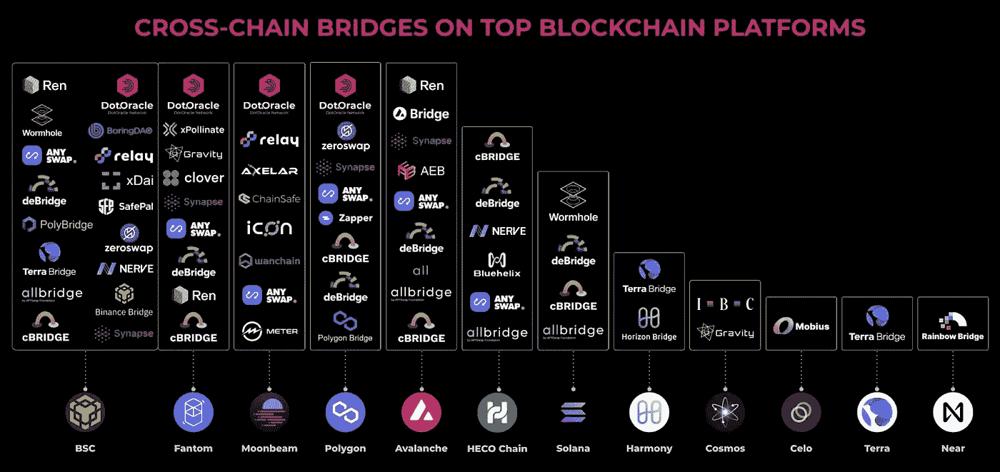
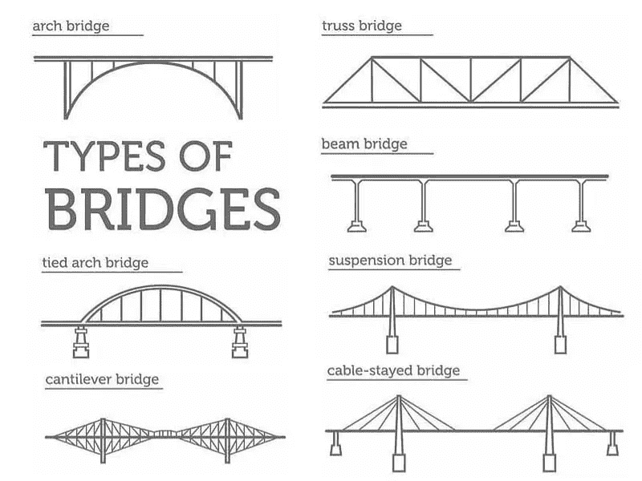
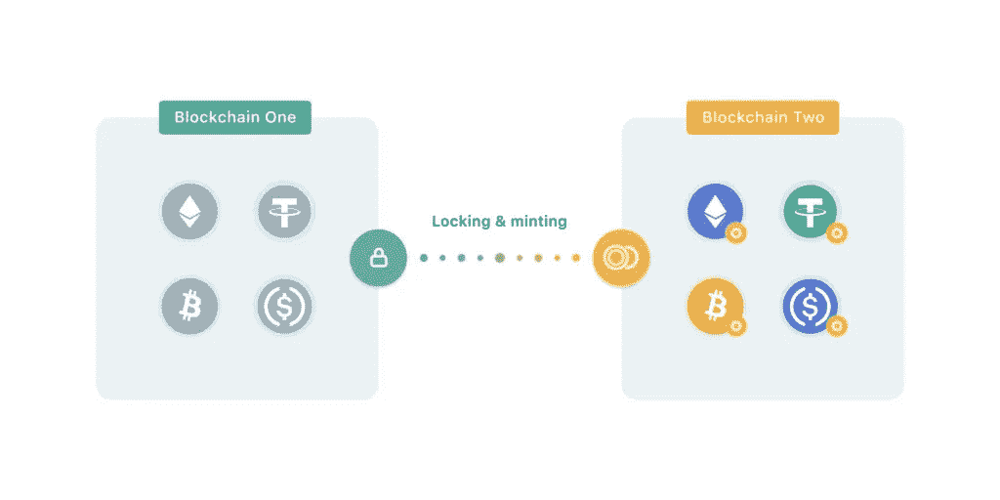

# 交叉链桥。详细分析如何将令牌和 NFT 从一个区块链发送到另一个

> 原文：<https://medium.com/coinmonks/cross-chain-bridges-detailed-analysis-3f2a555f3322?source=collection_archive---------4----------------------->

## 如何在桥牌上赚钱？交叉链桥的类型。如何发送区块链之间的加密和他们的风险是什么。

我将桥梁作为投资机会进行分析，所以我从一般研究开始。现在想和大家分享一下。

**我的公司用**帮助加密项目:

1.  设计对投资者有吸引力的**象征经济学和商业模式；**
2.  **部署令牌**和**生成刀**；
3.  为项目创建一个**社区**；
4.  设计并推出 **NFT 系列**；
5.  **筹款**；
6.  **通过我们的做市商在交易所为代币创造流动性**。

在[https://twitter.com/kmolodykh](https://twitter.com/kmolodykh)上关注并给我发消息，把你的甲板和帮助请求发给我。

# 目录

**1。这些桥解决了什么问题？**

1.1 P2P(场外交易)

1.2 CEX

1.3 指标

**2。跨链桥**

2.1 为什么桥梁很重要

2.2 有三种类型的桥梁

**3。有 5 种类型的跨链交易**

3.1 锁定和释放

3.2 锁和薄荷

3.3 燃烧释放

3.4 烧薄荷

3.5 贸易

**4。技术风险**

4.1 黑客攻击和资产泄露

4.2 拒绝服务

**5。金融风险**

6。如何用桥牌赚

# 这些桥解决了什么问题？

交易密码有三种方式:

1.  **个人对个人(P2P)** 或**场外交易(OTC)** :指不通过任何交易所，由两个交易对手直接进行证券交易。他们可以在不同的平台、论坛、聊天等找到对方。
2.  **集中交易所(CEX)** :证券和资金存入交易所账户，并通过该平台进行交易，通常使用指令簿。
3.  **分散交易所(DEX)** :这是一个 P2P 交易所的平台，其中一个交易对手为交易对提供流动性，以便其他用户可以进行交易。

## P2P(场外交易)

这是显而易见的常识。人们寻找其他人来买卖他们的资产。在传统市场中，它被用来交易大量的证券。例如，埃隆·马斯克正试图收购推特公共政策。他可以直接去交易所购买股票，但在这种情况下，他不会得到最好的价格，因为他买不到那么多的股票。

此外，如果证券不在交易所交易，人们可以在场外寻找买家。通常，他们可以在不同的平台、论坛、聊天等进行搜索。

因此，每个人都可以找到其他愿意直接从钱包到钱包进行交易的人。但存在巨大的欺诈风险，交易所解决了这一问题。

## CEX

集中交易所是受监管的、正式成立的公司，在这里可以以标准化、快速和安全的方式进行证券交易。CEX 降低了交易对手的风险，因为它充当了一个清算所的角色，确保每一笔交易都由买卖双方完成。

每个客户都将他们的资产存入交易所的账户，从那时起，交易所代表客户持有这些资产。从技术上来说，从那一刻起，它可以做任何事情:它可以冻结资产，设定提款限额，将这些资产用于自己的目的等等。

来自区块链的所有资产都存放在交易所的钱包里，当其客户交易他们的资产时，链条上没有任何交易被处理。所有的变化都只发生在纸面上——客户的账户上。这可以避免区块链交易佣金，并立即完成交易。

## 地塞米松

分散化交易所是一种智能合约，其用户界面允许交易客户互换自己的资产和其他资产，为交易对手提供流动性，并因此获得回报。每当客户交换资产时，他都要支付一笔佣金，由链上交易费和交易所费组成，这笔费用将在流动性提供商和交易所之间分配。

这些资产只能在一个区块链内交易，所以用以太坊的资产交换索拉纳的资产是不可能的。这是因为我们认为两个区块链是两个没有联系的不同数据库。它们不是以这种方式编程的。区块链上的每个交易都由知道属于其区块链的信息的节点批准。此外，即使在不同的区块链上有相同的令牌，如 USDT，它们也不能相互作用。为了解决这个问题，跨链桥来处理它。

你可以在这里阅读更多关于集中式和分散式钱包的信息:

 [## 分散式与集中式加密钱包

### 什么比较安全方便？优势和

medium.com](/coinmonks/decentralised-vs-centralised-crypto-wallets-b506a6aef4c8) 

# 交叉链桥

跨链桥是一种使用户能够在区块链之间传输资产和信息的技术。跨链桥是在不同区块链上具有智能合约的应用程序。交易完成后，**用户需要支付三笔佣金**:

1.  关于最初的区块链；
2.  在目的地区块链；
3.  去桥上。

## 为什么桥梁很重要

由于分散融资(DeFi)项目的增长，用户现在可以获得更好的产生被动收入的方式，如产量农业、赌注、贷款等。不过，有一个警告——如果你的令牌与底层区块链不兼容，你就不能使用这些平台。不可能将 BTC 用于基于以太坊的定位服务，也不可能将 ETH 用于基于雪崩的产量农场。您可以使用区块链桥将您的资产转移到不同的链上来解决这个问题。例如，你可以用 BTC 作为 wBTC 的抵押品，它可以在以太坊区块链使用。另一个很好的例子是在不同的链上使用不可替换的令牌(NFT)。例如，你可以用 Polygon 上铸造的 NFT 作为抵押品，通过 NFTfi 向以太坊贷款。

在区块链生态系统中，每个平台都有不同的优势——更好的安全性、更便宜的天然气费、更快的交易完成率等等。跨链桥提供了对替代平台的访问，允许用户利用原始区块链可能缺乏的功能。

跨链桥有助于开发人员，因为它们能够构建跨链应用程序，并允许应用程序用户与不同链上的相同 dApp 进行交互。如果网络拥塞，用户可以切换到另一个链，以享受更好的 dApp 体验。

## 有三种类型的桥:

1.  **完全集中** —这是关于对这个实体的信任。它可以做任何它想做的事情——冻结资产，提取资金，发行它想发行的代币。还有就是可以被黑，黑客可以提取资产。
2.  **完全去中心化**且不可改变。如果桥被部署到区块链，它就不能被改变，这就是问题所在，因为如果区块链收到更新或存在漏洞，它就不能被升级。所以如果出了问题，这座桥就无法使用了。
3.  **道** —这是两种解决方案之间的折衷，因为它保持了一些去中心化，同时，它允许对智能合同进行修改

每个网桥都有数量有限的受支持令牌。如果开发人员为确切的令牌准备了智能合约，这个桥将支持它。

此外，可以根据桥支持交易的类型对桥进行分类:

1.  **在两条链之间转移一项资产**。有将特定加密货币转移到另一个链的桥梁。例子有 wBTC(由 BitGo 管理)和 tBTC(由 Keep Network 管理)——两者都允许你将 BTC 从比特币区块链转移到以太坊。
2.  **在两个链之间转移许多资产**。有些网桥允许你移动多个令牌，但只能在两个链之间移动。例如，彩虹桥可以从以太坊向 NEAR 协议发送 ETH 和多个 ERC-20 令牌。类似地，Gravity 和 ZeroSwap 分别允许以太坊与宇宙和币安智能链(BSC)之间的多资产转移。
3.  **将资产从一个链条转移到多个链条**。某些跨链网桥允许用户将一条链连接到不同的区块链。一个例子是虫洞，它将资产从 Solana 连接到以太坊、Fantom、Avalanche、Terra 和 Polygon。
4.  **在不同链条间转移多项资产**。一些跨链网桥通过促进令牌在独立区块链之间的移动来提高互操作性。开发商可以将这种桥梁集成到 dApps 中，以增加可用的流动性。任桥是上面描述的桥的一个经典例子。这种互操作性协议在以太坊、露娜、索拉纳和多边形之间移植资产，包括比特币、Dogecoin 和 Zcash。
5.  **在一个应用程序下跨不同链转移资产**。跨链 dApps 通常支持不止一个链，以便能够获得更多的流动性和用户。他们依靠桥梁让用户在同一个 dApp 内的不同链之间移动资产。然而，这种类型的区块链桥仅限于一种应用。例如，Anyswap DEX(现在的 Multichain)有一个桥，允许用户在不同(受支持的)链之间移动资产。
6.  **在不同链之间传输 NFT**。考虑到 NFT 市场的规模，存在桥接非功能性交易的服务也就不足为奇了。NFT 桥有助于以下原因:I)用户可以利用其他链上更便宜的铸造费，ii)用户可以通过跨链桥移动 NFT 来利用更高的流动性。著名的 NFT 桥包括虫洞桥、多链桥、七边形桥和多边形桥。

# 有 5 种类型的跨链交易

## 锁定和释放

因此，桥可以以五种不同的方式运行。第一种情况是发行者在不同的区块链(例如 USDT)发行了相同的代币。因此，要将资产从一个区块链转移到另一个，该桥应该在两个区块链都有流动性，因为它无权发行这种资产。桥锁定一个区块链上的资产，并在另一个上解锁它们。这个过程可以双向进行。

## 锁和薄荷

第二种类型是当区块链之一上没有初始令牌时，例如以太坊上的 BTC。在这种情况下，网桥在第一个区块链上锁定资产，并在另一个上发布与锁定数量相等的包装令牌(令牌化资产)。只有在证明资产已经交付并锁定的情况下，才应该进行造币。

## 燃烧释放

这是锁和造币厂相反的交易。因此，如果用户想将资产转移回原来的区块链，他必须将它们发送到桥上，桥将烧毁它们，然后在第一个区块链上解锁初始令牌，并将它们发送到选定的地址。

## 燃烧薄荷

此外，在两个非原始区块链之间存在事务，例如，从 BSC 向 Polygon 发送 ETH。当然，在这种情况下没有发送原始的 ETH，但它是一个包装版本。

## 贸易

有一个桥梁和 DEX 的组合，允许交易不同区块链的资产。例如，他们可以在原来的网络上用比特币兑换以太坊。例如，ThorChain swap 允许这样做。

# 技术风险

## 黑客攻击和资产泄露

按照设计，网桥容易受到黑客攻击，因为它们是连接不同区块链上的多个令牌的第三方应用程序，所以很容易出现编程错误。在铸造其他链上的令牌化资产之前，桥必须确保原始区块链上的令牌被锁定。此外，它还必须确保释放锁定令牌的唯一方法是烧毁包装好的令牌。

由于公开可用的代码，一切都变得更加复杂。对于黑客来说，这是分析应用程序逻辑最简单的方法，也就是所谓的白盒。为了保护开放的代码，开发人员可能会使用不同的混淆技术。

例如，今年估计有价值 20 亿美元的加密货币在 13 次独立的黑客攻击中被盗，其中对跨链桥的攻击占被盗资金总额的 69%。

## 拒绝服务

这是另一个关键的技术风险。在典型的情况下，一切都可以正常工作，所有的事务都可以快速处理。如果有事发生，很多人提交交易，桥可能会拒绝交易。这是由于每秒事务的技术限制造成的。所有被拒绝交易的人都会再提交一个或几个，希望至少有一个可能完成，但这只会在桥上制造更多的紧张。

例如，当 UST 与美元脱钩时，许多人试图从中套利。因为任何散户投资者都可以用 1 美元做到这一点，所以很多人都试图这么做。因此，交易太多，很多人无法完成套利机会，而“大”资本也无法完成套利。

此外，如果中央网桥停止工作，拒绝服务也可能发生。或者在分散或 DAO 桥的情况下，智能合约将不支持区块链上的新变化，这可能随着合并而发生。

# 金融风险

第一个至关重要的金融风险是证券化资产与原始资产的脱钩。它是指同一令牌的价格因链而异。这可能是由于前面讨论过的技术风险造成的。

第二个风险与区块链委员会有关。为了在网桥上完成交易，用户应该支付两个网络的佣金，并向网桥支付服务费用。交易的成本可以是有形的，特别是对于资本较少的散户投资者来说，这可能是合理的。

# 如何用桥牌挣钱

桥牌提供三种赚钱方式:

1.  **提供流动性**。桥梁的运营是必要的，因此它通过与用户分享费用来激励用户提供流动性。一个桥接应用程序可能包含多个桥接，这些桥接可能收取不同的费用，具体取决于流动性的大小。
2.  **打桩土著令牌**。如果桥有一个 PoS 区块链，它可能允许它标上它的本地令牌。为了激励用户参与，该桥还将提供交易费。另一个用例是治理。例如，用户可以在很长一段时间内下注他的代币，并允许对一些关键的桥牌参数如费用进行投票。此外，桥可以通过为相同的令牌号码提供更多的投票来激励将令牌锁定更长的时间。
3.  **手持节点**。节点对于运行大桥的区块链至关重要，所以这些无私的人将支撑整个大桥。通常，他们也会获得交易费。此外，他们还可以从赌注者的利润中获得一定的百分比。

每个桥梁将提供不同的盈利能力，因此由您来比较它们的投资回报率。

更多有用内容请关注。

> 交易新手？尝试[加密交易机器人](/coinmonks/crypto-trading-bot-c2ffce8acb2a)或[复制交易](/coinmonks/top-10-crypto-copy-trading-platforms-for-beginners-d0c37c7d698c)