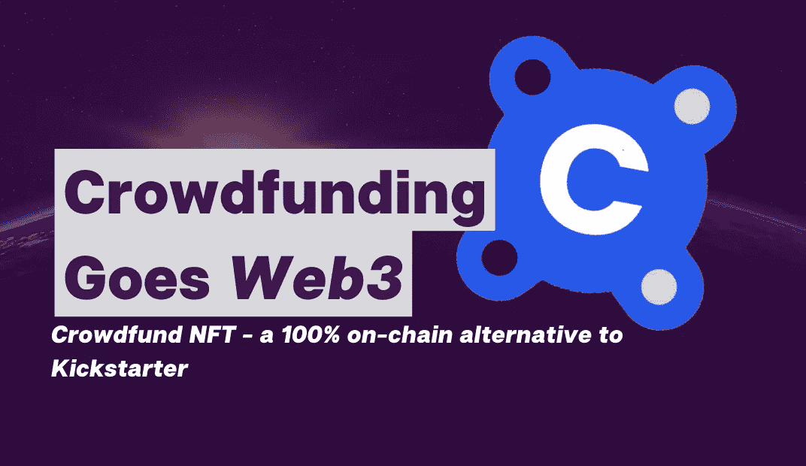
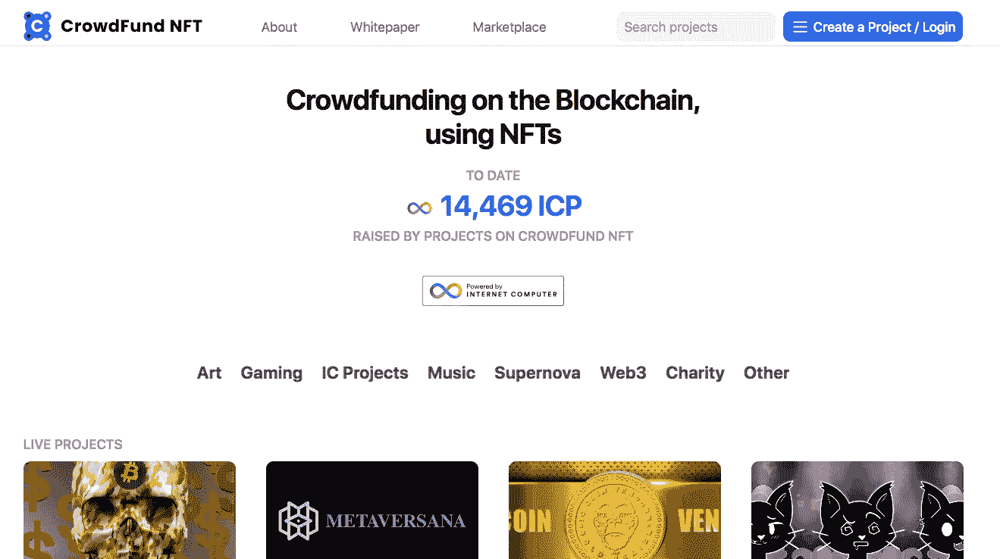
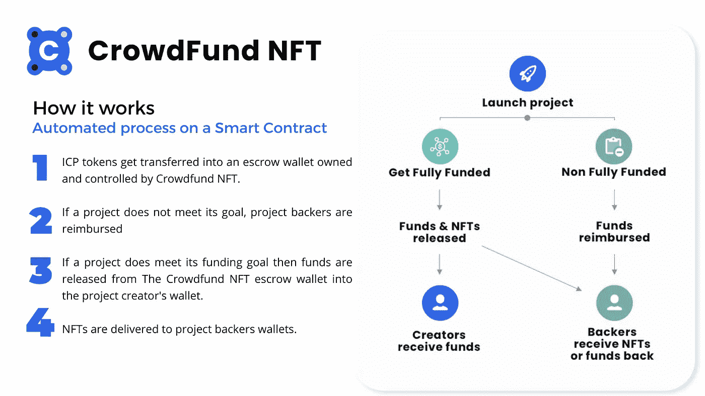

# 众筹走向网络 3

> 原文：<https://medium.com/coinmonks/crowdfunding-goes-web3-d74496a60edc?source=collection_archive---------17----------------------->

## **推出众筹 NFT——Kickstarter 的 100%连锁替代方案**

第一个记录在案的**众筹**成功案例发生在 1997 年，当时一个英国摇滚乐队通过粉丝的在线捐款资助了他们的重聚巡演。受这种创新融资方式的启发，ArtistShare 在 2000 年成为第一个专门的众筹平台。然后在 2009 年出现了 Kickstarter，它将这种资助模式——如果项目成功，为项目筹集资金的粉丝将获得利益/奖励——带入了主流。结果利润丰厚。Kickstarter 报告 2021 年收入为 950 万美元。根据[统计](https://www.statista.com/outlook/dmo/fintech/alternative-financing/crowdfunding/worldwide)，众筹行业预计将在 2022 年达到 10.2 亿美元。

尽管众筹为许多个人和小企业创造了大量机会，但该行业一直因版权保护不严和投资者利益空洞而受到批评。但对众筹最大的批评集中在它缺乏透明度和信任。目前，整个众筹生命周期都依赖于一个中央实体(Kickstarter)来筹集、管理和支付资金，这让他们拥有了太多的权力，可以控制数百万小投资者和企业家的资金。

## 众筹的未来将由区块链技术塑造，其核心是透明和不信任。

此外，众筹的整个前提与 Web3 的目标有许多共同之处；例如，一个项目建立了一个爱好者社区，他们支持一个项目(建立在区块链上)，如果项目成功(令牌化)，他们会获得一些好处作为回报。也许这就是 Kickstarter 在 2021 年宣布他们将开始在区块链上建造的原因；然而，到目前为止还没有发布任何东西。

## 众筹行业需要的是对整个价值链的彻底改革，智能合约服务于不可信的功能。

随着 [**众筹 NFT**](https://t.co/k3sk6Y0Zrr)——一个建立在[**互联网电脑**](https://internetcomputer.org/) 区块链上的 100%连锁众筹平台，这个行业正在被重新想象。已经有超过 10 家 Web3 初创公司完全透明、轻松地为他们的项目筹集了资金。因为它是建立在链上的，所以过程的每一步——筹资、托管和支付——都是公开可验证和可追踪的。没有一个中央权力机构来决定每一笔交易的命运，这使得整个过程分散化和不可信。

利用智能合约和 NFT 的力量，众筹 NFT 为投资者带来了透明度和游戏化。项目支持者不仅会收到一件 t 恤、一顶酷酷的帽子或一件产品样品，他们还会收到一件 NFT，可以在专门的市场上自由交易。目前，该平台使用$ICP 令牌；然而，它将很快成为多链，这意味着项目将有能力筹集资金在$ETH 或$BTC。

> **“整个流程在智能合同网络上运行，该系统完全自动化，因此资金支付、报销和 NFT 铸造都是自动进行的。有了我们的黑洞托管罐模型，没有人为干预-这使得我们的系统防篡改和安全。也有可能在全球范围内筹集资金，没有对众筹轮次的法定限制，这意味着有更多的潜在参与者，”首席执行官卢克·达戴尔说**

众筹 NFT 在艺术、游戏、音乐、慈善等多个领域都有直播项目。“全额资助”项目的最高比例出现在游戏领域，一个突出的例子是[cube topia](https://t.co/u16qP7bsww)——一款多人 RPG 沙盒游戏，玩家可以在区块链上拥有一个独特的岛屿，同时在现场游戏前后展示和销售 NFT。Cubetopia 在最初阶段利用[NFT](https://kn5ky-6iaaa-aaaai-qbikq-cai.ic0.app/project.html?projectId=33)众筹基金成功筹集了 3000 ICP。对支持者的奖励是一张“创始人通行证”NFT，附带的好处有:

*   众筹游戏内装甲
*   不和谐和游戏中使用的“创始人”称号
*   一个随机大小的山形岛屿

对于项目支持者来说，这个 NFT 代表的不仅仅是一个漂亮的礼物和当前和未来利益的“访问令牌”，而是一个可以在价格上升值的可交易投资。

NFT 众筹基金赋予新的 Web3 项目以透明、无信任、零风险或股权稀释的方式筹集资金的权力。同时，通过对 NFTs 的新颖使用，他们的创始人可以围绕他们的项目建立大型社区。Kickstarter 的 Web3 颠覆已经开始。

**最初在** [**快速块**](http://fastblocks.com) 发布 100%在线

[https://wnftq-taaaa-aaaaaf-QA HCA-Cai . raw . ic0 . app/talking web 3/66/crowd funding-goes-web 3](https://wnftq-taaaa-aaaaf-qahca-cai.raw.ic0.app/talkingweb3/66/crowdfunding-goes-web3)

> 交易新手？尝试[加密交易机器人](/coinmonks/crypto-trading-bot-c2ffce8acb2a)或[复制交易](/coinmonks/top-10-crypto-copy-trading-platforms-for-beginners-d0c37c7d698c)