# Crypt0:什么是 NFT？

> 原文：<https://medium.com/coinmonks/crypt0-what-are-nfts-c07d7774b4ae?source=collection_archive---------33----------------------->

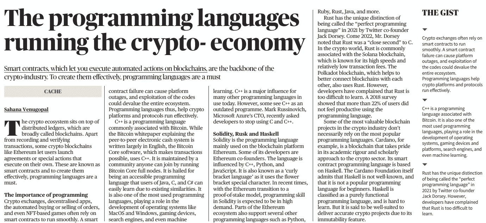

NFT 编程的先决条件

再者，你应该已经知道了编程语言，比如 **JavaScript 和 Solidity** 。JavaScript 和 Solidity 以及 JSON 等格式对于创建智能合同和与区块链交互非常重要。

> **不可替代代币的世界，通常被称为 NFT，已经大受欢迎。事实上，NFT 行业允许艺术家从他们的数字艺术中赚取数千万美元。NFTs 的出现现在获得了如此巨大的估值，以至于艺术、金融和加密社区的数字创作者开始意识到 NFTs 的转型影响。因此，学习 NFT 发展是一个伟大的方式来推进你的 Web3 职业生涯。然而，如果您是 NFT 领域的初学者，您可能想知道如何开始 NFT 开发。**

# 如何开始 NFT 编程

鉴于当今对 NFTs 和 NFT 平台的需求，它们激起了希望在这个令人兴奋和有利可图的区块链领域起步的开发人员的兴趣就不足为奇了。

人们认为 NFT 编程既复杂又困难。虽然它有一定的先决条件，但并不像听起来那么可怕。最近，开源工具让这变得更加容易，这些工具允许您导入可靠的智能合同，而不必从头开始构建您的 NFT 项目。一旦您掌握了所需的技能和知识，并且熟悉了使您的构建更容易的工具，您会发现 NFT 开发可以非常简单、容易和有趣！

# NFT 编程的先决条件

首先，你需要熟悉区块链、智能合约、Web3、DeFi、dApps 的概念，以及这些生态系统是如何工作的。你还需要对以太坊等去中心化网络有透彻的了解。理想情况下，你应该已经探索了在以太坊上构建的各种方法，比如编程 dApps 或创建 ERC-20 代币。

# NFT 编程的步骤

本指南的组织方式为您提供了 NFT 编程或 NFT 开发中重要步骤的概述。NFT 编程的基本步骤是:

1.  NFT 本身的创建，包括构建智能合同。
2.  添加元数据并找到元数据的主机。
3.  在市场上列出你的 NFT。
4.  管理 NFT。

*请注意:在本文中，我们将关注前两步，即通过构建基于 ERC-1155 标准的智能契约来创建 NFT，并为元数据找到主机。然而，由于第三步和第四步也很重要，你可以参考前面提到的 NFT 编程的视频来更详细地了解它们。*

# NFT 编程步骤 1:创建 NFT

我们将创建一个 ERC-1155 令牌。请注意，有两种 NFT 或不可替代的令牌标准:ERC-721 和 ERC-1155。ERC-1155 比 ERC-721 更新，功能更多。

使用 ERC-1155(创建不可替换令牌的最新标准)具有某些优势，包括:

*   更加灵活。
*   能够在同一合同中创建和使用可替换和不可替换的令牌。
*   进行批量转移。
*   更有效地设置和管理参数。

# 构建智能合同

要创建智能合约，请访问 Remix (remix.ethereum.org)。Remix 让你可以访问大量的库，从而更容易地构建智能合约。这些库作为可靠的、经过测试的智能契约的来源非常有用，可以在 NFT 开发中使用。

# 创建新文件

在你的混音工作区创建一个新文件。为此，我们将其命名为“Opensea_nft”，但是您可以自由选择任何您喜欢的名称。

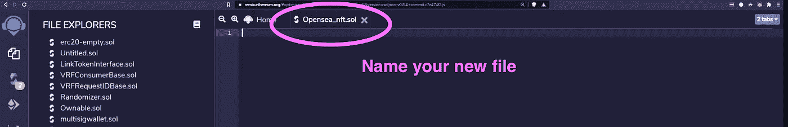

ERC-1155 标准为您提供了自动 NFT 所需的所有功能，包括跟踪天平的必要映射功能和检查天平的功能。它还提供了进行传输、创建新的 NFT(包括批量创建)和刻录 NFT 的功能。并非所有可用的功能都将在本项目中实施。我们只会选择最相关的。

# 从智能合约创建 NFT

将原始合同导入到 Remix 上新创建的智能合同中。

继续定义新的智能合同。命名新契约(为此，我们称之为“NFTContract”)。在这之后，你可以“继承”原来的 ERC-1155 合同。可靠性中的继承仅仅意味着你从这个契约中获取功能。

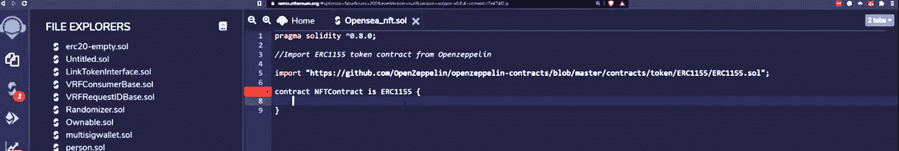

继承契约后，您可以开始基于父 ERC-1155 契约实现自己的 NFT。

# 实现您自己的 NFT

您可以在此指定合同特有的项目。例如，您可以命名您的 NFT 项目，并指定您想要铸造多少代币。您还将提供元数据，并指出谁可以在您的契约上调用函数。

# 燃烧代币

有些人可能想要刻录他们自己的 NFT。你需要做的就是添加“刻录”功能和参数。“刻录”功能确保帐户余额大于您刻录的金额。对于其他参数，您可以选择像上面那样添加限制。只有契约所有者调用 burn 函数是有意义的。因此，您还可以在代码中添加一个“require”函数。

# 在虚拟机上部署

该合同现在可以部署在虚拟机上了。要测试智能合约，点击 Remix 左侧菜单上的以太坊图标。确保您选择了 NFT 合同。单击“部署”。

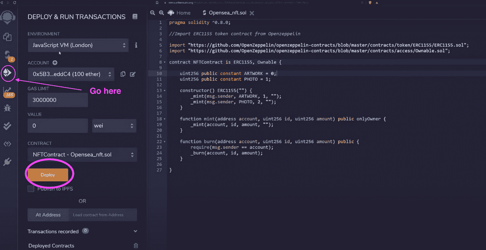

单击“部署”后，您将能够查看实例。该实例列出了此协定中可以调用的所有函数。之后，尝试调用一些函数，看看它们是否工作。

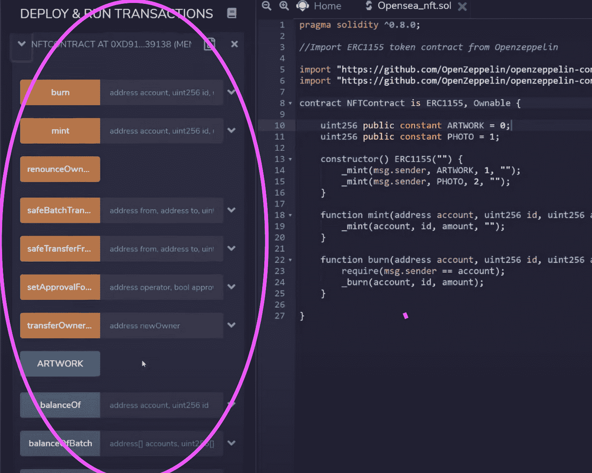

# 代币余额

你可以从检查你的代币余额开始。在文件名“Artwork”下，可以粘贴账号 ID，创建令牌 ID(此处暂称为“0”)，点击“调用”。你将能立即看到你的余额。

# 测试薄荷功能

您可以铸造新的代币，只需点击实例上的“铸造”功能，并输入您的地址、代币 ID 和您想要铸造的代币数量。点击“交易”。

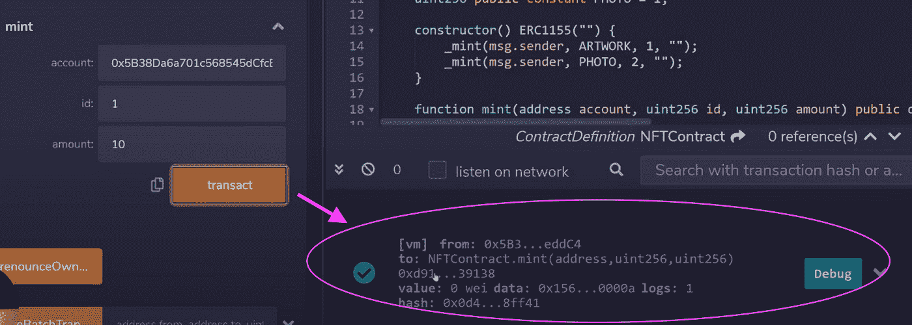

如果您再次检查您的代币余额，您会发现这些新铸造的代币已经添加到您的总数中。您可以对每个新的令牌 ID 重复该过程。

# NFT 编程步骤 2:添加元数据和查找主机

对于下一步，您需要了解每个 NFT 的元数据结构。要获得一个概述，请访问 OpenSea 网站，搜索他们显示元数据标准的地方。

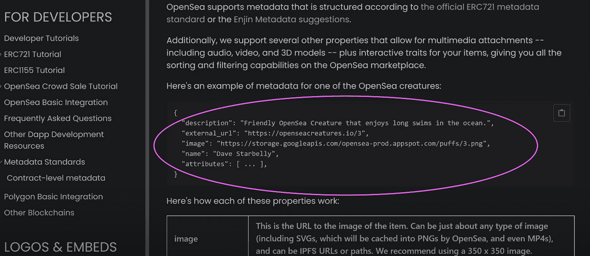

基本结构写为两个花括号之间的 JSON 字符串，应该至少包括以下内容:

*   描述。
*   外部 URL:指向您可以查看 NFT 的位置。
*   图片:图片本身的链接。
*   姓名。
*   属性。

# 创建 JSON 文件

在你的混音编辑器中打开一个新文件夹。它应该是一个“index.html”文件。保存文件。创建一个 JSON 文件；对于这个例子，我们可以写“0.json”作为初始名称，并在该文件中包含实际的属性(图像、描述、名称等)。).它应该看起来像来自 OpenSea 的例子。

在为 NFT 创建 JSON 字符串之后，您需要在某个地方托管它们。它不能在智能合约内或区块链本身上。需要有一个到 JSON 文件的外部链接，然后将它放入智能契约中。

# 托管 JSON 文件

获取托管您的目录的 URL。为此，您需要来自 Moralis 服务器的各种 CLI。

一旦你建立了一个帐户，点击右上角的“+创建一个新服务器”按钮来创建一个新的服务器。创建服务器后，单击“查看详细信息”以检索 CLI API 密钥和 CLI API 密码。这些是你需要在稍后的混音中输入的细节。

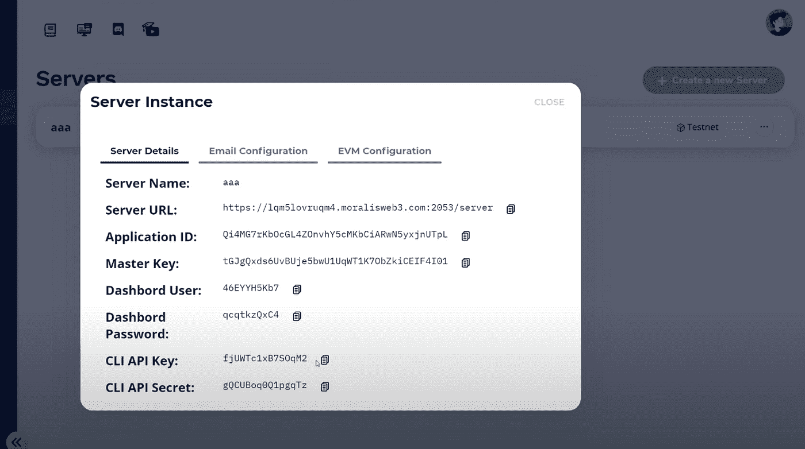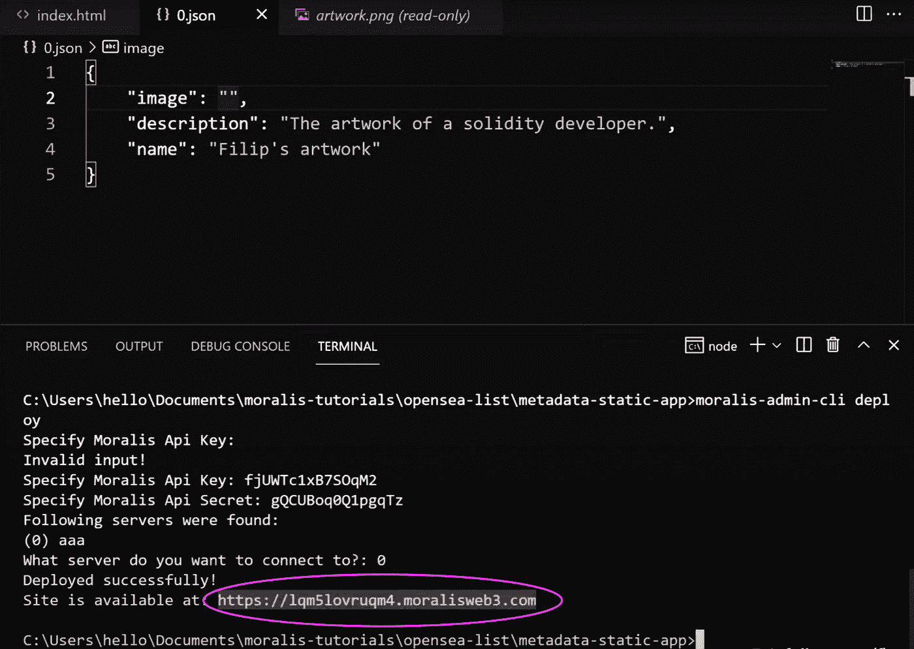

现在可以部署了。如果一切正常，您应该看到“部署成功！”。

复制该文件的 URL，并在浏览器上访问该 URL。现在获取您希望嵌入到 NFT 中的作品的 URL，并将其作为“图像”粘贴到 JSON 字符串中。

你也可以选择添加一个外部网址(如艺术家的专业网站)来为你的作品或图像添加适当的属性。如果希望在部署初始文件后添加属性，可以根据需要经常编辑文件并重新部署。

您可以对其他图像重复此过程，次数不限。

# 关注 ERC-1155 标准

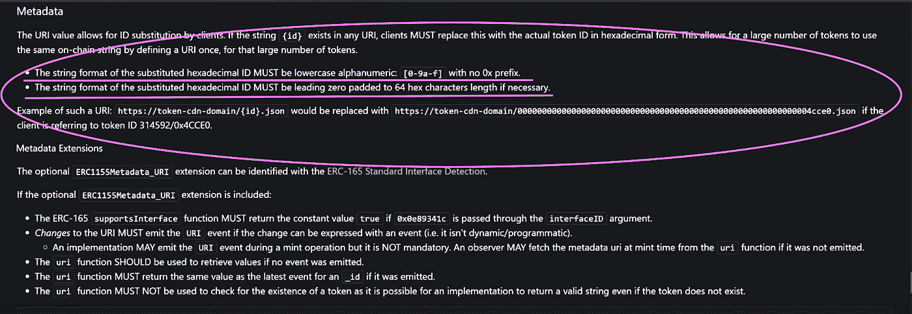

## 重命名文件

在这种情况下，因为 NFT ID 只是“0 ”,所以只需再加上 63 个 0 就可以得到 64。这很重要，因为每个查询 ERC-1155 的人都会根据这个特定的模式进行查询。

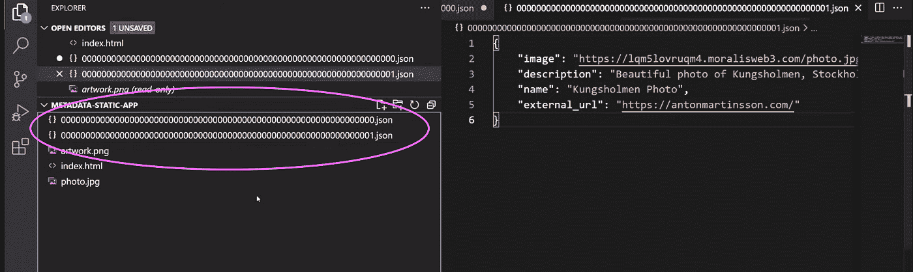

# 部署智能合同

现在，您的文件已经托管在网站上，您可以继续部署您的智能合同。

上面的过程就是我们如何提供 ERC-1155 合同的 URL。

# NFT 元数据和市场

OpenSea 等市场与托管的 NFT 元数据进行了有效的交互。通过只定义一次 URI，适当的格式化将允许这样的市场使用相同的链上字符串用于大量代币。

本质上，你指的是区块链的同一个空间。URI 只提供一次，客户端可以用十六进制形式的任何令牌 ID 替换“{ID}”。

# 在测试网上部署

您的 NFT 智能合同现在已经准备好部署在一个测试网上，看看它是否工作。这包括通过 Rinkeby 网站等网站从水龙头获取 testnet 令牌。你应该已经熟悉从这种水龙头中获取乙醚，以及在调配和测试中使用它们。对于此过程，您还需要一个元掩码帐户。

Photo by [Andrey Metelev](https://unsplash.com/@metelevan?utm_source=medium&utm_medium=referral) on [Unsplash](https://unsplash.com?utm_source=medium&utm_medium=referral)

> 交易新手？试试[加密交易机器人](/coinmonks/crypto-trading-bot-c2ffce8acb2a)或者[复制交易](/coinmonks/top-10-crypto-copy-trading-platforms-for-beginners-d0c37c7d698c)