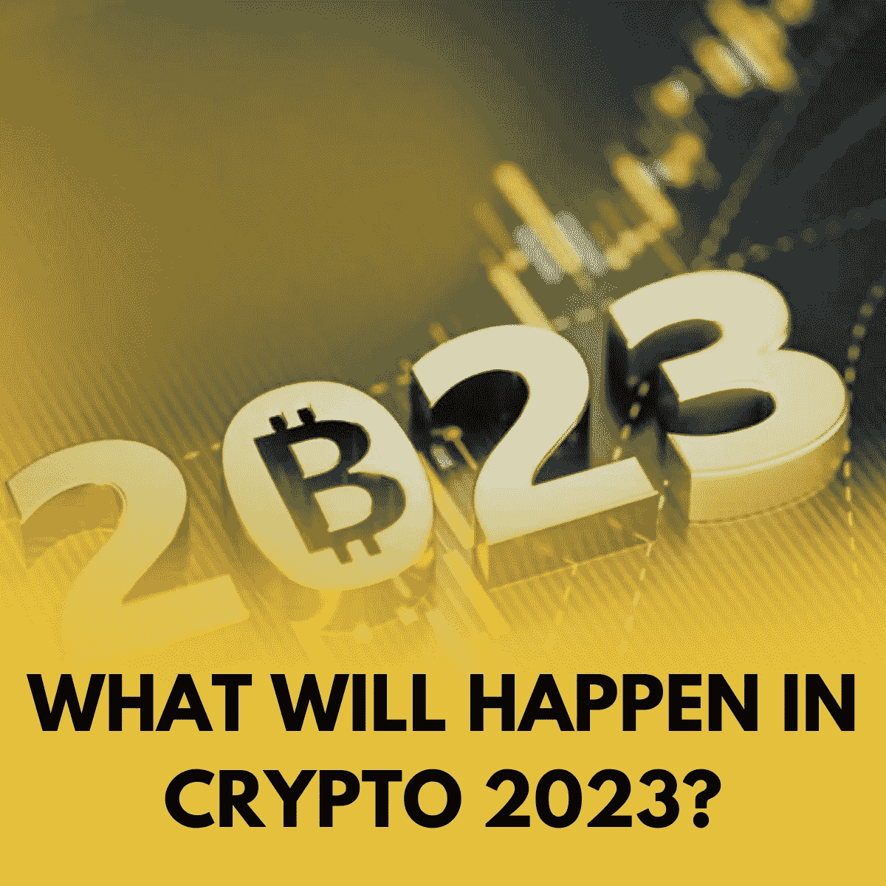

# 密码 2023: FTX 辐射的连锁反应和加强法律和教育的迫切需要

> 原文：<https://medium.com/coinmonks/crypto-2023-ftx-fallouts-ripple-effects-and-the-urge-for-law-enhancement-and-education-25849589869c?source=collection_archive---------19----------------------->

# FTX 不仅自身崩溃，其他国家也崩溃了

萨姆·班克曼-弗里德在巴哈马参加完听证会后将于周三飞往美国。他将面临洗钱和共谋电信诈骗的指控。有一种情况是，SBF 在巴哈马被拒绝保释后，在美国请求保释。

> 从顶级交易者那里复制交易机器人。免费试用。

好戏似乎还在继续。我们可以看到它在市场上的连锁反应。Celsius Network 和 BlockFi 坐在破产法庭上。最近，加密交易公司和做市商 Auros Global 表示，上个月英属维尔京群岛的一家法院批准了其“临时清算”请求。目标是重组贷款人的巨额债务。

情报网站 OffShoreAlert 显示，傲罗在 FTX 冻结了 2000 万美元的资金。[FTX 的内爆](/coinmonks/the-ftx-disaster-why-does-it-profoundly-impact-the-crypto-market-f738a1cc7735)让傲罗遭遇流动性问题。它也无法满足贷方的召回要求。

 [## FTX 灾难:为什么它会深刻影响加密市场？

### FTX 的惨败严重影响了许多公司，甚至整个加密行业。因此，许多人把……

medium.com](/coinmonks/the-ftx-disaster-why-does-it-profoundly-impact-the-crypto-market-f738a1cc7735) 

众所周知，2022 年对于加密投资者来说是一场噩梦。FTX 事件并不是密码行业唯一的灾难性事件。此外，它不会一下子让整个市场崩溃。Crypto 可能不是不朽的，但它也不是脆弱的。

然而，如果我们把密码市场上的事件当成没有重大教训的激动人心的故事，事情会变得更糟，最糟糕的情况是整个系统的内爆。

 [## 在加密的不确定性中塞翁失马，焉知非福&比特币的替代品

### FTX 的余波不仅仅是报纸上点击诱饵标题背后的灵感。它产生了…

medium.com](/coinmonks/blessings-in-disguise-amid-the-crypto-uncertainty-altcoins-backing-up-for-bitcoin-9db3d825a478) 

# 密码 2023:加强法律和教育的迫切需要

找到每一个问题的根源，强烈建议综合解决。此外，它使你能够避免陷入同样的陷阱。那么，是什么原因导致了密码界很多大牌的倒闭，比如 FTX、露娜、BlockFi 等等。？

许多专家认为，宽松的监管为创新新方式留下了自由空间，但也为欺诈、诈骗、盗窃和黑客留下了空间。在混乱的 2022 年之后，密码世界需要在即将到来的 2023 年加强法律。

今年 3 月，区块链情报小组发现了与 Frosties 相关的潜在可疑活动，Frosties 是一个[不可替代令牌(NFT)](/@libraryoftrader/the-future-of-nfts-illusions-or-optimism-a95f7520786e) 项目，并通知了执法当局。特工可以沿着区块链找到并追踪金融交易以及其他电子数据，以确定罪犯。

 [## NFTs 的未来:幻想还是乐观？

### 非专利技术已经上升到投资者和投资者最值得考虑的投资项目

medium.com](/coinmonks/the-future-of-nfts-illusions-or-optimism-a95f7520786e) 

区块链的调查人员没有将案件搁置几个月，而是展示了他们简化和提高调查效率的能力。特别是当 2022 年目睹了许多网络攻击和跨辖区资金转移到当地警察机构的案件。

 [## 2022 年的密码英雄:那些给密码行业带来清晰的人

### 看起来今年的加密市场不景气。在余波中有许多戏剧…

medium.com](/coinmonks/the-crypto-heros-in-2022-those-who-bring-clarity-to-the-crypto-industry-de76c5b54277) 

将这些调查交给联邦政府是不可能的，但是地方警察部门将利用他们的资源来培训和装备金融和经济犯罪侦探，让他们掌握最新的加密知识和专业技能。

2023 年，跨国犯罪组织(TCO)和贩毒组织(DTO)可能会使用调查人员的说法。这意味着每个生态系统参与者都必须提交可疑活动报告，并发现潜在的犯罪。

尽管 crypto 具有验证系统和前所未有的透明度，但跨国犯罪集团利用比特币和以太坊等分散网络的审查阻力，将其收入用于非法活动。

 [## NFTs 2023 预测:展望未来的回顾

### 支持 NFTs 的著名企业家 Gary Vaynerchuck 提到了一些严重影响 NFT 市场的因素…

medium.com](/coinmonks/the-forecasts-of-nfts-2023-a-look-back-for-a-look-forward-9399e36fafed) 

区块链分析在跟踪犯罪活动的流程中发挥着重要作用，但它是整个解决方案。2023 年，如何避免成为加密欺诈受害者的知识和技能将成为一种趋势。与此同时，随着数字资产调查空间的持续增长，网络安全行业将会加强。

此外，对于当地警察机构和金融调查人员来说，购买跟踪和追踪加密货币诈骗和欺诈的工具更加实惠。

 [## 2023 年的 NFT 市场会发生什么？

### 密码市场今年经历了一场真正的混乱。许多大公司灾难性的倒闭和破产…

medium.com](/coinmonks/what-will-happen-in-the-nft-market-in-2023-38fa1382a772) 

**你也能找到我们👇**

*   [库的交易员](http://bit.ly/3GQsIiY)
*   [脸书](http://bit.ly/3XyoeTY)
*   [推特](http://bit.ly/3XHQRhK)
*   [领英](http://bit.ly/3ihv3cu)
*   [Reddit](http://bit.ly/3imq76f)
*   [Quora](http://bit.ly/3VcaEUK)
*   [Tiktok](http://bit.ly/3VibUpx)

> 加入 Coinmonks [电报频道](https://t.me/coincodecap)和 [Youtube 频道](https://www.youtube.com/c/coinmonks/videos)了解加密交易和投资

# 另外，阅读

*   [最佳加密交易机器人](/coinmonks/crypto-trading-bot-c2ffce8acb2a) | [购买索拉纳](https://coincodecap.com/buy-solana) | [矩阵导出评论](https://coincodecap.com/matrixport-review)
*   [Coldcard 评论](https://coincodecap.com/coldcard-review) | [BOXtradEX 评论](https://coincodecap.com/boxtradex-review)|[uni swap 指南](https://coincodecap.com/uniswap)
*   [比特币基地评论](/coinmonks/coinbase-review-6ef4e0f56064) | [德里比特评论](/coinmonks/deribit-review-options-fees-apis-and-testnet-2ca16c4bbdb2) | [FTX 评论](/coinmonks/ftx-crypto-exchange-review-53664ac1198f)
*   [Coinmetro 评论](https://coincodecap.com/coinmetro-review) | [VirgoCX 评论](https://coincodecap.com/virgocx-review)
*   [法国 4 大最佳加密副本交易平台](https://coincodecap.com/copy-trading-platforms-france)