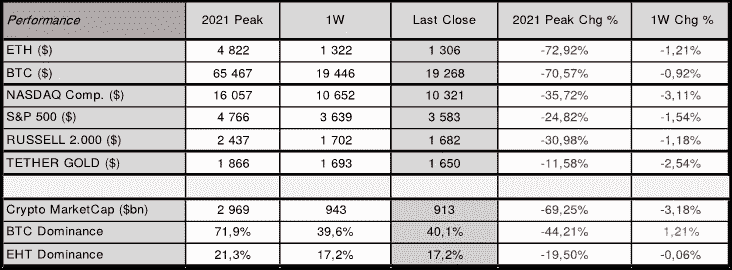
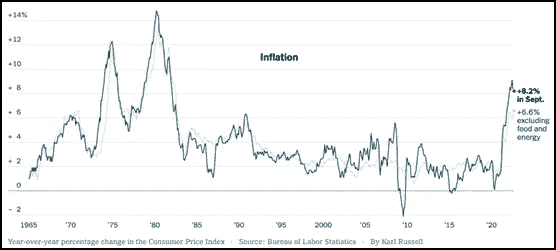
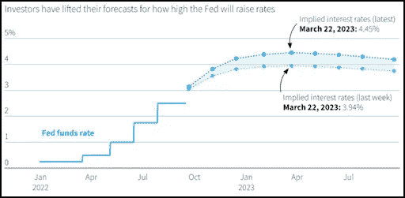
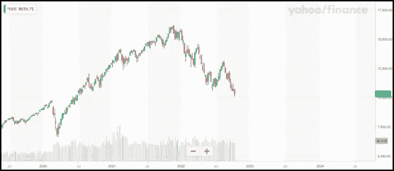
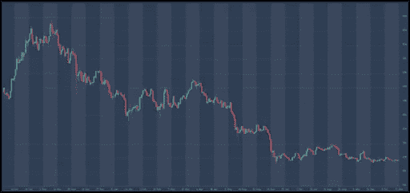

# 第 41 周的加密和宏概述

> 原文：<https://medium.com/coinmonks/crypto-and-macro-overview-for-week-41-e87bf9df7ba4?source=collection_archive---------35----------------------->

总的来说，对数字资产和美国股市来说，这都是消极的一周。美国股市拖累数字资产走低——上周五，纳斯达克收于 10.321 点(⬇3.11%)，标准普尔收于 3.583 点(⬇1.54%)。结果，比特币在本周收盘时几乎下跌了⬇1%，周日收于 19.268，而以太坊的跌幅超过了⬇1%.

**本周市场整体以新低开始，因为许多投资者等待 2022 年 10 月 13 日(星期四)公布的 2022 年 9 月美国 CPI 数据，正如我们在之前的每周报告中所报道的那样，美国 CPI 从一个月前的 8.3%降至 8.20%，核心 CPI 同比上涨 6.64%。**

高于预期的美国 CPI 引发了本周后半周数字资产和美国股票的新一轮抛售。请注意，核心 CPI 更重要，因为它不包括不稳定的食品和能源项目。路透社对经济学家的调查预测美国 CPI 将降至 8.1%。在这个阶段，对通胀的担忧甚至超过了对美国整体消费者情绪的积极调查，这超出了经济学家的预测。

Source: altFINS

**最新的美国 CPI 数据有力地证实了美联储将在 11 月初将基金利率再提高 0.75%，因此我们预计未来会有更多的紧缩措施。**

这将是 2022 年的第四次增长。目前联邦基金利率的目标区间为 3.00-3.25%。美联储董事会成员对目标区间中点的最后一个中值预测仍是 2022 年底为 4.4%，2023 年底为 4.6%。

**我们预计美国 CPI 将在 2022 年 10 月略有降温，稳定在 8.13%，核心 CPI 略低，为 6.58%。**一旦我们开始看到较低的通胀数据，美联储将放缓加息步伐，这可能成为风险更高的数字资产和美国股票的转折点。

**美国基金利率**

**美国消费者物价指数**

Source: Refinitiv | Reuters, Sep. 14, 2022 | by Vincent Flasseur

**纳斯达克**

Source: Yahoo Finance Source: altFINS

**比特币**

Source: [altFINS.com](https://altfins.com/crypto-screener/btc-bitcoin)

总体而言，与一周前该指数略高于 22/100 相比，加密市场情绪(通过加密恐惧和贪婪指数衡量)进一步下降至⬇ **20/100，**表明**极度恐惧**。

与一周前相比，加密市场的总市值也比⬇3%下降了更多，仍低于 1 万亿美元的大关。BTC 的优势有所增加，与前一周相比，⬆️1.21%收高，而 ETH 的优势相对保持不变。

**看点:**欧洲央行下一次货币政策会议:2022 年 10 月 27 日；美联储:2022 年 11 月 01 日–02 日；下一次美国 2022 年 10 月 CPI 发布定于 2022 年 11 月 13 日。下一次美国 GDP 更新将于 10 月 27 日发布。2022.

> 交易新手？试试[密码交易机器人](/coinmonks/crypto-trading-bot-c2ffce8acb2a)或者[复制交易](/coinmonks/top-10-crypto-copy-trading-platforms-for-beginners-d0c37c7d698c)