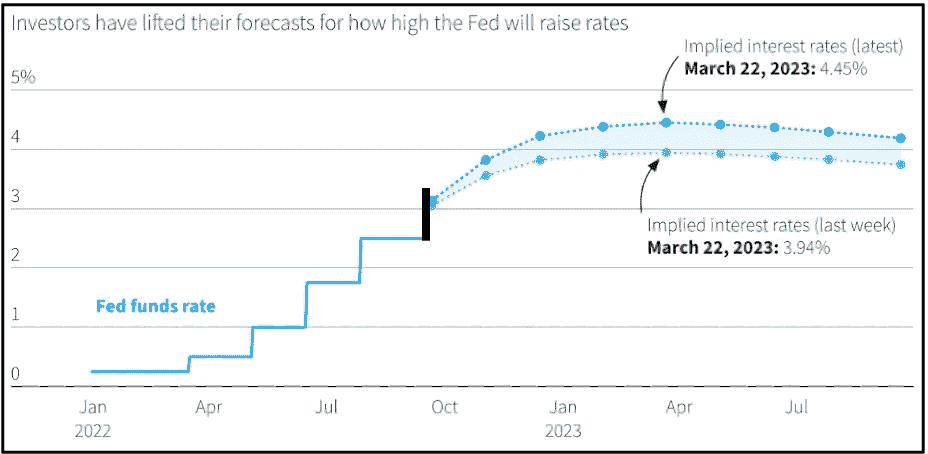

# 加密和宏概述(第 40 周)

> 原文：<https://medium.com/coinmonks/crypto-and-macro-overview-week-40-21f02d4f3b4f?source=collection_archive---------29----------------------->

总的来说，对数字资产和美国股市来说，这是动荡的一周。比特币本周收盘上涨逾 2%，周日收于 19.446，低于心理 20k 关口。ETH 收盘时也上涨了超过 3.5%。上周五，美国股市上涨，纳斯达克收于 10.652 点，标准普尔收于 3.639 点。

在本周的前半周，两个市场都表现强劲，收复了前一周失去的大部分价值，然而，周末又出现了新的下跌，因为美国劳动力市场报告显示就业增长持续强劲，并在某种程度上打消了投资者对美联储将很快转向并放缓加息步伐的希望。

该报告显示，美国雇主 9 月份新增就业岗位 26.3 万个，低于 8 月份的 31.5 万个，但高于经济学家的预期。报告还显示，失业率出人意料地从一个月前的 3.7%降至 3.5%。

# **表演**

Source: altFINS

**上个月，美联储将利率提高了 0.75%，并宣布进一步收紧政策。预计央行将在 11 月初进一步加息 0.75%，这将是今年连续第四次加息。**

目前联邦基金利率的目标区间为 3.00-3.25%。美联储董事会成员对目标区间中点的最后一个中值预测仍是 2022 年底为 4.4%，2023 年底为 4.6%。周五收盘时，10 年期美国国债收益率为 3.89%，在劳动力报告抛售压力下进一步下跌 0.06%。

**9 月份通胀读数将于 2022 年 10 月 13 日星期四公布** — **克利夫兰美联储通胀临近预测预测 CPI 将从一个月前的 8.3%降至 8.20%** ，核心 CPI 将降至 6.64%。此外，他们预测 2022 年 10 月 CPI 迄今为止将为 8.04%，核心 CPI 将小幅降至 6.58%。一旦 9 月和 10 月的官方 CPI 报告公布，这些预测的准确性仍有待观察。

# 比特币价格

Source: altfins.com

# 纳斯达克

Source: Yahoo Finance

# 美国消费物价指数

# 美国基金利率

Source: Board of Governors of the Federal Reserve System (US) — *shared areas indicate U.S. recessions.*

总体而言，与一周前该指数略高于 24/100 相比，加密市场情绪(通过加密恐惧和贪婪指数衡量)略有下降，至 **22/100，仍表明极度恐惧**。加密市场的总市值进一步上升了近 1%，仍低于 1 万亿美元的心理关口。与前一周相比，联邦理工学院和 BTC 的优势有所增加，联邦理工学院(3.55%)的表现优于 BTC(增长 2.75%)。

**看点:**欧洲央行下一次货币政策会议:2022 年 10 月 27 日；美联储:2022 年 11 月 01 日–02 日；下一次美国 2022 年 9 月 CPI 发布定于本周四，2022 年 10 月 13 日。下一次美国 GDP 更新将于 10 月 27 日发布。2022.

[**altFINS**](https://altfins.com/) 是**一个领先的密码分析平台**，成千上万的交易者和投资者使用它来寻找有利可图的交易思路。

altFINS 项目是出于对缺乏高质量工具的失望而开始的，这些工具用于寻找交易想法、创建警报、执行交易策略以及监控交易所之间的投资组合表现。我们的团队决定填补这一空白。

我们正在构建一个全面而直观的平台，使用传统的技术分析和替代的链上数据以及跨交易所的交易执行来进行硬币筛选和分析。交易想法发现和交易执行的结合在加密交易领域是独一无二的。

更多信息，请访问:[altfins.com](https://altfins.com/)

> 交易新手？尝试[加密交易机器人](/coinmonks/crypto-trading-bot-c2ffce8acb2a)或[复制交易](/coinmonks/top-10-crypto-copy-trading-platforms-for-beginners-d0c37c7d698c)