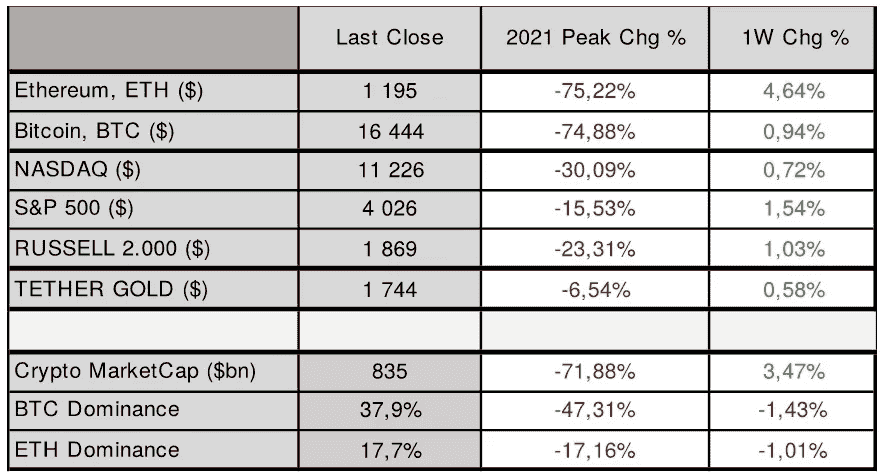
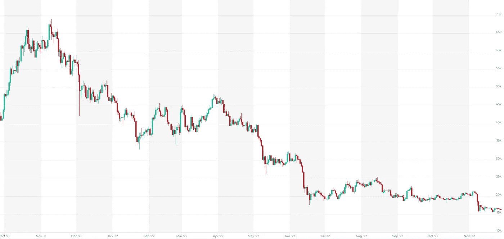
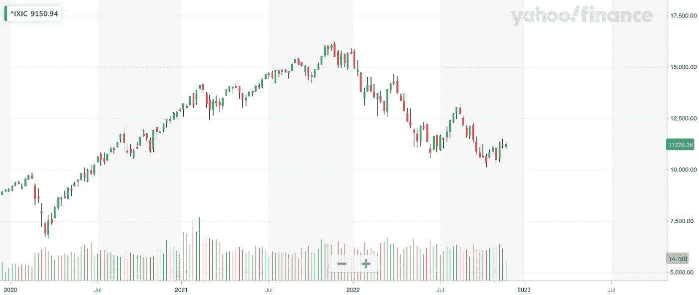

# 加密和宏回顾-第 47 周

> 原文：<https://medium.com/coinmonks/crypto-and-macro-review-wee-47-bb38772acc8d?source=collection_archive---------37----------------------->

**美国股市本周结束时略微走强，**纳斯达克收盘上涨 **(** [**纳斯达克**](https://finance.yahoo.com/quote/%5EIXIC?p=%5eIXIC&.tsrc=fin-srch) **⬆️0.7%)** 收于**11.226 美元**和 **S & P 500** 上涨**(**[**s&p500**](https://finance.yahoo.com/quote/%5EGSPC?p=%5eGSPC&.tsrc=fin-srch)**⬆️1.5%)另一方面，**以太坊**表现优于股票市场，收盘上涨**(**[**eth**](https://altfins.com/crypto-screener)**⬆️4.6%)**，收于 **$1.195** ，而**比特币**本周收盘上涨( [**比特币**](https://altfins.com/crypto-screener) **⬆️0.9%** ，收于 **$16.444 美国股市保持了较高的涨幅，因为在美国 CPI 显示出回落迹象后，投资者认为美联储变得更加温和。****

**我们预测通胀率将进一步降至 7.6%，核心 CPI 将在 2022 年 11 月降至 5.80%左右。最新公布的 2022 年 10 月美国 CPI 为 7.7%，核心 CPI 为 6.3%，而 9 月份为 8.20%和 6.64%。**

如果通货膨胀继续下降，我们将看到风险资产反弹的可能性增加。因此，将于 2022 年 12 月 13 日发布的下一次 CPI 读数将受到密切关注。市场认为美国联邦银行将在 12 月的下一次政策会议上开始放松加息，预计该行将仅上调基金利率 0.50%。10 年期美国国债收益率收于 3.73%，而 2Y 期美国国债收益率上周五收于 4.48%。

# **市场表现**

Source: altfins.com

**加密市场继续面临更高的下行风险**，因为市场关注受 FTX 崩溃影响最大的其他提供商。由于数字资产的现货价格大幅下跌，我们也看到一些比特币矿商的利润受到挤压。

如果一些矿商开始出现资不抵债的迹象，随着开采比特币的成本越来越高，市场可能会进一步下跌。

FTX 事件再次推动了去中心化，特别是去中心化的加密交易所，同时我们也可以看到，传统的交易所和经纪人从集中式加密交易所的不幸后果中受益，因为他们建立了良好的声誉和充分的监管监督。尽管未来几周数字资产面临更高的下行风险，但零售生态系统明显积累了加密货币。

链上分析公司 Glassnode 报告称，自 FTX 崩溃以来，散户投资者增加了近 10 万 BTC，这是有史以来最高的余额增幅。当矿商投降，许多小账户在短时间内成为长期持有者时，这是未来供应紧张的一个非常积极的信号。

# 比特币价格

Source: altfins.com

# 纳斯达克

Source: Yahoo Finance

# 市场情绪

数字资产市场情绪( [**加密恐惧&贪婪指数**](https://alternative.me/crypto/fear-and-greed-index/) )上升到 **⬆️28/100，**表示**恐惧**。周日收盘时，加密货币市场总市值上升至约 8350 亿美元，比一周前高出约 16 ⬆️3.5%。**以太坊(**[**eth**](https://altfins.com/crypto-screener)**)的统治力**下降到 **17.7%** ，降低了 **⬇️1.0%** ，而**比特币(**[**BTC**](https://altfins.com/crypto-screener)**)的统治力**也由 **⬇️1.4%** 下降到 **37.9%**

**关注什么:**美联储下一次货币政策会议:2022 年 12 月 13 日至 14 日欧洲央行下一次货币政策会议:2022 年 12 月 15 日；美国 2022 年 11 月 CPI 将于 2022 年 12 月 13 日发布。

> 交易新手？尝试[加密交易机器人](/coinmonks/crypto-trading-bot-c2ffce8acb2a)或[复制交易](/coinmonks/top-10-crypto-copy-trading-platforms-for-beginners-d0c37c7d698c)