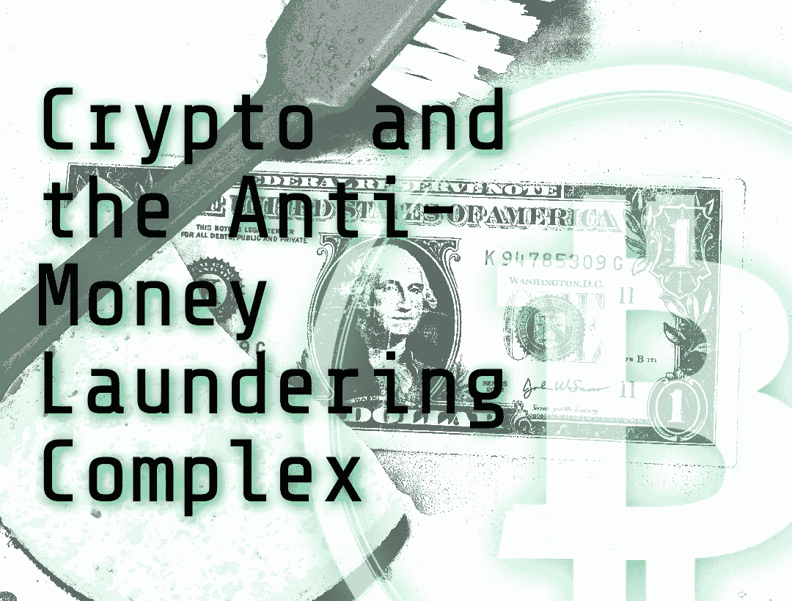

# 密码和反洗钱综合体

> 原文：<https://medium.com/coinmonks/crypto-and-the-anti-money-laundering-complex-87df1c62ee95?source=collection_archive---------10----------------------->

在最近的听证会上，美国参议员伊丽莎白·沃伦强调了加密给洗钱带来的风险。Crypto 需要反击。

Image: PixTeller

# 洗钱神话

反洗钱(AML)法规已经存在了 52 年。今天，我们需要“打击”恐怖分子/毒品/犯罪融资的想法是如此普遍，人们只是接受…