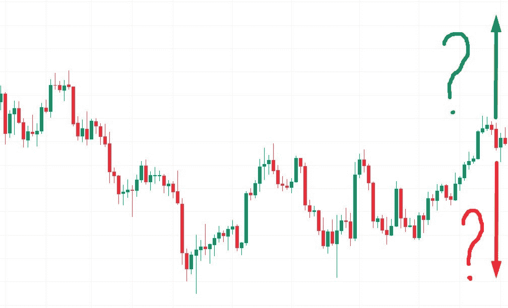
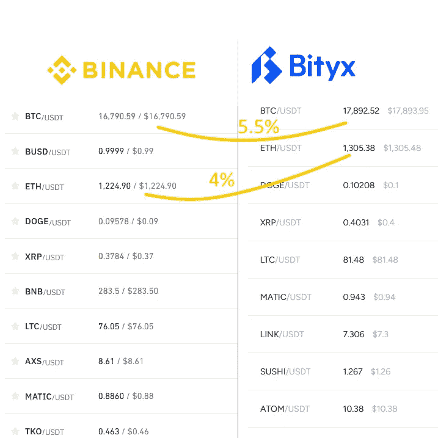
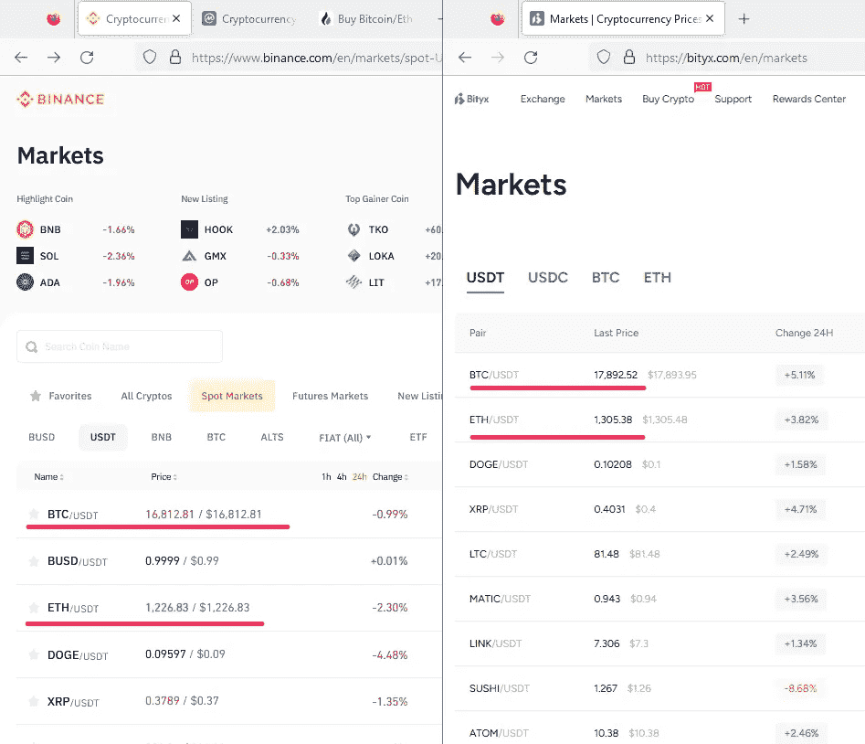
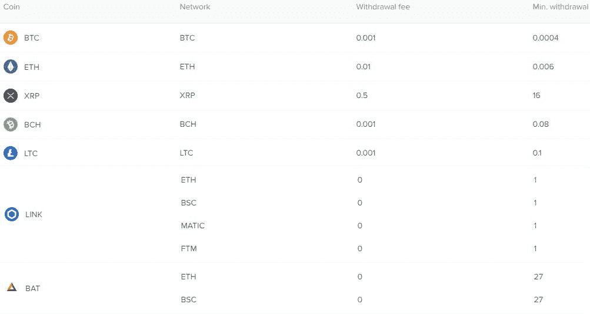

# 加密套利:无需钻研股票分析就能赚钱

> 原文：<https://medium.com/coinmonks/crypto-arbitrage-make-money-without-delving-into-stock-analysis-8021c72dc487?source=collection_archive---------0----------------------->

九千万美元。这个数字是每天最大的加密货币交易量的近似值。

在加密平台上交易可以给你带来超过 1000 美元的日利润。不到一周你就能把押金翻倍。此外，为了获得这笔收入，并不需要了解基本面和技术分析。无论比特币和其他硬币的利率上升或下降，都有利润。你会问，这怎么可能？**答案很简单:加密套利。**

# 什么是加密货币套利

从数字资产中赚钱最简单的方法就是交易。交易员买入比特币、以太坊等加密货币，等待其价格上涨。这种方式有可能增资吗？是的。但是同样的概率，你可以失去一切。加密货币的速度变化很快。没有分析师能够准确预测图表的走向。

> *你能预测图表会往哪个方向移动吗，向上还是向下？*

结果，新手存钱，花时间分析行情，指标，预测。然后加密货币图表迅速向相反方向移动。

**因此，在交易平台上有一种风险更小的赚钱方式:加密套利。**

代币和硬币的价格在不同的平台上有所不同，有时高达百分之十。例如，截至 2022 年 11 月 27 日，1 BTC 在 [*币安*](https://binance.com) *的价值为 16790 美元。同时，在*[*Bityx*](https://bityx.com/r/f3k3010)*交易所上，比特币可以卖到 17892 美元。比率差异几乎为 5%。这是交易员从一笔套利交易中可以获得的金额。*

> *加密货币价格差异* [*币安*](https://binance.com) *和*[*Bityx*](https://bityx.com/r/f3k3010)*。你可以从一笔套利交易中获得高达 5%的回报。*

**套利赚钱的经典方案:**

1.  交易者发现两个交易所的加密资产价格不同。
2.  硬币或代币在汇率最低的平台购买。
3.  数字货币被转移到具有最佳报价的加密交易所。
4.  资产以更有利的价格出售。

# 预期收益

加密套利的主要优势:**你不需要做市场分析**。硬币的价格是涨是跌并不重要。你从差价中获利，而不是从动态报价中获利。

**你可以估算每笔交易的大概利润**。例如，如果交易佣金是 1%，汇率差异是 3%，那么每笔交易给你带来 2%。

另一个好处是初学者容易开始赚钱。**你需要大约 1 天的时间来制定盈利方案**。

# 循序渐进的指导

为了从加密套利中赚钱，你需要:

1.  在两个或多个交易所创建账户，如 [*Bityx*](https://bityx.com/r/f3k3010) 和 [Phemex](https://phemex.com) 。
2.  将钱存入你的个人账户。
3.  找到一个套利机会，这意味着你需要等到一个交易所的硬币或代币的买入价和另一个交易所的这种资产的卖出价存在差异。
4.  在价格较低的平台购买比特币或其他加密货币。
5.  将资产从一个交易所转移到另一个交易所。
6.  趁汇率有利在那里卖。
7.  由此产生的利润可以提取或留在账户上，增加你的资本。

> *BTC 和 USDT*
> 
> [*币安*](https://binance.com) *:买入—$ 16812.81* [*Bityx*](https://bityx.com/r/f3k3010)*:卖出— $17892.52*

每 BTC 交易利润:1079.71 美元

# 选择交易所进行套利

如今，有数百个加密货币平台可供使用。但并不是所有的都适合加密套利。选择交易所时，您需要考虑以下标准:

*   可靠性。平台必须稳定安全。
*   有利的汇率。在报价大致相同的加密平台上创建账户是没有意义的。
*   不收提现费。价格越低，投资者获得的收益越大。

*在*[*Bityx*](https://bityx.com/r/f3k3010)*等一些平台上，可以 0 手续费提取硬币和代币。*

**截至 2022 年，我们可以为初学者推荐以下平台:**

*   [*Bityx*](https://bityx.com/r/f3k3010) 。这有利于巨大的套利机会。和其他平台的报价差可以超过 5%。此外，该交易所有忠实的初学者条件，您可以快速轻松地通过验证。此外，对于许多加密货币，提现费用为零。
*   [币安](https://binance.com)。最大的加密平台。币安有一个方便快捷的终端，但账户验证规则相当严格。此外，硬币的最低取款金额也有限制。
*   [火币](https://huobi.com)。该平台允许您无需验证，每天最多提取 0.1 BTC。此外，转让硬币和代币的费用也很低。

# 常见问题解答

**套利和现货交易哪个更赚钱？**

交易可以一次带来更多的钱。但由于不正确的市场分析，有失去一切的风险。加密货币的汇率变化很快，新手可能很难理解图表的走向。所以，套利是新手最好的赚钱方式。

**从事加密套利合法吗？**

是的。在像[币安](https://binance.com)或者[Bityx这样的大而可靠的交易所上，投资者从来没有因为这种赚钱方式产生过误会。](https://bityx.com/r/f3k3010)

**用加密货币套利每天能赚多少？**

这完全取决于花费的时间和初始资本。理论上，投资者可以在几天内将存款翻倍。在这种情况下，通过一开始投资 100 美元，你可以在一个月内将它们变成 5000 美元或更多(如果投资者不提取利润)。

加密套利有风险吗？

是的，如果投资者花费大量时间在平台之间转移资产，费率可能会变得不利。因此，交易必须快速进行。此外，如果您看到报价变化太快(加密货币正在迅速变得更贵或更便宜)，则不希望执行交易。但是这种事件很少发生。

**我想试试这个方法，应该怎么开始？**

1.  在 [*Bityx*](https://bityx.com/r/f3k3010) (邀请代码:f3k3010)和[币安](https://binance.com)(邀请代码:T214RL)上创建账户。
2.  存款。
3.  找一个汇率有差异的交易对，买一个更便宜的货币。
4.  把硬币转移到第二交易所，然后在那里出售。

> 交易新手？试试[加密交易机器人](/coinmonks/crypto-trading-bot-c2ffce8acb2a)或者[复制交易](/coinmonks/top-10-crypto-copy-trading-platforms-for-beginners-d0c37c7d698c)