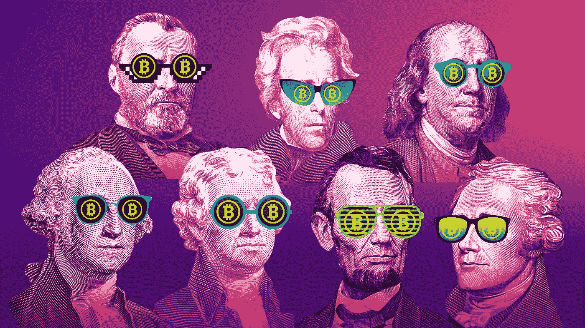
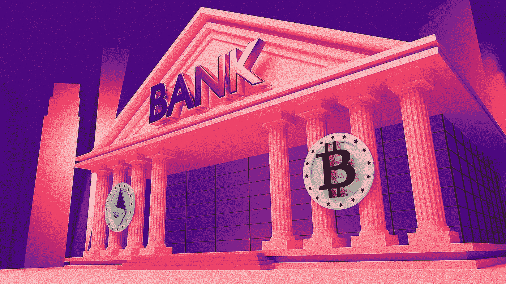

# 加密银行离推翻传统金融机构又近了一步

> 原文：<https://medium.com/coinmonks/crypto-banks-just-got-one-step-closer-to-overthrowing-tradfi-institutions-f55f4ce8d0b5?source=collection_archive---------26----------------------->

加密银行被纳入国际支付系统是不可避免的吗？也许……不管怎样，看起来美联储正在通过让加密银行获得主账户来赶上潮流，让加密更接近融入主流经济。美联储最近发布了新的指导方针，要求进入主账户和支付服务的机构。

# 什么是主账户？

如果你认为一个主账户听起来像是一个统治所有其他账户的账户，那你就错了。主账户就是在组成美联储体系的 12 家成员银行之一开立的银行账户。这使得持有者可以直接进入美联储的支付系统，并以中央银行的货币与其他成员进行交易结算。主账户网络构成了遗留财务系统的基础。

你会问，遗产财务是什么？好吧，对你的问题的聪明回答是，传统金融系统是建立在这样一种理念之上的，即机构“被评估并纳入一个网络，以确保一个安全、高效、包容和创新的支付系统，有利于消费者的安全和保护。”如果这让你摸不着头脑，那就把传统金融体系想象成一个排他性的银行俱乐部。如果你想加入俱乐部，你需要遵守规则。制定这些规则是为了保护客户并保持现状。

# 密码银行和正规银行有区别吗？

密码银行与整合到该系统中的普通银行有何不同？加密银行是独立的，比传统银行更灵活。这是因为加密银行比普通银行受到的监管更少，这意味着它们可以试验新技术。这有时会与由美联储监管的传统银行体系发生冲突。因此，它们一直处于监管的灰色地带，客户几乎得不到任何保护或保障。

密码银行隶属于数字银行。数字银行可以分为两类，挑战者银行和新银行。第一类包括已申请银行牌照并希望与传统银行直接竞争的银行。而那些与传统银行合作以利用其牌照的银行则被称为新银行。任何想要从事金融服务的加密银行都需要与已经接入全球支付系统的中介银行合作。

# 为什么加密银行会想成为传统金融系统的一部分？

为什么加密银行会想参与到他们被设计来推翻的系统中呢？为了让加密货币成为主流并成为法定货币的有力竞争者，创造一个透明、安全和一致的环境非常重要。有无数的密码项目崩溃的故事，看似一夜之间，导致投资者损失数百万美元。通过为更好地访问传统金融系统制定指导方针，加密银行在满足监管要求方面将更加清晰。

# 这对加密银行客户有什么好处？

这对加密银行客户意味着什么？嗯，这意味着他们看到了更大的稳定性和安全性。当你把你的比特币或其他密码发送到数字银行时，你更有把握明天它还会在那里。这并不能保证该银行不会倒闭，但在获准进入全球支付系统之前，它将接受严格的审查。这是因为美联储采用了新指引引入的多层体系。一级银行有联邦保险，而二级银行没有，但联邦银行机构将在审慎监管下密切关注它们。第三层是密码银行所在地。这些银行没有联邦保险，也不受联邦银行机构的监管。相反，他们将接受最严格的审查。

加密银行要求进入主账户并不是什么新鲜事。事实上，早在 2021 年就已经有几个像[北海巨妖](https://www.coindesk.com/policy/2022/03/26/kraken-hits-key-milestone-in-quest-to-gain-fed-account-equal-treatment-with-traditional-banks/)和[保管](https://cointelegraph.com/news/crypto-bank-custodia-sues-the-fed-over-19-month-delay-on-account-approval)这样的密码机构申请接入。尽管这些尝试已经拖了 18 个月，但它们可能已经引发了对新指导方针的需求，以允许“新型”银行进入现有的遗留金融体系。

但这是 crypto 的正确举措吗？将 crypto 置于美联储的监视之下有意义吗？这个决定确实破坏了加密的理想，首先比特币是一个去中心化的点对点数字现金网络。

# 这是好事还是坏事？

从传统金融的角度来看，对不稳定后果的警报正在响起。仅在过去一年，密码市场就蒸发了超过 7000 亿美元，导致初创公司倒闭，投资者几乎一无所有。令人担忧的是，获准进入主账户的加密银行数量可能会达到数百家，而且都没有联邦保险的保护。因此，2022 年 5 月发生的崩盘的后果将产生更大的连锁反应。相反，支持者认为，通过让加密公司更多地使用央行基础设施，将会有比以往任何时候都大得多的监管。这可以增加加密空间内的信任，使数字资产合法化，并消除当前的污名。

# BAXE 在其中扮演什么角色？

BAXE 正在采用 neobank 方法，与现有的金融机构合作来访问遗留金融系统。这提供了来自合作银行的保护和监管监督，而不会使全球经济过度暴露于当前数字资产市场存在的波动性。这种方法使 defi 和 trad 的世界保持分离，但通过监管桥梁联系在一起[。任何创新或新技术都有风险和危险。数字资产也是如此。我们才刚刚开始了解数字资产、密码和 defi 在我们经济中的位置。](/@baxe_app/for-defi-to-survive-we-need-to-bridge-the-gap-between-traditional-finance-and-crypto-2f9f55a92911)

不可避免地会有成功的项目和失败的项目，对于投资者、客户和用户来说，教育自己寻找什么是重要的。BAXE 的核心是让传统金融和加密货币之间的这座桥梁尽可能无缝连接。尽管这通常意味着监管指引仍在跟进，但现有金融体系和分散化金融体系之间的明确区分，让用户能够就如何投资做出明智的选择。

如果你喜欢这篇文章，并想留在了解所有事情的网站 3，请确保你关注 BAXE 博客并注册我们的邮件列表。

你也可以在[推特](https://twitter.com/BaxeApp)上关注我们，并加入我们的[电报组](https://t.me/BaxeCommunity)。

我们承诺让您了解最新信息，尽情娱乐😏

> *加入 Coinmonks* [*电报频道*](https://t.me/coincodecap) *和* [*Youtube 频道*](https://www.youtube.com/c/coinmonks/videos) *获取每日* [*加密新闻*](http://coincodecap.com/)

# 此外，请阅读

*   [拷贝交易](/coinmonks/top-10-crypto-copy-trading-platforms-for-beginners-d0c37c7d698c) | [密码税务软件](/coinmonks/crypto-tax-software-ed4b4810e338)
*   [网格交易](https://coincodecap.com/grid-trading) | [加密硬件钱包](/coinmonks/the-best-cryptocurrency-hardware-wallets-of-2020-e28b1c124069)
*   [密码电报信号](/coinmonks/top-3-telegram-channels-for-crypto-traders-in-2021-8385f4411ff4) | [密码交易机器人](/coinmonks/crypto-trading-bot-c2ffce8acb2a)
*   [印度最佳密码交易所](/coinmonks/crypto-exchange-dd2f9d6f3769) | [印度最佳密码交易所](/coinmonks/bitcoin-exchange-in-india-7f1fe79715c9)
*   [开发人员的最佳加密 API](/coinmonks/best-crypto-apis-for-developers-5efe3a597a9f)