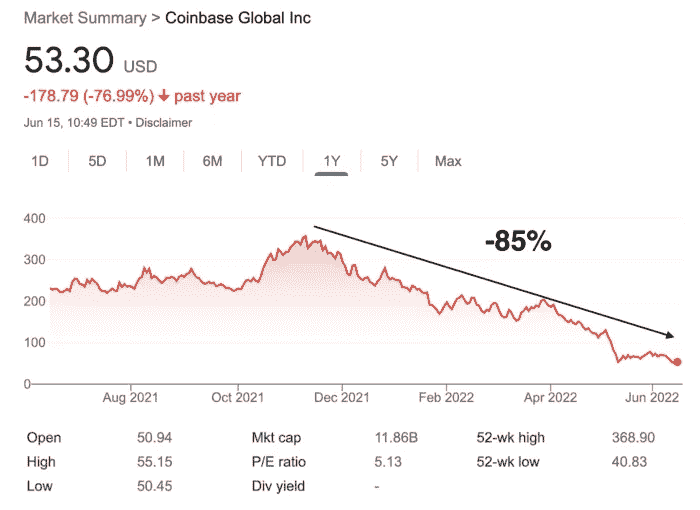

# 加密熊市——紧急抓住你的私钥

> 原文：<https://medium.com/coinmonks/crypto-bear-market-urgently-take-hold-of-your-private-keys-29169a2c796d?source=collection_archive---------20----------------------->

持续和/或显著增长的市场被称为牛市。价格持续和/或大幅下跌的市场被称为熊市。每个市场都有自己独特的机会和风险。

# 市场波动

无论是加密货币、股票、房地产还是任何其他资产，市场经常被描述为要么牛市要么熊市。简单来说，牛市就是上涨的市场，熊市就是下跌的市场。

由于市场经常波动，例如从一天到下一天(甚至从一个时刻到另一个时刻)，这两个术语通常描述以下市场发展:

上涨或下跌占优势的时间更长

价格大幅上下波动(20%通常被认为是一个指标)

# 那么什么是牛市呢？

牛市，也被称为牛市，被定义为大多数投资者都在购买，需求超过供应，市场信心高涨，价格上涨的时期。如果你发现市场中的价格正在快速上涨，这可能表明大多数投资者对未来的价格发展越来越乐观或“看涨”，这可能标志着牛市的开始。

认为价格会随着时间的推移而上涨的投资者被认为是“多头”。随着投资者变得越来越乐观，一个正反馈循环发展起来，这通常会吸引更多的投资，导致价格持续上涨。

因为加密货币的价格受公众对这些资产的信心的影响很大，所以一些投资者采用了一种策略，试图衡量投资者对市场的乐观程度(这种衡量方法被称为“市场情绪”或“情绪”)。

# 不同的阶段

熊市通常由 7 个不同的阶段组成。十有八九，我们目前仍处于阶段 4 和阶段 5 之间。我们在恐慌和积累/稳定之间。看看比特币恐惧和贪婪指数的现状，恐慌阶段仍然占主导地位:

这是整个加密货币生态系统的游戏规则改变者，比特币是其中无可争议的王者。比特币和加密货币的熊市发生在复杂的宏观经济背景下，投资者的风险厌恶情绪达到了新的高度。乌克兰战争、通胀和央行货币政策收紧，都给未来几个月的投资者带来了很大的不确定性。

比特币现在约为 2 万美元。这是自 2020 年末以来的最低水平。比特币的价格甚至跌破了 2017 年底的 ATH，跌至 17.7 美元的低点。这场风暴正导致该行业上市公司的股价下跌。例如，自 2021 年底比特币价格触及 69K 美元的 ATH 以来，比特币基地的 ATH 已经下跌了 85%以上

# 这个行业的美国巨头现在仅重 118 亿美元

这促使该平台审查其未来几个月的战略。首席执行官兼创始人 Brian Armstrong 刚刚宣布比特币基地裁员 18%,约 1100 名员工:

“在经历了 10 多年的经济繁荣后，我们似乎正在步入衰退。做出这个艰难的决定是为了确保我们在经济低迷时期保持健康。”

自 2021 年初以来，必须指出的是，比特币基地的劳动力经历了飞速增长，从 1，250 名雇员增加到 6，000 多名。Brian Armstrong 为自己辩护说，比特币基地发展得太快了。该平台可能被围绕比特币牛市及其 2021 年 4 月首次公开募股的兴奋情绪冲昏了头脑。

比特币基地报告称，2022 年第一季度净亏损 4.3 亿美元。因此，在华尔街，自 2022 年 1 月以来，比特币基地的估值被除以 5。

在过去的两周里，市场崩溃已经促使几个行业巨头削减他们的工资。在比特币基地之前，由文克莱沃斯双胞胎兄弟创立的双子座公司宣布裁员 1000 多人，占员工总数的 10%。

美国平台 BlockFi 和 Crypto.com 也是如此，分别裁员 20%和 5%。在拉丁美洲，Buenbit 已经选择解雇一半的员工，而 Mercado Bitcoin 已经将员工人数减少了 15%。

由于投资者的谨慎，主要参与者正面临加密货币交易量的急剧下降。自今年年初以来，全球市场已经损失了三分之二的价值，即 2 万亿美元。分析师们现在担心“没有尽头的一天”，会有一连串的破产。市场正处于与最糟糕的下跌阶段相吻合的状态。从历史上看，在反弹之前，它可以持续 8 到 24 个月。价格进一步下跌 40%至 64%是可能的，甚至长期投资者已经遭受重大损失。

现在，只有巨人币安表示，它决心在不牺牲任何员工的情况下渡过难关。上周在奥斯汀举行的大型美国加密活动 Consensus 2022 上，其首席执行官赵昌鹏甚至宣布“未来几周将招聘新员工。”

> 交易新手？试试[加密交易机器人](/coinmonks/crypto-trading-bot-c2ffce8acb2a)或者[复制交易](/coinmonks/top-10-crypto-copy-trading-platforms-for-beginners-d0c37c7d698c)

# 最后的想法

除了加密货币领域，整个科技生态系统都受到了严重限制。许多初创公司在最近几周宣布了大规模裁员计划，如快速商业专家大猩猩或瑞典金融科技公司 Klarna。而 Meta、Snapchat、优步和 Lyft 等巨头则放缓了招聘步伐。

这一熊市将让该行业清理掉那些在增长时不够谨慎的不太稳健的公司。因此，在我看来，这是一个重要的时刻，我要再次提醒你，你应该拥有你的比特币私钥，而比特币基地等一些平台的破产可能会导致提款受阻，然后使用加密货币资产偿还公司的投资者或债权人。

简而言之，用户将失去他们的劳动成果，并且是最后被服务的。记住比特币的黄金法则:不是你的钥匙，不是你的比特币。这会让你充分保护自己。