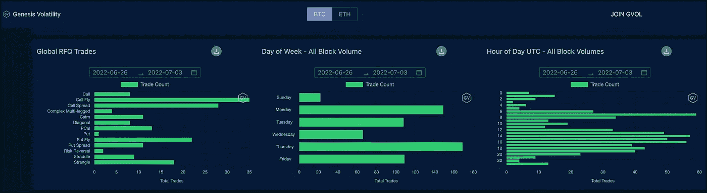

# 加密块流 2022 年 6 月 26 日–2022 年 7 月 3 日

> 原文：<https://medium.com/coinmonks/crypto-block-flow-6-26-22-7-3-22-bb4e2ec112d2?source=collection_archive---------42----------------------->

叫蝴蝶？🦋 🦋

是的，我们正处于交易者利用看涨蝴蝶努力赚钱的阶段。这就是我们上周在 [Paradigm](https://www.linkedin.com/company/paradigmco/) 上看到的。根据交易数量，最常见的交易结构是看涨期权。

如果不看罢工，人们可能会认为交易员正在努力工作。蝴蝶可以被认为是腐烂的策略。交易者希望市场横向移动到稍高的位置，因为他们做空自动取款机的中部，而做多 ITM 低点和 OTM 高点。

> 交易新手？试试[密码交易机器人](/coinmonks/crypto-trading-bot-c2ffce8acb2a)或者[复制交易](/coinmonks/top-10-crypto-copy-trading-platforms-for-beginners-d0c37c7d698c)

这可能是底部正在形成的信号。横着比低着好，嗯？

我的直觉？我不会打任何电话，但考虑到坏消息的激增，价格可能会更糟。外面还有多少暴徒？不知道。数目不详的秘密交易所通过自己的破产运营，这令人沮丧。更多的鞋子可能会掉下来。

保持头部旋转。新的机会肯定会出现，并一如既往地注意思想僵化。封闭的陷阱抓不到猎物。敞开心扉。