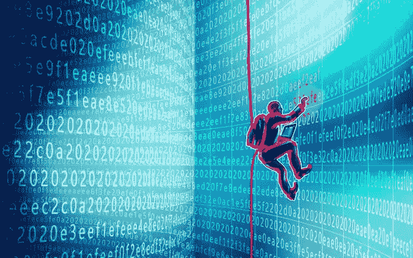

# 密码虫赏金猎人:2020 年以来的综述

> 原文：<https://medium.com/coinmonks/crypto-bug-bounty-hunting-an-overview-since-2020-6f5cebe24650?source=collection_archive---------6----------------------->

本文是无银行岛作家群的第二篇，共四篇。

A Bug Bounty Hunter Doing His Thing.

Crypto 过去一直都是关于交易和贩卖 alt 和 shitcoins 的，希望能有所收获。然而，越来越多的人通过加密赚钱——不是通过通常的 HODLing 或 day trading 方式——而是通过加密平台托管的“奖金”。其中一个奖励就是 bug 狩猎，随着 DeFi 的兴起和随之而来的 DeFi 黑客攻击，这项活动最近变得非常流行。

据 [Cointelegraph](https://twitter.com/Cointelegraph/status/1561990375316881411) 报道，“黑客对区块链安全专家的需求飙升，一些审计员的年薪高达 43 万美元。”对发展中国家的审计员和安全专家来说，幸运的是，加密赏金猎人正在成为摆脱贫穷和平庸的一条高速公路。

但是，这一切是怎么开始的呢？行业是如何在短短两年内完成这一转变的？这个故事可以追溯到 2017/2018 年，当时 Bounty0x、Gitcoin 和其他赏金托管平台允许赏金主持人发布以任何加密货币支付的赏金，如以太币、stablecoins 或其他代币。

这些奖励从发现一般代码中的漏洞到营销服务，如撰写内容和推文。然而，随着以太坊区块链及其智能合约的流行，焦点开始转移。很快，以太坊上的项目开始建立，dapps 涌入市场。

这种危险的发展很快导致了复杂性——开发人员用以太坊代码构建 dapps，这些代码可能会被黑客攻击或利用。于是开始了一系列臭名昭著的 dapp 和 smart contract 攻击，都是为了榨干他们的资金。我们都很熟悉 2020 年的夏天。那一年，[因漏洞、利用和黑客攻击损失了近 1 亿美元](https://cryptobriefing.com/50-million-lost-the-top-19-defi-cryptocurrency-hacks-2020/)。这些协议挽回了一些损失，但黑客攻击影响了行业前景。

像 YAM、Soft 向往、bZx、Harvest 和 Akropolis 这样的项目遭受了数十万和数百万的损失。其中一些攻击是由黑客精心策划的，他们想证明一点——协议的代码基础或安全性是不安全的，他们可以逃脱攻击。

2020 年 12 月进入 Immunefi。

这个想法是激励白人黑客通过发现和报告生态系统中可利用的漏洞来保护协议。这个想法很快就火了；Immunefi 与许多协议建立了合作关系，赢得了 DeFi 社区的信任，并接纳了许多白人黑客。

据报道，截至 2021 年秋季，Immunefi 负责保护 Synthetix、Chainlink、SushiSwap 和 PancakeSwap 等项目中超过 500 亿美元的协议资产。此外，OG bug bounty 平台支付了超过 750 万美元的 bug 奖金。

发现的最流行的漏洞之一是在 Polygon 网络上，据报道有 8 . 5 亿美元被利用的风险。一名 Immunefi 黑客 [Gerhard Wagner](https://twitter.com/g3rh4rdw4gn3r?lang=en) 发现了这个漏洞，他迅速报告了这个漏洞，并获得了[200 万美元的赔偿](/immunefi/polygon-double-spend-bug-fix-postmortem-2m-bounty-5a1db09db7f1)。

根据 Immunefi 进行的研究，与 DeFi 相关的黑客攻击和利用已经使该行业损失了超过 102 亿美元。2022 有相当多的黑客，从大约 6 亿美元的 Axis Ronin Bridge 黑客到 Solana 黑客，再到最近 1.6 亿美元的 Wintermute 漏洞。

这些黑客攻击都意味着定义，加密空间仍然需要得到保护。Immunefi 迅速采取行动，筹集了 2400 万美元来增强其安全能力，这是其 2021 年筹集的 500 万美元的巨大飞跃。Immunefi 声称自 2020 年 12 月首次亮相以来，已支付超过 6000 万美元的奖金。

该平台还支持 300 多个 DeFi 和加密项目，包括 Big Names、Chain link、MakerDAO 和 Compound，同时保护 1000 亿美元的资产。请注意，还有其他 bug bounty 平台，如 Hackenproof 和 bugbounter，但 Immunefi 高于它们。

两年来，随着白帽黑客因保护协议而获得足够的报酬，加密漏洞奖金空间得到了极大的改善。还有很多工作要做，但有了 Immunefi、其他 bug bounty 平台和黑客们，我敢说我们是安全的。

> 交易新手？试试[密码交易机器人](/coinmonks/crypto-trading-bot-c2ffce8acb2a)或[复制交易](/coinmonks/top-10-crypto-copy-trading-platforms-for-beginners-d0c37c7d698c)