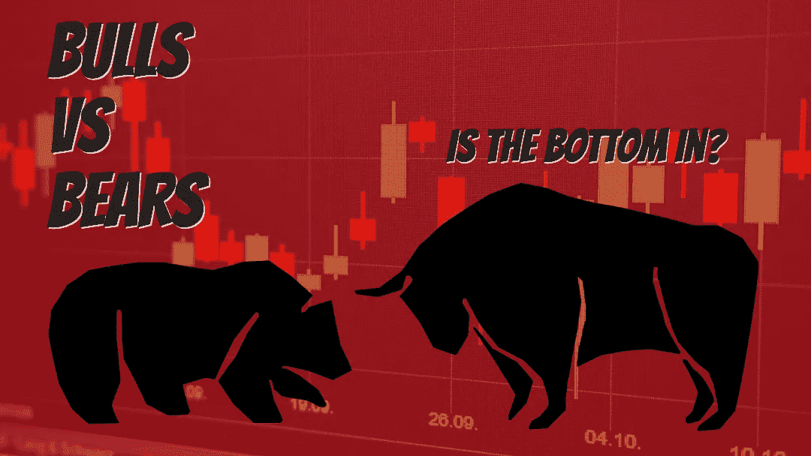

# 加密牛市或熊陷阱？2018 年的教训。

> 原文：<https://medium.com/coinmonks/crypto-bull-run-or-bear-trap-lessons-from-2018-99587172e15?source=collection_archive---------4----------------------->

越来越多的加密“专家”表示，2022 年加密崩溃的最糟糕时期已经过去。我们应该听吗？

Image: PixTeller

# 加密宏环境

看起来推特(CT)的多头和空头几乎平分秋色。随着近期价格持续上涨，看起来看涨的理由可能越来越充分。