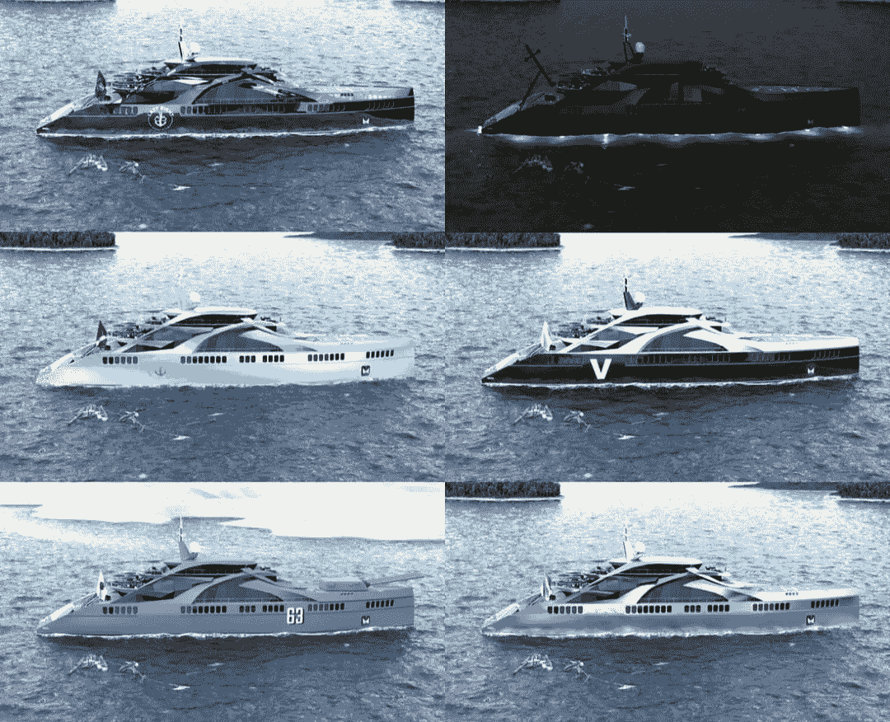

# 密码分类，比特币基地犯罪，和 Crescive 国会大厦

> 原文：<https://medium.com/coinmonks/crypto-classification-coinbase-crime-crescive-capitol-179f99489efc?source=collection_archive---------48----------------------->

By [Holly Eimer](https://medium.com/u/e25f399c6d84?source=post_page-----179f99489efc--------------------------------) for [Message in a Bottle Newsletter by Lazy 8ight YC](https://medium.com/u/6dcb932fb22b?source=post_page-----179f99489efc--------------------------------)

在加密相关的消息中，大多数主要加密货币在周五的日出交易中上涨，比特币现金 BCHUSD 的涨幅最大，上涨 3.89%，至 127.50 美元。以太坊交投于 1566.22 美元，+1.61%；索拉纳美元报 41.24，跌 4.02%；Dogecoin 为 0.0682 美元，下跌 1.3590%。Bitwise Asset Management 首席投资官马特·侯根(Matt Hougan)表示，加密货币市场可能会在今年剩余时间里保持不稳定。“我们仍在努力完成最后的去杠杆化过程，”Hougan 说。“我们还在应对一些短期的监管阻力，包括从监管角度来看，预计 2022 年 crypto 将出现动荡。”然而，他预计，尽管经济衰退迫在眉睫，但一轮隐秘的牛市将于 2023 年开始。“随着我们进入加密的下一个技术周期，我认为推动加密增长的长期趋势将压倒宏观趋势，”Hougan 说。

周一，加密资产的总市值在过去五周内首次超过 1 万亿美元。随着三起重大加密货币破产案件的开始，以及投资者对以太坊合并的预期继续上升，这一统计里程碑事件发生了。对于 crypto 来说，灾难性的第二季度导致其收回万亿美元的市值。根据 Hougan 的说法，2022 年下半年最伟大的加密故事可能取决于以太坊成功转向股权证明，其预期的软件升级的希望越来越大。随着以太坊价值的上升，“以太坊将成为下半年机构资产的首选，它正在出售，”Hougan 断言。

在五月下旬 stablecoin，TerraUSD 倒闭后，许多加密公司仍然有偿付困难。在不久的将来，美国投资者将能够把他们的钱投入到加密业务中的可能性将受到每个贷款人偿还消费者的能力的极大影响。投资者将密切关注三箭资本(Three Arrows Capital)、航海家数码(Voyager Digital)和 Celsius Network 这三起重大加密货币破产案的进展。虽然受影响的硬币之一的发行者 Flexa 声称美国证券交易委员会(SEC)尚未联系它，但比特币基地对 SEC 的说法提出质疑，即在 crypto exchange 上交易的七种加密货币是证券。SEC 描述了为什么有问题的 25 种加密资产中有 9 种会通过豪威测试，这是美国最高法院在另一场民事诉讼中用来评估什么构成“投资合同”的标准。除了 Flexa 的放大器，这九种硬币还包括 RLY，DDX，XYO，RGT，LCX，POWR，DFX 和克罗姆。

与数字资产监管相关的一个主要讨论话题是加密货币是否算作证券。加密货币交易所的高级法律官员保罗·格雷瓦尔(Paul Grewal)周四表示，比特币基地没有上市任何证券。“比特币基地平台上提供的 9 项资产中，有 7 项受到了证交会的指控。这些资产不是证券，”格雷瓦尔说。该行业的贸易协会区块链协会(Blockchain Association)的政策主管杰克·切尔文斯基(Jake Chervinsky)表示同意。根据切尔文斯基的推文，美国证券交易委员会可能会“表现得像他们已经树立了先例&转向下一个目标。”Grewal 表示，“SEC 本身已经评估了比特币基地在我们的交易所提供数字资产之前用来分析和审查每一项数字资产的严格流程。除了分析资产是否可能被视为证券之外，该程序还考虑了法规遵从性和信息安全性。”

在一名前比特币基地雇员被指控内幕交易后，比特币的价格开始下滑。该业务的前产品经理伊山·瓦希(Ishan Wahi)被指控参与一项利用该平台上市的加密货币从事内幕交易的计划。他被指控泄露秘密计划的信息，向他的兄弟和朋友提供某些数字代币。司法部的一份新闻稿称，这三人至少赚了 150 万美元。根据联邦调查局助理局长迈克尔·德里斯科尔(Michael Driscoll)的说法，“本案中的指控涉及在加密交易所进行的交易——而不是更传统的金融市场——但它们仍然构成内幕交易。”这被认为是第一个与加密货币相关的内幕交易骗局。

根据一份新闻稿，前比特币基地雇员 Sameer Ramani 已被起诉，但尚未被逮捕，而 Ishan Wahi 和他的兄弟 Nikhil Wahi 都已被拘留。Nikhil Wahi 和 Sameer Ramani 各被控一项电信欺诈共谋罪和一项电信欺诈罪，而 Ishan Wahi 被控两项电信欺诈共谋罪和两项电信欺诈罪。尽管 DOJ 的指控不包括任何证券欺诈罪，但有趣的是，在美国证券交易委员会提交的单独指控中，该集团交易的大量资产被认定为加密资产证券，如果这一认定成立，无疑将对加密货币市场产生重大影响

在 SEC 长达 62 页的文件中，他们针对上述业务和硬币，称“Nikhil 和 Ramani 从事受联邦证券法管辖的证券交易，因为这些加密资产是投资合同；它们被提供和出售给投资于共同企业的投资者，这些投资者对从他人的努力中获得利润有合理的预期。”根据新闻公告，该组织使用他人的账户购买了加密货币，并“通过许多匿名的以太坊区块链钱包”转移资金 Ishan Wahi 显然试图逃离该国，但在登机前被当局阻止。

美国证券交易委员会扩大其加密资产作为证券的分类对加密货币市场构成了重大风险，由于对商品的宽松监管标准，加密货币市场已经获得了动力，许多业内人士声称加密货币应该被归类为商品。比特币基地宣布，他们已经提交了一份请愿书，要求为加密监管框架创建新的标准，以回应 SEC 的诉讼。逮捕发生在一个主要发生在 Twitter 上的故事之后，在这个故事中，著名的加密货币人物 Cobie 发现了一个钱包，这个钱包被用来购买各种加密货币，然后比特币基地宣布将在交易所上市这些资产。此次逮捕发生在 6 月份 OpenSea 高管 Nate Chastain 被捕之后，他也被指控从事与 NFTs 有关的内幕交易。

除了诚实和正直，成功和持久的 Web3 公司提供社区。利用区块链技术，Lazy 8ight 游艇俱乐部(L8YC)创建了一个所有会员都能从每笔交易中受益的平台。L8YC 的价值在于其伴随会员资格的实用性和豪华酒店服务。为了成为 L8YC 会员，个人必须持有 L8YC 第 1 代 NFT 或 VIP 通行证。任何时候最多有 8，888 个会员名额。L8YC 旨在弥合豪华酒店和区块链技术之间的差距。随着公司的发展，L8YC 的目标是利用智能合同无缝促进豪华酒店领域的大型金融交易。非功能性测试还能以一种对每个人都有益的方式进行结构化。L8YC 所有利润的 50%返还给会员(NFT 持有者)。因此，社区不仅通过折扣受益，也从被动奖励中受益。Lazy 8ight 是第一家将一艘 90 米长的巨型游艇整体绘制成 NFT 的公司。这种技术能力允许他们在虚幻引擎 4 中创建一个交互式游戏世界，但它并没有就此停止！Lazy 8ight 游艇俱乐部与真实世界的游艇建造商合作，创建可穿越的 1:1 NFT 真实世界游艇。使用虚拟现实眼镜，潜在买家甚至可以在预约之前探索游艇！

为了购买 NFT，个人可以通过他们的造币网站直接购买，或者在二级市场上购买。L8YC 会员享受 L8YC 活动服务和所有豪华酒店合作伙伴的折扣。L8YC 还举办真实世界的活动，持有人可以免费入场。智能合约确保特定的行为得到处理，允许 L8YC 将其编码到平台中，并在没有任何人工监督的情况下将利润分配给所有持有人。此外，这项技术可以即时更新。当一辆 L8YC NFT 被铸造时，没有一个“处理时间”L8YC 网站上发生的下一笔交易将立即授予新的持有者优惠！L8YC 汇集了世界各地 NFT 项目、web2 公司和个人的真实事件。L8YC 的独特之处在于，他们能够利用现实世界中的合作伙伴关系，为会员提供重大活动折扣。L8YC 与豪华酒店和娱乐公司合作，为他们的社区带来最佳体验。无论是利用 Lazy 8ight 的游艇销售、咨询还是包租，会员都可以确保在 Web3 和 Web0(真实世界)中完全透明和安全——L8YC 甚至提供活动安全服务，此外还有私人厨师为他们的豪华活动提供餐饮服务。无论您的需求是什么，Lazy 8ight 游艇俱乐部都能让您拥有最难忘的体验！

> 交易新手？试试[加密交易机器人](/coinmonks/crypto-trading-bot-c2ffce8acb2a)或者[复制交易](/coinmonks/top-10-crypto-copy-trading-platforms-for-beginners-d0c37c7d698c)