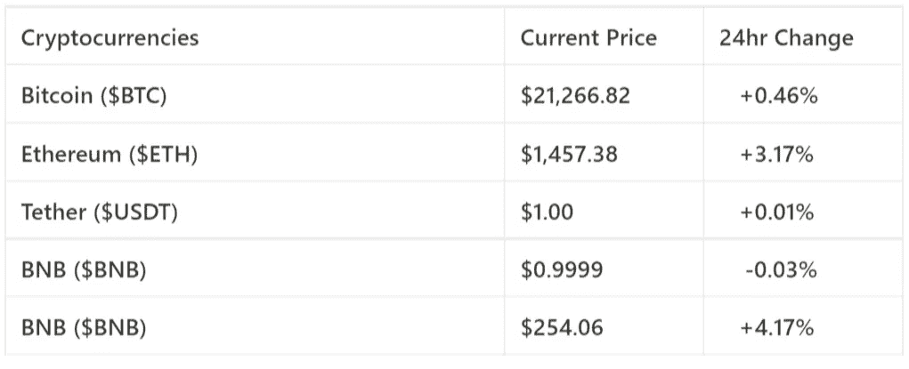
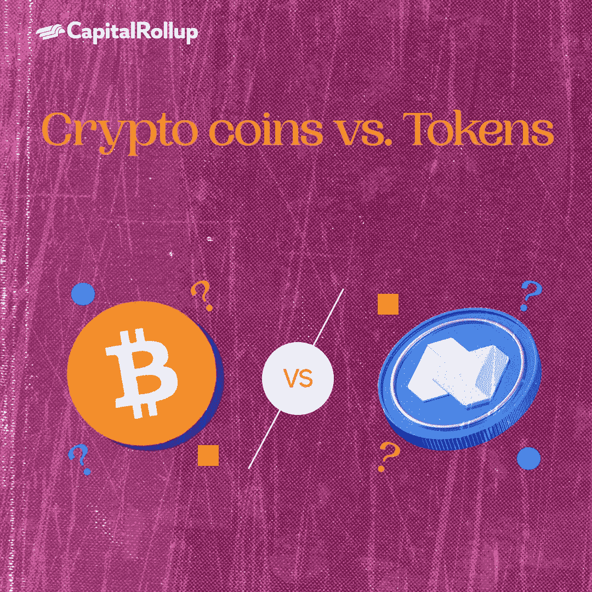
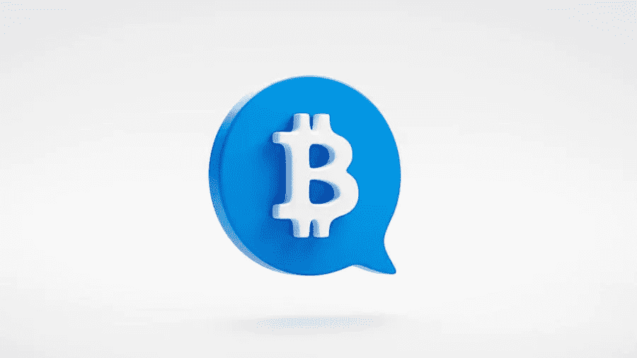
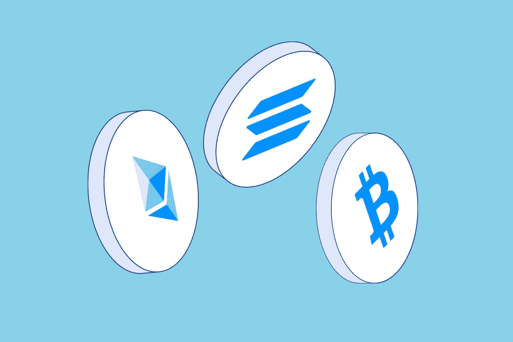
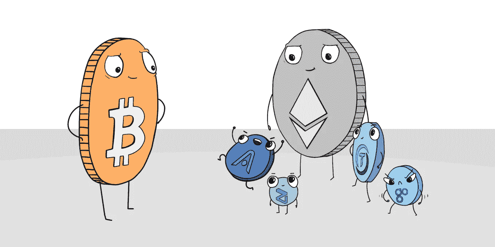

# 加密硬币与代币

> 原文：<https://medium.com/coinmonks/crypto-coins-vs-tokens-how-to-not-get-mistaken-5f08e8111b82?source=collection_archive---------56----------------------->

欢迎来到最新一期的 CapitalRollup Digest！今天的文摘是 7 月 27 日的，阅读时间大约需要 5 分钟。我们马上开始。

*   今天的市场看起来怎么样？(前 5/10 大流行加密货币)

Price Market Update

# 加密硬币与代币

几乎所有进入加密领域的投资者都会犯一个常见的错误，就是把加密硬币和代币混淆起来，反之亦然。

加密硬币和代币之间的基本相似之处是，它们都可以在交易所平台上在线买卖，并存储在加密货币钱包中。另外，所有的硬币都是代币，但不是所有的代币都是硬币。

在本文中，我们将探讨这两个术语的不同和不相似之处。

# 硬币是什么？

被称为加密货币的硬币是区块链网络上分散的点对点数字货币。类似于传统的法定货币，它们作为交换媒介，并持有特定的价值。它们是可替代的、可分割的、可接受的、可携带的、持久的，并且是限量供应的。

比特币就是一个例子，它是第一种成熟的加密货币。继 BTC 之后进入加密市场的所有其他加密货币都被称为“替代硬币”

# 什么是代币？

它们被用来代表可替代和可交易的数字资产，包括从商品到投票权的各种服务，并且也建立在由另一个平台(如以太坊)托管的区块链上。

我们将看一下令牌的三个部分:

**不可替换的令牌**:NFT 是唯一的令牌化资产，每个都有数字签名。不可替换这个词意味着它不能被另一个令牌或其他东西交换。它们可以是任何东西(艺术品、游戏中的物品和音乐)。你可以拥有它，购买它，或者出售它。这些令牌是根据 ERC-721 令牌标准构建的。

非功能性测试的一些例子有:

*   **无聊猿游艇俱乐部(BAYC):**2021 年 4 月推出，收集了 1 万只数码猿。
*   是一个虚拟世界，用户可以拥有土地、房子和艺术品。

**证券代币**:这些代币是可以表明所有权和投资的金融资产，可以向持有人提供投票权等特权。他们运行在以太坊区块链上。

**实用令牌**:简而言之，实用令牌旨在提供对项目生态系统的访问。可以购买这些代币来资助项目，并与发行者网络内的产品或服务进行交易。此外，他们还可以用它们来筹集资金，通常是通过首次发行硬币(ico)和私下销售。

# 硬币与代币:它们有什么不同？

## 基于区块链，它们是不同的

硬币在独立的区块链上运行，但加密代币在现有的区块链上运行。

## 非唯一和唯一

加密硬币是非唯一的，仅用作支付选项。无论平台如何，BTC 都将保持相同的值。与硬币相比，代币具有多种特定功能，使其更加独特。

## 它们是以不同的方式创建的

硬币是利用计算能力(采矿)创造的，而代币是通过在 DLT 上写一份智能合同铸造的。

## 它们代表不同的事物

区块链上的代币代表可以像房地产一样定价的实物资产，而硬币代表金钱——这意味着你可以用加密货币购买这些代币。

## 令牌不可替换

不可替换令牌是一种独特的数字资产。不可替代一词意味着每个代币不可与另一个代币交换，这与比特币等硬币相反，比特币是可替代的代币，意味着每个比特币与其他比特币的价值相同。

# 最终拍摄

简而言之，这两者之间的差异并不大，但理解这些术语对于降低风险和在当今动荡的市场中做出更好的决策是至关重要的。

只要 5 美元，投资者就可以在 CapitalRollup 投资各种加密指数。[www.capitalrollup.com](http://www.capitalrollup.com)

# 琐事🤔

**智能合约代表什么？**

A.交易层

B.业务逻辑层

C.工作证明

D.交易 API

在下一期的 CapitalRollup Digest 中找到答案。😉

# 每日一词！

💡**白皮书**

加密货币的详细说明，旨在提供令人满意的技术信息，解释硬币的用途，并为其计划如何取得成功制定路线图。它旨在让投资者相信这是一个比 ICO 更好的选择。

**在一个句子中使用的术语:** *—许多* ***白皮书*** *是为企业对企业或营销目的而设计的。*

# 社区更新📢

我们与 3 位行业领袖组织了一次 Twitter 空间会议，我们在会上讨论了“分享您的熊市经验& CeDeFi 内爆”，您可以在这里[收听](https://twitter.com/i/spaces/1YpKkZzakbNxj?s=20)

# 我们今天在读什么📰

**区分代币、硬币、虚拟货币。** [***阅读更多***](https://paxful.com/university/what-are-tokens-coins-virtual-currencies/)

**加密货币硬币和代币有什么区别？** [***阅读更多***](https://www.etoro.com/crypto/coins-vs-tokens/)

## 与朋友一起学习和投资加密技术💰

当您邀请您的朋友开始使用 CapitalRollup 进行有利可图的投资时，您将获得独特的奖励。

💬对 CapitalRollup Digest 有什么反馈吗？ [**告诉我们！**](mailto:hi@capitalrollup.com)

> 交易新手？尝试[加密交易机器人](/coinmonks/crypto-trading-bot-c2ffce8acb2a)或[复制交易](/coinmonks/top-10-crypto-copy-trading-platforms-for-beginners-d0c37c7d698c)