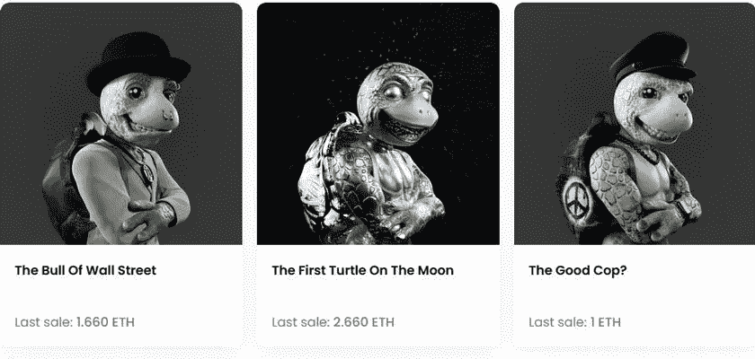
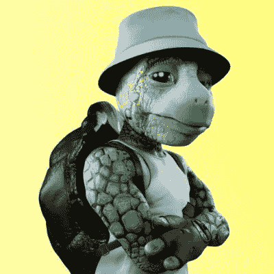

# Crypto.com 因误导 NFT 促销而被拷问

> 原文：<https://medium.com/coinmonks/crypto-com-grilled-for-misleading-nft-promotion-568b3fcd4e01?source=collection_archive---------23----------------------->

Source: OpenSea

啊对了，这是个好话题，NFT 推广。更妙的是，我们还有 crypto.com，它以大胆而有争议的营销方式而闻名。是的，财富的确青睐勇敢者，天知道买个 JPEG 有多勇敢。在对误导性营销的强烈反对之后，实际上是时候规范一些公司以及他们如何推广他们的产品了。可悲的是，他们的产品依赖于他们无法控制的 NFT 和加密货币。因此，很自然的，包括非功能性测试在内的所有东西都会被涂上糖衣，crypto.com 就是这么做的。现在，他们终于要为他们的广告向当局作出回应了。

> 从顶级交易者那里复制交易机器人。免费试用。

## **遏制你的 NFT 升职**

哈利路亚！英国广告标准局(ASA)已经将 crypto.com 的广告标记为 NFT 推广的[。美国证券交易协会称，交易所对非金融交易的描述具有误导性，未能识别该资产类别的相关风险。](https://www.asa.org.uk/rulings/turtle-united-nft-a22-1162126-turtle-united-nft.html)

具体来说，crypto.com 在脸书做了一系列广告，推广 NFT 海龟实验。促销发生在 2022 年 7 月，ASA 以三个主要理由对其进行指控。首先，它没有“说明 NFT 投资的风险”，这是一个公平的说法。此外，他们也没有披露铸造，并给投资者无法核实的保证。

不出所料，crypto.com 没有试图揭示非功能性税收实际上会贬值。最重要的是，非金融资产是不受监管的资产，这意味着投资者可能会涉足更粗略的投资。在这种情况下，平台必须包括与受众相关的风险。因此，根据美国广告标准局的说法，该广告具有误导性。

## 但是海龟们呢？

但是，这不是这两个人第一次一起跳舞了！早在一月份，美国广告标准局就标记了两个来自 crypto.com 的误导性广告。显然，该交易所在每日邮报应用程序上发布了它们，暗示投资者可以通过用信用卡投资比特币获得高达 8.5%的年收益率。随后，交易所不得不撤下广告。

对于海龟 NFTs，crypto.com 发表声明说，他们认为这没有违反任何规则。他们的理由是，由于财政部关于数字资产的报告中没有提到 NFT，因此它们不属于金融产品。另一方面，ASA 反驳了他们的观点，指出数字收藏品的描述是“提供了很多价值”。因此，疏忽包括 0.2 ETH 的铸造费，约为 302 美元。

与以前的案例不同，美国广告标准局没有对 crypto.com 进行罚款。但是，如果不对他们的 NFT 促销进行上述更改，他们就不能投放广告。

随着监管机构逐渐对数字资产加以约束，我们可以预计广告监管机构将挑战加密平台目前的营销风格。让自由主义见鬼去吧，从长远来看，这对 crypto 来说可能是件好事。

> 加入 Coinmonks [电报频道](https://t.me/coincodecap)和 [Youtube 频道](https://www.youtube.com/c/coinmonks/videos)了解加密交易和投资

# 另外，阅读

*   [加密货币储蓄账户](/coinmonks/cryptocurrency-savings-accounts-be3bc0feffbf) | [YoBit 审核](/coinmonks/yobit-review-175464162c62)
*   [Botsfolio vs nap bots vs Mudrex](/coinmonks/botsfolio-vs-napbots-vs-mudrex-c81344970c02)|[gate . io 交流回顾](/coinmonks/gate-io-exchange-review-61bf87b7078f)
*   [CoinFLEX 评论](https://coincodecap.com/coinflex-review) | [AEX 交易所评论](https://coincodecap.com/aex-exchange-review) | [UPbit 评论](https://coincodecap.com/upbit-review)
*   [AscendEx 保证金交易](https://coincodecap.com/ascendex-margin-trading) | [Bitfinex 赌注](https://coincodecap.com/bitfinex-staking) | [bitFlyer 点评](https://coincodecap.com/bitflyer-review)
*   [Bitget 回顾](https://coincodecap.com/bitget-review)|[Gemini vs block fi](https://coincodecap.com/gemini-vs-blockfi)cmd |[OKEx 期货交易](https://coincodecap.com/okex-futures-trading)