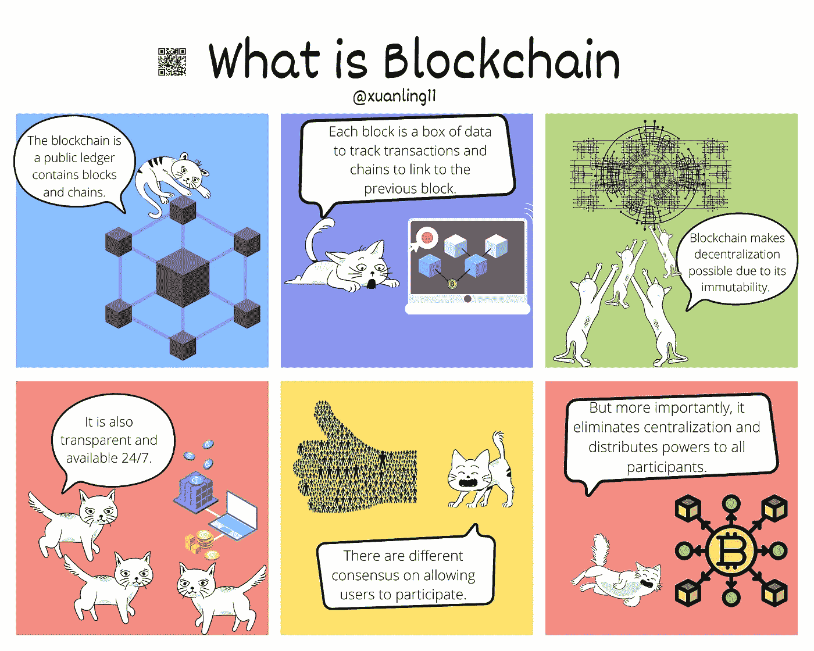

# 加密漫画——什么是区块链

> 原文：<https://medium.com/coinmonks/crypto-comics-what-is-blockchain-cfccb0866942?source=collection_archive---------31----------------------->

Photo by [Pascal Bernardon](https://unsplash.com/@pbernardon?utm_source=medium&utm_medium=referral) on [Unsplash](https://unsplash.com?utm_source=medium&utm_medium=referral)

我试图在连环画中解释区块链是什么。

**TL；博士**

区块链能做什么和它自己独特的历史。

**一些外卖**