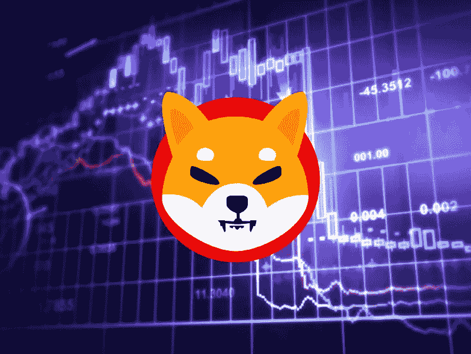

# 加密社区在 2022 年 10 月 31 日前设定柴犬(SHIB)价格

> 原文：<https://medium.com/coinmonks/crypto-community-sets-shiba-inu-shib-price-by-october-31-2022-d0221fff9b90?source=collection_archive---------15----------------------->

随着柴犬(SHIB)成为持续加密市场调整的最大受害者之一，大多数投资者都在关注这一信号，以寻找重新获得 2021 年高点的机会。

值得注意的是，最近几天，随着平台上的开发者试图通过整合元宇宙和分散金融(DeFi)等方面来使生态系统更加可行，SHIB 显示出了重整旗鼓的迹象。与此同时，在去年迷因加密货币迅速崛起期间，人们对这种代币的兴趣有所下降。

加密界押注 SHIB 将推动大规模的市场抛售和反弹。特别是，Finbold 月 30 日从 CoinMarketCap 价格估计功能获得的数据表明，加密社区预计到 2022 年 10 月底，柴犬的平均交易价格为 0.000013 美元。

该估价基于 6，167 名机构群体成员的投票，比截至发稿时 SHIB 的价格 0.000011 美元增长了约 20%。

在 SHIB 经历了数周的大幅回调之后，市场对该资产的兴趣正在消退。以前，缺乏兴趣被归因于缺乏实用性，这是开发社区通过采取一些措施来纠正的一个因素。

尽管 SHIB 的 DeFi 平台没有像预期的那样有所起色，但代币进入不可替代代币(NFTs)和游戏领域令人乐观。

值得注意的是，SHIBOSHIS 项目(一个 Shiba Inu NFTs 集合，允许持有人积极参与 NFT 造币和交易、数字土地收购和虚拟现实游戏)越来越受到社区的关注。

此外，SHIB 继续推进其象征性燃烧机制，以达到通货紧缩的状态。自从共同体采取切断 SHIB 的供应，超过 410 万亿代币被烧毁。

在其他地方，SHIB 也记录了鲸鱼活动的增加，这是一个乐观前景的指标。例如，WhaleStats 在 9 月 27 日的一条推文中指出，柴犬是排名前 1000 的以太坊鲸中持有最多的令牌。

# SHIB 的 DeFi 未能起飞

尽管社区前景乐观，但 SHIB 受到了其他因素的拖累，比如无法吸引用户使用其 DeFi 平台 ShibaSwap。值得注意的是，ShibaSwap 的总价值锁定(TVL)在最近几周持续稳步下降。

经过数周的亏损交易后，SHIB 在过去七天内录得超过 3%的正收益，交易价格为 0.000011 美元。与此同时，该资产仍以 61.4 亿美元的市值排名第 14 位。

> 交易新手？试试[加密交易机器人](/coinmonks/crypto-trading-bot-c2ffce8acb2a)或者[复制交易](/coinmonks/top-10-crypto-copy-trading-platforms-for-beginners-d0c37c7d698c)