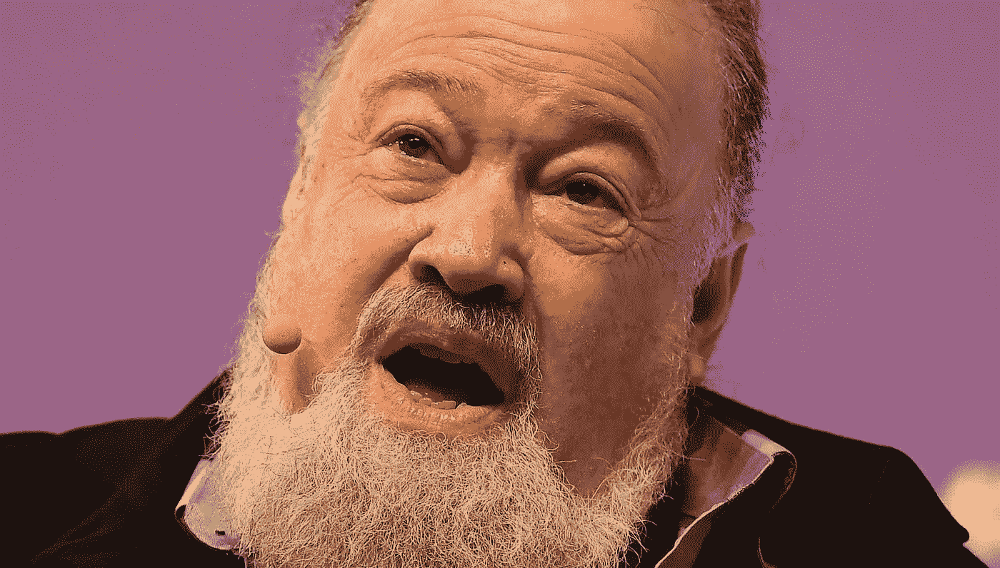

# crypto——这个人会是中本聪吗？

> 原文：<https://medium.com/coinmonks/crypto-could-this-person-be-satoshi-nakamoto-9a13a6daacce?source=collection_archive---------40----------------------->

*(Photo: Eoin Noonan / Web Summit via Getty Images)*

密码学背后的许多智力燃料都致力于隐私和匿名问题。它是什么，我们有资格得到多少，更明确地说，区块链是如何做到这一点的。在过去的 40 年里，有一个研究人员为此贡献了如此多的原创密码研究，以至于许多人都在私下里说他是中本聪最有可能的候选人。

不可改变的所有权是区块链的核心，隐私是它的近亲。你可能拥有一辆昂贵的 NFT，并选择公开出售。但是如果你有一个你不想分享的秘密，那么我们就在隐私的领域，这实际上只是所有权的另一种形式。我在这里谈论的不仅仅是你的密码或私钥。任何秘密——你捐给了哪个慈善机构，你选择了访问哪些网站，你选择了给谁打电话，你选择了什么时候给他们打电话。

正如我们被我们公开拥有的东西所定义一样，我们也被我们保密和私人拥有的东西所定义。

大卫·乔姆在伯克利获得博士学位时，正是 20 世纪 80 年代初密码学蓬勃发展的时候。我在一个名为 *Bankless，*的节目中听到了他的一次采访，他谈到了自己从小就对秘密着迷(人们很自然地会问为什么)，以及这是如何自然而然地引导他进入密码学，即秘密科学的。

这使他与一些早期的密码名人有了密切的联系，这些人的名字现在已经铭刻在密码史上——迪菲、赫尔曼、默克尔。还有一些人取得了巨大的成就——比尔·乔伊创立了太阳微系统公司(编程语言 Java 就是在这里诞生的，早期版本的操作系统 Unix 也是在这里诞生的)，埃里克·施密特从 2001 年到 2010 年执掌谷歌。

大卫·乔姆在过去的十年里已经成为了密码界的一个偶像，主要是因为他 1982 年的论文，在论文中他基本上描述了区块链的技术。它被神秘地命名为*‘由相互怀疑的组织建立、维护和信任的计算机系统’*。然后是后来一篇题为“*不可追踪支付的盲签名”*的论文，描述了现代区块链的另一个核心部分，数字签名。

我想，他的偶像地位已经进一步提高，因为每个人似乎都喜欢他；他面带微笑，健谈，知识丰富，看起来一点也不像那个留着大胡子的叔叔，当他来拜访时，总是带着礼物和笑声。

乔姆的弓还有更多的颤动；他的研究成果是一个奇迹——该领域如此多的重大创新都得到了他的认可。这当然让很多人相信他就是中本聪，但他不承认也不否认。

他有一个重要的理由来说明隐私(和匿名)对区块链及其后代的重要性，以及对我们认为的隐私(“哦，这很酷，这是加密的”)和真实隐私之间的差异普遍缺乏理解。这是他的一个困扰，他经常在他的博客和公共场合反复强调这个家。

隐私不仅仅是指隐藏起来的东西，只有一个人可以接触到

授权方。就像电报或 Whatsapp 信息，它确实加密了你的信息，实际内容。他认为隐藏“元数据”也很重要，比如谁发送了信息，信息发送给了谁，什么时候发送的。这些元数据很容易被窃听的第三方获得，这是一件小事，不需要很高的技能。

Chaum，为了支持他的“粉碎元数据”的号召，讲述了一个关于 1970 年中央情报局支持的推翻智利民选总统萨尔瓦多·阿连德的有趣故事。事实证明，他们拥有的最重要的工具之一是“贩运数据”，这是一份关于谁在 1970 年代风格的电话网络中在什么时间给谁打电话的每日报告。这使得他们能够在时间和空间上把人和事拼凑在一起。他们可以获得实际的对话，但“元数据”足以帮助他们推翻外国政府。(这些都在公开记录中，中情局在 2000 年承认了这一点)。

Chaum 写了大量关于现代消息传递系统中的元数据漏洞的文章，不真诚地用“端到端加密”这样的词混淆视听，这似乎满足了我们大多数人。是的，我们的数据可能被加密了，但我们的元数据没有，这对任何想在你不知情的情况下找到你的人来说都是一个信息宝库。

事实证明，Chaum 已经解决了这个问题和其他问题，并且刚刚推出了许多产品和计划，这些产品和计划都被捆绑到他创建的去中心化平台 xx network 中，包括一个集成了加密支付和元数据“碎片”消息的抗量子高速区块链。所有这些都基于不可改变的所有权(Chaum 更喜欢“控制”这个词)和隐私。随着“这实际上是真正的 Web 3”的传言开始流传，它正在深层技术领域掀起波澜。

xx 网首页中间的标语写着

我们正在建立一个你的生活属于你的世界。

是的，这就说明了一切。

Steven Boykey Sidley 是约翰尼斯堡大学 JBS 的实践教授。这篇文章最初刊登在《每日特立独行》上

> 交易新手？试试[密码交易机器人](/coinmonks/crypto-trading-bot-c2ffce8acb2a)或者[复制交易](/coinmonks/top-10-crypto-copy-trading-platforms-for-beginners-d0c37c7d698c)