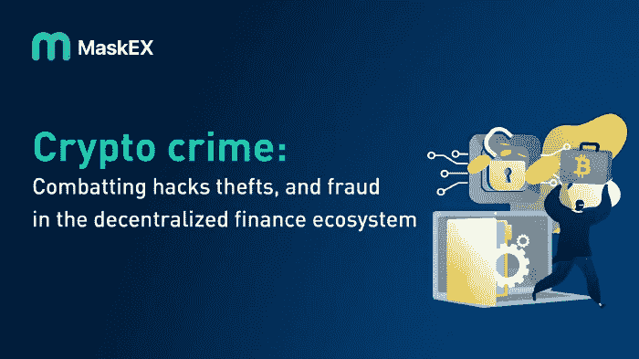

# 秘密犯罪:在分散的金融生态系统中打击黑客、盗窃和欺诈

> 原文：<https://medium.com/coinmonks/crypto-crime-combatting-hacks-thefts-and-fraud-in-the-decentralized-finance-ecosystem-6a93ce62145b?source=collection_archive---------55----------------------->

传统的金融服务通过区块链的 DeFi 项目提供，不需要集中的金融中介。多亏了区块链的智能合约，用户现在可以借贷、兑换加密货币、赚取利息等等。DeFi 项目经常使用开源软件，据估计，这些 DApps 的总价值约为 1042 亿美元。此外，根据 Elliptic 的数据，过去一年，分散交易所(dex)的交易量从每月 180 亿美元增加到 3000 多亿美元。

# 什么是 DeFi？

分散金融(DeFi)是一种新的金融系统，建立在安全分布的分类账之上，可与加密货币使用的分类账相媲美。该系统消除了包括银行在内的金融机构对货币、金融商品和金融服务的权力。

然而，DeFi 是加密货币的狂野西部。在努力使用户能够获得金融服务并消除第三方的同时，由于通过 DeFi 系统的欺诈和盗窃，总共损失了 100 亿美元。这是因为 DeFi 的开放性，一个主要优势，也带来了新的威胁。由于底层技术相对不成熟，黑客能够从用户那里窃取资金，由于流动性资产充足，犯罪分子能够清洗勒索软件和欺诈等犯罪的收益。

# DeFi 的开发

今年，在分散式金融(DeFi)领域，超过 16 亿美元的加密货币被黑客和诈骗从消费者手中夺走，超过了 2020 年和 2021 年的总和。

研究人员警告不要利用经济漏洞，这是一种可以用来获取巨额利润的服务缺陷和代码漏洞，已造成 55 亿美元的损失。

攻击在 4 月份非常普遍，CertiK 记录了 31 个大型实例，平均每天一个。最有价值的是通过闪贷攻击从 Beanstalk Farms 窃取的 1 . 82 亿美元。

CertiK 表示，由于这种利用造成的损失总计 3.014 亿美元，2022 年 4 月“保持了我们有史以来记录的闪贷攻击中最大金额损失的记录。”相比之下，2022 年 1 月、2 月和 3 月的闪贷攻击造成的总损失仅为 670 万美元。

DefiLlama 报告称，由于今年的 DeFi 开采，自 3 月 16 日以来，DeFi 锁定的总价值(TVL)首次低于 2000 亿美元。

# 在分散的金融生态系统中打击黑客、盗窃和欺诈

因为它们不受政府法规的约束，并且可以匿名使用，所以加密资产总是对未经授权的使用开放。然而，由于其透明性和可追溯性，执法部门仍然可以采用经过时间考验的“跟踪金钱”调查程序，通过加密货币交易跟踪犯罪分子，并将他们绳之以法。

当加密资产转移到集中式服务提供商(如交易所)时，这种策略会遇到问题。当这种情况发生时，资金“脱离链条”；加密货币资产被合并或变成其他资产，区块链追踪资金踪迹的能力丧失。因此，执法部门必须依靠这些服务提供商保留的记录来跟踪资金。

大多数司法管辖区要求这些企业保留这些记录，但许多服务提供商仍然没有这样做。因此，这些公司成为犯罪所得加密货币的磁石，并对执法构成严重障碍。相反，DeFi 中的资产不会离开链，并且通常仍然是可追踪的。例如，如果以太被送到一个集中的交易所，然后被转换成硬币，在区块链上所能看到的就是交易所的存款。把这比作在去中心化的平台上把比特币换成以太。以太坊区块链将比特币存入分散的交易所、转换为以太币以及提取以太币的过程公之于众。

这对执法部门来说是一个巨大的好处，如果没有这一点，他们将不得不依赖一个集中的服务提供商为他们提供必要的数据来跟踪现金。虽然有些服务(如分散式 mixer DApps)可能无法提供这种级别的透明度，但 DeFi 通常可以提供更好的可追溯性，执法机构和受监管的金融机构都可以利用这些服务来识别和打击金融欺诈。

> 交易新手？试试[加密交易机器人](/coinmonks/crypto-trading-bot-c2ffce8acb2a)或者[复制交易](/coinmonks/top-10-crypto-copy-trading-platforms-for-beginners-d0c37c7d698c)