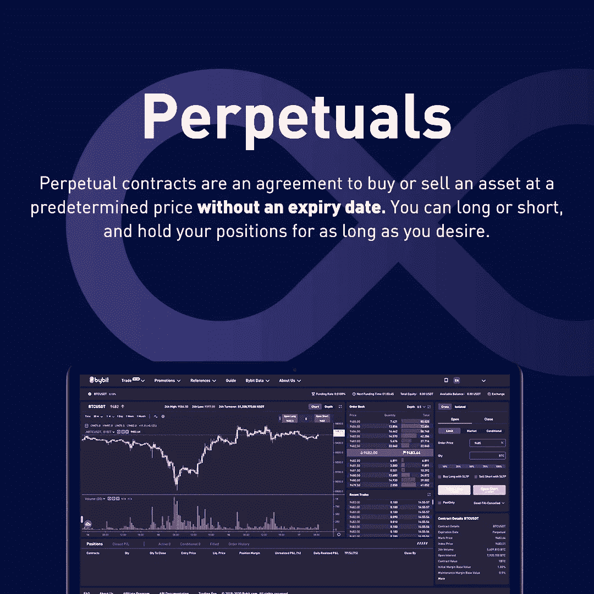
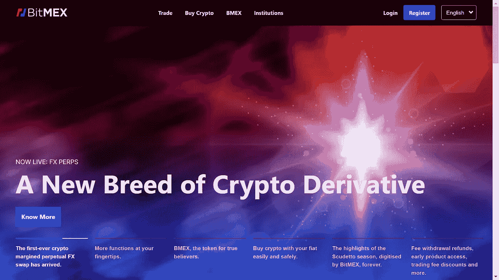
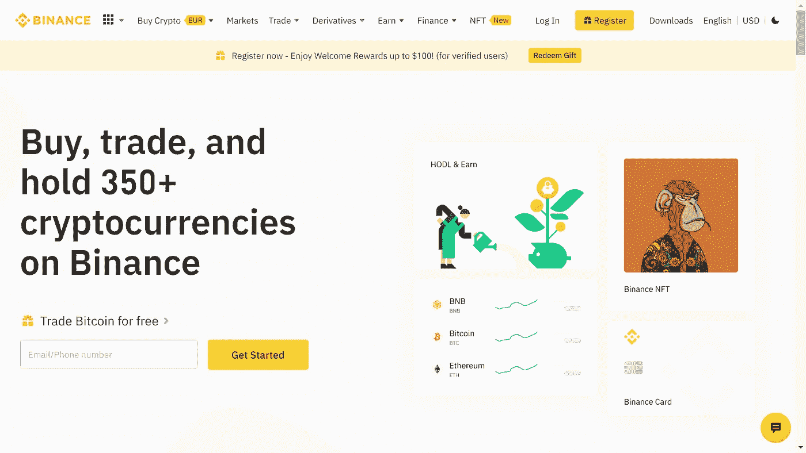
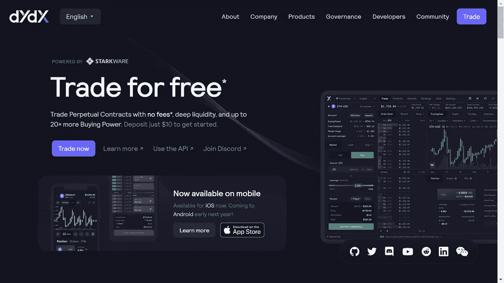

# 加密衍生品:什么是永久合同

> 原文：<https://medium.com/coinmonks/crypto-derivatives-what-are-perpetual-contracts-cde1d9a19185?source=collection_archive---------5----------------------->

## 了解永久合同

Perpetual Contracts

今天，我们将了解什么是**永久合同**，我们为什么使用它们以及它们是如何工作的。所以让我们开始吧！

**永久合同**近年来在加密领域越来越受欢迎，数据显示日交易量超过**1800 亿美元**。它们允许交易者持有**杠杆头寸**而没有**到期日**的负担。与期货不同，由于永久融资利率的原因，永久合同的交易价格接近标的资产的指数价格。

永久掉期交易产品于 2016 年由 crypto exchange **BitMEX** 首次推出。永久掉期为交易者提供了一个机会，让他们可以花很少的钱买入大量加密货币。这种在小运动中赢得大胜利的机会往往会吸引很多人使用它们，但伴随着如此大的回报，也伴随着同样巨大的风险。

在深入探讨永久合约之前，我们将首先讨论加密衍生品。

# 什么是加密衍生品

简单地说，**衍生产品**是任何产品或合同，其价值由基础资产决定。在传统金融市场，衍生品从股票、债券、利率、商品、法定货币和加密货币等资产中获取价值，因此得名。

从买方和卖方签订合同出售基础资产的意义上来说，加密衍生品的工作方式类似于传统衍生品。这种资产在预定的时间和价格出售。因此，衍生品没有内在价值，而是依赖于基础资产的价值。比如一个以太坊的衍生品，依赖于以太坊的价值，并从以太坊的价值中获取价值。

衍生品交易也不持有或拥有基础资产。加密领域最受欢迎的衍生品类型是期货、期权和永久合同。

## 加密期货

期货涉及买卖双方在未来出售资产的协议。具体日期和金额也提前商定。合同细节可能有所不同，但条款通常是相似的。

## 加密选项

期权是另一种类型的衍生合约，允许交易者在未来某个日期以固定价格购买或出售特定商品。然而，与期货不同，期权允许买方选择不购买资产。

# 什么是期货合约？

一份**期货合同**仅仅是双方在一个预先确定的**【期货】**日期以固定价格出售或购买一项资产的协议。想象一下，两个投资者签订了一份基础资产为比特币的合同。一方承诺**以商定的价格出售比特币**，而另一方承诺购买比特币。合同到期时，无论比特币的实际价格如何，双方都必须履行自己的承诺。如果未来价格比最初约定的价格高**多**，卖方输，买方赢。如果价格下降，情况正好相反。

# 什么是永久合同

Perpetuals

永续合约**也称为永续期货合约或永续掉期，是最常见的加密衍生品，尤其是在日间交易者中。永久合约是一种**衍生**产品，类似于传统的**期货合约**(在未来特定时间以预定价格购买或出售商品的协议)。尽管如此，有一个主要的区别:与期货不同，永久合约**没有**到期日**，所以你可以持有一个你喜欢的**长**的头寸。此外，永久合约模仿基于保证金的现货市场(T21 ),交易价格接近指数价格(T23)。这让你可以放大交易的结果。不过，这也意味着商品价格的下降等于你的初始保证金(你作为抵押品提供的总资金的百分比)将自动清算你的股票并平仓。****

# 做多和做空

永久合同是综合交易市场，允许使用稳定的 USDC 抵押品对任意流动资产进行投资。通过交易永续期权，你可以参与市场波动，降低风险，并通过利用期货合约的杠杆做多***或做空*****来获利。**

**你可以在 http://dydx.exchange/用 10 美元开始交易。**

## ****龙****

**通过做多，交易者购买了一份永久合同，并期望基础资产在未来会升值。交易者不是购买并持有标的资产，而是购买该资产的合成敞口。**

## ****短****

**通过做空，交易者卖出了一份永久合同，预期基础资产在未来会贬值。交易员出售的不是基础资产，而是该资产的合成敞口。**

# **交易方向**

**交易永久掉期有两个方向:**

1.  **如果交易者认为资产的价格将会上涨，那么他们就可以建立多头头寸。**
2.  **或者，如果交易者认为资产价格将会下跌，他们可以建立空头头寸。**

# **永久互换是如何运作的？**

**交易者可以通过购买永久掉期并在未来某个时候卖出以获得 T4 利润来做多比特币 T3。例如，Alice 通过存入 80，000 美元作为抵押购买了 2 份 BTC/美元永久掉期。因此，每份 BTC/美元永久掉期合约价值 4 万美元。假设比特币的价格在接下来的一个月稳步上升到 50，000 美元，爱丽丝决定平仓，她将从每笔购买的永久掉期交易中获得 10，000 美元的利润。她的总利润大约是 20，000 美元。**

**利润=永久互换数量*(当前价格-进场价格)**

**利润= 2 *(5 万美元-4 万美元)**

**利润= 20，000 美元**

**值得注意的是，该计算没有考虑融资利率对 Alice 盈利能力的影响。作为交易所试图将永久掉期与比特币现货价格挂钩的一部分，Alice 支付的费用和收到的回扣将决定 Alice 产生的确切数字。**

**此外，爱丽丝还可以利用永久掉期交易者可以利用的杠杆机会来成倍增加利润。要做到这一点，她可以购买价值两倍于她最初保证金的永久合约。采用这种策略，她的头寸规模将是 160，000 美元(或 4 个 BTC/美元永久掉期)，尽管她的抵押品是她交易的永久掉期价值的一半。在这种情况下，Alice 利用了 2 倍杠杆。假设她在每份 BTC/美元永久掉期价格为 50，000 美元时平仓，她的利润大约为 40，000 美元。**

**利润= 4 *(5 万美元-4 万美元)**

**利润= 40，000 美元**

**有趣的是，一些交易所允许交易员使用高达 125 倍的杠杆，以实现利润最大化。然而，正如杠杆放大利润一样，它也会放大亏损。在我们的例子中，如果永久掉期的价格比她购买时的初始价格下跌 50%,使用 2 倍杠杆会使 Alice 面临清算风险。**

**利润= 4 *(2 万美元-4 万美元)**

**损失= 80，000 美元**

**当交易者的未实现损失等于保证金时，交易所自动平仓。因此，抵押品将全部丧失。因此，使用保证金或杠杆交易的风险很大，新手不应该尝试。**

# **永久合同与期货合同**

**考虑这个例子。说你绝对确定比特币的价格会涨。不幸的是，你不知道这样做需要多长时间。如果在你的期货合约到期时价格还没有上涨，你就被一笔糟糕的交易套牢了。然而，有了永久合同，你可以无限期地保住你的职位**。这样，你就能最大限度地增加你成功**的机会。******

# ****什么是永久融资利率？****

******永久融资利率是为永久合同提供价格稳定性的主要机制**。融资利率的作用是激励交易者在价格相对于指数较低时买入永久合约，在价格相对于指数较高时卖出。虽然这听起来相对简单，但融资利率需要精心设计，以保持价格稳定，否则，市场将更容易受到价格偏差的影响，从而增加风险，并可能抑制流动性提供者的积极性。****

****永久融资利率的主要功能是对永久合同和基础资产目标价格之间出现的任何偏差进行估值。长期持续交易高于目标价格意味着对多头头寸的需求增加，持有多头头寸的人将向持有空头头寸的人提供资金。同样，低于目标价格的永久交易表明空头更受欢迎，资金将从空头流向多头。融资利率的大小与永久价格和目标价格之间的偏差大小相关。****

****融资利率的两个主要价格概念是:****

******指数价格:**指数价格是标的资产在多个交易所的平均现货价格。****

******马克·普莱斯:**标示价格是计算融资利率的主要参考点，来源于指数价格，尽管它可能会考虑到到下一次付款之前的时间的衰减基准利率。****

****资金利率计算通常包括两个主要部分:****

******利率:**利率通常是不变的，取决于永续性资产的价值。****

******溢价部分:**溢价部分用于量化永久价格与标记价格之间的偏差。大多数融资利率在计算保费部分时使用时间加权平均值，这使得操纵融资利率更加困难。****

****然后，通过将利率和溢价部分相加来计算总融资利率。****

# ****永久合同的好处****

****永久合同的主要好处是你可以无限期地持有它们。没有到期日或执行日意味着即使价格对你的头寸不利，你也不会马上被亏损的交易套牢。相反，只要你有足够的资金维持你的头寸，你就可以继续持有，直到价格再次对你有利。****

# ****永久合同的风险****

****尽管交易永久掉期合约风险很高，但它们很有吸引力，因为它们允许交易员不受时间限制地投机数字资产的短期或长期价格走势。即使加密货币价格下跌，也有可能产生利润，这也是永久互换的额外优势之一。****

****尽管如此，建议交易者在对加密货币进行任何投资之前，应该始终进行自己的尽职调查，并向金融顾问寻求专业建议。当交易永久掉期合约时，交易者可能会损失全部投资资本——尤其是在使用杠杆的情况下。****

# ****交易所提供加密的永久合同****

****最早提供加密永久合约的交易所之一是 T2 的 BitMEX T3。因此，许多紧随其后的交易所从 BitMEX 的设计中获得了融资利率，并加入了自己的调整。交易所之间的永久合约市场和融资利率可能在保证金金额、融资间隔、更新间隔、指数和标记价格计算、利率等方面有所不同。****

# ****比特梅克斯****

********

****[https://www.bitmex.com/](https://www.bitmex.com/)****

****BitMEX 目前提供 BTC/美元、ETH/美元和 XRP/美元的永久合约，可以以高达 100 倍的杠杆进行交易。资金费率每 8 小时在 UTC 时间的 4:00、12:00 和 20:00 应用一次，用户仅在这些时间持有头寸时支付或接收资金。每个用户的资金数额根据头寸大小线性调整，由以下等式表示:****

*******资助=职位价值*资助率*******

****如上文所述，融资利率由利率和溢价指数组成。利率来源于基础货币和永续债券所基于的市场货币对的报价货币之间的借款利率差(例如 BTC 和美元借款利率)。溢价指数的计算公式如下:****

*******溢价指数(P) = (Max(0，冲击买入价—马克·普莱斯)— Max(0，马克·普莱斯—冲击卖出价))/现货价+马克·普莱斯使用的公平基础*******

****该等式表明，溢价指数取决于标记价格与影响买卖价格之间的差异，影响买卖价格是将订单簿的买卖双方结算指定金额所需的价格。****

****BitMEX 每分钟计算利率和溢价指数，然后对分钟利率进行 8 小时时间加权平均，以计算融资利率。但是，如果利率和溢价指数相差小于 0.05%，溢价指数将被归零，融资利率将等于利率。在给定的 8 小时窗口内，当永久价格与标记价格足够接近时，就会出现这种情况。****

# ****币安****

********

****[https://www.binance.com/en](https://www.binance.com/en)****

****币安提供 BTC/美元、瑞士联邦理工学院/美元和 BCH/美元的永久合约，BTC 的杠杆高达 125 倍，瑞士联邦理工学院和 BCH 高达 75 倍。币安的永久融资利率类似于 BitMEX，只是它在计算溢价指数时不使用融资基础。这意味着在每个融资窗口中，融资利率都是从零开始计算的，与之前的利率无关。****

# ****dYdX****

********

****[https://dydx.exchange/](https://dydx.exchange/)****

****dYdX 于 2020 年 5 月与 BTC/USDC 永久合约一起上线，创造了首批非托管永久市场之一。资金由智能合约持有，而不是由集中的一方持有，MakerDAO 被用作价格反馈 oracle。dYdX 的永久市场设计借鉴了 BitMEX，但也有自己明显的不同之处。****

****通过使用智能合约每秒计算和应用资金，资金利率每小时更新一次。持续融资的目标是保持永久和尽可能接近的价格，避免在其他融资利率设计中随着时间的推移而积累的融资基础。dYdX 使用时间加权影响价格计算溢价指数，并应用每天 0.03%的恒定利率。****

*****注意:还有许多其他交易所提供加密货币对的永久合约，包括 ByBit、OKEx、FTX、北海巨妖、Futureswap 和 MCDEX 等。*****

# ****包裹****

****在本文中，我们对 crypto 中的永久契约有了基本的了解。继续阅读更多与区块链相关的故事。****

## ****与我保持联系！👋****

****穆罕默德·沙赫扎德
——[***瑞尼思科技***](https://medium.com/u/8721a6090e85?source=post_page-----cde1d9a19185--------------------------------) 的技术副总裁****

******领英**https://www.linkedin.com/in/ishanshahzad/▶️****

> ****交易新手？尝试[加密交易机器人](/coinmonks/crypto-trading-bot-c2ffce8acb2a)或[复制交易](/coinmonks/top-10-crypto-copy-trading-platforms-for-beginners-d0c37c7d698c)****