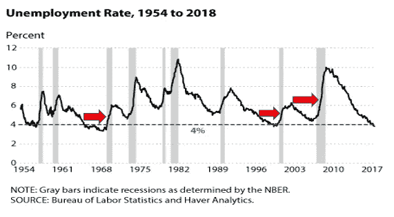
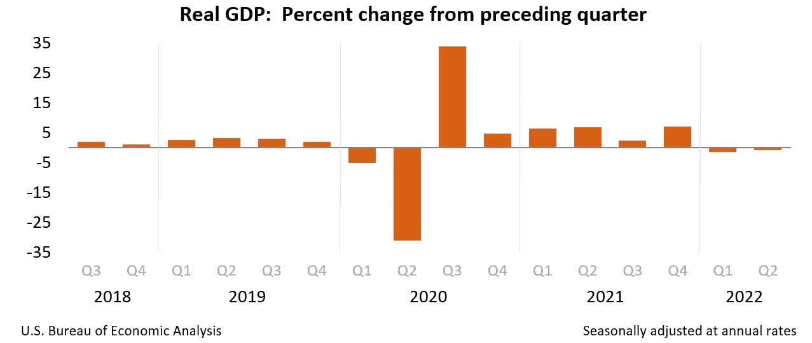
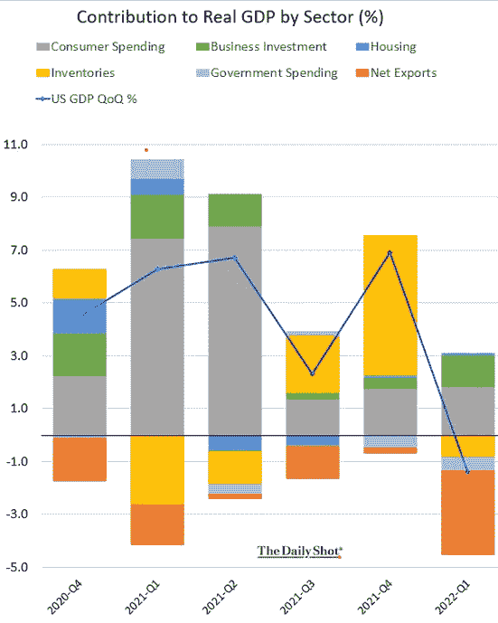
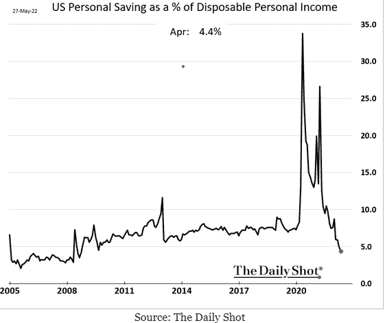
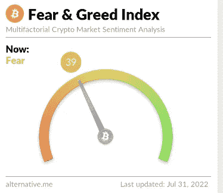
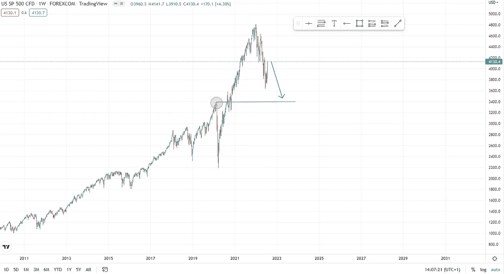
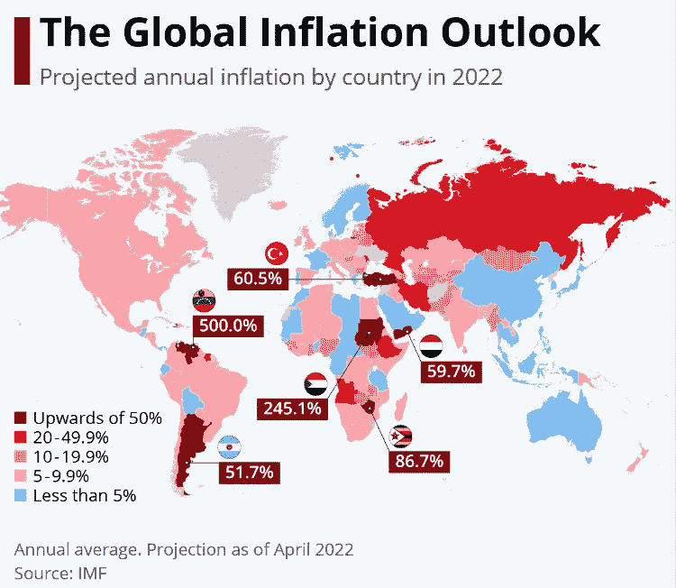

# Crypto 进入第一次衰退。结束了吗？

> 原文：<https://medium.com/coinmonks/crypto-entering-the-first-recession-366f7426e774?source=collection_archive---------20----------------------->

在 FOMC 会议和第二季度 GDP 发布后，市场经历了疯狂而忙碌的一周。根据投资者的预期，美联储将利率提高了 0.75 % 个百分点，这在市场上引起了宽慰的反弹。标准普尔 500 指数以惊人的上涨收盘，本周上涨 4.26 %，纳斯达克上涨 4.70 %，比特币表现更好，收盘上涨 8.63 %。美联储表示，根据即将公布的数据，他们对未来加息的指导具有灵活性，这在某种程度上安抚了市场，并注入了一些多巴胺，同时表示他们致力于抗击通胀，如果通胀继续走高，他们将更加积极地加息。

似乎大多数投资者都押注杰罗姆·鲍威尔(Jerome Powell)愿意在通胀数据略微下降和其他经济数据可能恶化时停止加息。失业率仍然很高，然而正如许多人指出的那样，美国过去经历的每次衰退都是低失业率，如下图所示，失业水平在此后不久急剧上升。因此，在连续两个季度 GDP 为负后，美联储对强劲就业的评论以及美国尚未陷入衰退对我来说没有太大意义。是的，这可能是一次轻微的衰退，但仍算一次，不需要来自[白宫](https://www.whitehouse.gov/cea/written-materials/2022/07/21/how-do-economists-determine-whether-the-economy-is-in-a-recession/)的其他解释。

Unemployment levels sharply rises each time the US enters a recession

从百分比来看，美国两个季度的 GDP 都比上一季度有所下降，消费者信心和支出都呈下降趋势，消费者储蓄占可支配收入的比例跌至悬崖，达到 2008 年以来的最低水平。

US-GDP readings visits negative territory for two consecutive quarters

甚至在去年，消费者支出也维持了美国经济的发展，没有进入衰退。由于消费几乎占美国经济的 70%,看下面的图表，美国经济的实力开始动摇，这与杰罗姆·鲍威尔的说法相反。

Consumer spending

US personal savings reached levels not seen in the last 14 years

根据目前可获得的数据和黯淡的经济前景，我认为牛市不会回来。我们有一个很好的反弹，但熊市是出了名的，它会让许多上涨的人感到惊讶，并让你的希望受到抑制，可能会欺骗你，让你迅速跳上火车。这并不是说你不能在交易中短期的时候获得收益。当然，你可以在熊市反弹中获得巨大收益，因为以太坊从 6 月 18 日的低点上涨了 100%，其他大型股也获得了类似的收益。相反，对于牛市来说也是如此，当大部分时间市场上涨时，对坏消息的反应会导致快速和显著的下跌，并且在反弹恢复后不久。

总之，夏季的最后一个月 8 月是一个更加平静的时期，因为机构投资者和交易员都去度假了，美联储也休息了一段时间，9 月份大家都回来了，届时我们对宏观经济前景有了更多的了解，焰火可能会再次开始。作为上次美联储会议的结果，其余投资者更加积极，整个 8 月份所有市场都可以看到进一步的上涨。

恐惧和贪婪指数慢慢接近中性水平，表明美联储决定后的乐观情绪。

从 9 月份开始，我预计会再次下跌，届时我们可能会再次创下新低，这可能标志着加密领域的投降时刻，届时剩下的没有经验的投资者会离开，失去希望，并把这个行业称为一个彻头彻尾的骗局，这可能会与标准普尔 500 重新回到新冠肺炎之前的高点相吻合。当加密空间慢慢找到自己的交易方式时，这也可能是脱钩的时刻。

S&P 500 still over extended when we zoom out for the last 12 years

自 2008 年以来，每当市场出现问题时，美联储总是能够用 QE 来刺激经济。这一次是不同的，因为全球通货膨胀非常严重，一些国家已经经历了恶性通货膨胀，除非美国希望实现类似的结果。

这种通胀前景确实令我担忧，并突显了保护自己免受通胀影响的重要性。我们每个人都必须做出决定，要么是硬资产，要么是黄金或比特币。如果你缩小范围，检查比特币的表现，因为他的存在无疑发挥了数字黄金的作用，表现优于其他所有资产。许多批评者在反对比特币作为通胀对冲工具/数字黄金时，指的是短期，或者他们生活在一个货币稳定、经济发达的国家。但如果你从不同的角度来解决这个问题，也许生活在上图中突出显示的国家的人，他们对比特币的看法可能会完全不同。所以下次当你听到这个问题时，比特币正在履行数字黄金的角色吗？你问你指的是哪个国家，在什么时间范围内？

大家周日快乐！！如果你分享这篇文章，我会非常感激，并鼓励我写更多。

免责声明:我必须警告你，有些观点可能是我个人的偏见，但是，我会尽我所能为你提供关于特定主题的客观观点。我不是理财顾问，所有文章只会有严格的教育目的。

> *交易新手？试试* [*密码交易机器人*](/coinmonks/crypto-trading-bot-c2ffce8acb2a) *或* [*复制交易*](/coinmonks/top-10-crypto-copy-trading-platforms-for-beginners-d0c37c7d698c)