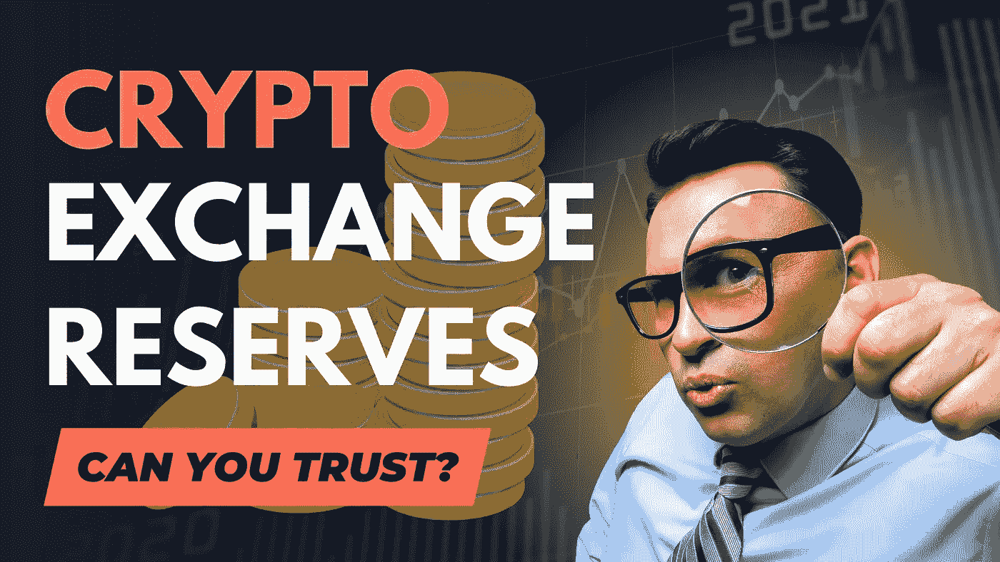

# 密码交易所暴露了他们的储备。你能信任他们吗？

> 原文：<https://medium.com/coinmonks/crypto-exchanges-reveal-their-reserves-can-you-trust-them-6ae195a1c017?source=collection_archive---------3----------------------->

FTX 崩盘后，许多加密交易所引入了储备证明，以获得用户的更多信任。在这篇文章中，我将告诉你要注意什么。

## 🧾 **什么是外汇储备凭证？**

据[财经日报](https://cointelegraph.com/news/proof-of-reserves-can-reserve-audits-avoid-another-ftx-like-moment),*储量证明(PoR)是由第三方*进行的独立审计…