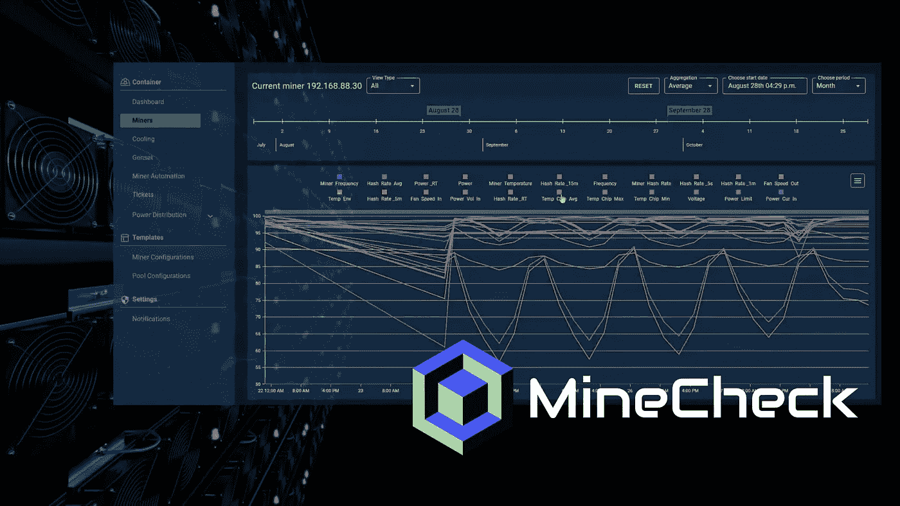

# Crypto Expert 构建挖掘软件来支持挖掘操作

> 原文：<https://medium.com/coinmonks/crypto-expert-builds-mining-software-to-support-mining-operations-14581fe0b5b2?source=collection_archive---------20----------------------->

*在挖掘了价值数百万美元的加密货币后，Kyle Sidles 开发了自动部署、配置和实时监控环境的软件*

加密货币矿工对逆境并不陌生。从在婴儿期追求被称为“短暂时尚”的东西而饱受批评，到在 2021 年[中国禁令](https://www.coindesk.com/learn/china-crypto-bans-a-complete-history/)后被迫寻找新家，再到今年早些时候陷入哈萨克斯坦[政治危机](https://www.coindesk.com/business/2022/01/06/kazakhstans-hashrate-drops-as-internet-blackout-persists-amid-nationwide-protests/)，他们一次又一次地证明，如果没有弹性，他们什么都不是——并将继续寻找创新的方法。

Kyle Sidles 可以证明这一点，自 2013 年进入该行业以来，他已经开采了价值数百万美元的加密货币，并经受住了 2014 年、2017 年和 2021 年的市场崩溃(更不用说今年的动荡)。

他第一次了解比特币是在住在佛罗里达州构建基于网络的应用程序时。他的一个朋友告诉他，人们在“丝绸之路”上使用比特币作为支付机制，这个数字黑市平台后来被关闭了。“人们用他们的电脑制造比特币，它取代了货币，”Sidles 回忆他的朋友说。

出于天生的好奇，他开始研究比特币及其价格。“当时，它是 100 美元一枚硬币，所以我开始研究如何开采它，”Sidles 说。“就在 ASICs 上市的时候，我花了几千美元买了一台这样的机器来验证这个想法。”

你瞧，他把它连接到一个采矿池，它开始制造比特币，然后比特币被存入他的比特币基地账户。但直到他去用美元出售一些比特币，Sidles 才意识到它的潜力。“两天后，钱到了我的账户上。我只记得对自己说，‘哇，这是真的，真的有效。’"

# **采矿百万**

从此，Sidles 开始购买越来越多的硬件。“这是在繁荣发生之前，所以仍然有设备可用，”他说。“我以 7000 至 8000 美元的价格购买了一台机器，在开采了相当一段时间后，8 个月后以 3 万美元的价格出售了它。”

Sidles 解释说，在此期间，他通过自学获得了很多知识，让自己完全沉浸在区块链技术中。“这真的是一个机会，我花了很多时间钻研这项技术是什么，它是如何工作的，我对它了解得越多，它就越有意义，”他说。

在 2014 年的价格暴跌导致许多矿商破产后，Sidles 决定，如果他想留在这个行业，唯一的办法就是获得廉价电力的竞争优势。“所以，我们搬到了华盛顿，”他说。“当时，那里的电价约为每千瓦时 2.5 美分，而佛罗里达州为每千瓦时 9 美分。”

Sidles 开始与 MegaBigPower 合作，该公司一度是世界上最大的矿业公司之一，开发他们自己的 ASIC 硬件。他最终被招募成为 Giga Watt 的首席技术官，Giga Watt 是一家建设基础设施的 ICO，因此人们可以使用他们购买的令牌以成本价为自己的采矿硬件获得电力，或者将他们的空间出租给其他矿工。

“当我第一次去华盛顿时，我正在做一个改造一些存储单元的小操作，一个 300 千瓦的旧汽车修理厂，一个相对较小的操作，”Sidles 说。“但我雇了一些电工来做建筑的电气部分，当他们看到我正在做的事情时，他们表示有兴趣参与进来并联手合作，所以我们从头开始设计了多个采矿作业-从电气到冷却、网络、布局、机架，基本上一应俱全，在整个华盛顿建造了几兆瓦的电力。”

# **旋转到软件**

随着事情的发展，他们开始遇到来自管理大规模采矿业务的无数挑战，Sidles 有了一个想法:如果他用他从采矿中获得的所有经验来开发矿工软件会怎么样？他一直在寻找一些不同的软件供应商，但注意到他们对采矿环境并不特别友好。

“当我们真正开始扩展到超过 1 或 2 兆瓦时，很明显没有现成的软件可以完成管理企业级采矿作业所需的工作，”Sidles 说。当时，是人工登录矿工并对其进行配置，或者使用一些第三方来配置池，但他们的能力有限

“最终，我意识到，完全专注于构建软件比试图建立全面的采矿业务更有意义，尤其是在大量资本进入市场的情况下。”

所以，这正是他所做的。2020 年，Sidles 推出了 [Minecheck](https://www.minecheck.com/) ，这是一款针对加密货币采矿业的专有软件解决方案。Sidles 将他在加密货币时代之前开发基于网络的应用程序的经验与他从实际采矿经验中获得的见解相结合，创建了一个软件解决方案，该解决方案被证明可以提高采矿运营团队的效率并降低成本。

鉴于他在小规模和大规模挖掘价值数百万美元的加密货币的经验，他理解挖掘的细微差别和复杂性，只有那些有经验的人才能从中受益。换句话说，他知道软件需要做什么才能有效。

“矿工比传统计算机更挑剔，所以他们更容易失败，”他说。“如果没有能够随时感知所有不同设备及其状态的软件，就很容易忽略一些性能不佳或出现故障的设备。如果您没有一个能够知道设备在数据中心中的位置的系统，那么您可能会看到矿工倒下了，但是如果您有一个装满数百或数千矿工的机架，您就没有办法找到它。”

Minecheck 的软件通过实时自动部署、配置和监控矿工来解决这一问题，使团队能够采取迅速、适当的行动，以确保一个功能齐全、优化的环境。

“该软件旨在尽可能消除人为因素，”他说。“它在部署和配置矿井方面创造了全新的自主水平，然后随着时间的推移对其进行监控并向用户发出问题警报。”

事实上，该软件提供了从机器上收集的大量有价值的数据，并反馈给所有者、投资者、经营者等。以及时、高效的方式。Minecheck 还解决了安全问题，确保只有特定人员被允许与矿工互动，以防止池配置被更改为其他人的池。

“我在 10 年左右的采矿过程中学到的所有这些小教训都是在开发这个软件的过程中经过深思熟虑的，”他说。“这最终是为了减少开销和人员，并提高发现和响应问题的效率。”

Minechek 的有效性不言而喻:该软件已被证明可将设施的运营费用降低高达 68%。

虽然存在其他采矿软件，但 Sidles 解释说，大多数都是为了与设备进行交互。“他们没有数据中心基础设施管理组件，这是专为管理数据中心而设计的软件，”他说。“Minecheck 将人们在开发采矿软件方面所做的正确事情与专门针对采矿的企业级数据中心基础设施管理包相结合。”

他补充说:“它更像是一个操作软件，与服务器、票务系统、布局、定位等接口。”

# **采矿的未来**

对具有 Minecheck 功能的软件的需求只会增加，尤其是随着更多大规模采矿作业的出现。

Sidles 说:“我认为，与三到五年前相比，现在的趋势是大规模运营资金充足的大型业务，而在三至五年前，更多的是业余爱好者自己筹集资金。”。“你现在开始看到的基本上是数亿美元的大型基金，如果不是更多的话，要么是公开交易，要么是某种形式的融资。”

也许这就是为什么 Sidles 对整个矿业的未来如此乐观。“现在有一场正在进行的辩论，因为很多人对比特币持否定态度，”他说。“他们看着采矿，认为这很愚蠢，或者认为这只是浪费电力，而实际上，这是运行比特币这样的去中心化系统最透明的方式。”

Sidles 还警告那些认为比特币增长不够快或不支持足够交易的人。“这就是它的伟大之处，”他说。“它没有改变或完全改变最初设计的方式。今天，它的工作方式几乎与最初设计时一模一样。因此，它的采矿方面有助于控制所有这些事情。我认为闪电等第二层解决方案最终将缓解交易吞吐量的问题，反对者认为这是比特币与传统支付处理器相比的一个主要劣势。”

他说，思考采矿的一种方式是用蛮力。“当我们谈论保护我们的实物资产时，通常在历史上，谁拥有最大的力量，谁就是胜利者，”他解释说。

“从采矿的角度来看，比特币是一种资产，这个地理上分散的网络由多个国家组成，每个国家都有多家公司在运营。分散的分布确保了网络不仅是安全的，而且是合法的。这就是比特币挖矿的字面意思，它是一种暴力保护的形式。”

> 交易新手？试试[加密交易机器人](/coinmonks/crypto-trading-bot-c2ffce8acb2a)或者[复制交易](/coinmonks/top-10-crypto-copy-trading-platforms-for-beginners-d0c37c7d698c)