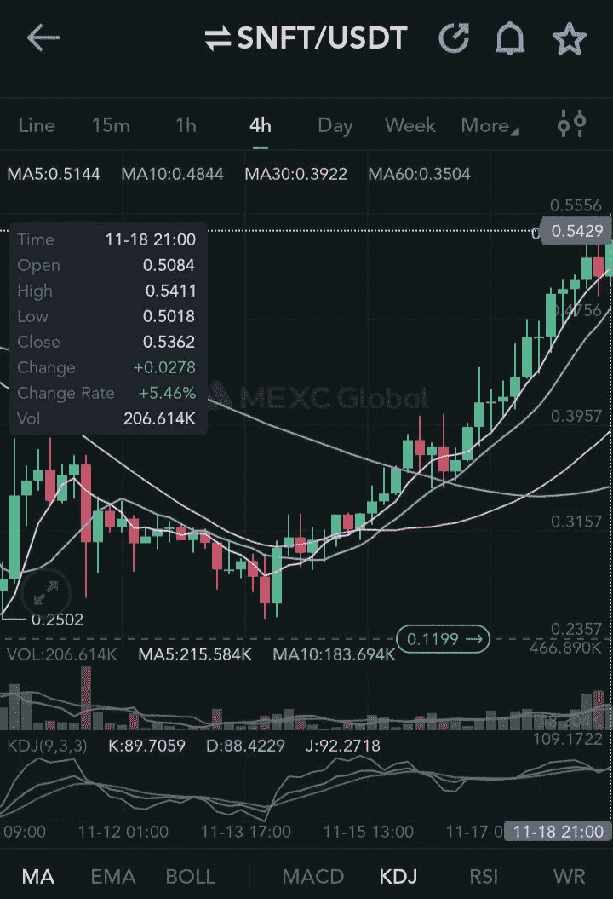

# 球场上球迷代币市场分析。

> 原文：<https://medium.com/coinmonks/crypto-fan-tokens-market-analysis-on-the-pitch-dbc7d95b0218?source=collection_archive---------11----------------------->

2022 年世界杯国际足联锦标赛正在全力进行中。这影响了最近几天的 Fantoken 价格波动。虽然持有球迷代币的主要目的是提供支持和加强球迷与他们选择的球队的关系，但一些球迷也从这些球迷代币的波动中获得好处。

Image designed by the author

# 什么是 Fantoken？

**球迷代币是一种加密货币，允许持有者独家使用体育俱乐部提供的一些服务。球迷代币的持有者可以获得与球迷相关的优势，如对俱乐部决策投票、赚取一定的奖励、参与俱乐部套件设计、参与激励性消息和庆祝歌曲、参与商品设计等。**运动队组织铸造大量可替换代币，然后分发给或出售给粉丝。粉丝们通过二级[市场](/me/stories/public)如 [MEXC](https://m.mexc.com/auth/signup?inviteCode=1Wi6t) 、币安等获得这些可替代代币，就像巨大的比特币和以太坊一样。

# **粉丝代币经济**

粉丝代币对某些人、组织和国家来说是合法且有利可图的收入来源。仅在 2022 年 3 月，足球迷代币就创造了 35 亿美元的销售额。与此同时，整体 Fan Token 经历了 46%的年同比价格飙升，使全球销售额达到约[23 亿美元](https://beincrypto.com/global-sales-of-fan-tokens-up-1-9b-hitting-2022-high/)的近似值。自 2022 年 1 月以来，粉丝代币的销量增长了约 204%，2022 年 3 月出现了峰值。在 5 月份 crypto 崩溃之前，Fan token 的交易量达到了一个新的里程碑，约为 95 亿美元。在此期间，以太坊也能够在不幸的月神紧缩之前满足其历史最高价格。

[MEXC 加密货币交易所](https://m.mexc.com/auth/signup?inviteCode=1Wi6t)拥有最全的球迷代币，从国家队到俱乐部球迷代币都有。而币安则有粉丝代币发行平台。墨西哥湾和币安都推出了球迷代币专区，球迷代币数量，以及最高涨幅汇总。

在世界杯预选赛中，球迷代币的总市值跃升至约 4.01 亿美元。这是在价格回升前几天接近 x2 的价格。但根据 Coingecko 的数据，市场波动已导致其价值跌破 3 亿美元。在 2022 年国际足联世界杯之前，用户购买用于交易各自球迷代币的社交链接代币 chiliz 在 11 月初创下了 7 个月来的新高。

Spotzchain 首席执行官 Siddhart Jaiswal 在他的一次演讲中说，购买球迷纪念品不应该只是为了赚钱，而是应该作为对喜爱球队的支持。但尽管市场动荡，一些持有者仍然看好他们各自的粉丝代币。

# **粉丝令牌类型**

**球迷代币的类型遍布球迷代币发行平台(如 CHZ、BITCI)、国家足球联盟(如 BFT、SNFT、ARG、POR、ITA)、俱乐部球迷代币(即 CITY 等)。球迷代币的范围从足球到 NPL 和板球。Fan token 授予持有者有限的治理权。例如，PSG(巴黎圣日耳曼队的球迷令牌)允许持有者享受独家 VIP 体验，并在 FIFA 2022 球迷版的封面上投票。**

chi Liz/social . com 和 BitCi platform 与国家队合作发行了官方粉丝代币，分别为$CHZ 和$BITCI。

Chiliz 平台提供体育设置和娱乐实体以及基于区块链的工具，以帮助吸引和货币化他们的观众。奇里兹的热门客户包括阿森纳、巴塞罗那和尤文图斯。

奇里兹在奇里兹区块链上为阿根廷发行了$ARG，为葡萄牙发行了$POR 等官方代币。阿根廷和葡萄牙目前在国际足联冠军预测中分别排名第二和第八。这两个国家由两个受欢迎的世界最佳足球运动员代表，使得$ARG 和$POR 获得更多的受欢迎程度，甚至影响了它们的价格。也被称为 Chiliz 的 CHZ 令牌是 socio.com 平台的 ERC 20 原生数字资产。这种粉丝令牌是市值最高的 50 种加密货币之一，用于粉丝令牌的发行和交易。CHZ 粉丝令牌于 2018 年底在以太坊网络上推出。

Bitci 平台正在开发区块链解决方案，包括交易平台、钱包、支付等。Bitci 与国家队合作发行球迷代币，特别是在 bitci 区块链上为巴西发行的$BFT 和为西班牙发行的$SNFT。巴西现在被预测会赢得世界杯，而西班牙在名单上排名第五。这家土耳其公司的本地令牌是$BITCI。虽然比奇区块链不如奇里兹的巴西足球标志(BFT)受欢迎，但 SNFT 更有可能赢得正在进行的国际足联。此外，Chiliz 和 Bitci 还为巴塞罗那的$BAR、曼城的$CITY、阿森纳的$ AFC($ AFC)等著名俱乐部发行了球迷代币。

## **巴西国家队球迷 Token (BFT)价格预测**

BFT 是一名国足球迷，在 Bitci、CoinEx、MEXC 和 BitMart 等加密货币交易所以高流动性信心和高交易量积极交易。从这个密码交易所来看，只有 CoinEX 和 MEXC 值得商榷。截至 2022 年 11 月 29 日，BFT 的交易量在 CoinEx 上约为 21，6665.40 美元，在 MEXC 上约为 192，671.50 美元。巴西国家队球迷代币在 MEXC 加密货币交易所的流动性高，交易量大。一周前，巴西国家足球队球迷 Token (BFT)的交易价格为 0.6582 美元，24 小时涨幅为 19.31%，市值约为 1970 万美元。由于这一粉丝令牌的抛售压力，根据 MEXC 交易所市场，截至 2022 年 11 月 30 日 5:56 UTC 的价格为 0.2334 美元。这相当于 24 小时内下跌了约 10.54%。粉丝代币市场现在很不稳定。2022 年 12 月 12 日，BFT 价格飙升至 0.2649 美元。价格变化幅度约为+5.54%。

CoinArbitrageBot 的历史价格数据分析预测，到 2023 年底，巴西国家足球队球迷代币价格将达到 0.83827 美元。整整一年后，BFT 价格可能高达 5.6432 美元，低至 0.37864 美元。该预测进一步指出，BFT 价格可能分别在 2024 年底和 2025 年底飙升至 1.5597 美元和 2.5237 美元。

## **西班牙国家足球队球迷代币(SNFT)**

大约两周前，SNFT 在 24 小时内经历了约 5.46%的价格飙升。在 FIFA 世界杯之前，SNFT 的交易价格为 0.5411 美元。

在 FIFA 期间，$SNFT 经历了一些抛售压力，导致价格下跌。后来，价格再次回升约 15.17%，交易价格为 0.3595 美元。

一个多星期前，SNFT 在 24 小时内暴涨 3.41%。当时$SNFT 的交易价格为 0.2954 美元。根据这一价格数据，CoinDataFlow 预测，如果$SNFT 遵循社交媒体增长和比特币增长模式，投资者可以获得不错的投资回报。根据墨西哥交易所 2022 年 11 月 30 日的数据，美元 SNFT 的当前价格在世界协调时 4:01 时为 0.1184 美元。价格变动幅度为-6.33%。

利用历史数据作为关键的观察因素，CoinArbitrageBot 预测 SNFT 价格将在 2023 年底达到 0.4141 美元。因此，一年后，SNFT 可能会升至 0.4763 美元。未来三年，SNFT 价格最高可能达到 2.7877 美元，最低可能为 0.1814 美元。预计 2024 年和 2025 年的 SNFT 将分别达到 0.77052 美元和 1.2467 美元。

进一步的研究指出，SNFT 在 MEXC 加密货币交易所的交易量高达约 150，726.00 美元。MEXC 具有高流动性，被视为$SNFT 强烈推荐的市场之一。

## **阿根廷足协球迷令牌(ARG)价格预测**

自从 ARG 在 Coinmarketcap 上市以来，它在 6 个月前开始了飙升的冒险，从 5 月到 11 月的价格涨幅估计约为 1156.14%。最近 6 个月 ARG 上涨 1158.14%。根据墨西哥期货交易所的价格图表，ARG 在 2022 年 11 月 18 日的交易价格为 9.177 美元。国际足联世界杯前价格暴涨 4.38%。这是受国际足联即将到来的积极氛围和围绕阿根廷世界最佳球队的猜测的影响。

在世界杯期间，价格经历了一些下跌，直到后来在 2022 年 11 月 22 日飙升至 7.515 美元，24 小时价格变化为+4.14%。

根据 MEXC 的数据，ARG 目前为 3.670 美元，自过去 24 小时以来上涨了+2.5%。目前的统计预测表明，阿根廷国债前景乐观，未来可能会呈积极趋势。这是根据钱包投资人 AI 分析师预测。coinArbitrageBot 使用历史数据预测 ARG 价格估计分别在 2023 年底、2024 年底和 2025 年底达到约 5.6195 美元、10.9180 美元和 17.6537 美元。ARG 在 MEXC、BingX、Poloniex、ZT、Bitget、BitMart 和 gate.io 上交易活跃。ARG 的最高交易量为 404，075.00 美元，这是为 MEXC 记录的。第二高的成交量是 194，842.14，是从 BingX 记录的。因此，MEXC 交易所是 ARG 粉丝代币的热门市场。查看粉丝代币流动性的最佳加密交易所[此处](/me/stories/public)

## **葡萄牙国家队球迷令牌(POR)价格预测**

截至 2022 年 11 月 30 日世界协调时 4:40，葡萄牙国家队球迷代币交易价格为 3.3 美元，24 小时涨幅+2.175%，交易量为 1005.6 亿美元。**POR 的价格受到当前正在进行的 FIFA 的影响。目前，POR 的市值约为 8938.5 亿美元。一个多星期前，POR 的交易价格为 4.85 美元，24 小时涨幅为 0.34%，交易量为 6，251，971.27 美元。POR 当时的市值为 19，461，904.65 美元。**

****

**因此，根据 POR 的历史数据，一年后的价格估计值预计将达到约 5.67757 美元。葡萄牙国家队球迷代币的最高价格在未来 3 年内可能会达到 33.2357 美元。POR price 预计到 2024 年将赚到约 0.18631 美元，到 2025 年底将赚到 14.8634 美元。钱包投资者 AI 分析师总结说，POR 前景乐观，未来将出现积极趋势。这说明 FIFA 世界杯是推动 POR 价格的众多因素之一。即使在世界杯锦标赛之后，这枚硬币也有充分的潜力。根据一项深入的研究，4 家交易所正在积极交易美元 POR，其中包括 MEXC，其 POR 交易量高达约 168，659.89 美元。**

## ****意大利国家足球队球迷令牌(ITA)****

**ITA 是意大利足协的球迷代币。ITA 目前的交易价格为 1.5272 美元。根据 MEXC 的分析，价格在最后 24 小时内飙升了+6.96%，交易量约为 44.779K。墨西哥交易所是粉丝代币的顶级市场。在此检查您的数字资产[的加密交换流动性。](/me/stories/public)**

## ****俱乐部粉丝令牌****

**一些世界知名足球俱乐部发行了 socio.com 支持的代币。这些代币包括巴黎圣日耳曼、曼城、国际米兰和马德里竞技，这些代币连同阿根廷和葡萄牙国家队的总市值约为 700 万美元至 2100 万美元。一周前，CITY fan token 的交易价格为 4.22 美元，24 小时价格变化约为-1.22%。历史数据分析估计，曼城球迷代币在未来一年将价值约 10.2983 美元。美元城市价格可能在 2024 年底和 2025 年底分别达到 18.3289 美元和 29.6562 美元。**

# ****后世界杯时代，球迷代币会发生什么变化？****

**区块链在世界体育中的潜力是显著的。所以， **web3 电竞** [**将成为本次 FIFA 锦标赛**之后全面大众化的工具](https://dappradar.com/blog/sports-report-fifa-world-cup-introduces-web3-to-5-billion-people) **。自 11 月秋季以来，世界的注意力一直集中在正在进行的国际足联世界杯上。本届世界杯被视为一个重大的全球现象，所有民族、种族、意识形态和宗教聚集在一起庆祝共同的利益。这一事件吸引了全世界数十亿人的关注。在上一个国际足联版本(FIFA 2018)中，我们在全球范围内拥有约 35 亿观众。这一数字预计将在本届国际足联期间激增。这一数字预计将在今年激增，因为 web3 将通过广告、赞助和互动体验与世界上一半以上的人口联系在一起。这对每个人来说都将是一个全球标志性的时刻！****

**在本届 FIFA 2022 中，足球迷将获得一种混合体验，包括 NFT 拍卖会和参与者在克罗诺区块链上创建他们的 NFT 的能力。 [**阿尔格兰德**](https://dappradar.com/rankings/protocol/algorand) **于 2022 年初成为国际足联的区块链官方合作伙伴，2022 年末，国际足联推出了其首个 NFT 市场，被称为 FIFA+collect** 。这将允许足球迷拥有他们的数字收藏品，代表 2022 年国际足联世界杯历史上的一个标志性时刻。不仅如此，我们还有一些第二层的区块链也为正在进行的世界杯签署了赞助协议。这些都可以让粉丝代币好好努力，将来成为正规的热币。这将为更多的 web 3 产品发布打开空间，包括更多的粉丝令牌、NFT 等等。**

# **最后的想法和总结**

****在过去的几十年里，通过引入高端技术，体育行业经历了巨大的发展。**然而，区块链创新将改变传统的体育模式，并带来一种新的方式(即球迷代币等)将球迷基础与他们喜爱的球队和球员联系起来。区块链在世界体育运动中的潜力是巨大的，当更多的人被允许通过球迷代币与他们喜爱的俱乐部互动时，这可以导致进一步的全球大规模采用。这给了人们更多的归属感，并将代币持有者与现实生活中的效用联系起来。**

**在上届世界杯中，不可能拥有标志性的镜头，通过球迷代币和 NFT 将人们对体育的兴趣与 NFL、NBA 和 MLB 联系起来。通过 web3，2022 年世界杯被带到了一个更迷人的水平，这促进了球员和球迷的经济。**

# **关于作者**

***Ojeniyi Rashidat Ayobami 是一名 web3 和区块链内容作家、开发人员、图形设计师和视频营销人员。她是一名经验丰富的加密货币交易员，拥有五年的交易经验。你可以通过电报联系到她:t.me/ayobami001***

> **交易新手？尝试[加密交易机器人](/coinmonks/crypto-trading-bot-c2ffce8acb2a)或[复制交易](/coinmonks/top-10-crypto-copy-trading-platforms-for-beginners-d0c37c7d698c)**