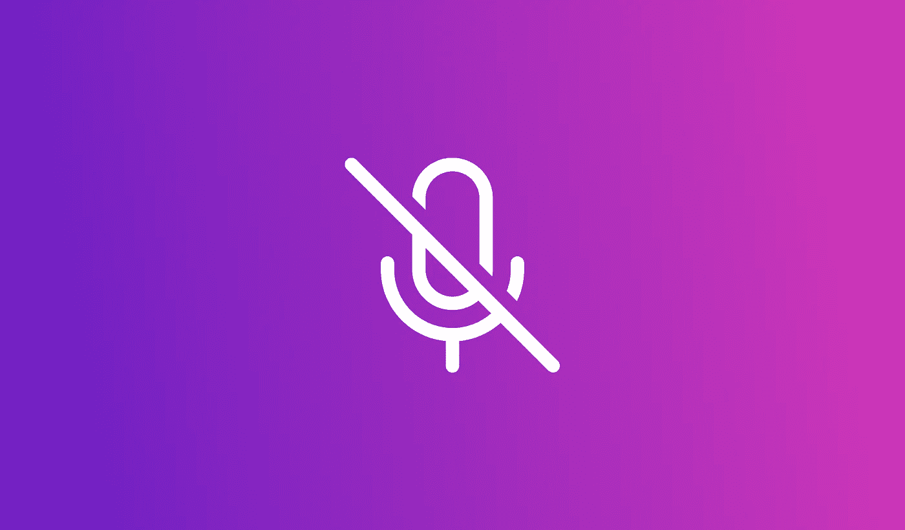
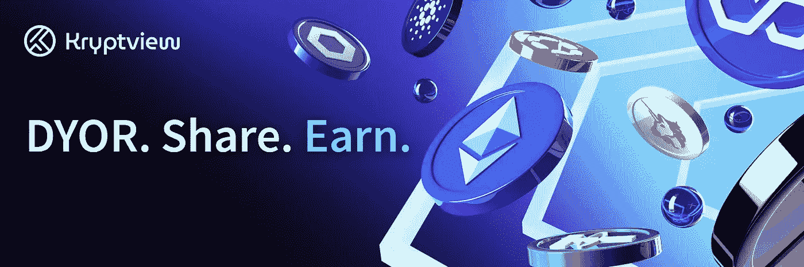

# 加密:过滤噪音和炒作。

> 原文：<https://medium.com/coinmonks/crypto-filter-the-noise-of-the-hype-a6d9cc326ec5?source=collection_archive---------38----------------------->

# 创世纪

这就像一场双方的游戏，即无信仰者对信仰者，政府对秘密项目，对与错，等等。

几乎很自然地认为，当你战斗并继续战斗时，你会变得更强壮，脸皮更厚，获得经验、知识和赢得战斗所需的一切。

我相信同样的事情也发生在加密领域。加密领域发现，推动全球采用的最有效方式之一是不断的**宣传**即传播消息，制造噪音，每个人都必须知道加密是金钱的未来。这样，政府将别无选择，只能采用加密技术。

# 福音策略(积极和消极)

**阳性**

1.  **结果**:随着世界各地的一些顶级政府机构开始致力于一个加密采用框架，即使 ECB ( *欧洲*中央银行)正在致力于推出*欧元* CBDC(中央银行数字货币)，福音传播战略正在产生结果。阅读关于 [**数字欧元**](https://www.ecb.europa.eu/paym/digital_euro/html/index.en.html)
2.  **认知度提高:**这个词像野火一样迅速蔓延。越来越多的人已经将加密视为一种资产、价值甚至金钱。

**底片**

1.  **噪音:**你还记得作为一个密码空间的新手是什么感觉吗？我知道。我记得 Defi，Cefi，Dyor，Dao，Protocol，非监禁，监禁，钱包延期，project this，project that 以及其他上百个俚语和词汇。我记得当时非常困惑。今天，这种噪音仍然困扰着这个空间里的许多人。
2.  **骗局:**随着各种噪音的持续，一些坏人很容易伪装成真实的项目，从人们那里收钱，然后就消失了。
3.  低质量:有些高中毕业生有一些编程技能，但没有实际经验，他们也很容易想出一些项目，大肆宣传，筹集一些资金，然后迅速发展！崩溃。

# **补救措施**

事实是我只知道一种补救方法。在这里。在你作为投资者或社区成员加入之前，对任何项目做一个彻底的研究。你也可以使用 Kryptview 作为你研究的工具。

Kryptview 是一个研究加密的平台。你可以把它看作是加密项目的[学术界](https://www.academia.edu/)或 [scribd](https://www.scribd.com/) ，在那里人们通过与社区分享他们的研究成果来赚取代币。

这样，在你做研究的时候，你可以很容易地从不同的角度收集关于一个项目的重要信息。

你可以在[推特](https://twitter.com/theKryptview)上关注他们，加入他们的[不和谐](https://discord.com/invite/bCN8aQj9qn)或[电报](https://t.me/Kryptviewportal)频道

> 交易新手？尝试[加密交易机器人](/coinmonks/crypto-trading-bot-c2ffce8acb2a)或[复制交易](/coinmonks/top-10-crypto-copy-trading-platforms-for-beginners-d0c37c7d698c)