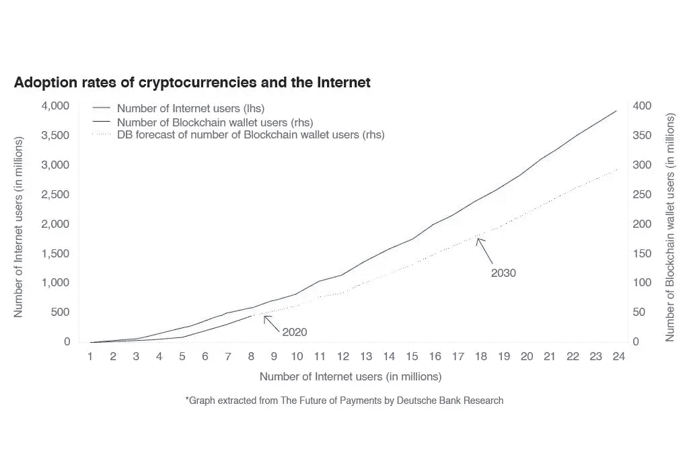
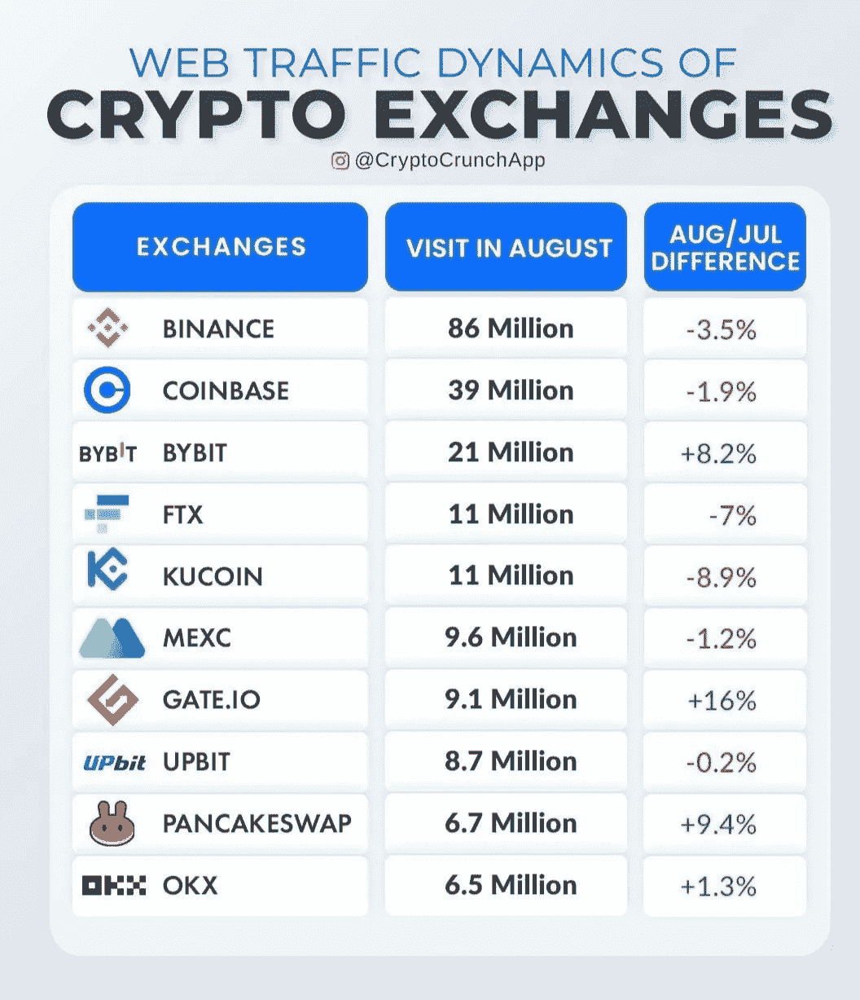
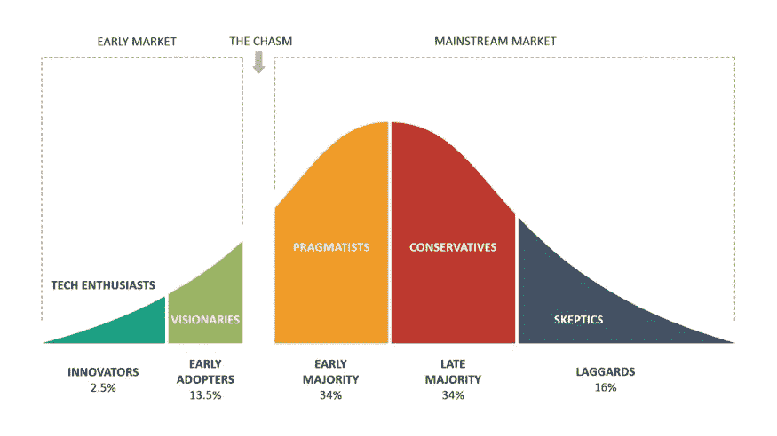

# 初学者密码

> 原文：<https://medium.com/coinmonks/crypto-for-beginners-4f9ef077206f?source=collection_archive---------26----------------------->

加密货币的采用率正在快速增长。如果你将它与互联网用户的曲线进行比较，你可以看到他们以类似的方式上升。

虽然许多专业交易者在市场上，并取得了自己的财富，这意味着更多的是新来的。他们都是来做自己的决定的。做这件事的第一个方法是为了更明智、更专业而学习。但我发现他们中的一些人有时太专业，太熟悉，太投入。

任何你感兴趣的东西(交换，加密项目，协议，APY，APR，游戏)你都会找到大量的信息。但是你的时间有限，你的钱包很小，你的大脑在燃烧。那又怎样？

我从事加密已经有一段时间了，我也一直在为同样的问题而挣扎。这就是为什么我想分享我的学习，给我的导师，提出我的警告，以帮助其他人使他们的培训更有效。

我的第一个建议是:在你可以——最终应该——立即做的事情和你应该稍微评估一下的事情之间进行多样化。

立即

以下是一些你可以做的事情:

1.  如果你刚刚读到一些人用密码成为了亿万富翁，而你唯一的搜索标签是#crypto，你不会学到很多东西。从基础开始:比特币和以太坊。你需要了解一些知识，最好的方法是对这两个巨头做一些研究:为什么比特币是游戏规则的改变者，BTC 和瑞士联邦理工学院之间的区别，“挖掘”是什么意思，什么是股份证明和工作证明，以及你会在一般讨论中找到的主要话题。如果你不想简单地谷歌它，你可以很容易地在主要交易所找到解释(见下文)。
2.  各大交易所是你找到有效信息的平台。您可以免费轻松登录所有。但是我的建议是在做那件事之前花一分钟。所有主要的交易所都有推荐项目:邀请订户加入新用户，双方都可以从推荐中获得额外的好处。如果你想订阅一个或多个平台，使用推荐:至少你不会在决定开始交易的那一刻失去潜在的利益，并且最终可以从一些**免费资金/免费交易**中受益。你可以在文章末尾找到我对**三个主要交易所**的推荐，如下图所示，但重要的是你要用一个——不管是谁。

1.  社交媒体是相关的:事实上，他们是更完整、更新、重要、实时的地方。你可以在网上找到有效的课程——我们会回来的，有些是免费的。但是社交媒体是自然的第一步。上**推特**，开始关注你感兴趣的话题。如果你已经很熟悉了，你可以挑选一些特定的关键词/账户:也许你是一名 F1 粉丝，对 crypto.com 感兴趣，或者你是一名游戏玩家，已经很熟悉 Axie Infinity。否则就从#比特币和#以太坊以及你第一次研究的关键词开始。你不喜欢或不理解的东西和你理解和喜欢的东西一样重要:取消关注你不喜欢的账户、个人资料和标签。他们可以在你的 feed 中制造“噪音”，你可以稍后再来。至少在 **Instagram** 和 **Youtube 上做同样的事情。**

这对于最初几天来说已经足够了。

根据我的经验，你正在采取的第一步是相同的，在不同的层面上，有着不同的意识和不同的结果，即使在那之后你也要继续做下去。

你什么时候准备好第二步？这很简单:当你准备好向别人解释你所读的内容时。如果你不能用一句话解释第一点的概念，你应该给自己更多的时间来理解这些话题。

我最后的建议是:**创建清晰的基本面**去理解这个世界。你仍然是早期的，完全及时成为早期采用者，并从中受益。

但是像任何技能一样，不管是专业的、运动的、技术的，你都需要投入学习时间。

祝你旅途愉快。

克劳迪娅（女子名）

推荐链接

[**币安**](https://www.binance.com/en/activity/referral-entry/CPA?fromActivityPage=true&ref=CPA_00R2BFCGO7) :交易量最大的密码交易所:包括一个钱包，研究工具和一个有用的学院，

 [## 加密交换推荐计划|币安官方

### 邀请朋友的正式方式。获得奖励高达 40%的佣金为每一个朋友，你提到…

www.binance.com](https://www.binance.com/en/activity/referral-entry/CPA?fromActivityPage=true&ref=CPA_00R2BFCGO7) 

[**Bybit**](https://www.bybit.com/en-US/invite?ref=N8J3PD) :大概是了解财务 ops 最好最便宜的地方。非常便宜的交易，以及数百美元的激励和奖金

 [## 推荐计划|Bybit

### 在 USDT，除了 20 美元奖金之外，当你和你的合格推荐人击中一个…

www.bybit.com](https://www.bybit.com/en-US/invite?ref=N8J3PD) 

[**【比特币基地】**](https://coinbase.com/join/mauri_t8) :最早也是使用最多的平台之一，最开始。有多种语言版本。没有经验的交易者使用它，但是有经验的交易者越来越少使用它。

【https://coinbase.com/join/mauri_t8 

> 加入 Coinmonks [电报频道](https://t.me/coincodecap)和 [Youtube 频道](https://www.youtube.com/c/coinmonks/videos)了解加密交易和投资

# 另外，阅读

*   [BigONE 交易所评论](/coinmonks/bigone-exchange-review-64705d85a1d4) | [CEX。IO 审查](https://coincodecap.com/cex-io-review) | [交换区审查](/coinmonks/swapzone-review-crypto-exchange-data-aggregator-e0ad78e55ed7)
*   [最佳比特币保证金交易](/coinmonks/bitcoin-margin-trading-exchange-bcbfcbf7b8e3) | [比特币保证金交易](https://coincodecap.com/bityard-margin-trading)
*   [加密保证金交易交易所](/coinmonks/crypto-margin-trading-exchanges-428b1f7ad108) | [赚取比特币](/coinmonks/earn-bitcoin-6e8bd3c592d9)
*   [WazirX vs CoinDCX vs bit bns](/coinmonks/wazirx-vs-coindcx-vs-bitbns-149f4f19a2f1)|[block fi vs coin loan vs Nexo](/coinmonks/blockfi-vs-coinloan-vs-nexo-cb624635230d)
*   [BlockFi 信用卡](https://coincodecap.com/blockfi-credit-card) | [如何在币安购买比特币](https://coincodecap.com/buy-bitcoin-binance)