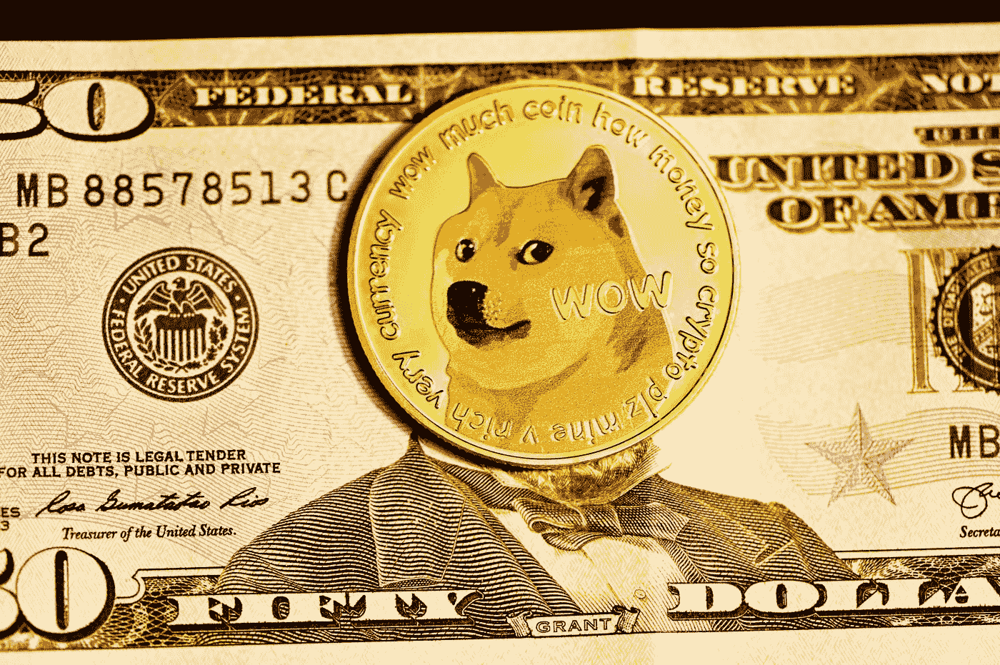

# 初学者密码

> 原文：<https://medium.com/coinmonks/crypto-for-beginners-8bdb4b3d6334?source=collection_archive---------44----------------------->

Photo by [Shubham Dhage](https://unsplash.com/@theshubhamdhage?utm_source=medium&utm_medium=referral) on [Unsplash](https://unsplash.com?utm_source=medium&utm_medium=referral)

# 加密货币简介

加密货币是使用加密技术进行安全金融交易的数字或虚拟货币。它们是分散的，这意味着它们不受任何中央权力机构或政府的控制。取而代之的是，他们使用一种叫做区块链的分布式账本技术在计算机网络上操作。

2009 年，随着比特币的诞生，加密货币首次出现，比特币仍然是迄今为止最知名、使用最广泛的加密货币。自那以后，数百种其他加密货币被创造出来，每种都有自己独特的功能和用途。

# 加密货币是如何工作的？

Photo by [Towfiqu barbhuiya](https://unsplash.com/@towfiqu999999?utm_source=medium&utm_medium=referral) on [Unsplash](https://unsplash.com?utm_source=medium&utm_medium=referral)

加密货币在一个分散的网络上运行，这意味着交易不是通过银行这样的传统金融机构处理的。取而代之的是，交易由一个被称为节点的计算机网络使用复杂的数学算法进行验证。

每笔交易都被记录在一个叫做区块链的数字账本上，这个账本分布在整个网络中。区块链是网络上发生的所有交易的安全透明的记录。

> 从顶级交易者那里复制交易机器人。免费试用。

# 加密货币的类型

Photo by [Traxer](https://unsplash.com/@traxer?utm_source=medium&utm_medium=referral) on [Unsplash](https://unsplash.com?utm_source=medium&utm_medium=referral)

有数百种不同的加密货币可供使用，并且不断有新的加密货币诞生。一些最著名的加密货币包括:

*   比特币:第一种也是最广泛使用的加密货币，市值超过 1 万亿美元。
*   以太坊:一种加密货币，也是一个分散的计算平台，允许开发人员构建和部署分散的应用程序。
*   莱特币:一种类似于比特币的加密货币，但交易时间更快。
*   Ripple:一种加密货币，旨在供金融机构使用，以促进国际货币转移。

# 使用加密货币

Photo by [Austin Distel](https://unsplash.com/@austindistel?utm_source=medium&utm_medium=referral) on [Unsplash](https://unsplash.com?utm_source=medium&utm_medium=referral)

要使用加密货币，你需要设置一个数字钱包来存储你的硬币。有几种类型的钱包可供选择，包括存储在电脑上的软件钱包，以及离线存储硬币的物理设备硬件钱包。

设置好钱包后，您可以使用传统货币购买加密货币，或者在加密货币交易所与其他用户兑换。

# 加密货币的优势

Photo by [Sincerely Media](https://unsplash.com/@sincerelymedia?utm_source=medium&utm_medium=referral) on [Unsplash](https://unsplash.com?utm_source=medium&utm_medium=referral)

使用加密货币有几个优势，包括:

*   去中心化:加密货币是去中心化的，在点对点网络上运行，这意味着它们不受任何中央权威机构或政府的控制。
*   安全性:加密货币使用复杂的加密算法来保护交易，这使得它们很难被欺诈或黑客攻击。
*   匿名性:加密货币允许用户匿名进行交易，这对那些重视隐私的人来说很有吸引力。
*   低费用:与传统金融机构相比，加密货币交易的费用通常非常低。

# 加密货币的缺点

Photo by [Markus Spiske](https://unsplash.com/@markusspiske?utm_source=medium&utm_medium=referral) on [Unsplash](https://unsplash.com?utm_source=medium&utm_medium=referral)

虽然使用加密货币有许多优势，但也有一些潜在的缺点需要考虑:

*   波动性:加密货币可能非常不稳定，一些硬币的价值在短时间内波动很大。
*   缺乏监管:由于加密货币是分散的，不受任何中央机构的监管，因此在欺诈或黑客攻击事件中缺乏对用户的保护。
*   有限的接受度:虽然加密货币越来越被广泛接受，但它们仍然不是在所有地方都被接受，所以你可能无法在所有的金融交易中使用它们。

# 结论

Photo by [Kanchanara](https://unsplash.com/@kanchanara?utm_source=medium&utm_medium=referral) on [Unsplash](https://unsplash.com?utm_source=medium&utm_medium=referral)

加密货币是数字或虚拟货币，使用加密技术和分散式网络来促进安全的金融交易。有数百种不同的加密货币可供使用，每种都有自己独特的功能和用途。虽然使用加密货币有很多优势，但它们也有一些潜在的缺点，包括波动性和缺乏监管。在使用或投资加密货币之前，做好自己的研究并仔细考虑风险和收益非常重要。

> 多样化的密码持有，了解[币安替代品](https://coincodecap.com/binance-alternatives)

*   [SmithBot 评论](https://coincodecap.com/smithbot-review) | [4 款最佳免费开源交易机器人](https://coincodecap.com/free-open-source-trading-bots)
*   [比特币基地僵尸程序](/coinmonks/coinbase-bots-ac6359e897f3) | [AscendEX 审查](/coinmonks/ascendex-review-53e829cf75fa) | [OKEx 交易僵尸程序](/coinmonks/okex-trading-bots-234920f61e60)
*   [如何在印度购买比特币？](/coinmonks/buy-bitcoin-in-india-feb50ddfef94) | [WazirX 审查](/coinmonks/wazirx-review-5c811b074f5b)
*   [加密交易机器人](/coinmonks/crypto-trading-bot-c2ffce8acb2a) | [Probit 审查](https://coincodecap.com/probit-review)
*   [隐翅虫替代品](/coinmonks/cryptohopper-alternatives-d67287b16d27) | [HitBTC 审查](/coinmonks/hitbtc-review-c5143c5d53c2)