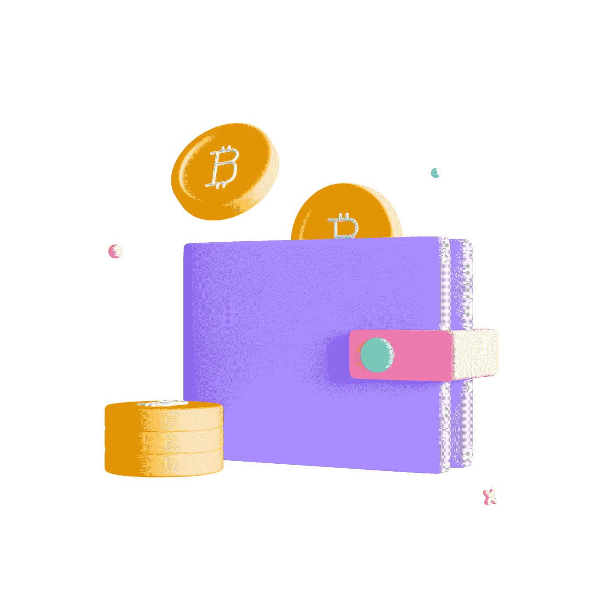

# 假人密码

> 原文：<https://medium.com/coinmonks/crypto-for-dummies-1fb7b4028874?source=collection_archive---------37----------------------->

## 即使你没有任何概念，如何在 crypto 和 Web 3.0 的世界中入门？

Image by [Freepik](https://www.freepik.com/free-photo/3d-cryptocurrency-rendering-design_17664285.htm#query=crypto&position=16&from_view=search&track=sph)

我的许多文章都是关于 [crypto 是如何工作的](/coinmonks/everything-crypto-explained-2b4ddad7e6ac)。这篇文章是为所有理解加密，想开始，但不知道如何做的人准备的。让我们直接开始吧。

# 流行的加密货币

唯一的加密货币不是比特币。以下是许多流行的加密货币及其使用案例。请注意，所有价格和市值数据都是在撰写本文时提供的，不应用于交易目的。

Image by [myriammira](https://www.freepik.com/free-vector/popular-cryptocurrency-logos-set_23678052.htm#query=crypto&position=0&from_view=search&track=sph) on Freepik

## 1.)比特币(BTC)

*   **价格:**16250
*   **市值:**:3120 亿美元

加密货币的 OG 和最流行的一个。2009 年出道，2017 年走红。

## 2.以太坊

*   价格:1210 美元
*   市值:1440 亿美元

可能是第二受欢迎的加密货币。主要功能是智能合约功能，支持 [Web3](/coinmonks/an-intro-to-web-3-0-a10b9520e690) 和 Defi 应用。智能合约是存储在区块链本身的程序和软件，当满足特定条件时就会触发。这可以允许像在区块链上运行的分散化应用程序这样的能力，而不是有一个集中的公司。

## 3.)系绳(USDT)

*   **价格:** $1.00
*   市值:690 亿美元

这种加密货币保持在每枚硬币 1.00 美元。这是因为它是一种稳定的货币，意味着它与其基础资产(在这种情况下是美元)保持不变。这对交易和转移资金很有用。尽管这是一种稳定的货币，但在 FTX 危机期间，它曾一度跌至 0.98 美元。

## 4.)币安硬币(BNB)

*   价格: $272.00
*   市值:450 亿美元

币安的官方加密货币，世界上最大的加密货币交易所之一。创建用于支付折扣交易，但现在可以用于支付。

## 5.)XRP (XRP)

*   价格: $0.34
*   市值:340 亿美元

由 Ripple 于 2012 年创建，是支付的终极加密货币。对跨境交易有用。

## 6.)索拉纳(SOL)

*   价格:13.41 美元
*   市值:46 亿美元

新的 kid on the block 创建于 2020 年，是交易中最具可扩展性的加密货币。它可以非常快速和便宜地完成交易。然而，由于 FTX 危机，它下跌了 60%。

## 7.)Dogecoin (DOGE)

*   **价格:** $0.08
*   市值:108 亿美元

一枚以网络上著名的柴犬为特色的迷因币。

# 加密货币交易所和钱包

Image by [Graphue](https://www.freepik.com/free-psd/3d-nft-icon-digital-wallet_25469820.htm#query=crypto%20wallet&position=0&from_view=search&track=sph) on Freepik

在购买这些加密货币之前，你首先需要注册一个加密货币交易所。你可以把加密货币交易所想象成一个股票经纪人，一个可以买卖加密货币的平台。

## 顶级加密货币交易所

1.  币安
2.  比特币基地交易所
3.  北海巨妖
4.  库科恩
5.  Bitfinex
6.  双子星座

一旦你购买了密码，密码就存储在加密货币交易所。然而，使用 crypto，将密码存储在交换本身中是不明智的，因为它可能被黑客攻击。通常建议将加密转移到加密钱包中，因为使用私钥更安全。

## 顶级加密货币钱包

*   出埃及记——最适合初学者
*   Metamask —浏览器扩展，最适合与以太坊交互
*   Ledger Nano X —最佳硬件钱包
*   Trezor 型—安全性最佳
*   菌丝体——最适合移动用户

# 结论

加密货币是一个快速发展的领域，只要有更多的人使用和了解它，它就有改变世界的潜力。

谢谢大家阅读，给点掌声，分享给你的朋友，干杯。

> 交易新手？试试[加密交易机器人](/coinmonks/crypto-trading-bot-c2ffce8acb2a)或者[复制交易](/coinmonks/top-10-crypto-copy-trading-platforms-for-beginners-d0c37c7d698c)