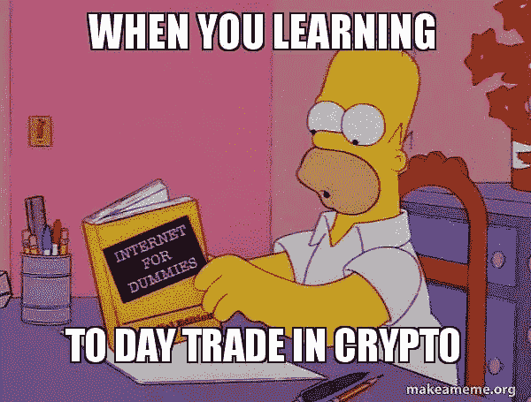
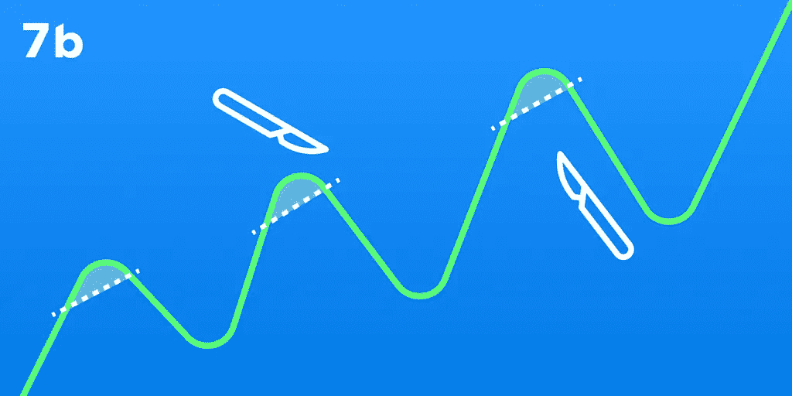
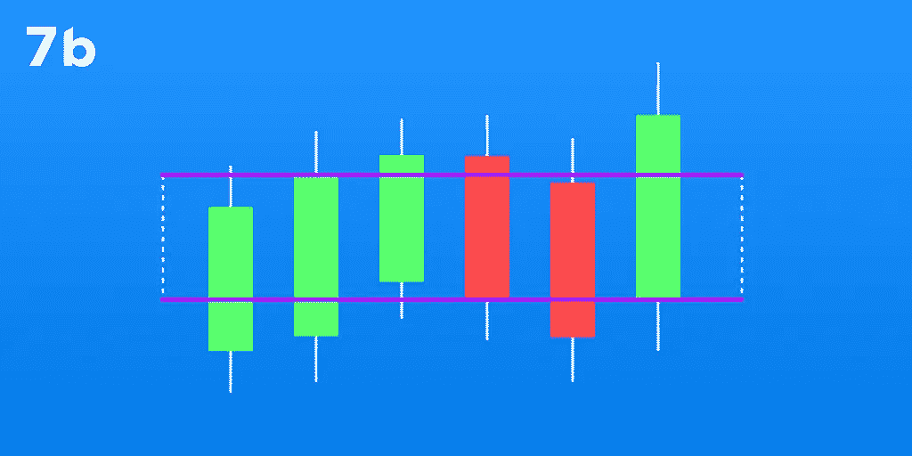
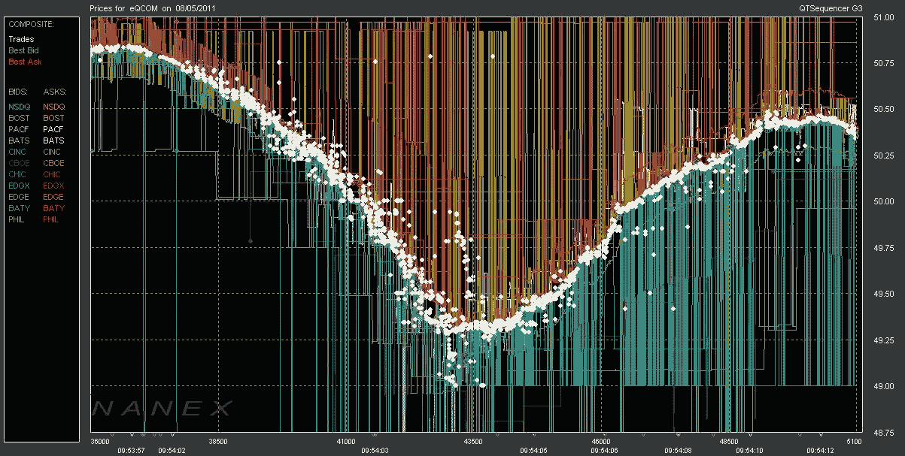

# 假人密码。日内交易是如何运作的？

> 原文：<https://medium.com/coinmonks/crypto-for-dummies-how-does-day-trading-work-4d5ab53b94ed?source=collection_archive---------25----------------------->

# 日内交易包括在一天之内甚至一天之内几次买卖一项资产。如果运用得当，利用小幅价格波动可能是一个有利可图的游戏。在这篇文章中，我们将分析什么是日内交易，有哪些主要策略，如何开始日内交易，以及是否有可能靠它谋生。

# 日内交易者如何赚钱？

事实上，日内交易的成功很大程度上取决于交易者的经验和知识。日内交易，需要对技术分析和风险管理有深刻的理解。运用日内交易的基本策略，交易者依赖于这样的概念:交易量，支撑位和阻力位，价格运动，图形模式，流动性和技术指标。

由于日内交易是一种短期交易策略，所选对的交易量和流动性是交易者的重要指标。因此，有经验的交易者经常关注 BTC/USDT。这种情况下的波动性，虽然不是非常高，但是，可以让你稳定、快速、有效地赚钱。

# 日间交易期权

有不同的方法来组织日内交易。真正有效的日内交易离不开的一个重要细节是策略。让我们考虑一下最流行的工作方案:

# 头皮

**刷单**是一种基于投机原则的日内交易策略。其本质在于交易者以极小的盈利能力完成大量交易，但由于强度大，交易者获得了很高的总利润。它包括在交易变得有利可图后几乎立即出售。通常头皮交易会在 1 分钟内结束，有时 3 分钟，但最多 15 分钟。

有经验的黄牛为了增加利润，往往会用杠杆交易。然而，这样的交易在一个没有经验的交易者手中，不仅会增加利润，也会增加损失。
黄牛党经常分析供求失衡，这可能导致价格定向波动。除了分析下单书，还经常用到各种技术指标。

# 区间交易

做好充分准备的区间交易也许是最赚钱和最简单的日内策略之一。首先，交易者需要能够分析蜡烛图，以及正确确定支撑位和阻力位。逻辑极其简单:当一项资产的价格达到支撑位时，交易者会积极买入该资产，从而导致价格上涨。相反，当资产价格达到阻力位时，交易者会积极卖出股票。
主要风险是价格迟早会突破区间，导致交易者亏损。使用止损就是为了防止这种损失。

# HFT(高频交易)

**高频交易**是一种最高速度的刷单。其原理是确定最小价格波动，并在几秒钟内完成大量交易。这样的速度是人类无法控制的，但它受制于机器人。简而言之，你购买的是 HFT 机器人的服务，它们以某种方式编程，并根据某种算法行动。迄今为止，有各种平台提供 HFT 机器人服务，但在你转向他们的服务，权衡所有的利弊。

是的，一个编程良好的 bot，不需要你的全力参与，也能给你带来稳定的利润。但是编程和存储机器人要花很多钱。此外，加密资产的价格不断波动，可能会发生机器人根本无法预测的事情。除此之外，这类平台对机器人的使用收费，不管交易结果如何。

# 如何开始日内交易加密

即使是没有经验或新手交易者也可以在最短的时间内学会日内交易规则，你开始日内交易也不需要很多资金。专注于熟悉不同类型的交易工具和可用资产。然后找到或发展你的交易策略。

首先，日内交易者必须学习技术分析。你需要清楚图表承载了什么信息，什么是支撑位和阻力位，存在什么图形形态，如何使用什么技术指标，如何设置止损单，以及许多其他工具。

风险管理策略也值得关注。我们强烈建议你写交易日志，以便能够分析盈亏交易。还有，对于新手交易者，我们强烈建议使用止损单。

选择合适的平台进行日内交易。你不仅需要关注交换的界面、可靠性和安全性，还需要关注费用的多少。日内交易需要支付多项服务费，因此，通过考虑费用来计算你的利润至关重要。

# 为什么我应该开始日交易加密？

日内交易就是让你每天都能赚钱的策略。许多有经验的交易者把日内交易作为赚钱的主要途径。这并不奇怪，因为有了适当的准备，这是非常有利可图的。

对于想尝试日内交易的新手来说，关键是学习和分析信息的欲望。了解技术分析的基本知识，使用止损单，选择流动和可靠的资产，以及仔细考虑你的交易策略，利润是有保证的。限制存款金额也很重要，这样才能填满你的手，把损失降到最低。

# 最后的想法

日内交易是一个有利可图和受欢迎的策略，然而，其盈利性需要足够的实践和一致的结果评估。在进行之前，你需要学习技术分析的基本概念，选择交易策略，以及合适的平台。选择 7b、安全和[匿名加密交易所](http://sevenb.io/?utm_source=medium&utm_medium=article)的日间交易选项，享受[低廉的加密交易](http://sevenb.io/about?utm_source=medium&utm_medium=article)费用。

*原载于 2022 年 8 月 25 日*[*https://seven b . io*](https://sevenb.io/blog/a-beginners-guide-to-day-trading-cryptocurrency/)*。*

> 交易新手？尝试[加密交易机器人](/coinmonks/crypto-trading-bot-c2ffce8acb2a)或[复制交易](/coinmonks/top-10-crypto-copy-trading-platforms-for-beginners-d0c37c7d698c)