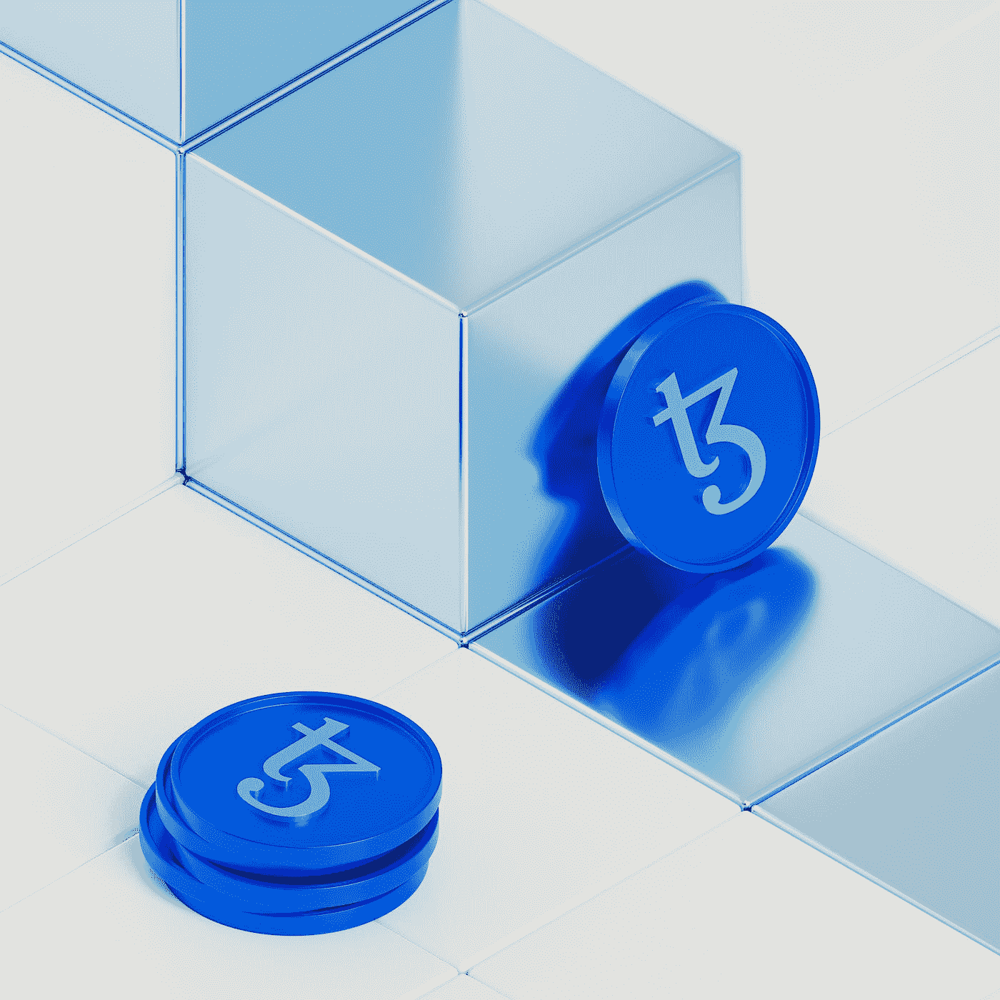

# 创业密码

> 原文：<https://medium.com/coinmonks/crypto-for-startups-b42acaf63adc?source=collection_archive---------35----------------------->

## 如何创造终极庞氏骗局和印钞？

Photo by [Rodion Kutsaiev](https://unsplash.com/@frostroomhead?utm_source=medium&utm_medium=referral) on [Unsplash](https://unsplash.com?utm_source=medium&utm_medium=referral)

你喜欢现金吗？你喜欢骗局吗？你喜欢庞氏骗局吗？看来你也喜欢加密。让我们一起建立我们的加密创业从想法到资金。

# 第 0 天:想法

在我们开始之前，我们必须想出一个主意。我们不会过分纠结于这一步，因为想法一文不值，执行才是最重要的。

# 第五天:计划

由于区块链的昂贵性质，加密初创公司往往有很高的费用。在我们完成任何实际工作之前，我们将进行定价估算和商业计划/模型。

# 第 20 天:建立 MVP

我们在两周内迅速制定了商业计划。现在，我们想让我们的加密初创公司爆发，所以我们需要资金。我们将建立一个 MVP 之前，我们要求资金，所以我们有东西给他们看。

1.  **选择共识算法** —共识算法是网络参与者验证交易并将其分成块的方式。流行的包括 PoW(工作证明)或 PoS(利益证明)
2.  **获得一个区块链—** 现在，我们可以根据应用程序中需要的共识算法来选择区块链。支持 dApps 的流行区块链有以太坊、OpenChain、NEM、EOS 和 Ripple。
3.  **设计节点** —节点是所有连接到区块链的电脑。他们是区块链的消费者和供应者。每个节点都有一个区块链的副本，它们使用自己的计算能力来挖掘数据块(在事务变成区块链的数据块之前验证它们)。在设计节点时，我们可以将其设置为私有或公共，选择内部部署或云托管，并选择硬件和软件细节。
4.  **创建区块链的架构**——现在这是我们应用程序的真正内容。这是去中心化应用的后端，我们在这里定义和编程智能合约，告诉我们的区块链应该如何工作。我们还为我们的节点创建安全规则，以及应该如何创建块。
5.  **集成关键 API**—我们分散式应用的用户可能会使用加密钱包和加密交换。我们还应该希望将 Metamask 集成到我们的去中心化应用程序中。比如 Transak 就像 Stripe，但是对于 crypto 来说。
6.  **设计 UI** —在这里，我们现在可以用任何前端编程语言来设计我们的 UI。

# 第 100 天——融资

从我们开始这段旅程到现在已经 100 天了，我们现在已经完成了我们的 MVP。我们现在正在寻求资金。我们可以去找投资人，也可以搞个 ICO(首发币)。这相当于 IPO，但我们不是出售股票，而是向股东出售代币。

当人们购买我们的 ICO 时，他们会收到我们的令牌，他们通常会获得像比特币或以太一样的既定和稳定的加密货币。一旦资金到位，项目启动，人们购买到我们 ICO 中的代币就会成为货币的一部分，或者成为我们自己的加密货币。

1.  **路线图** —你会想要展示你未来的路线图
2.  **白皮书发布**——在密码行业，初创公司会创建一份解释项目的白皮书。
3.  **团队**——你也应该展示一个值得信赖的、有能力的团队。
4.  **令牌** —消息传递部分完成后，我们应该选择人们购买我们 ICO 时获得的令牌。

## **代币类型:**

*   **实用程序** —授予对产品或服务的访问权限，例如，您的 MVP。 [Dash2Trade](https://dash2trade.com/) 就是这样一个例子。
*   **参与** —给予投票或参与区块链的权利。
*   **投资** —令牌持有者有权分享加密公司的红利。
*   **资产** —令牌的所有权授予任何资产的所有权。

# 结论

我们在 100 天内创建了自己的加密初创公司。当然，这将比现实生活中花费的时间更长，但这可以作为创建一个的基本框架。谢谢大家看完，给点掌声，分享给大家，干杯。