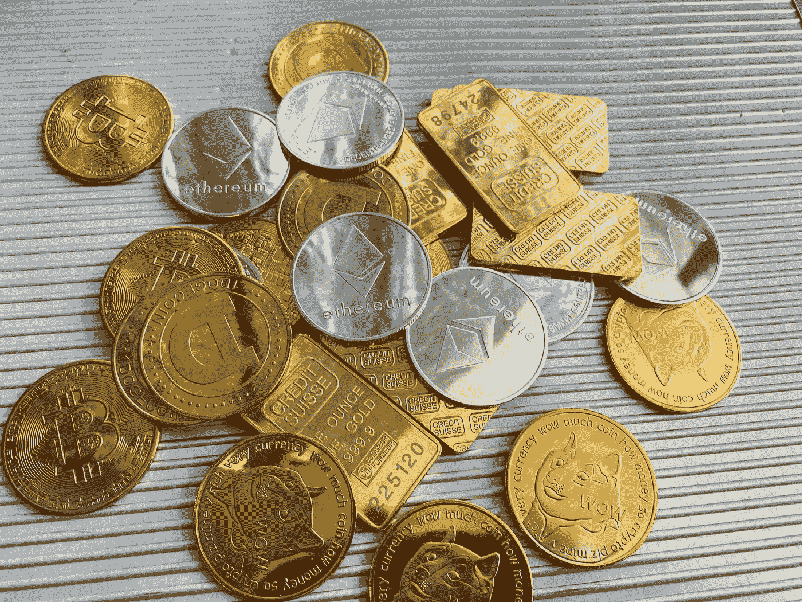
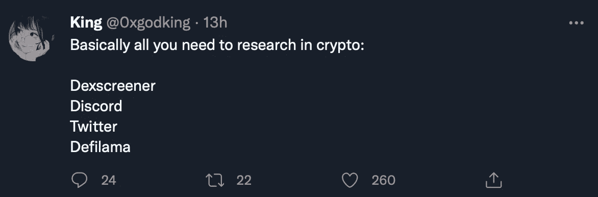
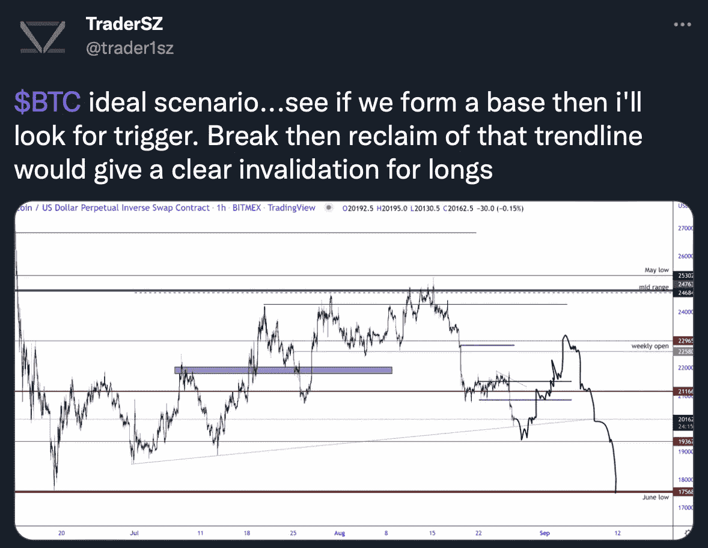
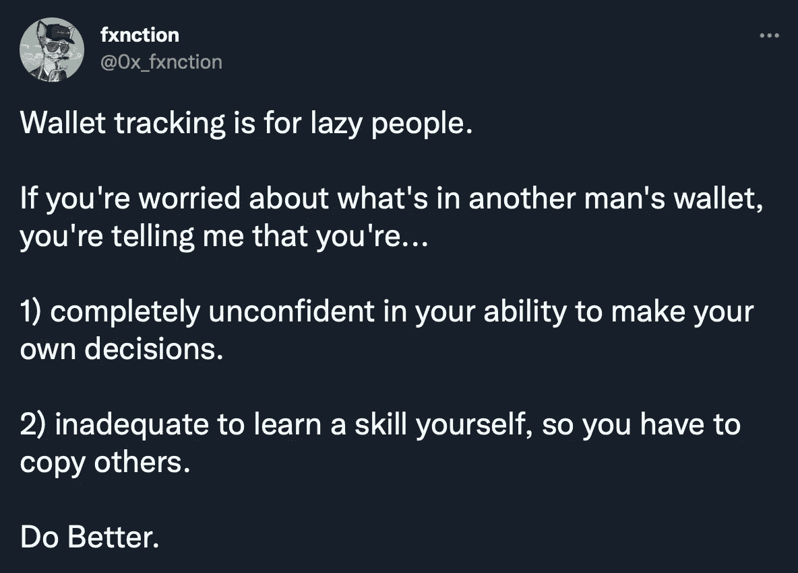
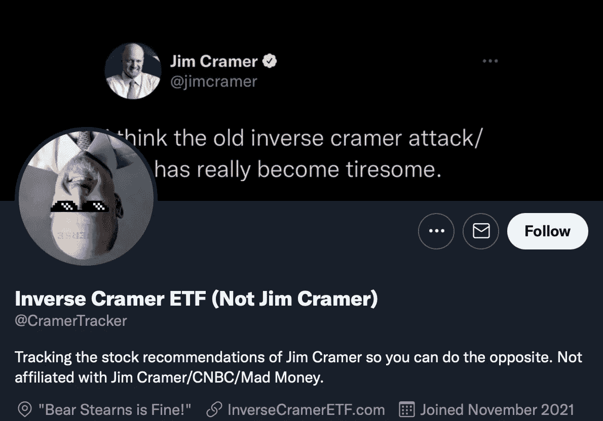
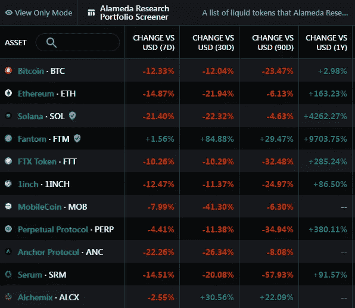
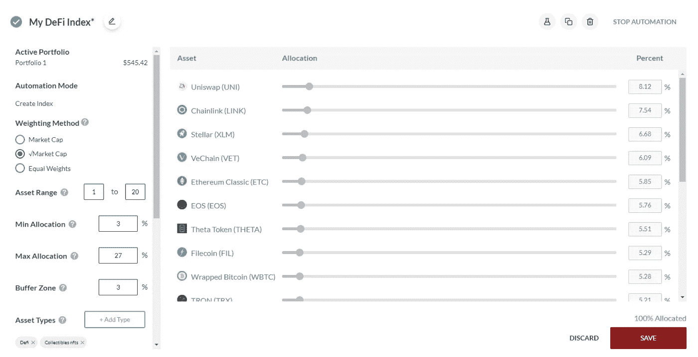
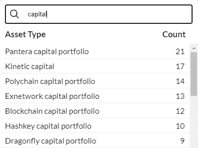

# 加密基金+拷贝交易=？？？

> 原文：<https://medium.com/coinmonks/crypto-funds-copy-trading-f19a43c33281?source=collection_archive---------8----------------------->

Photo by [regularguy.eth](https://unsplash.com/@moneyphotos?utm_source=medium&utm_medium=referral) on [Unsplash](https://unsplash.com?utm_source=medium&utm_medium=referral)

投资的关键是要有优势。具有优势的投资者是指与其他市场参与者相比，拥有增加盈利可能性的优势的人。

一个共同的优势包括已经参与了一个完整的市场周期。见证了价格上涨和下跌的人知道下一个周期开始时如何行动，这让他比没有见证的人更有优势。

另一个很好的例子是信息优势。那些利用社交技能的人会加入充满专业投资者、开发者、创始人和风投的圈子。他们可以了解最热门的新 NFT 系列或即将推出的加密货币。一般投资者不会听到这个机会，直到为时已晚。

投资/交易优势有多种形式，是不可或缺的工具。但由于市场的周期性，新投资者没有时间在牛市结束前获得优势。

最终发生的情况是，新来者购买了错误的代币，或者投资于旨在将资金从散户吸到风投手中的项目。他们在试图了解内幕的同时，浪费了他们的财富和时间。

但需要技巧才能盈利的时代早已过去；你可以简单的复制那些已经很熟练的。

# 复制交易:赚钱的懒惰方式

人性的一部分就是模仿那些成功的人。如果有人长期以来一直擅长某件事，你会得出这样的结论:你可以通过模仿他们的行为来复制他们的成功。

Knowledge is everything. And when you have a community of investors constantly aggregating data for those who seek it, you don’t need to do any research.

加密领域的一个常见策略是跟踪有良好记录的交易者和投资者。如果他们公开分享他们的交易，你可以进入相同的交易，收获的话，而投资零努力。抄他们的入口，出口，TP，SL 都不会错。

Example of a CT analyst sharing his trading ideas.

或者，当一个 NFT 收藏家有购买有利可图的 JPEGs 图片的记录时，人们倾向于记录他的地址，并通过链上分析跟踪他的活动。然后，他们发现收藏家已经购买了一个新项目的几个 JPEGs，并跟风购买。很快，它们就以盈利告终，因为收集者太善于知道在哪里分配资本了。

A popular Solana NFT influencer complaining about wallet tracking.

甚至有一个受欢迎的 Twitter 账户跟踪吉姆·克莱默的股市预测。Crammer 几乎每次都对市场做出了可笑的错误判断。有些人反其道而行之，反向交易他赚钱。

Can you really go wrong by counter-trading Jim Cramer?

有各种各样的人和实体可以复制。然而，最有趣的策略是复制加密交易资金。

# 复制加密交易资金

Part of the Alameda Research team.

想象一个由最聪明的投资者组成的团队。他们的工作是研究大量的定量数据，并应用定制的模型来确定哪些交易或项目可能有利可图。

如果你召集一群专家，他们唯一的存在就是一起工作赚钱，你认为会发生什么？他们会像其他人一样赚钱——这就是为什么投资者虔诚地追随交易基金的浮夸活动。

在很长一段时间里，像 3AC、T2、阿拉米达研究、T4、a16z 和 T5 这样的组织曾经是秘密交易基金的精英。如果任何一家公司参与了一个项目的融资，你就知道这将是下一个大事件。

他们买，你买，别人都买。这就是游戏的名字。

人们就是这样交易的！他们不必研究市场，分析价格行为，或者花几个小时阅读白皮书和文章。他们会简单地跟踪基金的活动并复制它们。这听起来很懒惰，但它确实有效，而且它有效的事实正是每个人都感兴趣的。

Messari’s Alameda Research portfolio tracker

您可以通过以下方式复制交易资金:

*   链上跟踪
*   投资组合跟踪器
*   社交媒体公告

例如，如果你发现阿拉米达研究的区块链地址，你可以跟踪他们的链上活动。他们买入时你买入，他们卖出时你卖出。如果他们慢慢地将配置从一种资产转移到另一种资产，你知道该怎么做。

如果你没有时间跟踪地址或编写一个机器人来提醒你基金的活动，你可以使用投资组合跟踪器。梅萨里有几个知名加密基金的投资组合追踪工具。

然而，投资组合跟踪器并不准确，因为它们大多是手动更新的。在有人将基金更新到最新版本之前，可能要过几个小时或几天。

第三个解决方案是追踪基金的社交媒体账户。通常情况下，交易基金会公开宣布他们参与了一轮融资。例如，阿拉米达可能会宣布他们在一个项目的融资轮中花费了 2500 万美元。这种策略的问题在于，你只会收到高水平投资的最新消息。一家公司不会公布它的每一笔交易或投资。

以上总结了你可以用来复制交易资金的策略。如果你有足够的时间，链上分析是理想的。但是如果你没有，选择下一个最好的。

不喜欢我们提到的任何策略？不用担心；还有最后一个策略我们还没有提到…

# Shrimpy:结合基金和复制交易

Shrimpy 是一个自动化的投资组合管理平台，使您的投资活动更加有效。在交易机器人的帮助下，Shrimpy 帮助您重新平衡您的投资组合，将 DCA 转换为加密，回溯测试加密策略，复制交易，并创建自定义指数基金。

我们的定制指数基金功能允许您创建一个具有设定分配、分配范围和自动化的自动化加密投资组合。

Example of a DeFi-focused custom index fund.

你可以选择任何你想要的资产，并将其加入指数基金。或者，您可以通过选择标签来添加特定资产组中的多种加密货币。你猜怎么着？除了流行的标签，如 DeFi，NFTs 和智能合同，我们还包括加密基金！

List of crypto firms and their tags.

你可以选择一个标签，如潘迪拉资本投资组合，你的投资组合将包括营运基金投资的所有资产。您还可以更改分配并进一步定制投资组合。

您可以使用 Shrimpy 有效地复制交易加密资金。你也不需要执行任何链上分析或投资组合跟踪——Shrimpy 会为你做。

听起来很有趣？[在这里注册](https://dashboard.shrimpy.io/signup)探索 Shrimpy 提供的一切。

# 关于我们

Shrimpy 是一个自动化的投资组合管理平台，通过使用简单直观的应用程序帮助加密货币投资者管理他们的资本，借助自动化的力量节省时间和金钱。

要了解更多关于我们平台的信息，并发现它如何帮助您开启加密之旅，请随时访问我们的 [**主网站。**](https://www.shrimpy.io/)

我们还在 [**Shrimpy 学院**](https://academy.shrimpy.io/) 和 [**Youtube**](https://www.youtube.com/channel/UCcT9S2PBM70Ly14SZ6VdSHg) 为大众提供免费的区块链教育。

> 交易新手？尝试[加密交易机器人](/coinmonks/crypto-trading-bot-c2ffce8acb2a)或[复制交易](/coinmonks/top-10-crypto-copy-trading-platforms-for-beginners-d0c37c7d698c)