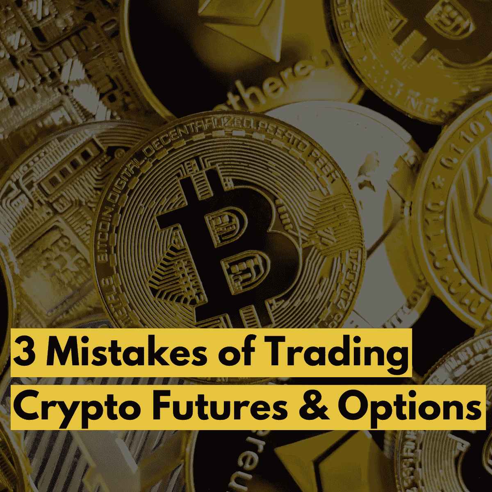

# 加密期货和期权:交易者容易犯的 3 个错误

> 原文：<https://medium.com/coinmonks/crypto-futures-and-options-3-mistakes-traders-are-succumb-to-2866c2a03f75?source=collection_archive---------20----------------------->

*Knowing the Mistakes of Crypto Futures and Options Trading is the First Step to Avoiding Them.*

错误就像甜蜜的陷阱或有着良好伪装的无害事物。然而，一旦你犯了错误，你就可能失去所有的财富。这篇博客涵盖了交易者可能会犯的三个重大错误。

由于高潜在回报的承诺，期货和期权吸引了许多新手。交易这些工具的名人和 kol 的影响可能会深刻地影响新手如何选择他们的工具。赚取不可思议的收益的广告是古老的，但永远不会停止诱惑！

 [## 什么是加密交易？以及你可能会问的其他问题

### 首次接触加密货币时，你需要一本入门指南。在这篇博客中，你将…

medium.com](/@libraryoftrader/what-is-crypto-trading-and-other-questions-you-might-ask-64f169e881e0) 

然而，我们正在谈论的是一个甜蜜的陷阱。人们被网上和网下的大量信息弄得不知所措，所以他们喜欢被看起来像专家的人指导。

公平地说，期货和期权是有利可图的，但它们应该伴随着高风险。当交易加密期货和期权时，你可能承担更高的风险。加密货币衍生品对重大金融市场事件非常敏感。你必须应对价格波动的波动性和敏感性，这会让你损失一大笔钱。

# 忽视孤立保证金的好处和风险

*Understanding the good and bad sides of isolated margins is helpful to avoid costly pitfalls.*

涉足衍生品交易所，需要把资金从正规的现货钱包转移到期货市场。在交叉抵押品之间进行选择是选项之一，这意味着在同一笔存款中有各种孤立的头寸。

新手交易者容易缺乏知识，这导致他们因保证金管理失败而被清算。然而，如果你知道正确的操作方法，你可以享受独立保证金的灵活性和风险管理。

 [## 如果你从 1000 美元开始，你能从加密交易中赚多少钱？

### 当我们不确定你可以通过交易加密货币赚多少钱时，不要生气！如果有人能…

medium.com](/@libraryoftrader/how-much-money-can-you-earn-from-crypto-trading-if-you-start-with-1000-2afee1c5d79a) 

每种方法都有利弊，因为不存在完美的方法。我们能做的最好的事情就是认识到最佳应用的好处和风险。在这种情况下，您应该使用交叉保证金手动输入每笔交易的止损。

# 以期权的流动性为例

*Don’t Take Things for Granted!*

期权交易的流动性是造成开仓和平仓费用的因素之一。因此，如果你不仔细考虑这一方面，它可能会增加嵌入费用，因为加密货币具有高波动性。

最低未平仓兴趣是所需联系人数的 50 倍。这个数字代表了先前买入或卖出的具有执行价格和到期日的合约的数量。

 [## 2022 年投资的十大加密货币—第一部分

### 选择一种有利可图的加密货币进行投资反映了你对市场趋势的把握程度以及你的…

medium.com](/@libraryoftrader/top-10-cryptocurrencies-for-your-investment-in-2022-part-i-f5aaa33b3bcf) 

关于隐含波动率的知识可以支持交易者。他们可以很容易地对期权合约的当前价格和未来的价格走势做出决定。你应该记住的是，期权的溢价随着隐含波动率的增加而攀升。

你应该避免购买波动性过大的看涨期权和看跌期权。在下大注之前，通过小规模启动和对每个功能的多次测试，耐心掌握衍生品交易。

# 忽略交易加密期货和期权的凸性

*Issues with the convexity of crypto futures and options are among the top reasons for novice traders’ failure!*

当标的资产的价格发生波动时，保证金存款的价值也会发生变化。例如，当比特币价格上涨时，以美元计算的投资保证金将随着杠杆的增加而增加。

 [## 2022 年投资的十大加密货币—第二部分

### 在之前的博客中，我们根据对以下领域的研究，向您介绍了 5 种最值得投资的加密货币

medium.com](/coinmonks/top-10-cryptocurrencies-for-your-investment-in-2022-part-ii-da391c6e5d52) 

当反向运动和 BTC 价格崩溃发生时，问题就出现了。因此，以美元计算，用户的保证金将会下降。新手在交易期货合约时往往会过于兴奋，并在 BTC 价格上涨的情况下减少他们的杠杆。

因此，最佳解决方案是避免仅仅因为保证金存款的增值而增加头寸。

# 常见问题

# 什么是孤立边际？

单独的保证金表示分配给单个头寸的保证金余额。它对每笔保证金金额的限制，使交易者在各自的头寸中有更好的风险管理。可以调整每个头寸的分配保证金余额。

# 期权的流动性如何？

流动性表明以现行市场价格出售资产以获得现金的容易和快捷程度。因此，如果期权合约流动性低，这意味着该合约的未平仓权益非常低或没有。考虑这一点可以帮助你下定决心持有、购买或出售期权。

# 有可能用密码做期权吗？

是的，我们可以在任何加密交易平台上买卖加密期权合约。你可以考虑的一些平台有 Bybit、Delta Exchange、Deribit、FTX 美国衍生品、币安、OKX、Quedex、Bit.com 等。

# 有哪些加密选项可用？

即使你是机构投资者和散户投资者，你也可以交易 BTC 和 BCH 的期权。最受欢迎的包括比特币(BTC)和以太坊(ETC)。

# 你能用密码做期货吗？

是的，你可以。芝加哥商业交易所(CME)允许交易员交易比特币(BTC)期货合约，提供现金结算的月度合约、六个月合约等。

其他可能引起您兴趣的文章包括:

 [## 新手期货交易终极指南

### 介绍

medium.com](/@libraryoftrader/the-ultimate-guide-of-futures-trading-for-beginners-cb66fe68498b)  [## 期货交易赚钱的背后有什么秘密吗？

### 当一些事情听起来很机密时，它会引发人们去了解。一些发现可能会让你满足于…

medium.com](/@libraryoftrader/are-there-any-secrets-behind-profitable-futures-trades-dc46d5decc95)  [## 期货和期权:差异和交易技巧

### 当你阅读这篇文章时，你可能会对期货和期权感到困惑。是时候通过…抛弃你的困惑了

medium.com](/@libraryoftrader/futures-and-options-differences-trading-tips-230ce7f0db73) 

你也可以找到我们👇

交易者博客库:[https://libraryoftrader.net/blogs](https://libraryoftrader.net/blogs)

https://www.facebook.com/libraryoftrader[脸书](https://www.facebook.com/libraryoftrader)

推特:【https://twitter.com/libraryoftrader 

领英:[https://www.linkedin.com/company/library-of-trader/](https://www.linkedin.com/company/library-of-trader/)

https://www.reddit.com/user/Library_Of_Trader

quora:[https://www.quora.com/profile/Library-of-Trader](https://www.quora.com/profile/Library-of-Trader)

> 交易新手？尝试[加密交易机器人](/coinmonks/crypto-trading-bot-c2ffce8acb2a)或[复制交易](/coinmonks/top-10-crypto-copy-trading-platforms-for-beginners-d0c37c7d698c)