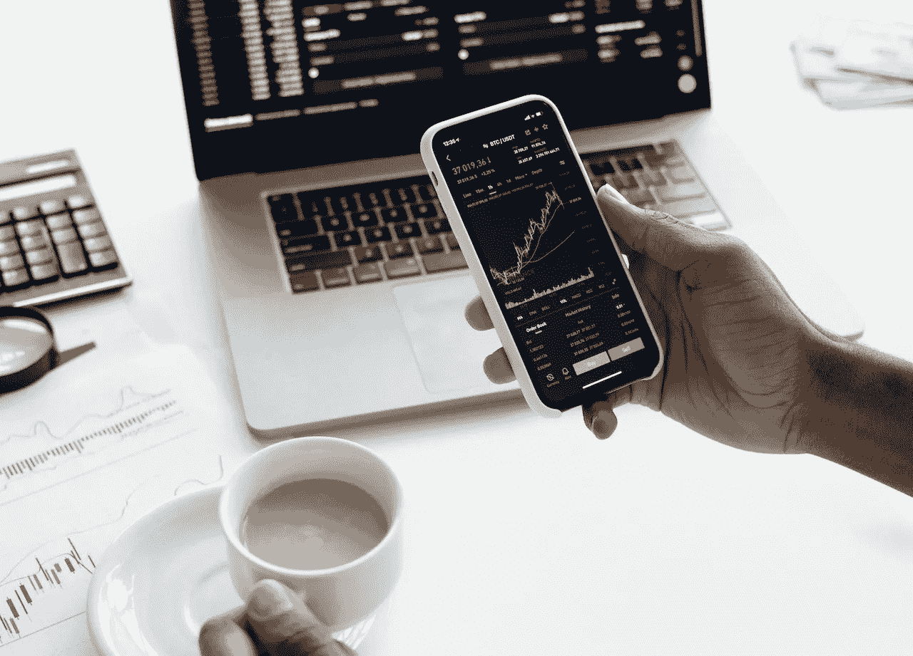
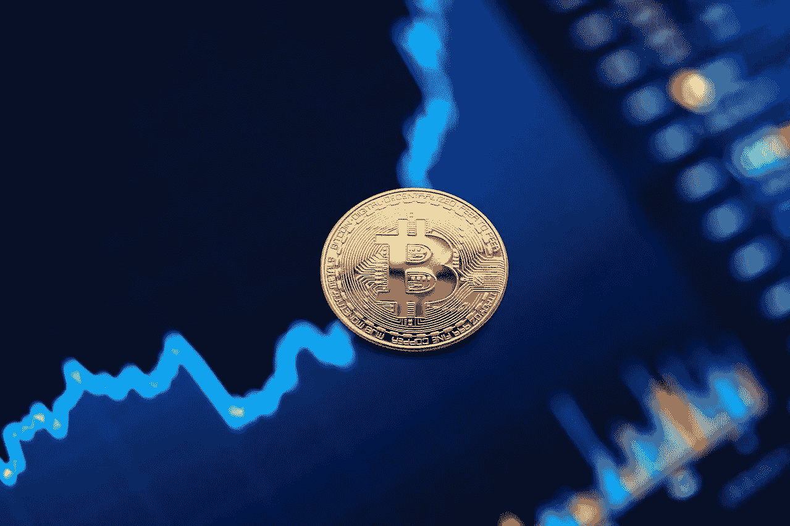

# 加密期货交易解释

> 原文：<https://medium.com/coinmonks/crypto-futures-trading-explained-684598049ba8?source=collection_archive---------29----------------------->

Photo by Liza Summer: [https://www.pexels.com/photo/crop-ethnic-trader-with-smartphone-and-laptop-on-bench-indoors-6347720/](https://www.pexels.com/photo/crop-ethnic-trader-with-smartphone-and-laptop-on-bench-indoors-6347720/)

加密货币交易者在进行交易时使用几种策略。不同的人会从不同的策略中受益，因为他们的工作方式都有些不同。虽然某些加密投资策略，如现货交易，已经得到广泛采用，但其他的，如期货交易，则被行业中的小部分人使用。

交易比特币期货类似于在常规金融市场上交易期货。必须使用期货合同，即在未来某个时间以确定的价格购买或出售资产的有约束力的法律协议。

期货合约是在未来某个时间点以指定价格购买给定加密货币的协议，无论加密货币的交易价格如何。

时间范围可能从一天到几十年不等。期货交易有时被比作赌博，因为它是基于一个项目的预测价值。

> **参见:** [**什么是以太坊合并？**](/coinmonks/what-is-ethereum-the-merge-1b65f4d2c853)

# 你能解释一下加密期货交易的机制吗？

Photo by Anna Nekrashevich: [https://www.pexels.com/photo/person-holding-a-smartphone-6801874/](https://www.pexels.com/photo/person-holding-a-smartphone-6801874/)

期货交易员通常只是对比特币资产的未来价值做出有根据的猜测。他们对某一天资产行为预测的基础可能是应用于一组指标的基本面分析、技术分析，或者通常是两者的混合。

例如，一名交易员可能会在 2022 年 10 月 23 日通过购买合约以某一价格出售比特币来建立比特币期货的空头头寸。假设价格满足，交易者会把比特币卖给你。为了表明完成交易的意图，必须在合同上建立多头头寸。

如果双方约定每枚比特币的价格为 3 万美元，但现在的市场价格为 2.3 万美元，那么卖家将获得利润，如果比特币的价格保持在 3 万美元以下，买家将亏损。假设 23000 美元的费用意味着一个比特币要花费你 4500 美元。

> **亦见:** [**认识分散交流；初学者指南。**](/coinmonks/understanding-decentralized-exchanges-beginners-guide-b6f74455a5f5)

或者，如果 10 月 23 日的价格是 45，000 美元，他们将会赔钱，而买方将会赢得这笔交易。期货合约的提前终止只能通过进行反向交易来完成。当合同的完成期限最终到来时，双方都必须依法履行自己的义务。

有时，期货交易者可能会从他们用来交易的交易所借入资金，以增加他们的交易规模，从而增加他们的潜在利润。杠杆被定义为最终交易规模与原始交易规模的比率。如果你做了一笔价值 X 的交易，杠杆可能是这个数额的 10 倍、20 倍、50 倍，甚至 100 倍，这取决于市场。

永远不要忘记，如果交易对你不利，通过借钱来增加合约的规模可能会适得其反。这是一个高风险的赌注，如果你被迫清算并失去所有的钱，可能会以灾难告终。

# 其他形式的加密交易与加密期货交易

Photo by Anna Nekrashevich: [https://www.pexels.com/photo/person-hands-pen-glass-6801681/](https://www.pexels.com/photo/person-hands-pen-glass-6801681/)

期货合约交易在几个关键方面不同于其他类型的交易。期货和现货交易(也称为点对点加密)处理单一基础资产。然而，前者涉及用一种资产(或货币)交换后者，而后者不涉及。另一个显著特点是，与直接的比特币交易不同，参与交易的各方不是市场本身，而是买方和卖方。

期货交易不同于其他类型的金融投机，因为它不是实时进行的，价格也不是基于项目的当前价值。相反，它是通过预测未来的成本来计算的。投机者不需要直接接触他正在下注的硬币。

**参见:**[**2022 年最佳 NFT 商场**](https://ilekeairende.com/the-best-nft-marketplaces-in-2022-bc94ae6270c)

# **你有场外加密交易的权利吗**？

Photo by Ivan Babydov: [https://www.pexels.com/photo/gold-bitcoin-coin-on-background-of-growth-chart-7788009/](https://www.pexels.com/photo/gold-bitcoin-coin-on-background-of-growth-chart-7788009/)

期货交易不需要商品的实际转移，而是基于对商品未来价值的猜测。要想成功，你需要牢牢把握整个市场的基本面，以及与手头资产相关的基本面。

这通常与技术分析一起使用，以获得对资产未来表现的合理准确的预测。虽然没有一个交易者能保证在未来的每笔交易中都能获利，但是这些知识可能会大大增加你获利的机会。

因此，期货交易最好留给经验丰富的市场老手，他们已经在这个行业浸淫了一段时间，能够可靠地预测价格将如何变动。如果你缺乏该领域的实质性知识，尽管期货交易很有吸引力，还是要避免。

> **亦见:** [**煎饼互换新手用。**](/coinmonks/pancake-swap-for-beginners-bb2896cdf56b)

# 我们先说清楚

加密货币的期货交易有风险，但如果你打好自己的牌，它可能会带来丰厚的回报。杠杆完美地说明了这个原则，因为它增加了你的潜在收益和损失。鉴于比特币市场的巨大波动性，这是一个特别紧迫的问题。

期货市场不会给你钱来杠杆化你的交易，除非你先拿出一定数量的钱，称为初始保证金，作为抵押品，以防你在交易中亏损。交易平台会为你存储这些信息，只有当你最终在交易中取得积极成果，并能够偿还借款时，才会释放这些信息。

当你在交易中出现亏损时，交易所会及时解除合约，对你的头寸进行平仓。如果发生这种情况，你最初投入的保证金将会一去不复返。这也是新手应该避免杠杆交易的原因。

> 交易新手？试试[加密交易机器人](/coinmonks/crypto-trading-bot-c2ffce8acb2a)或者[复制交易](/coinmonks/top-10-crypto-copy-trading-platforms-for-beginners-d0c37c7d698c)