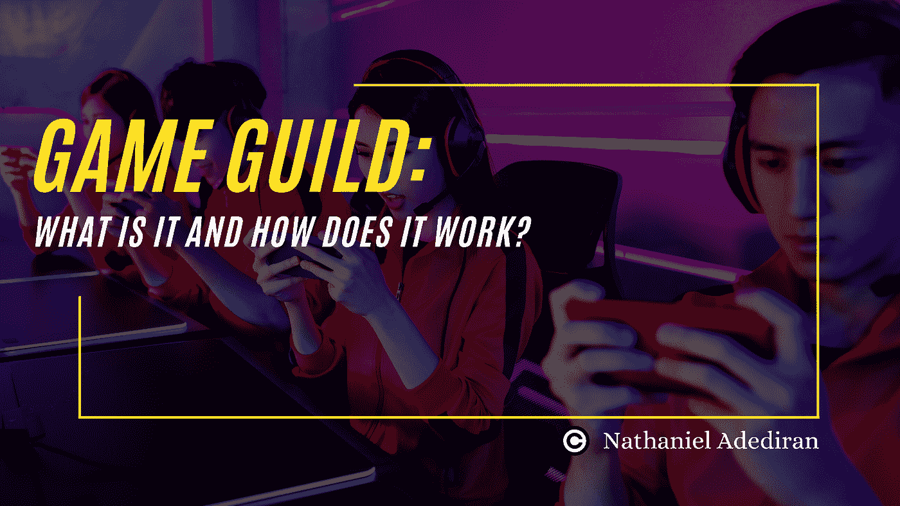
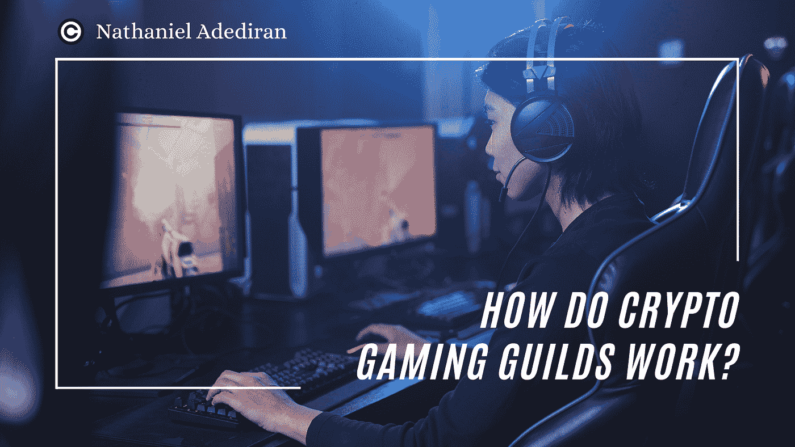

# 加密游戏公会:它是什么，它是如何工作的？

> 原文：<https://medium.com/coinmonks/crypto-gaming-guild-what-is-it-and-how-does-it-work-f6c2d2eea14b?source=collection_archive---------17----------------------->

随着区块链技术的出现，现在游戏玩家可以在玩在线视频游戏的同时赚钱。

不幸的是，许多这类游戏需要拥有某些游戏内资产、设备和其他设施，其中一些可能很昂贵。许多玩家，尤其是发展中国家和不发达国家的玩家，负担不起。这个问题怎么解决？这就是加密游戏公会变得相关的地方。

# 什么是加密游戏公会？

加密游戏公会是一个由玩家、投资者和管理者组成的组织。

成立加密游戏公会的主要目的是投资潜在的 web3 游戏计划，以促进健康的游戏赚钱环境，并向无法购买游戏资源的玩家提供游戏资源，如 NFT 人物和游戏内代币。NFT 投资者和雄心勃勃的游戏玩家看到了互利的潜力，这导致了游戏公会在加密货币领域的受欢迎程度上升。当玩家成功赚钱时，这笔钱的预定部分会给公会。

游戏公会的概念并不新鲜。他们通常由喜欢一起玩视频游戏的游戏玩家组成，并且有自己的文化。电子竞技团队是众所周知的游戏公会，但在加密领域，游戏玩家可以通过玩电子游戏稳定地生活。

# 加密游戏指南是什么时候开始的？

现在的“游戏赚钱”概念据说起源于菲律宾。当新冠肺炎肆虐世界时，P2E 游戏开始大受欢迎，玩家们通过玩 [Axie Infinity 赚钱。许多人一兑现他们的奖品并上传他们消费的照片，标签 ***#ThankYouAxie*** 就开始在社交媒体上传播。](https://axieinfinity.com/)

随着越来越多的人开始玩这款游戏，Axie Infinity 的游戏内货币 Axies 开始以创纪录的水平交易。Dizon，Yield Guild Games (YGG) 的创造者，看到了一个机会，开始在奖学金项目中租赁 Axies。玩 Axie Infinity 赚的钱，学者收 70%，公会收 10%，社区管理员收 20%。

这种模式受到了很多人的欢迎，很快新的行会就成立了。

> A ***【奖学金】*** 是 NFT 或游戏内资产的拥有者借出给其他公会成员使用这些资产进行游戏并获得收益的情况。而 NFT 资产的所有者被称为 ***【经理】*** 玩家被称为 ***【学者】按照之前的约定，经理、学者和游戏公会都会从学者的收入中获得一定比例的分成。***

# 加密游戏公会是如何工作的？

对于加密游戏公会来说，目标不仅仅是推进 GameFi 产业。他们希望推动整个加密货币行业，在帮助玩家实现收入最大化的同时，让人们更加广泛地接受加密货币。加密游戏公会使用以下技术:

*   **连接加密货币和传统游戏。**

建立在区块链上的游戏不同于传统的视频游戏。非加密用户可能会觉得有几个过程令人生畏。GameFi 行业必须更容易进入，因此新手获得更多指导材料至关重要。

因此，公会通过对玩家进行以下教育，间接地帮助非加密玩家获得市场准入:

*   *如何设置一个加密货币钱包，像 Metamask 一样接入游戏和市场。*
*   *如何在交易交易所和 DApps 中存取款。*
*   *如何保护自己的账户并进行交易*

游戏公会也帮助玩家学习更多关于游戏项目的知识，包括游戏的机制和奖励计划。非加密游戏玩家对这个行业了解得越多，他们尝试 GameFi 的可能性就越大。结果，更多的资金流入，这有助于市场的长期扩张。

*   **用加密游戏连接社区。**

每个游戏项目的核心都是它的社区，游戏公会帮助玩家与游戏项目联系起来。

游戏公会的功能相当于 DAO(分散式自治组织)，资金由 DAO token 社区提供。投资者将把他们的钱投入 NFT 资产和游戏中的代币，游戏玩家将使用这些资产和代币来玩游戏并赚取共享利润。这被称为“奖学金计划”

然而，公会的主要职责和义务是在 Web3 游戏世界中引导社区。这个社区有助于游戏项目的长期发展，玩家可以聚集在这里聊天和交流问题。

*   **游戏玩家奖学金项目**

不发达国家的游戏玩家遇到的“从玩到赚”的障碍的解决方案是游戏公会的奖学金计划。

公会内 NFT 资产的所有者可以将他们的 NFT 借给其他被称为“学者”的公会成员然后，学者可以利用这些数字资产在加密游戏中竞争并从中赚钱。公会、NFT 资产的所有者和玩家分享收益。根据公会不同，利润分配也不同。

由于这一系统，几乎每个人都可以获得新的游戏体验和收入前景，这在世界范围内具有重大的社会影响。

*   **GameFi 项目质量控制**

在 2021 年 Axie Infinity 热潮之后，GameFi 领域的受欢迎程度有所上升。因此，几个项目的目标是在市场上发布下一款尖端游戏产品。

然而，这也意味着一些项目质量低下，是欺诈行为，旨在从游戏赚钱的热潮中获利。行会必须保护其成员免受欺诈或诡计。在向其成员发放奖学金之前，所有顶级游戏公会都会对其投资项目的经济结构进行详细研究，并对游戏进行测试和评估。

*   **将潜在投资者与 GameFi 市场联系起来**

在 GameFi 行业，加密游戏公会也充当风险资本。他们会研究新的加密货币游戏，如果发现有希望，就会进行投资。

投资者可能会向公会捐款，并向会员提供奖学金，即使他们没有时间玩他们想投资的游戏。以这种方式，公会可以通过允许投资者通过他们投资游戏来间接帮助投资者，而不必处理进行研究、管理账户或操作游戏的麻烦。

# 结论

尽管目前处于熊市，GameFi 行业仍有光明的未来。这是因为游戏是全世界最受欢迎的娱乐形式，每个人都可以从做自己喜欢的事情赚钱的机会中受益。

然而，高准入门槛和短期经济可行性仍然是 GameFi 行业的拦路虎。加密货币的游戏公会在这种情况下很有用。通过购买 NFT 游戏中的资产，并借给玩家，让他们可以玩和赚，这将通过奖学金计划分享，他们充当促进中介。

> 你觉得这篇文章怎么样？下面分享一下你的想法。

**如果你想了解更多关于区块链、GameFi、NFTs 和元宇宙的信息，请关注这个频道。**

**也可以在** [**Twitter**](http://twitter.com/angelnath001) 上联系我

> 交易新手？尝试[加密交易机器人](/coinmonks/crypto-trading-bot-c2ffce8acb2a)或[复制交易](/coinmonks/top-10-crypto-copy-trading-platforms-for-beginners-d0c37c7d698c)