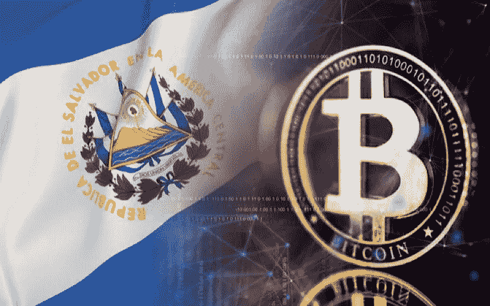
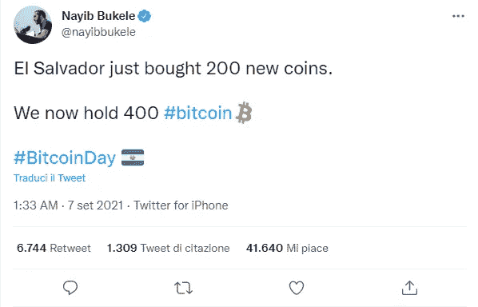
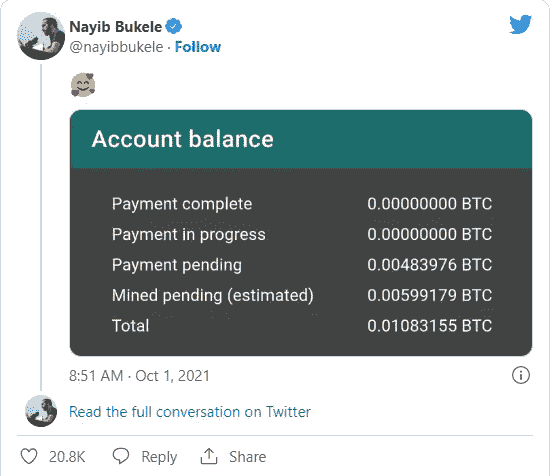
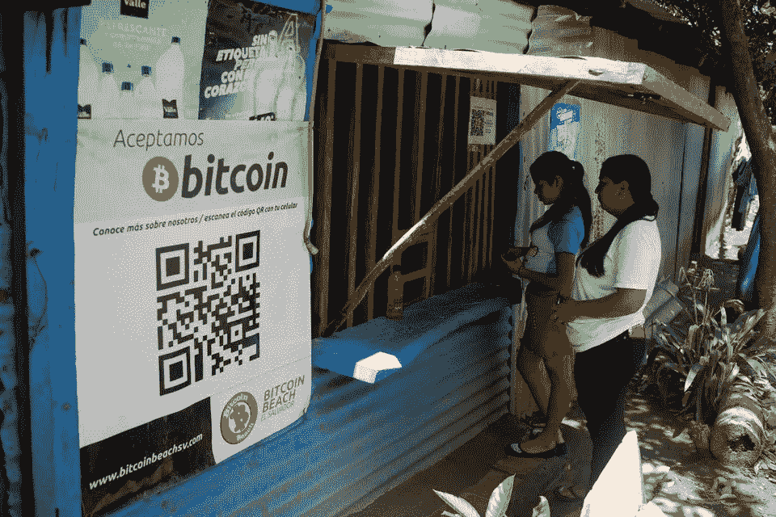
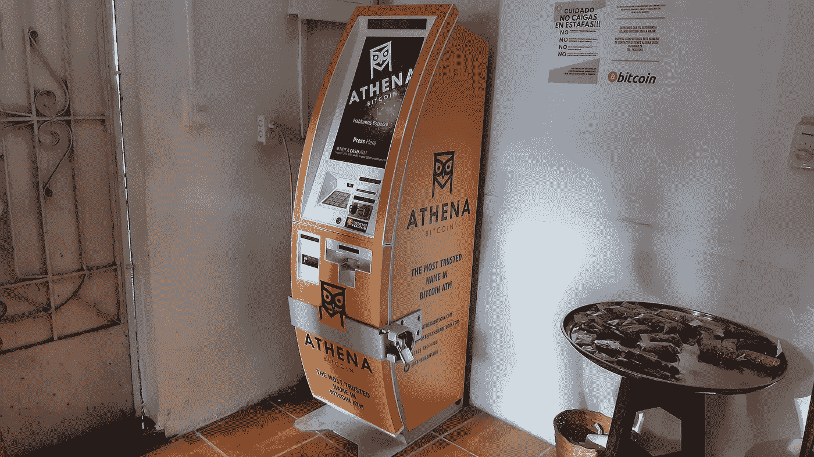

# 加密天堂国家#1:萨尔瓦多

> 原文：<https://medium.com/coinmonks/crypto-haven-countries-1-el-salvador-c59f25c2bbf0?source=collection_archive---------19----------------------->

每天，我都会读到不同国家的加密货币法规，以及特定国家内不同的现实情况。我了解到有些国家禁止比特币，相反的，像 T2 和乌克兰这样的国家使用加密货币为军队提供资金。我在想:“为什么不创建一个关于加密天堂国家的专栏呢？为什么不谈谈那些为比特币、加密货币的使用提供便利、张开双臂欢迎加密企业家的国家呢？”我决定创建“加密天堂国家”专栏，在第一期中，我决定谈谈萨尔瓦多，第一个将比特币作为法定货币的国家。

El Salvador

在这篇[文章](/coinmonks/friends-and-supporters-of-btc-3-president-of-el-salvador-nayib-bukele-db0162673b9e)中，我已经谈到了纳伊布·布克勒总统和他对比特币的同情。现在我将告诉你关于这个中美洲小国的其他奇闻。2021 年 9 月，萨尔瓦多[购买了](https://twitter.com/nayibbukele/status/1435023474494410753?ref_src=twsrc%5Etfw%7Ctwcamp%5Etweetembed%7Ctwterm%5E1435023474494410753%7Ctwgr%5E63946e84de2d231c636c51b6985f6d83c7f9fbb2%7Ctwcon%5Es1_&ref_url=https%3A%2F%2Fwww.cnbc.com%2F2021%2F09%2F07%2Fel-salvador-buys-400-bitcoin-ahead-of-law-making-it-legal-currency.html) 400 比特币，这是世界上最受欢迎的加密货币正式成为法定货币的前一天。

The tweet of President Bukele

2021 年 10 月，萨尔瓦多开始利用来自火山的能量开采比特币。萨尔瓦多开采了 0.00599179 BTC，利用火山的能量，这在该国尚属首次。Bukele 曾指示国有地热电力公司 LaGeo SA de CV“制定一项计划，为比特币采矿提供非常便宜、100%清洁、100%可再生、零排放的火山能源。”[还提供了采矿奖励的明细](https://twitter.com/nayibbukele/status/1443830930997719044?ref_src=twsrc%5Etfw%7Ctwcamp%5Etweetem-bed%7Ctwterm%5E1443830930997719044%7Ctwgr%5E5b8f8a0b6d8d3d184289b44c37559d87cd6b0e5e%7Ctwcon%5Es1_&ref_url=https%3A%2F%2Fwww.cnbc.com%2F2021%2F10%2F01%2Fel-salvador-just-started-mining-bitcoin-with-volcanoes-for-the-first-time-ever-and-theyve-already-made-269.html)。

The mining rewards

萨尔瓦多因被称为[比特币海滩](https://www.cbsnews.com/news/bitcoin-beach-el-salvador-60-minutes-2022-04-10/)的 El Zonte 而闻名，这是一个可持续的比特币经济生态系统，在这个地方，大多数人没有银行账户，当地企业永远没有资格获得接受信用卡所需的商业账户。2022 年 8 月，Bukele [宣布](https://www.presidencia.gob.sv/presidente-nayib-bukele-lanza-la-fase-2-de-surf-city-1-en-la-libertad-y-anuncia-la-ejecucion-de-proyectos-que-potenciaran-el-turismo/)萨尔瓦多将花费超过 2 亿美元重建比特币海滩。他表示:“埃尔宗特对许多人来说被称为比特币海滩；我们将固定一个 15000 平方米的区域，那里将有一个购物中心、停车场、海滩俱乐部、处理厂，以振兴该地区。”

Bitcoin Beach

据《福布斯》报道，在萨尔瓦多，拥有比特币钱包的人比拥有传统银行账户的人还多。2021 年 6 月，布克勒[总统宣布](https://diarioelsalvador.com/estos-son-algunos-datos-importantes-que-debe-saber-sobre-la-aplicacion-de-la-ley-bitcoin-en-el-salvador/97732/)政府将给予每个下载 [Chivo 钱包应用](https://www.chivowallet.com/)的公民相当于 30 美元的 BTC，该应用由萨尔瓦多政府创建，旨在激励比特币在该国的使用。

Chivo wallet

根据 [Coin ATM Radar](https://coinatmradar.com/countries/) 的数据，萨尔瓦多是世界上比特币 ATM 数量第四多的国家(212 个)。去年，加密公司 Athena [预计](https://www.techtimes.com/articles/261985/20210625/el-salvador-install-1-500-crypto-atms-adult-citizens-30.htm)将在萨尔瓦多连续安装 1500 台自动取款机，同时雇佣员工在该国开设办事处开展业务。

Athena Bitcoin ATM

像往常一样，不缺少批评者。根据一些报纸的报道，比特币并没有改变萨尔瓦多的经济现实，甚至这个国家正在走向违约。萨尔瓦多雄心勃勃的现代化计划的财政可持续性也受到质疑。你怎么想？

告诉我，如果你想让我写一篇关于你认为在比特币和加密货币方面有有利立法的特定国家的文章。

把这个空间当成一个没有审查的谈话场所。

胜利者是永不放弃的梦想家。

***免责声明*** *:我不知道所使用的图片有任何第三方权利。如有任何资料来源，我保证予以引用，如有要求，我将调整立场。*

***免责声明*** *:交易加密货币具有很高的风险，可能不适合所有投资者。在决定交易加密货币之前，你应该仔细考虑你的投资目标和你的经验水平。自己做研究。此处表达的所有观点归各自作者所有，不应被视为任何形式的财务建议。*

> 交易新手？试试[加密交易机器人](/coinmonks/crypto-trading-bot-c2ffce8acb2a)或者[复制交易](/coinmonks/top-10-crypto-copy-trading-platforms-for-beginners-d0c37c7d698c)