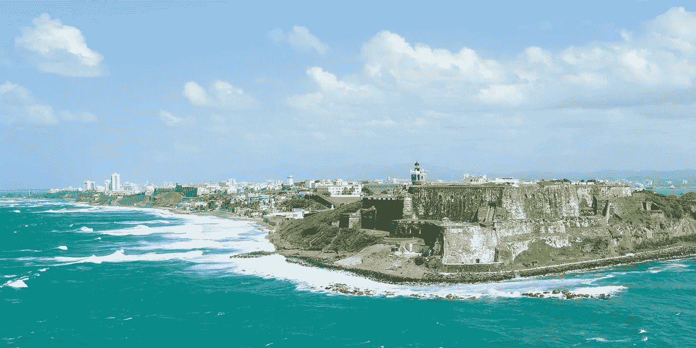
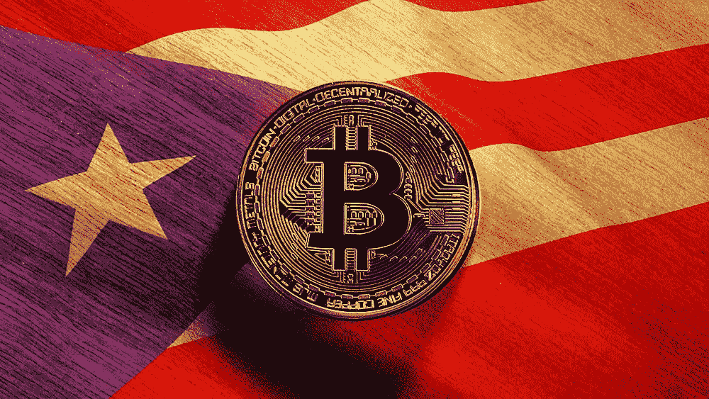
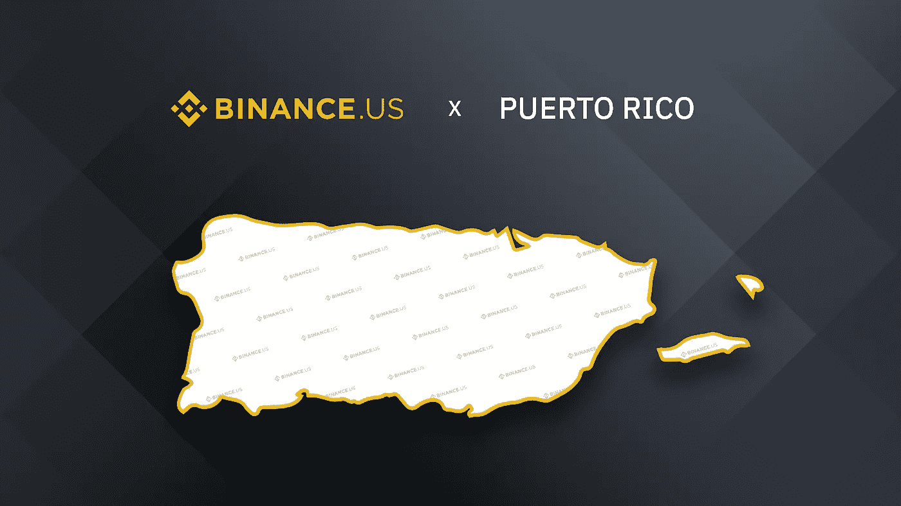

# 加密天堂国家#4:波多黎各

> 原文：<https://medium.com/coinmonks/crypto-haven-countries-4-puerto-rico-19eecfbc53e4?source=collection_archive---------16----------------------->

在我调查的所有国家中，我发现了一个对加密企业家来说无疑非常有趣的国家:波多黎各，这是一个加勒比海岛屿和美国的未合并领土，是一个非常受欢迎的旅游目的地，也被称为 *Isla del Encanto* (魅力之岛)。

Puerto Rico, called *Isla del Encanto* (Island of Enchantment)

波多黎各经济的主要部门是制造业(主要是制药、石化和电子产品)，其次是服务业(旅游和酒店业)。这个加勒比海岛屿是休闲、自然和历史的完美融合，这要归功于它的殖民历史在这里留下了无数的见证，它的领土能够给出独特的建议，由火山岩和壮丽的大海组成。波多黎各人自 1917 年以来一直是美国公民，可以在岛上和大陆之间自由行动。然而，作为未合并领土的居民，波多黎各的美国公民在国家一级被剥夺了公民权，不能投票选举总统或副总统，一般也不缴纳联邦所得税。据《美国消费者新闻与商业频道》报道，波多黎各正在成为一个加密中心，初创公司和加密公司正在这里找到一个舒适的家。

慷慨的税收减免被认为对每年至少在那里度过 183 天的人来说是一个巨大的好处。根据 [*法案第 60*](https://www.anchin.com/news/anchin-alert-puerto-rico-act-60-how-you-can-lower-your-federal-and-state-tax-rates-under-the-resident-tax-incentive-code)*真正的*居民如果在美国定居后购买资产，可以不必缴纳美国来源的资本利得税，同时可以保留他们的美国护照。在美国，投资者为短期资本收益支付高达 37%的利息，为长期收益支付高达 20%的利息，这适用于持有一年以上的加密和其他资产。第 60 号法案中的一项税收减免被称为*个人投资者法案*，如果满足某些条件，税收义务将降至零。这对企业家和密码交易员来说尤其重要。对于在波多黎各扎根的企业主来说，还有一项重大的税收激励措施。大陆公司需缴纳 21%的联邦公司税，外加各州的税，税率各不相同。如果一家公司从波多黎各向美国或其他任何地方出口服务，他们需要支付 4%的公司税率。

Puerto Rico is an attractive country for crypto companies thanks to very low taxes and friendly legislation

2021 年 3 月，加密企业家和投资者戴维·约翰斯顿将家人和公司搬到了波多黎各。潘迪拉资本加密基金在圣胡安开设了一个办事处。Sean Walsh([Redwood City Ventures](https://www.redwoodcityventures.com/)的创始人，这是一家瞄准比特币和区块链生态系统的硅谷投资公司)和加密亿万富翁 [Brock Pierce](https://www.forbes.com/sites/laurashin/2018/02/07/brock-pierce-bitcoin-coinbase-ethereum-crypto-cryptocurrency/?sh=213b6459d67c) 也搬到了波多黎各。许多其他企业家已经乘飞机来到这里。2022 年 4 月，波多黎各成为美国第四个向 Binance.US 发放汇款许可证的管辖区。

Binance.US has received Money Transmitter License in Puerto Rico

根据[公告](https://blog.binance.us/binance-us-receives-money-transmitter-license-in-puerto-rico/)，Brian Shroder，*币安*首席执行官。美国表示:“在种子期成功结束后，我们很高兴能在获得许可证的基础上继续发展，并感谢波多黎各金融机构专员办公室(OCIF)的信任。作为美国购买、交易和赚取数字资产的家园，我们的目标是在所有 50 个州和地区提供最合规和以客户为中心的交易所。特别是波多黎各，它是 crypto 增长的一个重要市场，我们期待着继续为其居民提供安全、可靠、低费用的令牌选择。”

除了经济，区块链还能给这个加勒比岛国带来其他好处。据[彭博](https://www.bloomberg.com/news/articles/2021-12-06/puerto-rico-lawmakers-want-to-use-blockchain-to-cut-corruption#xj4y7vzkg)报道，在 2021 年 12 月当地一名市长承认接受超过 10 万美元现金贿赂后，波多黎各立法者希望利用区块链来减少腐败。

岛上对加密货币的兴趣越来越大，[波多黎各区块链贸易协会](https://www.prblockchain.org/)成立，旨在建立一个包容性的加密社区，将波多黎各推向区块链创新的前沿，吸引新的人才和企业，并将该岛定位为加密货币领域的领导者。该协会推动了许多倡议，包括[加密星期一](https://www.cryptomondays.org/sanjuan/)，这是一个在首都尼斯酒店和餐馆举行的每周聚会，以及[加密好奇](https://www.prblockchain.org/crypto-curious/)，它吸引了该领域的新成员，涵盖了 NFTs、DeFi 以及如何打开自己的加密钱包等主题。数百名当地人已经开始参加这些聚会，现在也提供西班牙语。[波多黎各区块链周](https://www.prblockchainweek.io/)将于 2022 年 12 月 5 日至 10 日举行，届时将有众多嘉宾、活动和会议。

告诉我，如果你想让我写一篇关于你认为在比特币和加密货币方面有有利立法的特定国家的文章。把这个空间当成一个没有审查的谈话场所。

胜利者是永不放弃的梦想家。

***免责声明*** *:我不知道所使用的图片有任何第三方权利。如有任何资料来源，我保证予以引用，如有要求，我将调整立场。*

***免责声明*** *:交易加密货币具有较高的风险，不一定适合所有投资者。在决定交易加密货币之前，你应该仔细考虑你的投资目标和你的经验水平。自己做研究。此处表达的所有观点归各自作者所有，不应被视为任何形式的财务建议。*

*关于作者*

[*CRYPTO _ ALBERT*](https://twitter.com/albertovischio?t=C3Xj9pTm9Q7EZqwjrGHQdA&s=09)

*主编* [*新币帖*](https://www.newcoinpost.com/) *。我帮助人们更好地理解加密货币领域及其目的。*

> 交易新手？尝试[加密交易机器人](/coinmonks/crypto-trading-bot-c2ffce8acb2a)或[复制交易](/coinmonks/top-10-crypto-copy-trading-platforms-for-beginners-d0c37c7d698c)