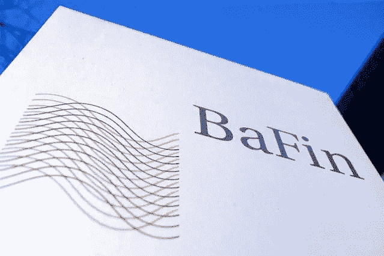

# 加密天堂国家#5:德国

> 原文：<https://medium.com/coinmonks/crypto-haven-countries-5-germany-27a26d639067?source=collection_archive---------19----------------------->

德国是一个技术非常先进的国家。作为许多汽车制造商的家乡，它被称为“欧洲的火车头”，因为它是一个经济非常强大的地方，一直吸引着许多投资。特斯拉还决定在德国投资，并于 2022 年 3 月 22 日正式开设了[柏林-勃兰登堡](https://www.tesla.com/giga-berlin)巨型工厂。此外，关于加密货币，德国确认自己是一个非常有吸引力的国家，因为德国的私人个人将不会对比特币交易的资本收益征税，只要他们持有收益至少一年。

Germany has ZERO capital gains tax on BTC

2022 年 5 月 11 日，德国财政部发布了一份关于加密货币税收的[声明](https://www.bundesfinanzministerium.de/Content/DE/Pressemitteilungen/Finanzpolitik/2022/05/2022-05-11-ertragsbesteuerung-von-virtuellen-waehrungen.html)，详细说明了当局打算如何处理来自赌注、借贷和空投的加密货币收益。如果个人持有加密货币超过一年，他们就不必为出售比特币或以太币纳税。这使得德国成为对加密最友好的国家之一，证实了最近由 [Coinmarketcap](https://coinmarketcap.com/alexandria/article/report-ranks-germany-as-the-most-crypto-friendly-nation) 发布的一份报告。此外，德国的人均 BTC 节点数超过了美国。德国外交部还澄清说，将 BTC 或瑞士联邦理工学院用于赌注和贷款目的不会导致最低一年期限的延长。这与许多国家形成鲜明对比，这些国家认为赌博收入是应纳税的，并将有助于推动加密资本流向德国，除非其他国家也与这一税收政策保持一致。该部还强调，目前的税收法规不是最终的，因为德国政府解释说，在未来，加密货币的税收政策也考虑到技术发展，也可能朝着更严厉的方向变化。

在加密货币领域运营的公司必须获得德国金融监管局[*BAF in*](https://www.bafin.de/DE/Startseite/startseite_node.html;jsessionid=05707FAEC5FF32D0F0DE9CCD7FA22498.1_cid503)(*Bundesanstalt für Finanzdienstleistungsaufsicht*—联邦金融监管局)的许可。

BaFin (Bundesanstalt für Finanzdienstleistungsaufsicht)

2022 年 11 月，Bitpanda [宣布](https://blog.bitpanda.com/en/we-have-received-largest-crypto-licence-german-regulator-bafin)将成为第一个从 BaFin 获得加密资产托管和自营交易全面许可的欧洲零售投资平台。由于 7 月 1 日生效的[基金定位法案( *Fondsstandortgesetz* )](https://news.bitcoin.com/4000-institutional-funds-germany-invest-20-of-portfolios-crypto-assets/) ，4000 家机构基金可以将其投资组合的 20%投资于德国的加密资产。

在 2022 年 Coincub 年度加密税排名中，德国在居民加密税最佳的五个国家中排名第一。在得分表类别的总体排名中，德国在全球排名第七。要阅读报告，请点击[此处](https://coincub.com/ranking/coincub-annual-crypto-tax-ranking-2022/)。

***免责声明*** *:我不知道所使用的图片有任何第三方权利。如有任何资料来源，我保证予以引用，如有要求，我将调整立场。*

***免责声明*** *:交易加密货币具有较高的风险，不一定适合所有投资者。在决定交易加密货币之前，你应该仔细考虑你的投资目标和你的经验水平。自己做研究。此处表达的所有观点归各自作者所有，不应被视为任何形式的财务建议。*

*关于作者*

[*CRYPTO _ ALBERT*](https://twitter.com/albertovischio?t=C3Xj9pTm9Q7EZqwjrGHQdA&s=09)

*主编* [*新币帖*](https://www.newcoinpost.com/) *。我帮助人们更好地理解加密货币领域及其目的。*

> 交易新手？尝试[加密交易机器人](/coinmonks/crypto-trading-bot-c2ffce8acb2a)或[复制交易](/coinmonks/top-10-crypto-copy-trading-platforms-for-beginners-d0c37c7d698c)