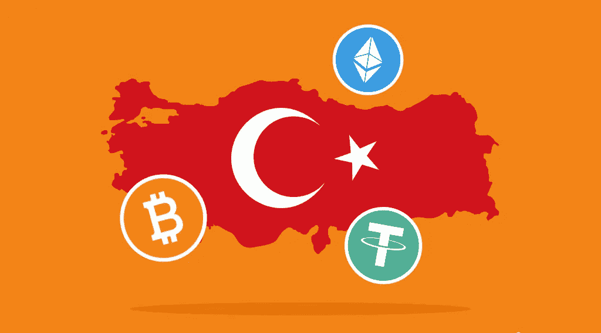

# 土耳其的加密:加密货币在土耳其合法吗？

> 原文：<https://medium.com/coinmonks/crypto-in-turkey-is-cryptocurrency-legal-in-turkey-7bd672370b00?source=collection_archive---------9----------------------->

随着即将到来的经济危机，数字资产继续在全球蔓延。土耳其是加密技术成为巨大贸易和投资机会的国家之一。像世界其他地方一样，土耳其人对加密的兴趣多年来一直在增长。随着持续的金融危机导致去年里拉贬值一半，加密货币交易在土耳其大受欢迎。在新的 [StealthEX](https://stealthex.io/) 文章中阅读更多关于土耳其加密的信息。

通货膨胀率非常高。今年 6 月，土耳其的年通胀率跃升至 78.35%的最高水平，失业率升至 10%。它的对外贸易赤字已经达到平均每月 80 亿美元。尽管物价压力持续，土耳其央行意外降息后，土耳其 8 月份的年通胀率预计将超过 81%。

总计 1824 亿美元的硬通货债务必须在下一年偿还或展期。未来 12 个月，土耳其经济至少需要 2200 亿美元。此外，欧元对美元的贬值给土耳其的外贸、旅游和外债带来了新的压力，也让事情变得更糟。土耳其的出口和旅游收入主要以欧元结算，因此，在其他条件相同的情况下，外部赤字再次上升。

继去年 12 月里拉大幅贬值后，埃尔多安总统宣布了一项新的金融计划，鼓励公民将钱存入土耳其银行以提高货币价值。该计划吸引了 900 亿里拉的存款，但据报道，其中很少一部分来自外汇。

# 土耳其的密码

加密货币在土耳其存在于法律灰色地带。在土耳其法律中，加密货币最初受 2021 年 4 月 16 日在官方公报上发布的“禁止使用加密资产支付的规定”管辖。政府禁止使用加密货币支付商品和服务，但仍允许交易。除此之外，政府没有制定明确的监管准则。

# 土耳其法律对加密货币的现行规定

该条例禁止以下行为:

*   在支付中直接或间接使用加密资产。
*   为支付中直接或间接使用加密资产提供服务。
*   支付和电子货币机构向平台提供中介服务，这些平台提供与加密资产或来自这些平台的资金转账相关的交易、存款、转账或发行服务。
*   支付服务提供商开发能够直接或间接使用加密资产的商业模式，以提供支付服务和电子货币发行，以及支付服务提供商提供与此类商业模式相关的任何服务。

# 土耳其和加密货币:政府 vs 人民

在土耳其，crypto 和 IT 社区之间的联系从未如此紧密，而土耳其政府一直试图开始监管该国的加密交易行业。政府限制数字资产使用的宏伟目标遭到了土耳其密码爱好者的强烈反对。对于加密货币的信徒来说，对政府解决方案越来越缺乏信任证明了数字货币是土耳其陷入困境的里拉的最佳替代品。随着政府试图鼓励里拉投资，土耳其议会正在起草一项法律来监管加密货币市场，目前这是加密爱好者之间激烈辩论的主题。

到目前为止，监管和官方声明一直旨在防止或减少加密货币的使用。新法案旨在限制国际交易所在土耳其运营，同时禁止使用自保管钱包来保护当地货币免受资本外流的影响。它的早期草案出现在 2021 年 12 月，遭到了强烈的批评。加密专家称，在过去的两年里，加密技术在土耳其的应用加速，用户将会受到影响。

# 土耳其的投资者数量

土耳其加密货币市场的真实规模很难估计，因为许多数据都是该行业自己产生的。据目前正在寻求监管加密货币交易的政府称，土耳其目前至少有 500 万人在运营加密货币交易账户。根据 Chainalysis 和 Kaiko 的数据，去年 3 月，土耳其每天的加密交易量超过了 100 万次。在央行宣布禁止使用加密货币进行支付后，交易量在 2021 年 4 月开始逐渐减少。

尽管如此，随着土耳其经济困境的恶化，土耳其公民正在拼命节省他们最后的钱。为了寻找流动性更强的资产，他们经常求助于加密技术。这是土耳其加密社区看到更多来自不同文化层的人加入其中的主要原因之一，其中大多数是年轻投资者，而老年人仍然选择将他们的钱再投资于黄金或美元。

# 土耳其密码领域的事件

土耳其加密货币行业似乎没有举办多少加密活动。其中最突出的一个是伊斯坦布尔区块链周，这是最受期待的区块链聚会，每年在土耳其最具活力的城市之一伊斯坦布尔举行。该活动通常聚集了一大群专家，与会者可以期待 web3 中的领军人物和传奇人物，如 David Chaum，一位传奇的密码学家和顶级风险投资基金和机构的先驱。伊斯坦布尔区块链周在 NFT 日和 Week 电子竞技锦标赛上也有强大的 NFT/游戏/元宇宙存在，预计曾参与一些大型游戏 AAA+游戏的发言者将加入对话。

该活动将包括教育研讨会、主题演讲和引人入胜的小组讨论、探索、会面和了解业内最伟大项目的展览区、网络休息室和 VIP 晚宴，以及独家晚间活动、互动体验(从 NFT 画廊到虚拟现实体验等)。总而言之，伊斯坦布尔区块链周代表了国际社会进入猖獗的土耳其加密社区的机会。今年，该活动将于 2022 年 11 月 14 日至 17 日举行。

# 土耳其密码交易所

虽然交易数字资产仍然不受限制，但 Altcointurk 等土耳其加密货币柜员对他们如何在不确定的监管环境中运营非常谨慎。尽管如此，尽管在基本不受监管的互联网领域出现了一些骗局，但许多在线交易所仍在继续工作，没有任何重大问题。

2021 年 4 月，拥有 40 多万用户的最大加密交易所之一 Thodex 被关闭，其首席执行官 Faruk Fatih zer 逃到阿尔巴尼亚，带走了 20 亿美元的投资者资金。警方已经在包括伊斯坦布尔在内的八个城市拘留了 62 人，土耳其当局已经发出了国际逮捕令，寻求逮捕奥泽尔。就在几天前，他在阿尔巴尼亚的发罗拉被捕，他的身份通过生物识别结果得到了确认。引渡他的程序已经开始。土耳其正在对涉嫌参与欺诈性加密货币交易的嫌疑人判处超过 4 万年的重刑。

就在 Thodex 倒闭的几天前，另一家名为 Vebitcoin 的土耳其加密货币交易所在面临财务压力后停止了所有活动。土耳其当局逮捕了四名与加密货币平台有关的人，并指控他们欺诈。在 Vebitcoin 关闭后，当局此前已冻结了其在岸银行账户。

# 在土耳其购买密码的方法

在土耳其密码行业遭遇如此臭名昭著的骗局后，该国政府寻求监管该领域就不足为奇了。然而，像 Paribu 和 BTCTurk 这样的本地平台似乎没有受到高调欺诈案件的影响。此外，土耳其有大量的零售商人；这使得许多主要的交易所都有了土耳其的身影，包括币安、霍比、比特币基地和 FTX 等等。数字惊人。例如，Paribu 允许土耳其人使用他们的银行账户以土耳其里拉买卖密码，其用户群从 2021 年初的约 150 万增长到年底的 500 万。

很难估计持有 crypto 的土耳其投资者的确切人数，因为并非所有交易所都公开了他们的数据。根据一些数据，专家估计有 1000 万到 1100 万人在积极投资加密货币。

除了一些你必须注册并通过 KYC 才能在土耳其购买密码的网上交易外，还有一个非托管国际交易的选择。例如， [StealthEX](https://stealthex.io/) 可以帮助任何人在土耳其购买加密货币。你可以私下做这件事，不需要注册服务。我们的加密收藏有超过 450 种不同的硬币，您可以立即和毫无问题地进行钱包到钱包的转账。

# 如何在土耳其购买 Crypto？

只需去 [StealthEX](https://stealthex.io/) 并遵循这些简单的步骤:

1.  选择要兑换的货币对和金额。例如，BTC 到瑞士联邦理工学院。
2.  按下“开始交换”按钮。
3.  提供要将您的加密传送到的收件人地址。
4.  处理交易。
5.  接收您的加密硬币。

在 [Medium](https://stealthex-io.medium.com/) 、 [Twitter](https://twitter.com/Stealthex_io) 、 [Telegram](https://t.me/StealthEX) 、 [YouTube](https://www.youtube.com/channel/UCeES_XBesX76ge7xf1meuSw) 和 [Reddit](https://www.reddit.com/user/Stealthex_io) 上关注我们，了解关于 [StealthEX.io](https://stealthex.io/) 和其他秘密世界的最新消息。

在购买任何密码之前，不要忘记做自己的研究。本文表达的观点和意见仅代表作者个人。

*原载于*[*https://stealthex . io*](https://stealthex.io/blog/crypto-in-turkey-is-cryptocurrency-legal-in-turkey/)

> 交易新手？尝试[加密交易机器人](/coinmonks/crypto-trading-bot-c2ffce8acb2a)或[复制交易](/coinmonks/top-10-crypto-copy-trading-platforms-for-beginners-d0c37c7d698c)