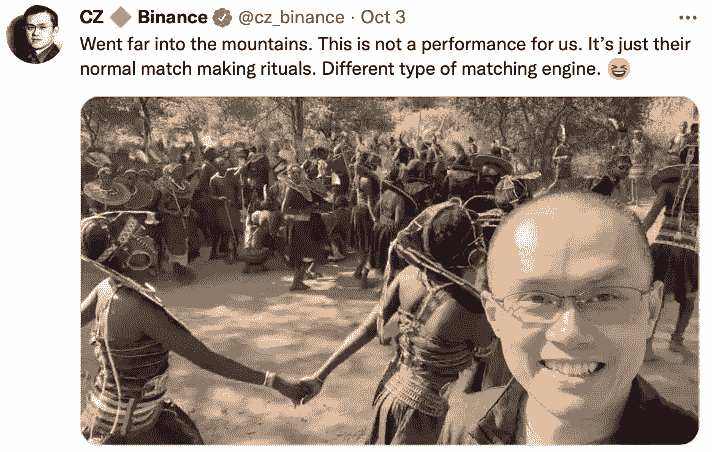
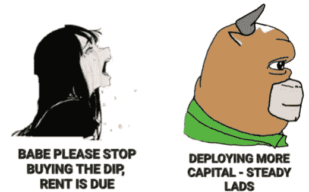
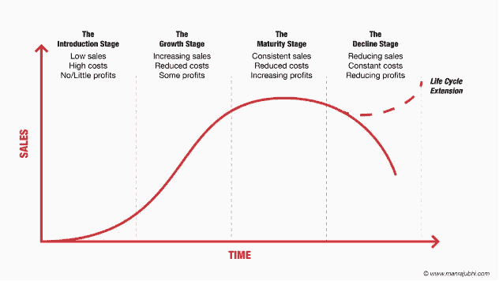
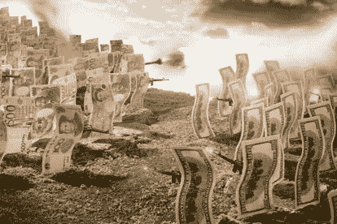
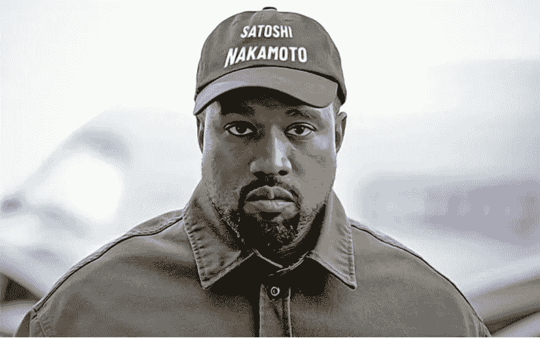

# 加密是一种信仰，而不是投资

> 原文：<https://medium.com/coinmonks/crypto-is-a-religion-not-an-investment-fa216e0cbe69?source=collection_archive---------7----------------------->

我可以理解为什么许多人把加密称为一种宗教。十几岁的时候，我定期去教堂，参加教堂的大部分活动。有一个外展计划，福音传道者深入丛林，将耶稣基督的好消息分享给未接触到的人。我不确定其他宗教，但对于基督教，我认为耶稣在 2000 年前命令他的 12 个门徒去做所有国家的门徒时，使这个病毒传播开来。

所以你们要去，使万民作我的门徒，奉父、子、圣灵的名给他们施洗，教训他们遵守我一切所吩咐你们的。我肯定会永远和你在一起，直到世界末日。”——马太福音 28:19–20

西方作为殖民者接受了这一点。上历史课的时候，我生动地回忆起葡萄牙人在东南亚殖民时期的流行语“黄金、福音、荣耀”。我总是好奇有多少是真正的福音。就像一些人在网上约会之前去教堂寻找他们的伴侣一样，有多少是为了福音呢？没关系，没有判断。

在任何情况下，看来自加密思想领袖和加密兄弟的图片通常是一次回忆之旅。显然，加密公司不能把如此激动人心的技术藏在心里。同样的拓展策略，这次是不同的先知。

以下是我的观点，我希望它能给你一些启示和鼓励，让你开始探索 crypto 和 DeFi，它可能什么都不是。

当我们陷入熊市/衰退的深渊时，退一步认真思考如何配置我的资本。不是财务建议，但我认为我们可能比高峰更接近市场的底部，黎明前最黑暗的时期。如果你同意我的观点，你应该认为自己非常幸运，拥有一生中最好的投资机会。因此，如果有剩余资金，你应该如何分配？你应该投资密码吗？

出生、成长、成熟和死亡都是任何生物的生命阶段。就像生命的循环一样，每个商业和行业都有自己的生命周期和寿命。我相信 Web 3.0 正处于成长阶段。Web 3.0 似乎有无限的可能性。只要资金不停止，开发者就会继续开发，新的特性和用例就会出现，也许会在印钞机重新开动时带来下一轮牛市。

传统金融由大型机构主导，包装得看似安全、管理良好，但却充满了排斥和剥削。它制造了一种虚假的安全感。

Web 3.0 的吸引力基于其无权限和不信任的状态。区块链技术支持自保管，这赋予了我们主权，因为只要节点处于活动状态，它就会授予资产的所有权。Web 3.0 如果不是无权限无信任的，有什么用？

> Watch Balaji(前比特币基地首席技术官和安德森霍洛维茨基金的普通合伙人)讨论了 Web 3.0 的最终用户
> 
> **时间戳- 2:56**

[T3【https://www.youtube.com/watch?v=Ilx7M8mRPyQ】T5](https://www.youtube.com/watch?v=Ilx7M8mRPyQ)

无许可和无信任允许去中心化，因为它不受个人、组织甚至政府的控制，而大多数资产类别和货币由可能犯政策错误的特定个人群体控制。这在最近几天变得更加明显，主要货币对美元贬值，银行和 Ce-DeFi 内爆。

通过创新，区块链科技为没有银行账户的人打造了一个新的模式。它为世界提供了公平访问新的 Web 3.0 金融基础设施 DeFI 的机会。

DeFi 不会根据你的背景或现状来评估你的资格。不会像我们现有的金融体系那样，进行任意的评估。

当然，大多数读这篇文章的人可能看不到 DeFi 的必要性，因为他们可能有足够的金融基础设施。然而，把你自己放在一个没有银行账户的人的位置上，无法进入基本的金融系统迫使你留在社会的后座。也就是说，你永远也不会知道你什么时候被银行录取了，除非你没有被录取。

保险、投资、融资和交易都是金融服务的例子，它们让个人获得保险、获得资本和复合财富，否则没有银行账户的人将无法获得这些。

非常感谢帮助抗击 FUD 和传播信息的福音传道者，因为只有通过福音传道，这种技术才会被采用，从而拓宽可能性和整个 Web 3.0 经济和可寻址市场。

感谢阅读，请继续关注更多加密和定义内容！

作为我的新年决心的一部分，我将分享我在 crypto 的经历，以讲述由我工作中的朋友& crypto OGs 激发的更好的故事。

*免费加密&股票连同推荐一起启动你的旅程:*[*https://docs . Google . com/spreadsheets/d/1 f2bx-xkvmezorxdzqavgckina 1 PME _ uI9pa _ c4l 4-DM/edit？usp =共享*](https://docs.google.com/spreadsheets/d/1f2bX-xKvmEzOrxDZqAvgCkIna1pmE_uI9pa_C4l4-DM/edit?usp=sharing)

> 交易新手？尝试[加密交易机器人](/coinmonks/crypto-trading-bot-c2ffce8acb2a)或[复制交易](/coinmonks/top-10-crypto-copy-trading-platforms-for-beginners-d0c37c7d698c)