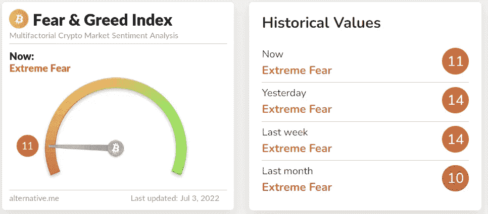

# Crypto:是该全部卖掉还是继续投资？

> 原文：<https://medium.com/coinmonks/crypto-is-it-time-to-sell-it-all-or-continue-investing-7d56b90735b6?source=collection_archive---------10----------------------->

Photo by [Jon Tyson](https://unsplash.com/@jontyson?utm_source=unsplash&utm_medium=referral&utm_content=creditCopyText) on [Unsplash](https://unsplash.com/s/photos/uncertainty?utm_source=unsplash&utm_medium=referral&utm_content=creditCopyText)

哇！这几个月来它一直处于保密状态。7 个月前，BTC 创下了 69，000 美元的历史新高。现在我们的价格是 19000 美元，比历史最高价低了 72%。

ETH 下跌了 78%，从 4870 美元跌至 1050 美元，一切都受到了极大的打击，恐惧和贪婪指数与极度恐惧挂钩已有一个多月了。

那么现在是恐慌的时候，是全部卖出还是买入更多？

好吧，我请客。一有机会，我就买。我把美元成本平均化到仓位上，买越来越多的密码。

> 交易新手？试试[加密交易机器人](/coinmonks/crypto-trading-bot-c2ffce8acb2a)或者[复制交易](/coinmonks/top-10-crypto-copy-trading-platforms-for-beginners-d0c37c7d698c)

有一句话让我印象深刻…..

> “当别人贪婪时要恐惧，当别人恐惧时要贪婪，”—沃伦·巴菲特。

这并不意味着我认为我们已经到了底部或接近底部的任何地方，但请考虑这一点。

*   如果你现在买了 100 美元的 BTC，当我们回到目前的历史高点 69，000 美元时，这 100 美元将价值 363 美元。
*   如果你现在购买了 100 美元的 ETH，当我们回到目前的历史高点 4870 美元时，这 100 美元将价值 463 美元。
*   如果你现在买了 100 美元的 HNT，当我们回到目前的历史高点 54.88 美元时，这 100 美元将价值 610 美元

我可以坚持一整天，但最近我在听有声读物，它让我对市场中人类的情感行为有了正确的认识。当价格暴跌时，我们往往会恐慌，在接近底部时卖出。当价格爆炸时，情况正好相反。我们害怕错过(FOMO ),希望全力以赴，但让我问一个问题，当你想要一个新的小工具、电器或衣服时，你会这样做吗？你会等到价格达到你看到的最高价位再买吗？或者，如果你看到同样的东西在打折，就以很大的折扣买下它？你当然会等待合适的机会！那么我们为什么不在市场上做呢？

主要是因为我们恐惧！我们害怕失去我们投资的钱。我们不考虑长远，只考虑眼前和短期。趋势带来了偏见，当我们看到下面这样的标题时，我们觉得应该像躲避瘟疫一样躲避它！

> 随着全球市场暴跌，比特币跌至 20000 美元以下的 11 天低点(市场观察)[来源](https://cryptopotato.com/bitcoin-dumps-to-11-day-low-beneath-20k-as-global-markets-tumble-market-watch/)

在结束之前，我想提出几点。

*   我们可能会看到从这里再下降 50%。你投资的 100 美元可能价值 50 美元，再投资 100 美元会使上述数字翻倍。
*   如果你真的相信你投资的项目有一个光明的未来，那就充分利用这些机会。
*   不要试图确定底部的时间，要有耐心！

我脑海中浮现的最后一句话…..

> “股票市场是一个把钱从没有耐心的人身上转移到有耐心的人身上的装置。”——沃伦·巴菲特

请记住，这不是财务建议。这些是我对当前市场的想法和观点。

如果你想知道我在哪里投资，我如何从加密和一些普通加密/非加密个人金融机会中获得被动收入，请查看我的其他故事，并关注我的未来内容！

**附属链接**

更多优惠还可以在这里找到:【https://linktr.ee/RealisticCrypto】T2

还有，如果你想请我喝杯咖啡或者啤酒:) :

BTC—BC 1 qaxaq 2 q 9 js 89 gyzhr 0202 sxt 6 hgchprqjga 5 px

基于 ETH、BNB、AVAX、SOL 和 FTM 的令牌—0 x3b 7b 843d 8125 Fe 7 EBA 541 e 1d 751 a4 a 73 f 0 cfad 4c

**免责声明**

这不是财务建议，我不是财务顾问或会计或税务专家。这是我对帮助过我的软件工具的体验，以及我使用它们的经历。

我在本指南中使用了推荐链接。使用这些工具有助于以后的文章，所以如果你觉得这篇文章有用，并且想看看我提到的工具，请使用它们。我还会叫出你在哪里打折——双赢对吧？