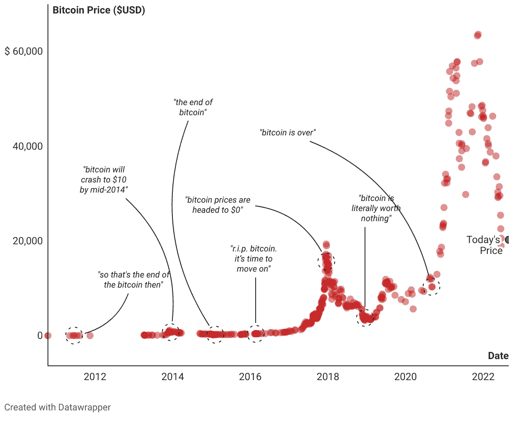
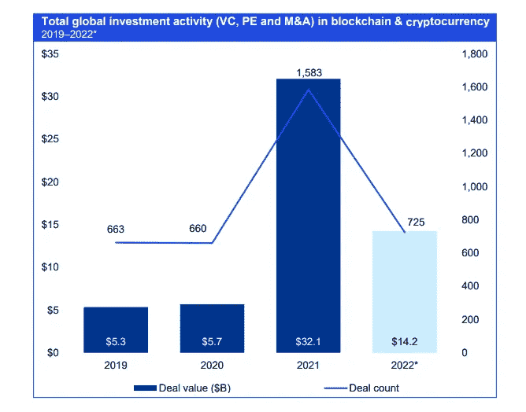

# Crypto 更多的是和自己的战斗，而不是和市场的战斗。这可能是你投资的最后机会…

> 原文：<https://medium.com/coinmonks/crypto-is-more-of-a-battle-against-yourself-than-against-the-market-this-may-be-our-last-chance-869f9f96e359?source=collection_archive---------20----------------------->

Photo by [Yan Krukov](https://www.pexels.com/photo/photo-of-woman-showing-frustrations-on-her-face-4458420/) via [Pexel](https://www.pexels.com/)

加密是个骗局！比特币已死！我的比特币钱都输光了！你觉得这些听起来熟悉吗？加密通常被视为计算机爱好者的冒险赌博或快速致富的方案。尤其是在这个漫长而无聊的熊市中，大多数投资者都损失惨重。在这个行业，人们很容易失去注意力，忘记伟大项目的伟大基础。但比特币真的全是痴人说梦吗？

在这篇文章中，我将解决；

> 1.加密投资者的挣扎
> 
> 2.我的担忧以及为什么我认为这是最后的机会
> 
> 3.我要做什么

# 来自政府的多重威胁

证券交易委员会(SEC)从一开始就表明了反对加密市场的立场。它始于 2017 年，当时首次发行硬币(ICO)的流行程度呈爆炸式增长。SEC 声明，分散自治组织(DAO)的加密令牌将被视为证券。SEC 宣布 2020 年对 Ripple XRP 提起第一起诉讼。在第一次 SEC 诉讼后，他们也开始了起诉其他加密公司的旅程。证交会的一些诉讼至今仍在进行。尽管 Ripple 和其他一些公司对 SEC 的指控有自己强有力的理由，但它仍然制造了 FUD，严重损害了投资者的信心。

除了美国证券交易委员会，中国和其他国家已经多次禁止比特币。这些国家禁止比特币的原因是因为比特币网络上存在大量非法活动，这在任何形式的货币中都是不可避免的。

# 不相信大气

前面说过，自从比特币被拦截以来，‘比特币已死’是这个行业非常普遍的说法。据 Bitcoin.com 称，谷歌搜索短语“比特币已死”正在飙升，100 次搜索中有 38 次。【99bitcoin.comT2 指出，根据讣告来源，比特币已经正式宣布死亡 463 次。随着比特币价格暴跌，极端 fud 在普通大众中不断蔓延。

Photo by [buy bitcoin worldwide](https://buybitcoinworldwide.com/bitcoin-is-dead/)

# 蘸酱一直在蘸

我记得在 2022 年第四季度，许多有影响的人声称加密市场的下跌只是周期中期的修正，并确保比特币价格将很快达到 10 万美元。包括我在内的许多人在那段时间过度暴露于加密市场，因为之前加密市场的持续繁荣带来了极度的贪婪。Luna 从每枚代币 100 多美元暴跌至近 0 美元，这可能会引发许多投资者的“创伤后应激障碍”。就在那之后，整个加密市场一蹶不振，根据福布斯的数据，市场价值损失了 3000 亿美元。当市场逆转时，这一切发生得太快，大多数人都失去了一切。

# 战斗

来自政府的威胁，整个行业的崩溃仅仅是因为一些糟糕的玩家，糟糕的投资，来自不信者的影响，绝望，恐惧，以及其他许多混合在一起的负面情绪。所爱的人不断告诉你，不要把时间浪费在“无用”的事情上。当人们经常看到其他在加密方面成功的人仅仅是“幸运”时，这很伤人。当熊市的环境充满负面能量时，加密投资者总是在与自己的思想战斗。斗争是真实的！

> 你喜欢这篇文章吗？请随时关注我并订阅电子邮件列表了解更多信息！

# 机不可失！

他们说，‘了解区块链永远改变你的生活’，我不得不承认，在我第一次了解比特币之后，我对这个行业产生了如此深厚的兴趣和动力。虽然这次价格变动绝对不是最吸引人的事情，但我从未像现在这样兴奋过。我深信比特币和区块链有能力彻底改变每一个行业。我很高兴我能够成为这个社区的一部分。然而，我研究得越多，我就越开始担心。为什么？听我说完…

> 1.据[彭博](https://medium.com/u/3d76181076e6?source=post_page-----869f9f96e359--------------------------------)、[介绍，自比特币在全球推出以来，其波动性已大幅降低。](https://www.bloomberg.com/news/articles/2021-02-15/bitcoin-s-latest-record-run-is-less-volatile-than-the-2017-boom?sref=aInCMkkj#xj4y7vzkg)
> 
> 2.这个市场正变得更加规范，尤其是在 Luna 崩溃之后。[国际货币基金组织(IMF)](https://www.imf.org/en/Publications/fintech-notes/Issues/2022/09/26/Regulating-the-Crypto-Ecosystem-The-Case-of-Stablecoins-and-Arrangements-523724) 已经提出监管稳定币，SEC 正在试图监管加密公司和有影响力的人，比如对 XRP 和金·卡戴珊提起诉讼。

这些是好的，因为它证明了这种资产越来越成熟，但同时也是坏的。比特币之所以价格波动大，是因为信息不对称。大型机构投资者对加密领域不感兴趣，因为这个行业过去没有监管。散户投资者第一次拥有了相对于机构投资者的竞争优势。随着监管开始引入这个市场，我们开始看到机构开始增加对这个行业的兴趣。

Photo by [Cointelegraph](https://cointelegraph.com/news/vcs-pour-14-2b-into-crypto-in-h1-2022-but-investments-now-slowing) via [KMPG](https://home.kpmg/xx/en/home.html)

据 [Cointelegraph](https://cointelegraph.com/news/vcs-pour-14-2b-into-crypto-in-h1-2022-but-investments-now-slowing) 报道，尽管经历了熊市，2022 年 Q1 的风险基金(VC)投资仍显著高于 2019 年和 2020 年。我们过去只与散户投资者竞争，但随着机构投入大量资金进入 web 3 领域，这个市场将开始变得越来越成熟。这让我们散户投资者没有空间获得这些疯狂的回报。

# 我们能做什么？

先别慌。这个行业我们还是有机会的。在我看来，我们直到下一个牛市，据 buybitcinworldwide.com[的](https://buybitcoinworldwide.com/halving/)估计，在 2024 年下一个减半的时候。在不对称信息的鸿沟永远消失之前，我们有大约两年的时间。如果我们不能在这个秘密空间实现我们的目标，我们可能无法再获得同样的机会。

**我的计划……**

我意识到最重要的是专注。我们现在都知道我们的时间有限。我们不能每天哭泣和祈祷，希望你最喜欢的影响者会告诉你一个神奇的加密项目，第二天就会暴涨。我确实承认我被牛市惯坏了，变懒了。我学的不够快，赶不上这个行业不断进化的快糊。我们将有一个漫长无聊的熊市，我们需要决定和定义我们在这里的原因。我们需要发展高收入技能。这次熊市给了我们专注于学习和发展的最好机会。如果我们做不到这一点，我们可能会失去加入历史上最具颠覆性技术之旅的机会，我不打算错过这个机会。

这个熊市还是有很多机会的。Coindesk 指出，世界顶尖大学的[与密码相关的工作](https://www.coindesk.com/layer2/2022/09/29/on-starting-a-crypto-career-in-the-dead-of-winter/)以及[主要课程](https://www.coindesk.com/layer2/2022/09/26/best-universities-for-blockchain-2022/)明显增加。作为商科本科生的最后一年，我将考虑在这些领域进一步深造，并加入 crypto 的月球之旅！

> 交易新手？试试[密码交易机器人](/coinmonks/crypto-trading-bot-c2ffce8acb2a)或[复制交易](/coinmonks/top-10-crypto-copy-trading-platforms-for-beginners-d0c37c7d698c)