# 加密比以往任何时候都更强大——深度潜水

> 原文：<https://medium.com/coinmonks/crypto-is-stronger-than-ever-a-deep-dive-249bfec6b49b?source=collection_archive---------25----------------------->

## Crypto 从未像今天这样拥有如此坚实的基础和未来发展的前景。

Photo by [Isaac Smith](https://unsplash.com/@isaacmsmith?utm_source=medium&utm_medium=referral) on [Unsplash](https://unsplash.com?utm_source=medium&utm_medium=referral)

加密不再是住在地下室挖掘数字硬币的书呆子和弃儿的领域。

由于我们现在看到的互联网的变化，它正在进入年轻人的日常世界。它慢慢成为新的标准。即使在牛市炒作后情绪冷漠的时期，也在不断成长和巩固其基础。

## **简介**

在之前的周期中，比特币的价格时涨时跌，每次都创下历史新高。然而，重要的不仅仅是我们能站多高，还有我们能跌到多低。在这种情况下，每个周期的底部都被设定在新的和更高的历史低点。

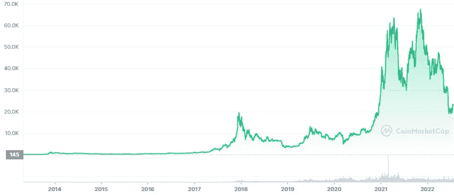

[https://coinmarketcap.com/currencies/bitcoin/](https://coinmarketcap.com/currencies/bitcoin/)

有人可能认为我们只有一条路可走——在每个周期后涨价。在得出这样的结论之前，我们必须问自己一些问题。

为什么加密资产的价格会上涨？这仅仅是对类似网络泡沫的新资产类别的纯粹投机吗？

我们有新的资金*流入这个领域吗？*

开发商是致力于建设，还是正在离开这个领域？

加密空间对新来者越来越友好了吗？

监管机构和其他金融机构对数字资产的看法有什么变化？2017/18 牛市的比特币和 2020/21 牛市的比特币一样吗？

这个问题没有明确的答案。然而，我们不得不考虑整个密码行业的基本面的巨大变化，这种变化已经发生了一段时间，并且在最近一年里迅速加速。

## **条例**

为了让加密资产在币安或 FTX 这样的中央交易所合法交易，我们需要法律法规允许现实世界的公司这样做。

监管越好，公司就越容易蓬勃发展，因为它不必担心缺乏监管。因此，如果没有适当的指令，公司就没有清晰的路径可循，以遵守法律，避免将来被起诉。

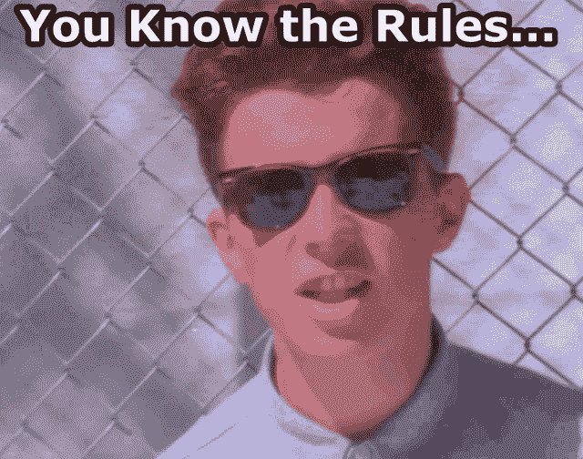

[https://tenor.com/bvMHa.gif](https://tenor.com/bvMHa.gif)

> 法律向前看，而不是向后看。

嗯……不是在金融界。

想象一下，在没有人告诉你什么是合法的，什么是不合法的情况下，建立你的企业。此外，在任何时候，你都可能因为过去的所作所为被起诉，而监管机构会发现这是违法的。最重要的是，我们无法确定未来，因为我们可能会遇到第二天出台的监管规定，这将削弱我们的整个业务模式，使我们无法像过去那样运营。更不用说随之而来的经济处罚了。

在确定了适当的监管对整个行业的未来有多么重要之后，我们可以进一步看现实世界的例子。

欧盟将做出一项关于密码行业的最重要的法律决定。在接下来的几个月里，我们将见证加密资产监管市场的最终形式，也被称为 [MiCA](https://www.cnbc.com/2022/06/30/eu-agrees-to-deal-on-landmark-mica-cryptocurrency-regulation.html) 。

简而言之，MiCA 的目标是彻底规范欧盟的加密资产市场，使这些公司更容易在欧盟国家运营。MiCA 将要引入的一套规则将鼓励与加密相关的公司在欧洲大陆定居和运营，增加了欧盟成为世界加密中心的可能性。

就 Web2，也就是现在的互联网而言，欧盟成了美国的附庸。那么，为什么不试着扭转局面，成为 Web3 领域的领军人物呢？

[https://tenor.com/bdAKE.gif](https://tenor.com/bdAKE.gif)

从监管者的角度来看，并非每个欧洲国家都同样安全，这一点值得注意。看一看金融行动特别工作组([【FATF】](https://www.fatf-gafi.org/))的国家名单，我们可能会看到不同的*信任度*。

由于英国被列为安全国家，伦敦成为各种公司的加密中心的愿望似乎没有受到监管公司的干扰。事实上，伦敦是世界上最大的金融中心之一，这样的地位很容易被利用。

往南走一小段路，我们会看到直布罗陀，由于 FATF 报告中列出的几个原因，直布罗陀已经从安全国家降级到灰名单国家，并受到越来越多的监督。

相反的例子是马耳他，它收紧了法律，大力打击非法资金活动。作为对其参与的回应，马耳他已从灰名单中除名，并被标记为安全国家。对于普通公民来说，被列入灰名单或安全国家名单这一事实可以忽略不计。然而，这对于一个特定国家可能经历的声誉和财政可能性，或缺乏这些可能性，是至关重要的。

我想在这里指出的一点是，监管基础对于制定长期计划和成为加密资产行业的领军人物至关重要。

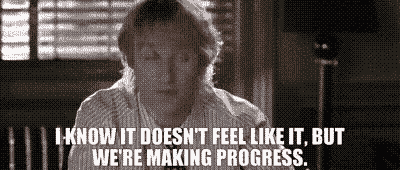

[https://tenor.com/QpCx.gif](https://tenor.com/QpCx.gif)

匿名加密交易和脱离国家的愿景对加密领域的许多个人来说一直非常重要。然而，如果没有适当的法规，加密将不会被允许作为一个行业发展。这是一个可悲的事实，我们都必须接受。

也许零知识证明技术的发展和传播会改变事物的状态；然而，要揭开这个面纱，我们至少要等上几年。

由于上述匿名原因，反洗钱(AML)程序之一——了解你的客户(KYC)——遭到许多人的反对。然而，从另一个角度来看，我们可能会看到许多加密交易所和类似的加密相关平台严格遵循 KYC 和其他反洗钱程序。程序越好，客户就越容易合法提现。

至于那些不想纳税的人，如果你非常投入，总会有办法的。

这能被认为是一种积极的现象吗？这取决于你的匿名和数据安全态度。尽管如此，我敢说这是一个积极的现象，导致各大洲更快、更顺畅的密码行业监管。

为什么跨越大陆？因为法律必须被相互接受和引进，以便为行业发展提供一个友好的环境，而不受地理位置的限制。

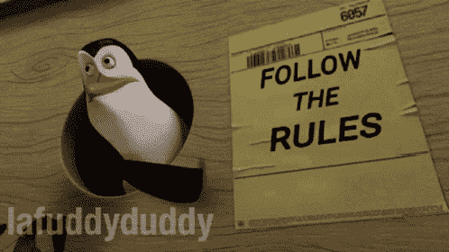

[https://tenor.com/biaUV.gif](https://tenor.com/biaUV.gif)

如果除了监管加密资产之外，我们还将比特币确立为该国的法定货币，那会怎么样？萨尔瓦多走上了成为第一个将比特币作为法定货币的国家的道路，换句话说，接受比特币作为货币。巴拿马采取了类似的步骤，并在该国部分地区接受比特币作为法定货币，创建了某种形式的比特币中心。

这在今天可能不是什么大新闻，但几年前谁会想到比特币会成为一个国家的法定货币？

谁知道在不久的将来等待我们的是什么…

随着时间的推移，越好的法规出台，加密行业就越容易繁荣和发展，从而提高客户和公司的整体安全性。

## **稳定的声音**

整个密码行业最重要的一个方面是稳定的密码。

在加密交易所开设账户既不复杂也不漫长。一旦进入交易所，你会看到可供你选择的交易对，其中大多数将被交易到一个稳定的币，如、、戴。

对于新来者来说，这是相当符合逻辑的，也是他们已经习惯的事情。你正在用你的 USDC *美元*——BTC/USDC——购买比特币，而不是用比特币购买 XYZ 替代货币——XYZ/BTC。

尽管这种交易对可能不是当今的首选，但在 2017 年的牛市中，这些交易对几乎是唯一可用的。

Tether (USDT)是当今主要硬币中的第一种稳定硬币，于 2014 年推向市场，并于 2015 年开始交易。按市值计算，第二大稳定硬币是美元硬币(USDC)，由 Circle 发行，于 2018 年下半年进入市场。第三种最常见的 stablecoin DAI 于 2017 年底发行，涉及 DAI stablecoin 的以太坊智能合约正式推出。

在最近的牛市中，稳定币在密码行业的重要性大大增加，成为不可分割的一部分。在曲线协议的引领下，稳定硬币的整个子市场出现了，其中大部分交易量是通过交易稳定硬币对和提供流动性产生的。此外，Curve 似乎计划很快发行自己的稳定币。

回到上一章，我们可能会看到，我谈到的加密法规不仅仅涉及比特币、以太和其他加密货币。它还监管 NFTs 等加密资产，更重要的是，stablecoins 成为新来者进入加密行业的门户，推广数字资产的采用。

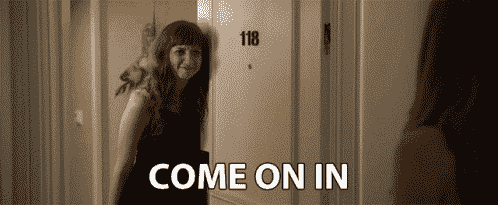

[https://tenor.com/bkixJ.gif](https://tenor.com/bkixJ.gif)

密码行业正在发展，稳定密码的重要性、用途及其与现实世界资产的联系也在增长。我甚至敢说 stablecoins 成为了整个密码行业的支柱。因此，从法律的角度来看，它们的安全性、彻底的审计(是的，我正在看着你，系绳)和安全使用是至关重要的。

## **区块链安全**

对于那些已经在这个领域呆了一段时间的人来说，中国的*加密禁令*传奇几乎是加密领域的一个特色。

如果你是新手，让我们快速回顾一下。

中国一直禁止 crypto，然后说它是合法的，然后又禁止它，等等。这些决定或操纵对比特币的市场和价格产生了重大影响。然而，每一次禁令*出现，影响似乎都在减轻。*

2021 年，中国给我们带来了更多的果断，因为他们禁止比特币采矿，并关闭了其领土上的所有比特币采矿设施。这一事件导致比特币价格下跌了约 50%。然而，随着矿工们决定将他们的设施转移到美国和加拿大等其他国家，hashrate 很快开始恢复。

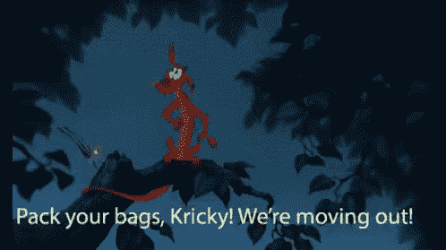

[https://tenor.com/Y1np.gif](https://tenor.com/Y1np.gif)

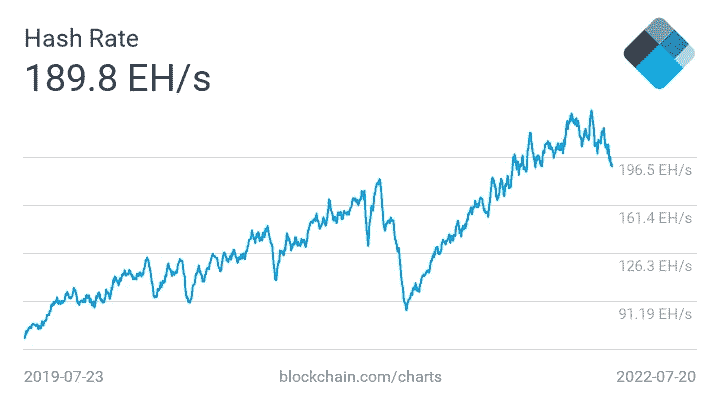

The visible collapse in Bitcoin hashrate due to China’s ban on crypto mining.

如果这样的事件发生在比特币的早期，会发生什么？我们只能怀疑后果，以及这是否会给比特币带来厄运。然而，这样的压力测试证明了网络的安全性和弹性，增强了对比特币的信心。

## **网的合并**

如今很难找到一个没有智能手机的人。持续访问互联网使得智能手机成为我们日常生活中不可分割的一部分。

我们今天所知的互联网可以被称为 *Web2* 。即将到来的(r)演进将通过整合区块链技术、去中心化和其他特性来改变互联网。Web2 将演变为 Web3，信息时代的新篇章将开始。

它与 crypto 的基础和整体实力有什么关系？

这一切都归结于这样一个事实，即 Web3 正慢慢地试图通过与现有的互联网融合来扩展和吸引新的客户。

互联网最显著的用途之一是我们的智能手机不断连接到网络。那么，为什么加密公司不应该尝试进入智能手机市场呢？

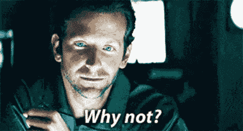

[https://tenor.com/btXYa.gif](https://tenor.com/btXYa.gif)

Polygon [最近宣布制造](https://forkast.news/headlines/htc-metaverse-phone-ethereum-polygon-support/)一款元宇宙智能手机，HTC 和 Solana 也在设计自己的智能手机 [*Saga*](https://solana.com/news/saga-reveal) ，这似乎是确立加密公司在现实世界中的地位的合理步骤。

另一个例子可能是 FTX 交易所及其所有的合作、赞助和公司收购。然而，这是另一篇文章的主题，因为 FTX 创造的影响力和广告杠杆是惊人的。我只想说，FTX 已经买下了美国航空球馆的权利，将它重新命名为 FTX 球馆，并且玩得非常好。

## **用户体验**

在加密的早期，普通人很难购买比特币或任何其他加密资产。即使在今天，一些应用程序很麻烦，可能会让潜在用户不知所措，尤其是那些不习惯该技术的用户。

[https://tenor.com/bkshW.gif](https://tenor.com/bkshW.gif)

随着向智能手机行业的转变和 NFT 的大肆宣传，crypto 在为其客户提供高质量应用程序界面方面取得了明显的进步，从而带来了更令人满意的用户体验。视觉效果变得越来越吸引人，界面变得清晰和用户友好，使应用程序直观和易于使用。

新客户入职的整个过程变得更快，所有的瓶颈都被发现和解决了。该行业为新客户的到来做好了准备。

访问越容易，视觉效果越好，在接下来的几年里就会有越来越多的人进入 crypto。

我不得不说，我喜欢 AAVE 幽灵的新造型。

## **滞留量**

周期来来去去，就像人们对密码的兴趣一样。市场条件、价格和周期可能不同；然而，情绪总是保持不变。

这是最重要的经验和规则之一，不仅在加密领域，在每个金融市场都是如此。下图是最具代表性的，展示了人们在市场中的行为。这是每个投资者的圣杯，自从…

> …市场上的情绪总是保持不变。

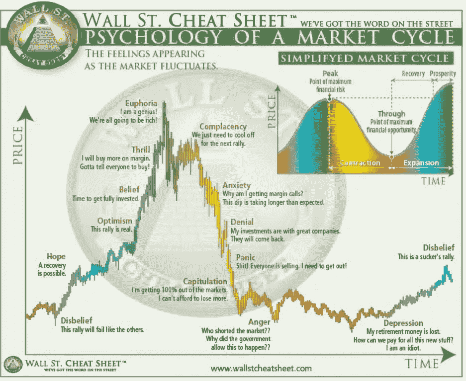

在牛市时期，特别是在乐观情绪达到顶峰的最后阶段，新的人涌入加密领域是非同寻常的。价格达到最高点只是为了经历下跌。随着价格下跌，达到更低的低点，情绪发生变化，兴趣下降，人们开始离开这个充满愤怒、怨恨和绝望的空间。

正如乔治·米歇尔唱的那样，一朝被蛇咬十年怕井绳？

不是每个人，因为每个周期都有新人加入 crypto，他们会因为各种原因长期留在这里。一个人可能已经找到了一份开发人员的工作，另一个人可能已经成为一名非常成功的投资者，而另一个人可能已经学到并经历了这么多，以至于他通过看到隐藏的潜力而了解到 crypto 在未来可能会成为什么。

越来越多的人决定留在密码行业，使其成为一个更加安全、广阔和令人兴奋的地方。新的友谊建立了，新的合同签订了，亚瑟·海斯的另一篇文章发表了。

随着时间的推移，这个空间变得更加稳固，并为新一波的兴趣增长和情感过山车做好了准备。Crypto 由越来越多无论发生什么都不会离开的人组成。不管可能性有多大。

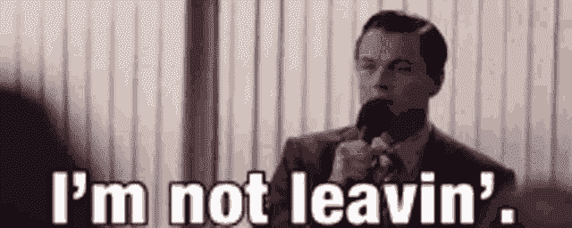

[https://tenor.com/bjxoJ.gif](https://tenor.com/bjxoJ.gif)

## **机会与损失**

散户投资者的情绪兴趣和惯性波动，对于任何在市场上待过一段时间的人，或者对人类心理学感兴趣的人来说，都是显而易见的。

如果你两者都精通，那么……这在市场上是一个有价值的优势。

它如何影响加密相关的公司和各种加密项目？

我们今天看到的是大规模裁员和大量招聘的二元性。即使是市场上最大的玩家也在跟自己的员工分道扬镳。由于市场状况和兴趣下降，NFT 利基巨头 OpenSea 决定[裁员 20%。这听起来可能很合理，因为 NFT 热表明这是一个牛市狂热阶段，盲目的项目达到过高的价格，但…](https://decrypt.co/105130/opensea-lays-off-20-percent-staff-prolonged-downturn-crypto-winter)

交流呢？这些似乎并没有与 NFT 的炒作纠缠在一起，然而 Gemini exchange [在几周前解雇了 10%的员工，并宣布了第二轮裁员。Blockchain.com](https://techcrunch.com/2022/07/18/crypto-exchange-gemini-executes-second-round-of-layoffs-less-than-two-months-after-axing-10-of-staff/?guccounter=1)决定关闭其在阿根廷的办公室，并停止在几个国家的扩张计划。

原因可能各不相同，但最常见的可能是利润整体下降、负现金流或持有或交易某些头寸所创造的价值损失。更不用说最近与三箭资本(3AC) *问题*有关的事件，这些事件对市场，尤其是一些公司造成了损害。

另一方面，通过加密相关的招聘网站，我们会看到大量的招聘信息。这表明，尽管市场环境恶劣，一些公司仍致力于建设项目。虽然投入是一个很好的补充，但建设项目的先决条件是钱。

如果我们仔细看看，这些不仅仅是像 DeFi 或元宇宙这样的加密领域的项目。浏览招聘信息，我们会看到来自 NFT 世界的公司和项目，如[looks are](https://docs.looksrare.org/about/category/hiring)。公司花钱在 NFT 领域建立自己的地位，这一事实告诉我们一些关于不可替代代币的未来和特定项目的整体状况。

剖析 crypto 的就业市场可能有助于我们了解谁在建设，谁没有。哪些利基市场和项目将长期存在，哪些只是炒作驱动的趋势。

这些项目在财务上得到更好的管理，在最近的牛市中节省了足够的资金来运营和建设整个加密冬天或拥有正现金流，这是一个更积极的指标，因为在熊市中赚钱不是一件容易的事情。

关于加密的基础，它告诉了我们什么？

有证据表明，尽管市场状况不佳，crypto 仍在不断发展，并不断巩固其基础，以在未来几年变得更加强大。

## **入职**

增长诱惑贪婪。

[https://tenor.com/bglZu.gif](https://tenor.com/bglZu.gif)

品牌转向 crypto 的原因是什么？要么是财务利润，要么是寻找新客户的扩张。不要错过在我们眼前的数字世界中获得认可的机会。

每天，我们都被关于*新资金*流入该领域以及各种现实世界人物和品牌与加密项目和公司达成交易的新闻轰炸。

领先的加密交易所币安已经与克里斯蒂亚诺罗纳尔多签署了[协议](https://www.binance.com/en/blog/markets/cristiano-ronaldo-and-binance-team-up-for-a-legendary-nft-partnership-421499824684904050)，将这位极具影响力的世界知名人士带入太空。阿迪达斯[带着他们自己的项目进入](https://www.adidas.com/us/metaverse)元宇宙，与 NFT 世界最著名的系列合作，确保他们在未来市场的地位。然而，渴望进入新市场的不仅仅是阿迪达斯；耐克已经收购了致力于创建 NFT 项目的 RTFKT 公司，并且正在加倍开发。

到目前为止，我讲的大多是和体育界有关的人和品牌，背后是有原因的。我将试着用下面的方式来解释我的观点。

数字世界->数字娱乐->游戏->电子竞技->体育

这不是进化。相反，这是这些领域之间相互交织的形象。换句话说，传统运动是元宇宙兴趣增长的自然下一步，因为它专注于娱乐，就像数字世界的一大块一样。这就是为什么各种品牌正在通过收购和投资各种项目来淹没加密市场，尤其是那些来自元宇宙利基的项目。这是这个市场前所未有的购买狂潮。尤其是 FTX 正在做的那个。

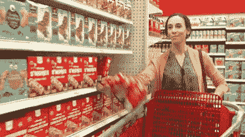

[https://tenor.com/4bSB.gif](https://tenor.com/4bSB.gif)

元宇宙允许我们创建我们的化身，我们的数字自我或我们希望成为的数字角色。头像需要什么？

要个性化。独一无二。独一无二。

那么服装和小玩意呢？是啊，那就行了。

所以我们已经进入了下一个阶段。在这个水平上，我们不仅看到阿迪达斯和耐克 NFT 服装，还看到更多的独家品牌，如普拉达和其他时尚品牌紧随其后。说到底，如果你能穿上普拉达的外套，为什么还要穿连帽衫呢？

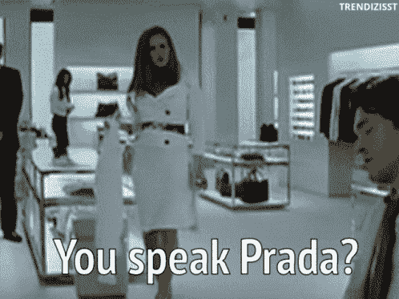

[https://tenor.com/bxogq.gif](https://tenor.com/bxogq.gif)

有人可能会认为，NFT 的炒作已经消失了，或者将在“隐秘的冬天”消失。这里的思考过程是正确的，我不想在这个问题上争论，因为围绕 NFT 的炒作与过去周期中的任何其他乐观趋势非常相似。然而，我们必须记住，NFT 技术远远不只是愚蠢的侧面照片和猿。

由于技术限制和缺乏想象力，这是文化和娱乐世界中的一项改变游戏规则的技术。我们已经进入了一条未铺设的道路，还无法想象会发生什么。正如我们最近所看到的，NFT 与价格过高的照片联系在一起，而不是其他任何东西，这表明我们面前的道路有多长。

如果你想知道 NFT 是什么，未来会变成什么样，我强烈建议你阅读下面的[文章](/coinmonks/the-future-of-nfts-according-to-punk-6529-5bf9b519cc51)或简短的[摘要](/coinmonks/the-future-of-nfts-summary-ca7530c13628?source=user_profile---------3----------------------------)，在那里我深入了解了 NFT 的世界和 Web3 的未来。文章和摘要是基于我有幸听到的 Raoul Pal 主持的 Punk6529 的采访。

简而言之，我们正在建设 Web3 的数字世界，也被称为元宇宙，在那里，增强现实将像今天的智能手机一样普遍。广告的可能性是无限的，而消费者的需求却得不到满足。这就是为什么品牌试图在未来的市场中确保自己的位置，并有大量的机会获得新客户和提高他们的认知度。

因此，世界知名的公司和个人都在加强加密的基础，他们不想错过*提前*的千载难逢的机会。

## **外卖**

Crypto 会一直存在。开发商是来建设的。品牌在这里成长。

不要被引人注目的预示厄运的文章和视频所误导。它们唯一的用途是吸引注意力，从怨恨和其他负面情绪中获利。

> 在信息丰富的世界里，知识是稀缺的。

远离有偏见的信息一步，寻找事实。给自己时间分析，得出自己的结论。

注意安全。

保持好奇。

下次见。

~法医。

附言:如果你有任何问题，请随时在评论中或通过 DM 在 Twitter 上提问。总是乐意帮忙。